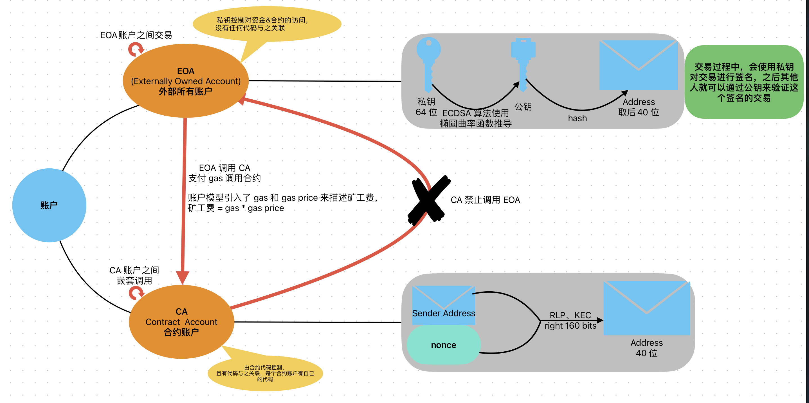
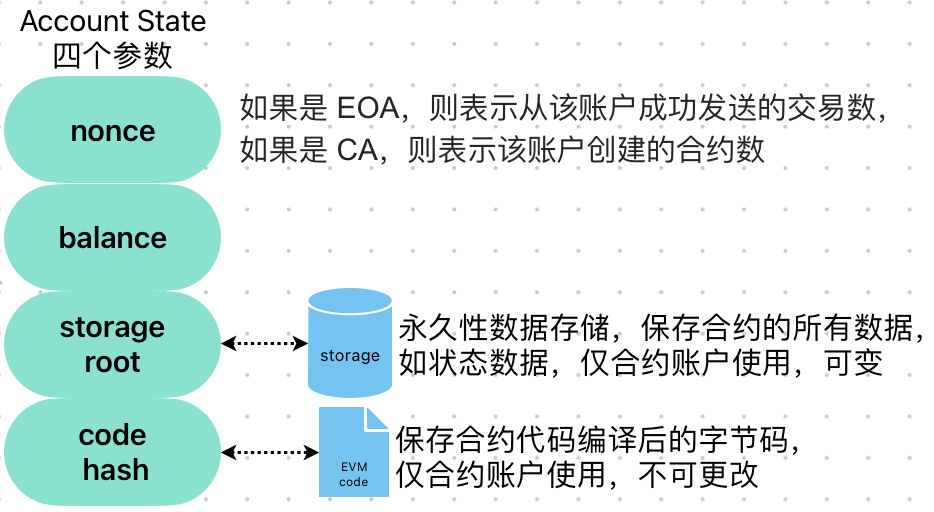
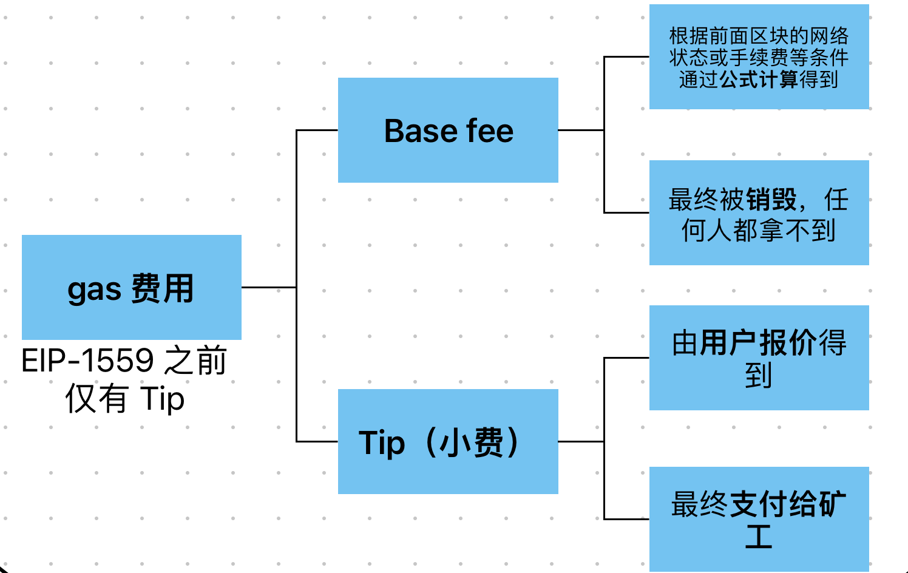

# 基础

EVM(Ethereum Virtual Machine)是 Ethereum 智能合约的执行化境，是一个沙箱化的虚拟堆栈机，嵌入在每个完整 Ethereum 节点中，负责执行智能合约的字节码。

## 账户模型

比特币的数据模型是 UTXO(Unspent Transaction Output)模型，属于交易模型，只能用于简单的记账系统，建立简单的一次性合约，不适合实现复杂的逻辑。

Ethereum 的数据模型则是账户模型。

Ethereum 中有两种账户：EOA(Externally Owned Account)、CA(Contract Account)。

每个账户有四个关键字段来记录该账户当前的状态：

因此，Ethereum 区块链是一个交易驱动的状态机！

## 数据结构

Ethereum 使用**状态树**、**交易树**和**收据树**来记录和追踪交易，并增加 gas 功能来为 EVM 的运行创造条件。

> BTC 的数据结构中只有一棵交易树。

Ethereum 中的两种数据：

永久数据：一般是转账数据。一旦确认，就会在区块中记录，不可更改；

暂时数据：一般是以太坊账户地址的余额等状态数据，当账户转账时，余额就会变更。

# Ethereum 改进

ETH 1.0 ——> execution layer 执行层

ETH 2.0 ——> consensus layer 共识层

ETH1.0 将启用难度炸弹，逐步弃用现有 PoW 共识，将共识机制部分工作转移到信标链，采用 PoS。

execution layer + consensus layer = New Wthereum，合并后，验证节点还将额外收到 gas 费，提高 PoS 收益率。

## EIP-1559

ETH 1.0 的问题：交易拥堵，费用昂贵。

> 每秒交易仅十几笔，Mempool 中待处理的交易有几万笔；为了自己的交易更快处理，就需要增加 gas price

在使用 EIP-1559 之前，gas 费就是 tip(小费)，而在 EIP-1559 后，将 gas 费分为两部分：BaseFee、Tip

EIP-1559 无法节省 gas，也无法提升交易费率。其主要用于消除 Ethereum 交易中 gas 信息不对称的问题。

> EIP-1559 之前用户设置 gas price 没有依据，都是自己盲设置的

## Layer2

由于 ETH 1.0 问题较为严重，但 ETH 2.0 的上线遥遥无期，所以就出现了 Layer2 的方案。

Layer1 改进指的是通过对某条公链本身的改进来提升它的可扩展性，即 On-Chain 链上改进。

Layer2 改进指的是不影响该公链本身，通过其他方式来实现可扩展性的提升，即 Off-Chain 链下（脱离该公链）改进。

Layer2 的几类改进思路：

- Plasma
- 状态通道，如闪电网络
- **Rollup(ZK+Optimistic)**
- **侧链**

### Rollup

其核心思想：将 transaction 从链上拿到链下， 链下执行完后，把交易数据传回到链上；通过将交易聚合，仅需要在链上进行一次交易，就可以验证多笔其他交易。

主要有两类：

- ZK-Rollup

核心：交易压缩+零知识证明

由 relayer(运营商)对数百个交易通过**字段压缩和删除**的方式将其压缩为一笔交易后再上链，并通过**零知识证明机制**防作弊。

> 零知识证明：一方（证明者）向另一方（验证者）证明一个陈述是正确的，而无需透露除“该陈述是正确的”之外的其他信息。其数学基础是：同态加密
> 
> 证明者 prover 负责计算交易并把这些交易聚合成零知识证明；验证者 verifier 验证证明者提交的零知识证明的有效性

可以提升到 2k～2.5k 的 TPS，难以支持通用的智能合约

- Optimistic-Rollup

核心：交易压缩+欺诈证明

由 Aggregator(运营商)对交易压缩（参考 ZK，但由于支持通用智能合约，压缩效果减弱），通过欺诈证明的方式防作弊。

> 首先假设交易在链下的执行都是诚实有效的，会把结果放到链上，然后预留一定的时间（通常一周左右）可以让所有人对该结果发起挑战。
>
> 如果有人认为存在交易作假或不诚实就可以进行挑战，只要有一个人证明存在不诚实行为，就会进行惩罚。

TPS 提升有限，可提升到数百 TPS，且完全兼容智能合约。但存在争议期，而期间的交易获得的金额需要等到争议期后才能取出。

## ETH 2.0

ETH 2.0 的核心改进：

- 共识机制

ETH 采用Ethash PoW 挖矿算法，牺牲了网络扩展性，目前 TPS 还在 15～20 之间。而 ETH2.0 采用 Casper 共识，基于权益投票，可以提高共识效率，减少无效算力挖矿消耗

- 性能扩容

ETH 采用单主链结构，节点按顺序打包交易成区块进行串行处理，性能较低。而 ETH2.0 建立**信标链-分片链**分层架构，通过多条分片链节点并行处理网络中交易并进行区块打包从而实现性能扩容。

- 计算引擎

ETH 计算引擎 EVM 仅支持少数几种开发语言，且不支持 64 位数据处理，执行速度存在改进空间。而 ETH2.0 将上线新的计算引擎 eWASM，支持 C/C++ 等传统编程语言和 64 位处理，代码执行速度将大幅提升

> eWASM 是以太坊上的 WebAssembly 计算引擎(简称WASM)，向后兼容E VM， 同时改进了 EVM 的不足之处

### Casper 共识

Casper 共识属于 PoS 权益证明算法。

- 质押机制：成为 ETH2.0 验证者需要至少质押 32ETH 作为保证金
- 随机选举：Casper 验证节点委员会**每隔一个周期进行重新选举轮换**，随机指派验证节点负责指定分片内的区块校验，避免分片内验证节点形成“合谋”
- 惩罚机制：验证者需要评估其他节点投注的区块，确保投注给大概率胜出的区块，如果验证节点投注其他区块将无法获得奖励，如果投注后又改投其他区块将被没收保证金，消极投注如离线行为，也将可能被处罚保证金。可以有效规避[无利害攻击](./01-blockchain.md#无利害攻击)问题

### 分片

- Ethereum 将网络分成 64 个分片，每个分片网络各自独立，并各自处理网络中不同的交易
- 分片内的交易结果由更高一层的信标链网络验证节点委员会指定验证节点负责验证
- 信标链验证委员会通过 Casper 机制对所有分片链的交易结果达成最终一致性
- 信标链采用**交联(crosslink)**技术收集分片内的区块交易真实性证明摘要（Merkle 根）
- **信标链负责分片状态更新**，通过 crosslink 实现信标链和分片的状态通信

# ERC

[ERC(Ethereum Request for Comments)](https://eips.ethereum.org/erc) 标准定义了一套 Ethereum 区  Token 的标准。块链上用于创建和管理的规则。

> 所有 ERC 标准都需要通过 EIP(Ethereum Improvement Proposals，以太坊改进方案)进行修订，最后社区讨论共同决定

常见的 ERC 标准：

- [ERC-20](https://eips.ethereum.org/EIPS/eip-20)，用于在 Ethereum 区块链上创建代币的技术标准
- ERC-621，是 ERC-20 的扩展，新增了“允许 Token 发行者对流通中的 Token 总量增加和减少”的功能，这对于管理代币经济和确保价格稳定很有用
- [ERC-165](https://eips.ethereum.org/EIPS/eip-165)，标准接口检测。创建了一个标准方法来发布和检测智能合约实现的接口
- [ERC-721](https://eips.ethereum.org/EIPS/eip-721)，定义了 NFT(Non-Fungible Token) 非同质化代币，不同于 ERC-20 Token，每个 ERC-721 Token 都是唯一且不可互换的，每个 NFT 都有一个 `uint256` 的 ID
  - 必须搭配 ERC-165 来使用
- ERC-721x 是 ERC-721 的扩展，增加了对 Token 的批量替代和传输功能
- [ERC-777](https://eips.ethereum.org/EIPS/eip-777)，相比于 ERC-20，它定义了与 Token 交互的高级功能（授权、撤销、转移、检查等）
  - 使用了 ERC-1820，在智能合约中注册元数据，以便和之前版本的 Token 实现向后兼容
- [ERC-884](https://eips.ethereum.org/EIPS/eip-884)，通过添加对资产部分所有权的支持来扩展 ERC-20 和 ERC-721 标准的功能
  - 主要优点之一是它允许在区块链上表示现实世界资产（例如财产或商品）的部分所有权
- [ERC-1155](https://eips.ethereum.org/EIPS/eip-1155)，用于管理多种 Token 类型（传统 Token、NFT、半同质化代币等）的合约接口
  - 传统上，创建管理多种类型代币的 dApp 需要为每种类型制定单独的智能合约，这可能很麻烦且效率低下，且会在以太坊区块链上放置大量冗余字节码，且随着 gameFi 的兴起，游戏开发者可能会一次性创建数以千计的 Token。借助 ERC-1155，开发人员可以创建一个管理可替代和不可替代代币的智能合约，从而降低 dApp 的整体复杂性。
  - ERC-1155 的另一个优点是它允许创建“半同质”代币。这些代币具有一些可替代和不可替代的属性。例如，一个游戏物品可能具有一组该物品独有的属性（使其不可替代），但也具有一组在多个物品之间共享的属性（使其可替代）。这使得管理游戏内物品变得更加容易，并为游戏开发者提供了更大的灵活性。
  - ERC-1155 还支持“批量转账”，允许在一次交易中转账多个代币。这可以在转移大量代币时降低 gas 成本并提高整体效率。

Reference：

[All ERC Token Standards Explained](https://web3.career/learn-web3/erc-token-standards)

