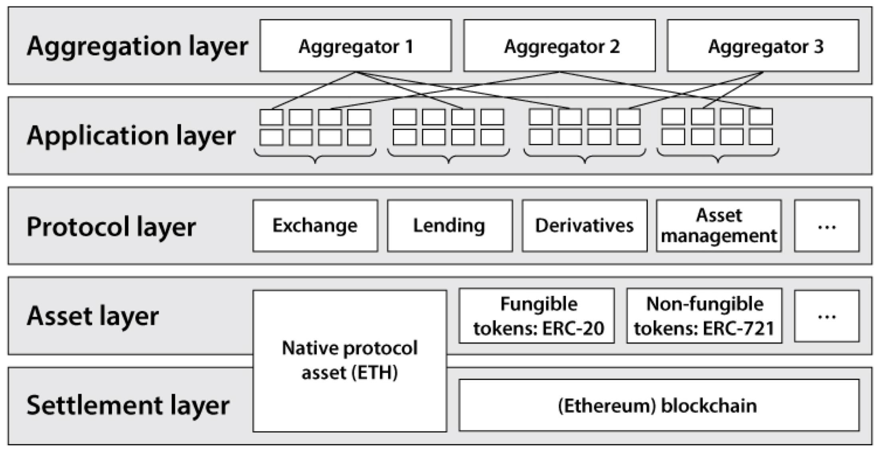

[MOOC](https://defi-learning.org/f22)

Decentralized Finance

# CeFi vs. DeFi

- CeFi
  - 通常是闭源的系统，建立在中心化的数据库之上
  - 第三方需要许可才能使用这些金融服务
  - 资产被金融机构监管
  - 建立在对中心化的信任
  - 提供个人真实信息，用于符合 KYC（Know Your Customer）、AML（Anti-Money Laundering）等合规要求
- DeFi
  - 通常是开源的，建立在不需要许可的区块链上
  - 任何人否可以使用服务而不需要胥口
  - 金融资产不被监管，而是被每个用户自己保管和控制
  - 无信任性
  - DeFi 应用中的用户是匿名的

DeFi 的优点：更高效，移除了有寻租行为的中间机构；提供了透明性与公众可检验性，任何人都可以检查合约代码，检验其执行以及系统的状态；用户可以自己保管资产；由于运行在区块链上，所以可以使金融服务的自运行、程序化成为可能；其开放性使它具有了无与伦比的可组合与可交互性。
 
# DeFi

DeFi 中的角色除了 User、Protocol 外，还需要通过 Oracle 来与区块链外的世界进行交互，还会有 Bridge 用于连接两个区块链，以及 Keeper（监管人，本质上是一种自动执行的机器人程序）来触发事件发送到链上（如代币价格下跌后触发清算，Keeper 会发送请求或交易到链上的 DeFi 来协助运作）。
 
## Asset Tokenization

资产代币化（Asset Tokenization）是将新资产添加到区块链的过程。Token（代币）是区块链上的资产，相比 CeFi 的资产，更容易被访问、被转移、被程序化。

- Governance Token 治理代币，其持有者可以投票决定一个 DeFi 协议未来的发展或导入决策；
- Security Token 证券代币，对应了实际物理世界的资产（如房地产资产等）
- Non-Fungible Token 非同质化代币，可以对应不同种类的资产（如音乐、美术品等）
- StableCoins 稳定币，包装了其他资产（如法币、贵金属）的代币，发行方式有：
  - Off chain (centralized) collateral [fiat, precious metal] 通过链下质押（法币、贵金属）发行
  - On chain (decentralized) collateral [crypto assets] 链上质押资产（数字资产）发行
  - Algorithmic (non-collateral) stable coin 纯粹算法的无质押方式发行

## DEX vs. CEX

- Centralized exchange
  - 中心化交易所托管用户资产
  - 可能卷款跑路
  - 运作上有大量不透明的地方
  - 通过订单薄 Order Book 来决定交易，中心化交易所撮合买卖双方成交并记录
- Decentralized exchange
  - 非资产托管，用户自己保管自己的资产
  - 提供完全的透明性
  - 有使用标准订单薄、常量函数的自动做市商、reserve aggregator 等方式

## Decentralized Lending

借贷的一个关键地方在于要保证借出去的钱最后能还回来！ 借出去的钱收不回来成为违约（default）。

在 CeFi 中会努力减少违约，因为处理违约的成本很高，所以需要依赖借款者的信用记录。

DeFi 世界中用户是匿名的，没有真实的个人信息及信用信息，所以无法依赖信用记录，在 DeFi 中使用了一种不同的方法：抵押贷（Collateralized Loans）。

常见的抵押贷：

- 超额抵押担保（抵押物价值超过借款额的贷款）
  - 抵押债务仓位（Collateralized Debt Positions，CDP），借款者放上抵押物，用这些抵押物生成新的代币，而借款者在赎回资产时会销毁代币 。如 MakerDAO
  - 抵押债务市场（Collateralized Debt Markets），借款者放上抵押，然后借走另一种数字资产。如 Compound、Aave

## flash loans 闪电贷

借助了区块链可以保证交易原子性的特性！！

在闪电贷中，一个借款机构可以提供借款，而不需要任何抵押品。这个操作会在一笔区块链交易中完成。条件是，贷款必须在交易结束前连本带利的归还。

如果借款者在这笔链上交易结束时无法偿还本金和利息，交易就会失败，状态回滚，就好像借款者从来没有借过这笔钱一样。

任何人可以通过闪电贷接触大额度的资金，而没有任何预付保证金，这种借贷方式在 CeFI 中是不存在的。

## 其他

- Derivative 衍生品 
  - 基于资产的衍生品，如 Synthetix、Mirror 是基于股票等资产创建的衍生品；
  - 基于 Event 的衍生品，如 Augur，本质上是去博弈市场未来走向
- On-chain asset management 链上资产管理，靠智能合约完成，是非托管的。
  - 可以执行半原子化（semi-automatic）的资产组合再平衡，或提供趋势交易（trend trading）
  - 如 Yearn、Set protocol 
- Decentralized insurance 去中心化保险

## 安全问题

DeFi 应用会面临多种风险攻击：

- Network attacks 网络层的攻击：Eclipse/Dos attacks
- Consensus attacks 共识层的攻击：51% attacks/Double-spending/Selfish mining
- Smart Contract code bugs：Reentracy/Authorization
- DeFi Protocol Composability attacks 组合不同 DeFi 协议时的风险：Excessive arbitrage between pools, flash loans、Oracle attacks
- Bridge acctcks
- Governance attacks

主要可以分为两类：

- 技术架构的安全问题：源于区块链系统技术架构上潜在的漏洞
- 经济模型的安全问题

# 名词

TVL-Total Value Locked 总锁仓价值
