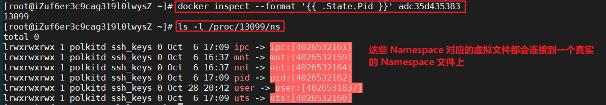
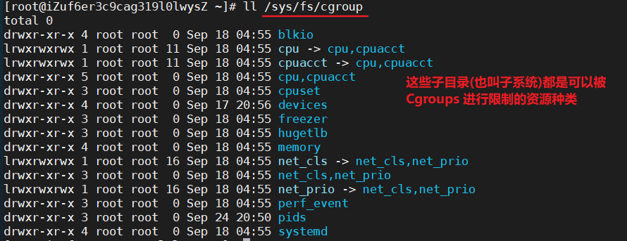
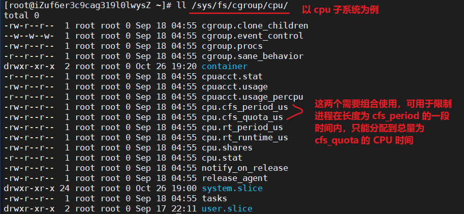
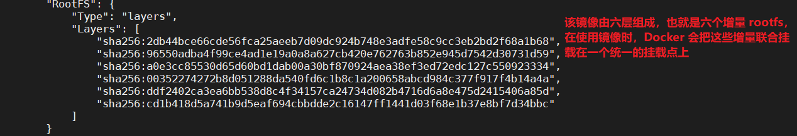

极客时间[《深入剖析 Kubernetes》-容器技术概念入门篇](https://time.geekbang.org/column/article/14642) 学习笔记。

容器是一种沙盒技术，可以把应用“装”起来，这样，应用与应用之间应为有了边界而不至于相互干扰，而被装起来的应用也可以被方便地搬来搬去。Linux 容器的核心实现原理：

- 通过 Namespace 实现资源视图隔离，让应用只能看到该 Namespace 内的“世界”；
- 通过 Cgroup 来限制系统资源的使用率，设置其能够使用的 CPU 以及内存量；
- 通过 UnionFS(由 chroot 发展而来) 来管理容器各自独立的文件系统

一组联合挂载在 /var/lib/docker/overlay2 上的 rootfs，称为“容器镜像”（Container Image），是容器的静态视图；

一个由 Namespace+Cgroups 构成的隔离环境，称为“容器运行时”（Container Runtime），是容器的动态视图。

**Namespace 做隔离，Cgroups 做限制，rootfs 做文件系统**。

容器是一个**视图隔离、资源可限制、独立文件系统**的单进程模型，**并不是指容器里只能运行“一个”进程，而是指容器没有管理多个进程的能力**。容器中 pid=1 的进程就是应用本身，其他进程都是 pid=1 进程的子进程，但用户编写的应用并不像正常操作系统中的 init 进程或 systemd 那样有进程管理的功能。

Mac 和 Windows 上的 Docker 实际上是基于虚拟化技术实现的，与 Linux 容器完全不同。

# Namespace

```shell
# docker run -it centos /bin/bash
# ps
PID TTY          TIME CMD
    1 ?        00:00:00 bash
   16 ?        00:00:00 ps
```

可以看到这个容器内现在一共有两个进程在运行，且 /bin/bash 是容器的 1 号进程，也就意味着 /bin/bash 和 ps 已经被 Docker 隔离在一个和宿主机完全不同的世界了。这是如何做到的呢？

这种机制，其实是对被隔离应用的进程空间做了手脚，使得这些进程只能看到重新计算过的进程编号，实际上 /bin/bash 在宿主机上并不是 1 号进程。这就是 **Linux 的 Namespace 机制**。

在 Linux 系统中使用系统调用 clone() 创建进程(该操作实际是线程操作，但 Linux 的线程使用进程实现的)时，可以向其传入 CLONE_NEWPID  参数，这样新创建的进程将会“看到”一个全新的进程空间，在这个进程空间中，它的 PID == 1。注意：在宿主机真实的进程空间中，该进程的 PID 还是真实的数值，如 100。

```shell
lsns # 查看当前系统所有的 namespace
# namespace 种类：
# pid 进程
# net 网络设备、网络协议栈、网络端口等
# ipc 进程间交互，System V IPC 和 POSIX 消息队列 
# mnt 挂载
# uts 主机名和域名
# user 用户和用户组
```

**Namespace 技术实际上修改了应用进程看待整个计算机“视图”，即它的“视线”被操作系统做了限制，只能“看到”某些指定的内容**。

创建容器进程时，指定这个进程所需要启用的一组 Namespace 参数，这样，容器就只能看到当前 Namespace 所限定的资源、文件、设备、状态，或者配置。对于宿主机以及其他不相关的程序，它就完全看不到了。


## 对比虚拟机的资源隔离

虚拟机使用 Hypervisor 软件，通过硬件虚拟化功能，模拟出了运行一个操作系统需要的各种硬件，如 CPU、内存、I/O 设备等等。然后，它在这些虚拟的硬件上安装了一个新的操作系统供用户使用。这样，用户应用运行在虚拟机里，其对宿主机操作系统的系统调用必须经过虚拟机软件的拦截和处理，尤其是对计算资源、网络和磁盘 I/O 损耗很大。

**容器本质上是原本宿主机上的应用进程**，只不过通过 Namespace 参数，使得进程只能看到各自的目录和文件，只能访问各自的网络设备，就好像被隔离了一样。所以不存在虚拟化带来的性能损耗，且使用 Namespace 作为隔离手段的容器并不需要单独的操作系统，额外的资源占用几乎没有。

**容器隔离得不彻底**：

容器只是运行在宿主机上的一种特殊的进程，那么**多个容器之间使用的就还是同一个宿主机的操作系统内核！**所以在 Windows 宿主机上运行 Linux 容器，或者在低版本的 Linux 宿主机上运行高版本的 Linux 容器，都是行不通的。而虚拟机则要方便很多，可以在 Windows 上创建 Linux 虚拟机......

在 Linux 内核中，很多资源和对象是不能被 Namespace 化的，如时间。也就是说，如果在容器中通过系统调用 settimeofday(2) 修改了时间，那么整个宿主机的时间都会被修改。而虚拟机则可以在里面随便折腾。


## 常用命令

一个进程的每种 Linux Namespace，都在它对应的 /proc/[进程号]/ns 下有一个对应的虚拟文件，并且链接到一个真实的 Namespace 文件上：

1. `docker inspect --format '{{ .State.Pid }}' 容器id` 可以获得正在运行的容器的进程号，如 13099
2. `ls -l /proc/进程号/ns` 可以看到该进程的所有 Namespace 对应的文件



有了这些 Namespace 文件，就可以将一个进程加入到某个进程已有的 Namespace 中，从而达到进入这个进程所在容器的目的，而这就是 `docker exec` 命令的实现原理。

```shell
lsns -t xx # 查看当前系统指定的 namespace 类型
ls -la /proc/<pid>/ns/  # 查看某进程的 namespace
# 进入某进程的 namespace 运行命令，-t 指定目标进程，-n 进入该进程 net namespace，执行 ip address 命令
nsenter -t <pid> -n ip address 

# namespace 练习
unshare -fn sleep 120 # 开启一个新的 namespace 来执行后面的 sleep 120 命令
ps -aux|grep sleep # 找到 sleep 120 的 pid
nsenter -t pid -n ip address # 可以看到该进程的网络配置与主机不同

# 常用！
docker ps | grep xxx  # 找到某一容器的容器id
docker inspect 容器id | grep -i pid # 找到该容器的进程在宿主机上对应的 pid
nsenter -t 进程id -n ip address # 进到该容器中查看其 IP 信息
```


# Control groups

由于容器隔离得不彻底，容器内的进程会和容器外的进程发生资源(如 CPU、内存)的竞争，所以需要对容器进程进行限制。

**Linux Cgroup(Control groups) 是 Linux 内核中为进程设置资源限制的功能，其主要作用就是限制一个进程组能够使用的资源(包括 CPU、内存、磁盘、网络带宽等)上限**。Cgroup 还可以对进程进行优先级设置、审计、以及将进程挂起和恢复等操作。

Cgroups 是以文件系统的形式暴露给用户的：



在子系统对应的资源种类下可以看到该类资源具体可以被限制的方法，如 cpu：



默认 cpu.cfs_period_us=100000 us(100ms)，cpu.cfs_quota_us=-1(没有限制)，我们可以通过修改这些文件内容来设置限制，某个进程运行后，可以将其 PID 写入 tasks 文件中，这样这些资源限制文件的设置就会对该进程生效。


## cpu子系统练习

对于 Docker 等 Linux 容器项目来说，只需要在每个子系统下面，为每个容器创建一个控制组(即创建一个新目录，操作系统会在新建的这个 container 目录下自动生成该子系统对应的资源限制文件)，然后在启动容器进程之后，把这个进程的 PID 填写到对应控制组的 tasks 文件中就可以了。

```go
func main() {
	go func() {
		for {
		}
	}()
	for {
	}
}
```

上面的程序 busyloop.go 如果不加限制的话会占用两个 cpu，可使用 `top` 命令查看。当程序运行后，在 /sys/fs/cgroup/cpu 下新建一个目录，如 cpudemo

```shell
cd /sys/fs/cgroup/cpu/cpudemo
# 将进程添加到 cgroup 进程配置组
echo ps -ef|grep busyloop|grep -v grep|awk '{print $2}' > cgroup.procs
# 设置 cpu_quota，10000/100000=0.1，所以此时再使用 top 命令看的话上面的进程占用 cpu 就会变成 10% 左右了
echo 10000 > cpu.cfs_quota_us
```


## 注意

Cgroups 对资源的限制能力也有不完善的地方，如 /proc 文件系统。

Linux 下的 /proc 目录存储的是记录当前内核运行状态的一系列特殊文件，可以通过访问这些文件，查看系统以及当前正在运行的进程的信息，如 CPU 使用情况、内存占用率等，这些文件也是 `top` 指令查看系统信息的主要数据来源。

但是，如果在容器内执行 `top`，其显示的信息居然是宿主机的 CPU 和内存数据，而不是容器自身的。原因在于 /proc 文件系统并不知道用户通过 Cgroups 给这个容器做了什么样的资源限制，即：/proc 文件系统不了解 Cgroups 限制的存在。生产环境必须修正该问题！


# UnionFS

Docker 在镜像的设计中，引入了层（layer）的概念。用户制作镜像的每一步操作，都会生成一个层，也就是一个增量 rootfs。这是借助联合文件系统(Union File System)的能力实现的。

UnionFS 可以将多个不同位置的目录联合挂载（union mount）到同一个目录下，支持为每个成员目录设定 readonly、readwrite、whiteout-able 权限。

可通过 `docker info` 查看具体的 UnionFS 实现，如 overlay2。

典型的 Linux 文件系统包含了 bootfs 和 rootfs， bootfs 主要用于加载内核，而 rootfs 主要是指的 /etc 等操作系统所包含的文件、配置和目录。不同的 Linux 发行版本，bootfs 基本一致，rootfs 存在差异。

而容器复用了宿主机的 kernel，所以容器没有 bootfs 只有 rootfs！挂载在容器根目录上、用来为容器进程提供隔离后执行环境的文件系统。

容器的 rootfs 里打包的不只是应用，而是整个操作系统的文件和目录，也就意味着，应用以及它运行所需要的所有依赖，都被封装在了一起。这就赋予了容器所谓的**一致性**：无论在本地、云端，还是在一台任何地方的机器上，用户只需要解压打包好的容器镜像，那么这个应用运行所需要的完整的执行环境就被重现出来了。

Docker 启动时，将 rootfs 以 readonly 方式加载并检查，然后利用 union mount 的方式将一个 readwrite 文件挂载在 readonly 的 rootfs 上；且允许再次将下层的 fs（file system）设定为 readonly 并向上叠加。这样一组 readonly 和一个 writeable 结构构成一个 continer 的运行时状态，每个 fs 被称为一个 fs 层。

一个镜像通常由很多层实现，假设本地 pull 了 redis 镜像，使用 `docker inspect redis` 命令，输出中含有以下内容：



Docker 会把这些增量联合挂载在一个统一的挂载点上，CentOS 中是挂载在操作系统的 /var/lib/docker/overlay2 目录下。

容器的 rootfs 通常由三部分组成：

- 只读层，是容器 rootfs 的最底层，也称为镜像层
  - 挂载方式是只读的(ro+wh，即readonly+whiteout，whiteout 见下面)
- 可读写层，是容器 rootfs 最上面的一层，也称为容器层
  - 挂载方式是 rw，即 read write
  - 所有的增、删、改都只作用在这一层。相同的文件，容器层会覆盖镜像层
  - **对容器进行修改操作时，会从上到下依次在各个镜像层找该文件，找到后将其复制到容器层再修改，修改产生的内容就会以增量的方式出现在这个层中，这种方式称为 copy-on-write**
  - **如果要删除只读层的内容，如 foo 文件，那么删除操作实际上是在可读写层创建了一个名为 .wh.foo 的文件，当只读层和可读写层联合挂载后，foo 文件会被 .wh.foo 文件“遮挡”起来，这就是 ro+wh 的挂载方式**
  - 当使用完这个被修改过的容器后，可使用 `docker commit` 指令保存这个被修改过的可读写层
- init 层，一个以 “-init” 结尾的层，夹在只读层和读写层之间
  - 是 Docker 项目单独生成的一个内部层，专门用来存放 /etc/hosts、/etc/resolv.conf 等信息
  - 这里的文件本来属于只读层，但用户通常在启动容器时会写入一些指定的值，如 hostname，这些修改往往只针对当前容器有效，执行 `docker commit` 指令时，只会提交可读写层，不包含这些修改。

容器使用 rootfs 机制和 Mount Namespace 构建出一个与宿主机完全隔离的文件系统环境。


## 查看容器挂载

```shell
docker ps # 查看运行的容器进程
sudo docker inspect 158139676f48 # 查看你容器细节
# ...
# "GraphDriver": {
#   "Data": {
#     "LowerDir": xxxx 冒号分隔多个目录,
#     "MergedDir": "/var/lib/docker/overlay2/223601399c66ea8aefca155cca1acc3f4571635b22d21da17230f58bbd4dcccb/merged",
#     "UpperDir": "/var/lib/docker/overlay2/223601399c66ea8aefca155cca1acc3f4571635b22d21da17230f58bbd4dcccb/diff",
#     "WorkDir": "/var/lib/docker/overlay2/223601399c66ea8aefca155cca1acc3f4571635b22d21da17230f58bbd4dcccb/work"
#     },
#   "Name": "overlay2"
# }
# ...
```


## overlayFS 模拟容器挂载

overlay 只有 upper、lower 两层，以 lower 层代表镜像层、upper 层代表可写层。

```shell
mkdir lower upper merged work
echo "from lower" > lower/lower.txt
echo "from upper" > upper/upper.txt
echo "from lower" > lower/both.txt
echo "from upper" > upper/both.txt
sudo mount -t overlay overlay -o lowerdir=`pwd`/lower,upperdir=`pwd`/upper,workdir=`pwd`/work `pwd`/merged
ll merged/ # 该目录下一共有 lower.txt、upper.txt、both.txt 三个文件
cat merged/both.txt # 里面的内容是 from upper

# 对公共文件的删除操作
rm merged/both.txt  # 删除后 merged 下就看不到 both.txt 文件了
ll upper/ 
# c---------. 1 root    root    0, 0 Jan 28 17:37 both.txt
# upper 目录下的 both.txt 变成了 root 用户的，且文件类型为 c
# 如果使用 sudo more upper/both.txt 时提示：both.txt: No such device or address
ll lower/ # 该目录下的 both.txt 文件还在

# 对 lower 层文件的修改操作
echo "modify something" >> merged/lower.txt
# 此时 merged/lower.txt 的内容包含了 from lower 和 modify something
more lower/lower.txt # 文件内容仅为 from lower
ll upper/ # 多出一个 lower.txt 文件，文件内容包含了 from lower 和 modify something

# 新增操作
echo "add file from merged" > merged/merged.txt
ll upper/ # 多出一个 merged.txt 文件，文件内容为 add file from merged
ll lower/ # 文件夹下的内容不变，依然是 both.txt、lower.txt

# 删除掉测试用的所有目录
sudo umount merged
rm -rf *
```

workdir 只是一个临时的工作目录，最终是以 mergedir 为主的。

# containerd

containerd 是容器运行时！可以在宿主机中管理完整的容器生命周期：容器镜像的传输和存储、容器的执行和管理、存储和网络等。

containerd 为每个容器进程都构建了一个父进程 container  shim，而每个 shim 进程的父进程是宿主机的 1 号进程，实现了容器进程和容器实现（如 Docker）的解绑，这样，当 docker 升级的时候不会导致容器进程强制终止。

PS：以前的 Docker 实现中，所有的容器进程的父进程都是 docker daemon，一旦 Docker 本身升级，父进程终止，所有的容器进程也会被销毁。

# 容器网络

Docker 提供的网络驱动，用于解决同一宿主机的容器通信、容器和主机的通信问题

- null(--net=None)：容器放入独立的网络 namespace 但不做网络配置，需手动使用 `docker network` 完成网络配置
- host(--net=host)：使用宿主机的网络 namespace，复用宿主机网络
  - 也可以在多个宿主机间的容器网络通信，但端口不可复用，且要求宿主机间网络互通
- container：复用其他容器的网络
- bridge(--net=bridge) 网桥模式：使用 Linux 网桥和 iptables 提供容器互联，Docker 在每台主机上创建一个名叫 docker0 的网桥，通过 veth pair 来连接该主机的每一个 EndPoint。
  - Docker 默认的网络模式

Docker 会默认在宿主机上创建一个名为 **docker0 的网桥（bridge）**，凡是连接在 docker0 上的容器，就可以通过它进行通信。

那么该如何将容器“连接”到 docker0 网桥上呢？使用一种名为 **veth pair 的虚拟设备**。

veth pair 被创建后，总是以两张虚拟网卡（veth peer）的形式成对出现，且从其中一个“网卡”发送的数据包，可以直接出现在它对应的另一张“网卡”上，哪怕两个“网卡”在不同的网络 namespace 中，可以当作连接不同 namespace 的”网线“。

veth pair 插在容器的一端是容器的 eth0，另一端连接在宿主机的 docker0 上。

A 宿主机上的容器访问 B 宿主机（即外网）：容器发出的数据包先经过当前宿主机的 docker0 网桥出现在宿主机，然后再转交给宿主机的 eth0 处理，该数据包会经宿主机的 eth0 网卡转发到宿主机网络上最终通过网络到达目标宿主机。注意：这里 A 宿主机上的容器只能访问到 B 宿主机，而无法访问到 B 宿主机上的容器！

**当遇到容器连不通“外网”的时候，你都应该先试试 docker0 网桥能不能 ping 通，然后查看一下跟 docker0 和 Veth Pair 设备相关的 iptables 规则是不是有异常。**


## 跨主机的容器间通信问题

不同宿主机上的容器通过 IP 地址进行互相访问是根本做不到的，为了解决跨主机的容器间通信，主要有两种技术：

- Underlay

使用现有底层网络，为每一个容器配置可路由的网络 IP，通过物理网络连通容器。

比如将某一网段预留给容器网络（这些容器不一定在同一宿主机上），然后通过某种 IP 分配的机制把发送给预留网段的 IP 分配给容器，这样不同宿主机的容器就可以直接通过网络互通了。这种方式会给每个容器分配一个独立的 IP，使它们看起来都是独立的物理主机。

容器的网络依托于主机的物理网络。

- Overlay Network（覆盖网络）

通过软件的方式，创建一个整个集群“公用”的网桥，然后把集群里所有容器都连接到这个网桥上，那么集群中所有容器就可以互相通信了。这种容器网络的核心在于：需要在已有的宿主机网络上，再通过软件构建一个在已有宿主机网络之上的、可以把所有容器连通在一起的虚拟网络。这一技术就是 **Overlay Network**，通过网络封包实现。

Overlay Network 会将数据包封装在另外一个网络来转发，其封包解包的过程会有一定开销。

Flannel 项目是 Overlay Network 的一种实现，Flannel 项目其实只是一种框架，真正提供容器网络功能的是 Flannel 的三种实现：

1. UDP：会进行 UDP 封装（Encapsulation）和解封装（Decapsulation），上下文切换和用户态操作的代价比较高，性能最差
2. VXLAN，Virtual Extensible LAN（虚拟可扩展局域网）：Linux 内核本身就支持的一种网络虚似化技术，可以在内核态实现封装和解封装
3. host-gw
