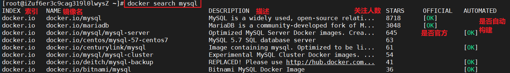

容器和容器内的应用，两者的生命周期需要是相同的！否则，一旦出现类似于“容器是正常运行的，但是里面的应用早已经挂了”的情况，编排系统处理起来就非常麻烦了。

核心概念：

- 主机(Host)：安装了 Docker 的宿主机；
- 客户端(Client)：连接 Docker 主机进行操作；
- 仓库(Registry)：用来保存各种打包好的软件镜像；
- 镜像(Images)：软件打包好的镜像；放在 Docker 仓库中；
- 容器(Container)：镜像启动后的实例称为一个容器；容器是独立运行的一个或一组应用

# 安装

在 Linux 环境下安装步骤：

1. 使用`uname -r`查看系统内核版本(Docker 要求 CentOS 系统的内核版本高于 3.10)
   - 如果内核版本较低，需升级软件包及内核：`yum update`
2. `yum install docker`安装 Docker(必须联网)
3. `systemctl start docker`启动 Docker
4. `docker -v`查看 Docker 版本
5. `systemctl enable docker`设置开机自启
6. `systemctl stop docker`停止 Docker

Docker 在拉取仓库镜像文件时过慢，可通过加速器来解决。见[阿里云镜像加速器](https://cr.console.aliyun.com/cn-zhangjiakou/mirrors)

1. 编辑 /etc/docker/daemon.json 文件：

   ```shell
   {
     "registry-mirrors": ["https://izitprih.mirror.aliyuncs.com"]
   }
   ```

2. 保存退出。

3. `sudo systemctl daemon-reload`

4. `sudo systemctl restart docker`

# 常用命令

可在[官网](https://docs.docker.com/engine/reference/commandline/docker/#child-commands)查看全部 Docker 命令！

## 帮助命令

```shell
docker version
docker info
docker --help
```

## 镜像相关

在[Docker 仓库官网](https://hub.docker.com/)可以搜索镜像，查看镜像的详情可以得到 tag。

```shell
# 在docker hub上检索镜像，使用 -s 参数可根据 star 数检索
docker search 镜像名
# 检索到镜像后可从镜像仓库拉取镜像，tag 是可选的，多为版本，不写则默认为 latest
docker pull 镜像名:tag
# 查看所有本地镜像
# "-a" 列出本地所有镜像(含中间镜像层)
# "-p" 只显示镜像 id
# "--digests" 显示镜像的摘要信息
# "--no-trunc" 显示完整的镜像信息
docker images
# 删除指定的本地镜像，也可使用 "镜像名:tag" 来删除
docker rmi 镜像id
# 在 Dockerfile 文件所在目录下执行该命令，可以构建镜像，-t 用于给镜像添加标签
docker build -t 标签
# 修改镜像 tag
docker image old_image:old_tag  new_image:new_tag
```

检索镜像：



## 容器相关

软件镜像(如 QQ 安装程序)——>运行镜像——>产生一个容器(正在运行的软件，如运行的 QQ)。

一个镜像可以启动多个容器！注意：映射端口时需要配置防火墙，也可直接关闭防火墙。

```shell
# 运行镜像
# "--name 自定义名字" 自定义容器名
# "-d" 后台运行
# "-p 主机端口:容器内部端口" 将主机端口映射到容器内部端口
# "-i" 以交互模式
# "-t" 为容器重新分配一个伪输入终端，通常和 "-i" 一起使用
# "-v" 磁盘挂载
docker run 镜像名:tag
# 当使用交互模式时，使用 exit 停止并退出容器
exit
# 容器不停止但退出
Ctrl+P+Q
# 查看运行中的容器
# "-a" 所有(运行中+运行过)容器
# "-n" 最近 n 个创建的容器
# "-q" 静默模式，只显示容器编号
# "-l" 最近创建的容器
docker ps
# 查看容器内部细节！！！
docker inspect 容器id
# 停止当前运行的容器
docker stop 容器名或容器id
# 强制停止容器
docker kill 容器名或容器id
# 启动容器
docker start 容器名或容器id
# 删除已停止的指定容器
docker rm 容器名或容器id
# 删除多个容器有以下两种方式
docker rm -f $(docker ps -a -q)
docker ps -a -q | xargs docker rm
```

示例：

```shell
docker run -d -p 6379:6379 --name myredis redis
```

更多命令：

```shell
# 查看容器日志
# "-t" 加入时间戳
# "-f" 同步更新最新的日志打印
# "--tail 数字" 显示最后多少条日志
docker logs 容器名或容器id
# 查看容器内进程
docker top 容器id
# 进入正在运行的容器并以命令行交互，直接进入容器启动命令的终端，但不会启动新的进程
docker attach 容器id
# 进入正在运行的容器并以命令行交互，在容器中打开新的终端，且可以启动新的进程（如果不加 "bash命令"，会打开新的终端，如果加了则直接返回 "bash命令" 的结果而不打开新的终端）
docker exec -it 容器id [bash命令]
# 将容器内的数据拷贝到宿主机
docker cp 容器id:容器内路径 宿主主机路径
```

Docker 容器后台运行，就必须有一个前台进程，容器运行的命令如果不是那些一直挂起的命令（如：`top`、`tail`），就会立即自动退出。

```shell
docker run -d centos
docker ps -a  # 会发现 centos 容器已经退出了
```

可以通过 `docker run --link 正在运行的容器名或id:别名 。。。` 使新生成的容器链接到**已经运行的容器**，如：

```shell
# 创建一个名为 mysql01 的容器
docker run --name mysql01 -p 3306:3306 -e MYSQL_ROOT_PASSWORD=123456 -d mysql:5.7
# 创建新的容器 blog，并与 mysql01 链接
docker run --name blog --link mysql01:mysql -p 8000:8000 blog-docker
# 在 blog 中，mysql 和 mysql01 都可以作为 mysql01 的 hostname 对其进行访问，而不通过 IP
```

`--link` 只能解决单机容器间的关联，在分布式多机的情况下，需要通过别的方式进行连接！

# 资源

- Docker 官方英文资源

docker 官网：[http://www.docker.com](http://www.docker.com/)

Docker windows 入门：<https://docs.docker.com/windows/>

Docker Linux 入门：<https://docs.docker.com/linux/>

Docker mac 入门：<https://docs.docker.com/mac/>

Docker 用户指引：<https://docs.docker.com/engine/userguide/>

Docker 官方博客：<http://blog.docker.com/>

Docker Hub: <https://hub.docker.com/>

Docker 开源： <https://www.docker.com/open-source>

---

- Docker 中文资源

Docker 中文网站：[http://www.docker.org.cn](http://www.docker.org.cn/)

Docker 安装手册：<http://www.docker.org.cn/book/install.html>

一小时 Docker 教程 ：<https://blog.csphere.cn/archives/22>

Docker 从入门到实践：<http://dockerpool.com/static/books/docker_practice/index.html>

Docker 中文指南：<http://www.widuu.com/chinese_docker/index.html>
