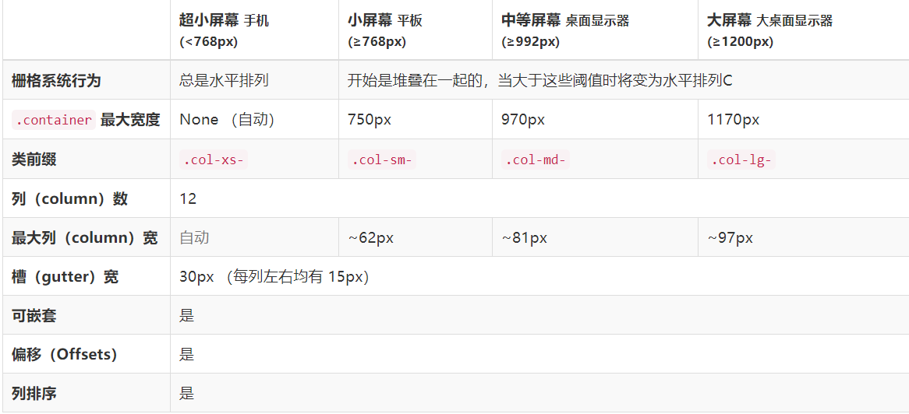

# Bootstrap

Bootstrap是一个基于HTML、CSS、JS 的移动设备优先的前端框架。让 Web 开发**更简单、更快捷**。使用 Bootstrap 框架并不代表我们再开发时不用自己写 CSS 样式，而是不用写绝大多数常见的样式。

[中文网站](http://www.bootcss.com/)、[官方网站](https://getbootstrap.com/)

[下载 v3.3.7](https://v3.bootcss.com/getting-started/#download)：选择用于生产环境的Bootstrap，解压下载后的文件，将css、fonts、js三个文件夹复制到工程中。

使用 Normalize.css 来建立跨浏览器的一致性。

注意：**Bootstrap 的所有 JavaScript 插件都依赖 jQuery**，因此jQuery必须在Bootstrap之前引入。

移动设备优先策略：

- 基础的 CSS 是移动优先。优先设计更小的宽度；
- 媒体查询。针对平板、台式电脑；
- 渐进增强。随着屏幕大小的增加而添加元素。

响应式：viewport 尺寸的增加，系统会自动分为最多12列。

用的较多的：模态框、表单、表单项、布局、栅格系统。

常用组件和样式：table、form、button、dropdown（下拉列表）、navbar（导航条）、pagination（分页组件）、alert（提示框）、model dialog（模式对话框）、progress bar（进度条）等

# 1.开始

## 1.1 基本模板

Bootstrap官网提供了基本模板：

```html
<!DOCTYPE html>
<html lang="zh-CN">
<head>
    <meta charset="utf-8">
    <meta http-equiv="X-UA-Compatible" content="IE=edge">
    <!--响应式meta标签-->
    <meta name="viewport" content="width=device-width, initial-scale=1">
    <!-- 上述3个meta标签*必须*放在最前面，任何其他内容都*必须*跟随其后！ -->
    <title>Bootstrap 101 Template</title>

    <!-- Bootstrap -->
    <link href="https://cdn.jsdelivr.net/npm/bootstrap@3.3.7/dist/css/bootstrap.min.css" rel="stylesheet">

    <!-- html5shiv 和 respond 是为了让 IE8 支持HTML5元素和媒体查询（media queries）功能 -->
    <!-- 警告：通过file:// 协议(就是直接将 html 页面拖拽到浏览器中)访问页面时respond不起作用 -->
	<!--条件注释的作用：当判断条件满足时，就会执行注释中的HTML代码，不满足时会当做注释忽略掉。这里引入了两个脚本-->
    <!--[if lt IE 9]>
        <script src="https://cdn.jsdelivr.net/npm/html5shiv@3.7.3/dist/html5shiv.min.js"></script>
        <script src="https://cdn.jsdelivr.net/npm/respond.js@1.4.2/dest/respond.min.js"></script>
	<![endif]-->
</head>
<body>
    <h1>你好，世界！</h1>
    <!-- jQuery (Bootstrap 的所有 JavaScript 插件都依赖 jQuery，所以必须放在前边) -->
    <script src="https://cdn.jsdelivr.net/npm/jquery@1.12.4/dist/jquery.min.js"></script>
    <!-- 加载 Bootstrap 的所有 JavaScript 插件。你也可以根据需要只加载单个插件。 -->
    <script src="https://cdn.jsdelivr.net/npm/bootstrap@3.3.7/dist/js/bootstrap.min.js"></script>
</body>
</html>
```

- 视口viewport的作用：在移动浏览器中，当页面宽度超出设备，浏览器内部虚拟的一个页面容器，将页面容器缩放到设备这么大，然后展示。属性：
  - width:设置viewport的宽度。
  - initial-scale：初始化缩放比例。
  - minimum-scale:最小缩放比例。
  - maximum-scale:最大缩放比例。
  - user-scalable:是否允许用户手动缩放（值可以写成yes/no，也可以写成1/0）
- 条件注释引入的两个脚本：
  - [html5shiv](https://github.com/aFarkas/html5shiv)：让浏览器可以识别 HTML5 的新标签。如header、footer、section等。
  - [respond.js](https://github.com/scottjehl/Respond)：让低版本浏览器可以使用 CSS3 的媒体查询。


## 1.2 搭建项目

### 目录结构

工程文件的目录结构：

```
├─ Demo ·························· 项目所在目录
└─┬─ /css/ ······················· 我们自己的CSS文件
  ├─ /font/ ······················ 使用到的字体文件
  ├─ /img/ ······················· 使用到的图片文件
  ├─ /js/ ························ 自己写的JS脚步
  ├─ /lib/ ······················· 从第三方下载回来的库【只用不改】
  ├─ /favicon.ico ················ 站点图标
  └─ /index.html ················· 入口文件
```


### 引入库文件

将Bootstrap下载后的文件解压后放入工程文件中，另外还需引入 html5shiv、respond、jQuery 这三个库文件。


### meta标签

使用\<meta>标签设置字符集、Viewport、浏览器兼容模式。见基本模板。


### favicon站点图标

```html
<link rel="shortcut icon" type="image/x-icon" href="favicon.ico">
```


### 引入第三方文件

注意：先引入第三方文件，再引入自己写的文件

```html
   <!-- 引入 Bootstrap 的核心样式文件（必须） -->
    <link rel="stylesheet" href="lib/bootstrap/css/bootstrap.css">
    <!-- 引入我们自己写的 css 样式文件-->
    <link rel="stylesheet" href="css/my.css">
。。。
	<script src="lib/jquery/jquery.js"></script>
	<script src="lib/bootstrap/js/bootstrap.js"></script>
	<script src="js/my.js"></script>
```


### 默认字体

在我们默认的样式表中将默认字体设置为：

```html
body{
  font-family: "Helvetica Neue",
                Helvetica,
                Microsoft Yahei,
                Hiragino Sans GB,
                WenQuanYi Micro Hei,
                sans-serif;
}
```


### 页面结构

先划分和页面的结构，再具体填充

```html
<!DOCTYPE html>
<html lang="zh-CN">
<head>
    <meta charset="utf-8">
    <meta http-equiv="X-UA-Compatible" content="IE=edge">
    <meta name="viewport" content="width=device-width, initial-scale=1, user-scalable=no">
    <title>我的网站</title>
    <!--建议：第三方引用的css库放在上面，自己写的文件，都放在下面-->

    <!-- 引入 Bootstrap 的核心样式文件（必须） -->
    <link rel="stylesheet" href="lib/bootstrap/css/bootstrap.css">
    <!-- 引入我们自己写的 css 样式文件-->
    <link rel="stylesheet" href="css/main.css">
    <link rel="shortcut icon" type="image/x-icon" href="favicon.ico">
    <!--[if lt IE 9]>
    <script src="lib/html5shiv/html5shiv.min.js"></script>
    <script src="lib/respond/respond.min.js"></script>
    <![endif]-->
</head>
<body>
    <!-- 头部区域 -->
    <header id="header"></header>
    <!-- /头部区域 -->

    <!-- 广告轮播 -->
    <section id="main_ad"></section>
    <!-- /广告轮播 -->

    <!-- 特色介绍 -->
    <section></section>
    <!-- /特色介绍 -->

    <!-- 立即预约 -->
    <section></section>
    <!-- /立即预约 -->

    <!-- 产品推荐 -->
    <section></section>
    <!-- /产品推荐 -->

    <!-- 新闻列表 -->
    <section></section>
    <!-- /新闻列表 -->

    <!-- 合作伙伴 -->
    <section></section>
    <!-- /合作伙伴 -->

    <!-- 脚注区域 -->
    <footer></footer>
    <!-- /脚注区域 -->

    <script src="lib/jquery/jquery.js"></script>
    <script src="lib/bootstrap/js/bootstrap.js"></script>
    <script src="js/main.js"></script>
</body>
</html>
```


# 2.CSS样式

需要哪个样式，直接根据官方文档在相应元素中添加指定的类名即可。这里仅选取重要部分。


## 2.1 布局容器

Bootstrap 需要为页面内容和栅格系统包裹一个 `.container` 容器。提供了两个类。注意，由于 `padding` 等属性的原因，这两种容器类不能互相嵌套。

```html
<!--.container 类用于固定宽度且居中的容器,该容器的宽度会跟随屏幕的变化而变化并支持响应式布局的容器-->
<div class="container"> ... </div>

<!--.container-fluid 类用于 100% 宽度，占据全部视口（viewport）的容器-->
<div class="container-fluid"> ... </div>
```


## 2.2 栅格系统

Bootstrap 提供了一套响应式、移动设备优先的流式栅格系统，随着屏幕或视口（viewport）尺寸的增加，系统会自动分为最多12列。它包含了易于使用的预定义类，还有强大的mixin 用于生成更具语义的布局。

栅格系统用于通过一系列的行（row）与列（column）的组合来创建页面布局，你的内容就可以放入这些创建好的布局中。

栅格参数：




```html
<div class="row">
    <div class="col-xs-12 col-md-8">超小屏幕下占12列，中屏下占8列</div>
    <div class="col-xs-6 col-md-4">超小屏幕下占6列(由于上一个div标签占满一行12列，所以当前div会在第二行占6列)，中屏下占4列(和上一个div标签在同一行)</div>
</div>
```

