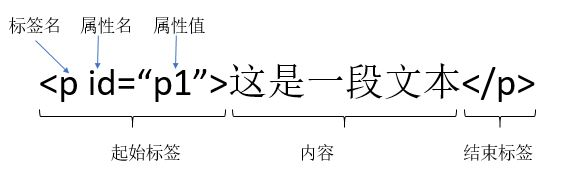
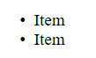
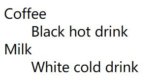
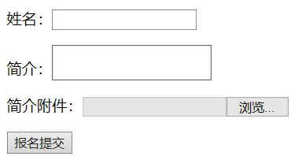

# HTML

HTML用于描述页面的结构！

# 0.补充

- 编写注意事项：
  - 虽然HTML标签对大小写不敏感，但推荐使用小写标签。
  - 一定要写上结束标签。
  - 写属性值时一定要加上引号。
  - 当显示页面时，浏览器会移除源代码中多余的空格和空行。所有连续的空格或空行都会被算作一个空格。需要注意的是，HTML 代码中的所有连续的空行（换行）也被显示为一个空格。 
- 标签分类：
  - 文本级标签：p、span、a、b、i、u、em。**文本级标签中只能放文字、图片、表单元素**；
  - 容器级标签：div、h系列、li、dt、dd。**容器级标签中可以放置任何东西**。
- HTML单标记元素：
  - `<meta charset="UTF-8"/>`
  - ``
  - `<link rel="stylesheet" type="text/css" href="some.css"/>`  引用外部的资源文件 
  - 对于单标记元素，尽量在<>闭合前加上 / ，H5可以不加，但 XHTML 强制需要 
- 最常用的全局属性： 
  - id（指定元素的唯一性）
  - class（指定元素应用的一个或多个样式规则，对应CSS中的class选择器）
  - style（直接给元素添加一组特定的样式）行内样式
  - title（添加特定的文字提示，当鼠标移动到该处时的显示） 
- 转义字符
  - **`&nbsp;`：空格	（non-breaking spacing）**
  - **`&lt;`：小于号**
  - **`&gt;`：大于号**
  - `&amp;`：符号`&`
  - `&quot;`：双引号
  - `&apos;`：单引号
  - `&copy;`：版权©
  - `&reg`：注册商标®
  - `&trade;`：商标`™`
  - `&#32464;`：文字`绐`。其实，`#32464`是汉字`绐`的unicode编码。

# 1.开始

HTML(Hyper Text Markup Language ) 超文本标记语言。

HTML基本要素：标签、元素、内容、属性 。



上图中p就称之为p元素

一个完整的HTML文档：

```html
<!DOCTYPE html> 		<!--文档声明头 DTD-->
<html lang="en">	
    <head>				
        <meta charset="UTF-8">	<!--这里定义文档的字符集为 UTF-8-->
        <title>Title</title>
    </head>				
    <body>				

    </body>
</html>
```

文档声明头 DocType Declaration，简称DTD 。该声明必须是HTML文档的第一行，位于`<html>`标记之前。声明了该HTML文档的文档类型。 **HTML5规范对应的文档类型声明只有一种：`<!DOCTYPE html>`**

HTML注释：`<!-- 注释信息-->`；


下面列出了模板的标签结构（包含嵌套关系）：

- `<html>`标签定义了整个HTML文档，所有的内容都要放在该标签内；
  - `<head>`标签定义关于HTML文档的信息，其中包含了浏览器使用的其他不可见信息；
    - `<title>`标签定义文档的标题，会在浏览器的最上面进行显示。建议该标签紧贴着`<head>`标签编写，网站中的多个页面的`<title>`也不应重复；


- `<meta>`标签提供有关页面的元信息（字符集charset、关键字、页面描述等）

  - 定义关键词（用来告诉搜索引擎该网页的主要内容，可以提高搜索命中率）

    ```html
    <meta name="keywords" content="B站,弹幕,字幕,AMV,MAD,MTV,ANIME,动漫,动漫音乐,游戏,游戏解说,ACG,galgame,动画,番组,新番,初音,洛天依,vocaloid">
    ```

  - 定义页面描述 description（搜索结果显示的内容）

    ```html
    <meta name="description" content="bilibili是国内知名的视频弹幕网站，这里有最及时的动漫新番，最棒的ACG氛围，最有创意的Up主。大家可以在这里找到许多欢乐。">
    ```

  - 请求重定向

    ```html
    <meta http-equiv="refresh" content="5;url=https://github.com/"> <!--5秒后跳转至GitHub网页-->
    ```


- `<body>`标签定义了文档的主体部分，也就是该HTML文档在浏览器上所显示的内容。主要编写的代码都在这个标签内。属性（除了下面列出的，还有很多）：
  - `bgcolor`：设置整个网页的背景颜色。
  - `background`：设置整个网页的背景图片。
  - `text`：设置网页中的文本颜色。
  - `leftmargin`：网页的左边距。IE浏览器默认是8个像素。
  - `topmargin`：网页的上边距。
  - `rightmargin`：网页的右边距。
  - `bottommargin`：网页的下边距。


- 块级元素：把标签中的内容当作一个块儿来对待
  - `<div>`分割（division）：。每个`<div>`无论内容多少都单独占据**一行**。
  - 其他常见块级元素：p、h1、h2...br 元素
  - 主要用于为页面布局
  - p元素不可以包含任何块元素
- 内联元素（行内元素：只占据自身内容大小的范围，不会占用一行）
  - `<span>`范围（span）。
  - 专门用于选中文字，然后为文字设置样式。
  - a元素可以包含除自身以外的任意元素
  - `<div>`是换行的`<span>`是不换行的。

一般只使用块级元素包含内联元素，而不会反过来使用。

观察以下代码的显示结果：

```html
<div style="background-color:red;">
		块级元素1
</div>
<div style="background-color:blue;">
		块级元素2
</div>
<span style="background-color:yellow">span元素1</span>
<span>span元素2</span>
```

- 内联框架：`<iframw>`可以向一个页面中引入其他的外部页面。属性：
  - src：外部页面的地址，可使用相对路径；
  - width、height：设置框架的宽度、高度
  - name：指定一个名字，可将该属性值设置为超链接的target属性值，这样点击超链接时，页面会在响应的内联框架中打开
  - 这里面的内容不会被搜索引擎检索，开发中尽量不要使用

# 2.文本

- HTML标题元素
  - `<h1>、<h2>、<h3>、<h4>、<h5>、<h6>`这六个标题元素表示各级标题
    - 通常字体逐次减小
    - 一个页面中只会使用一个`<h1>`标签
  - 浏览器会自动在标题的前后添加空行。

- HTML段落元素
  - `<p>`表示一个段落（paragraph ）。只能放文字、图片、表单元素，浏览器会在段前和段后各加一个换行。 
  - `<br/>`表示换行：虽然`<br>`和`<br/>`的效果一样，但建议使用`<br/>`,因为存在结束标签。
  - `<hr>` 水平标识线。是一条水平分割线 

- ”计算机输出“标签（常用于显示计算机/编程代码）

  - `<code>Computer code</code>`   定义计算机代码。 
  - `<kbd>Keyboard input</kbd>`     定义键盘码 。
  - `<tt>Teletype text</tt>`      定义打字机代码。  
  - `<samp>Sample text</samp>`       定义计算机代码样本。 
  - `<var>Computer variable</var>`    定义变量。 

- 文本格式化元素
  - `<b>Bold text</b>`    加粗 
  - `<i>italic text</i>`    斜体 
  - `<strong>Important text</strong> `  表示一段重要的文本，样式上和`<b>`元素相同都是加粗 
  - `<em>Emphasized text</em>`          表示一段重要的文本，样式上和`<i>`元素相同都是斜体
  - `<big>This text is big</big>`  表示大号字
  - ` <small>Smaller text</small> `      表示一段字体小的文本 
  - `<del>(deleted text)</del>`         表示需要删除的文本，样式上是在文本内容是加一条中划线 
  - `<ins>(inserted text)</ins> `       表示一段插入的文本，样式是在文本下面加上一条下划线 
  - `This text contains  <sub>subscript</sub>`     定义下标字
  - `This text contains  <sup>superscript</sup>`  定义上标字

- 引用

  - 短引用：`<q>构建人与自然和谐共存的世界。</q>`     浏览器通常会为` <q>` 元素包围*引号*。 

  - 长引用： `<blockquote>    </blockquote>`  浏览器通常会对 `<blockquote>` 元素进行*缩进*处理。 

    ```html
    <blockquote cite="http://www.worldwildlife.org/who/index.html">
    五十年来，WWF 一直致力于保护自然界的未来。
    世界领先的环保组织，WWF 工作于 100 个国家，
    并得到美国一百二十万会员及全球近五百万会员的支持。
    </blockquote>
    ```

  -  `<abbr> `元素定义*缩写*或首字母缩略语。 

    ```html
    <p> <abbr title="World Health Organization">WHO</abbr> 成立于 1948 年。 </p>
    <!--显示：WHO成立于1948年-->
    ```

   

# 3.插入

## 图片

- 语法：``

- 属性

  - src：（必须有）给出了img元素要加载图片的网络地址（Web URL） 
    - `src="http://tp4.sinaimg.cn/1938166551/50/5638454901/1"`这种绝对路径的方式可以加载和显示整个Web上的任何一张图片 
    - `src="img/a.jpg" `这种相对路径的方式是在当前HTML文件所在目录去找对应路径的图片 
    - `src=“/img/a.jpg”`这种相对路径的方式，无论当前HTML文件在Web服务器的那个目录下，都是在同一个Web服务器根目录下的img文件夹下找该图片
  - alt：（可选，但H5建议一定要加上）加载失败时的替换文字；也可以在这里添加一些图片的说明信息；搜索引擎通过该属性识别图片内容
  - width（可选）
  - height（可选） 
  - align （可选） 定义对齐方式


- 图片格式：
  - JPEG：颜色丰富的图片，如照片
  - GIF：颜色单一、简单透明的图片，动态图
  - PNG：颜色丰富、复杂透明的图片

- 案例：

  ```html
  <body background="/i/eg_background.jpg">      <!--插入背景图片-->
      <p>图像  </p>  <!--bottom是默认对齐方式-->
  </body>
  ```


## 超链接

- `<a> `标签创建超链接。语法：`<a href="所链接到内容的URL">点击跳转的内容（可以是文字、图片）</a>`。属性：
  - href：指定链接跳转的目标地址，可以是相对路径
    - 也可以是#id属性值，这样就会跳转到当前页面的指定位置；
    - 也可以使用`mailto:`来创建一个发送email的超链接
  - target：指定在哪个窗口打开链接。可选值：`_self`（默认值）当前窗口打开；`_blank`新窗口打开


使用：

- 文档外链接（一个文档到另一个文档的跳转 ）
  - `<a href="https://github.com/mybatis">MyBatis下载地址</a>`
  - `<a href="https://github.com/mybatis" target="_blank"></a> `对图片添加超链接 
  - `<a href="/course/202">即时通讯技术</a>`   超链接的方式与图片的src属性方式相同 
  - `<a href="mailto:simba.song@gmail.com">Email to Us</a>`  不再是以http开头的URL地址，而是以mailto开头。浏览器会尝试打开一个本地的浏览器客户端，尝试向特定的邮件地址发送邮件。
- 文档内导航 
    - `<a href="#faq">常见问题</a>` 导航跳转到当前文档 `id="faq"` 的元素所在的区域 
    - `<a href="#botton-section">去底部</a>`    导航跳转到当前文档 `id="botton-section"`的元素所在的区域 
    - `<a href="#">回顶部</a> `  返回到文档的顶部 
    - 综合eg:`<a href="http://abc.com/course/202#faq">常见问题</a>` 在当前页面跳转（由于target属性默认）到` http://abc.com/course/202 `然后立刻进行文档内导航，到`id="faq"`的区域 


## 列表

- Unordered List 无序列表

  ```html
  <ul>
      <li>Item </li>
      <li>Item </li>
  </ul>
  ```

  - 样式效果：

    

- Ordered List 有序列表 

  ```html
  <ol>
      <li>First </li>
      <li>Second </li>
  </ol>
  ```

  - 样式效果：

    

有序列表和无序列表在样式上会默认添加上的样式效果：一个1em（一个字体同等大小的边距）的上下外边距；40px（像素）大小的左外边距。

`<ul>`和`<ol>`元素可用来表示线性数据结构，如一组数据内容，导航栏的各个子项下拉列表的各个子项等。 

`<li>`元素中除了 plain text ，还可以防止嵌套的`<ul>`或`<ol>`，从而表示树形数据结构。

- 自定义列表

  - 自定义列表以 `<dl>` 标签开始。每个自定义列表项以 `<dt>` 开始。每个自定义列表项的定义以 `<dd>` 开始。 

    ```html
    <dl>
        <dt>Coffee</dt>
        <dd>Black hot drink</dd>
        <dt>Milk</dt>
        <dd>White cold drink</dd>
    </dl>
    ```

    

## 表格

- 表格 table （可用来表示二维数据结构）

  - ` <table>` 元素 :`<table border="1">` 拥有关于表格边框的附加信息。 
  - `<caption>` 元素   定义表格标题
  - `<tr> `元素 table row    如果有多个`<tr>`元素，会默认将其放入`<tbody>`元素中，再将`<tbody>`放入`<table>`元素中 
  - `<th>` 元素 table head  表格的表头
  - `<td>` 元素 table data   定义单元格的数据
  - 扩展：其他和table相关的 HTML Tags :
    - 对多行进行分组`<thead>`表格的页眉、`<tbody>`表格的主体、`<tfoot>`表格的页脚
    - 对多列进行分组`<colgroup>`表格列的组、`<col> `用于表格列的属性

  ```html
  <table border="1">
  <caption>我的标题</caption>
      <tr>							
          <th>Heading</th>
          <th>Another Heading</th>
  	</tr>
      <tr>							
          <td>row 1, cell 1</td>
          <td>row 1, cell 2</td>
      </tr>
      <tr>
          <td>row 2, cell 1</td>
          <td>&nbsp;</td>  <!--空单元格的边框不会被显示出来，在空单元格中添加一个空格占位符，就可以将边框显示出来-->
      </tr>
  </table>
  ```


## 表单

- `<form>` 元素为用户输入创建HTML表单，用于向服务器提交数据。 

  ```html
  <form action="/course.reg.do" method="post" enctype="multipart/form-data">
      <!--action属性给出了访问路径；method属性给出了提交的方式；enctype属性制定了表单提交给Server的编码方式，由于存在文件上传，所以使用了"multipart/form-data"-->
      
      <p>姓名：<input type="text"></p>        单行输入
      <p>简介：<textarea></textarea></p>      多行输入
      <p>简介附件：<input type="file"></p>
      <p><input type="submit" value="报名提交"></p>
  </form>
  ```

  - 样式效果：

    

# 4.样式

style 属性用于改变 HTML 元素的样式 

在 HTML 4 中，有若干的标签和属性是被废弃的。被废弃（Deprecated）的意思是在未来版本的 HTML 和 XHTML 中将不支持这些标签和属性。请避免使用这些被废弃的标签和属性！而使用样式替代。 

下面的替代样式都是写在style属性中的，如：`<h1 style="text-align:center">This is a heading</h1> `。

| 标签/属性                  | 描述               | 替代样式                                                     |
| -------------------------- | ------------------ | ------------------------------------------------------------ |
| ` <center> `               | 定义居中的内容。   |                                                              |
| ` <font> `和 `<basefont> ` | 定义 HTML 字体。   | `font-family `属性定义字体； `font-size`属性定义字体尺寸（用像素取值，如20px） |
| `<s> `和 `<strike> `       | 定义删除线文本     |                                                              |
| `<u>`                      | 定义下划线文本     |                                                              |
| `align`                    | 定义文本的对齐方式 | `text-align` 属性                                            |
| `bgcolor`                  | 定义背景颜色       | `background-color` 属性，eg：`<h2 style="background-color:red">This is a heading</h2> ` |
| ` color `                  | 定义文本颜色       | `color`属性                                                  |

- 案例：

  - 利用`background-color` 属性为元素定义了背景颜色 

    ```html
    <html>
        <body style="background-color:yellow">
            <h2 style="background-color:red">This is a heading</h2>
            <p style="background-color:green">This is a paragraph.</p>
        </body>
    </html>
    ```

  - `font-family`、`color` 以及`font-size` 属性分别定义元素中文本的字体系列、颜色和字体尺寸

    ```html
    <html>
        <body>
            <h1 style="font-family:verdana">A heading</h1>
            <p style="font-family:arial;color:red;font-size:20px;">A paragraph.</p>
        </body>
    </html>
    ```

  - `text-align` 属性规定了元素中文本的水平对齐方式 

    ```html
    <html>
        <body>
            <h1 style="text-align:center">This is a heading</h1>
            <p>The heading above is aligned to the center of this page.</p>
        </body>
    </html>
    ```

------

下面用到的标签说明：

| 标签      | 描述                           |
| --------- | ------------------------------ |
| `<style>` | 定义样式定义。                 |
| `<link>`  | 定义资源引用。                 |
| `<div>`   | 定义文档中的节或区域（块级）。 |
| `<span>`  | 定义文档中的行内的小块或区域。 |

当浏览器读到一个样式表，它就会按照这个样式表来对文档进行格式化。有以下三种方式来**插入样式表**：

-  外部样式表

  - 当样式需要被应用到很多页面的时候，外部样式表将是理想的选择。使用外部样式表，你就可以通过更改一个文件来改变整个站点的外观。 

    ```html
    <head>
    <link rel="stylesheet" type="text/css" href="mystyle.css">
    </head>
    ```

- 内部样式表

  - 当单个文件需要特别样式时，就可以使用内部样式表。你可以在 head 部分通过 `<style>` 标签定义内部样式表。 

    ```html
    <head>
        <style type="text/css">
        body {background-color: red}
        p {margin-left: 20px}
        </style>
    </head>
    ```

- 内联样式

  - 当特殊的样式需要应用到个别元素时，就可以使用内联样式。 使用内联样式的方法是在相关的标签中使用样式属性。样式属性可以包含任何 CSS 属性。以下实例显示出如何改变段落的颜色和左外边距。 

    ```html
    <p style="color: red; margin-left: 20px">
    This is a paragraph
    </p>
    ```


​                