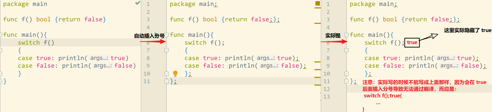

# 时间

`time.Parse()` 解析字符串后得到的是 UTC 时间（可通过 `Time.Location()` 函数查看）

`time.Now()` 得到的是本地时间

# 对空指针解引用

```go
type T struct {}

func (*T) foo() {}

func (T) bar()  {}

type S struct {
    *T  // 这里使用 T 的话，下面是可以正常运行的
}

func TestStructAssemble(t *testing.T) {
    s := S{}
    t.Logf("%#v",s)  //  S2{T:(*T)(nil)}
    _ = s.foo
    s.foo()
    _ = s.bar  // 报错，s.bar 会被展开为 (*s.T).bar，而 s.T 是空指针，解引用会 panic！
}
```

# 易错

- 没有显式声明类型的变量不允许使用 `nil` 初始化，如 `var a = nil` 是错误的
- 可以向 `nil` 的 slice 插入数据，但是对 `nil` 的 map 添加操作会导致 panic
- 无法使用 `cap()` 获取 map 的容量

```go
func TestNil(t *testing.T) {
    var m map[int]bool
    _ = m[123]
    var p *[5]string
    for range p {
        _ = len(*p)
    }
    var s []int
    _ = s[:]
    // s[0] 的 s == nil ，报错
    s, s[0] = []int{1, 2}, 0
}

func TestNilCover(t *testing.T) {
    nil := 123
    t.Log(nil)
    // 当前作用域中，预定义的 nil 被覆盖，此时 nil 是 int 类型值，不能赋值给 map 类型
    // var _ map[int]string = nil
}
```

# 方法表达式&多级指针调用方法

通过类型引用的方法表达式会被还原成普通函数样式，接收者是第一个参数，调用时显示传参。类型可以是 T 或 \*T，只要目标方法存在于该类型的方法集中就可以！详见《Go 语言学习笔记》-方法

```go
type N int

func (n N) value() {
    n++
    fmt.Printf("v: %p, %v\n", &n, n)
}

func (n *N) pointer() {
    *n++
    fmt.Printf("v: %p, %v\n", n, *n)
}

func (n N) test() {
    println(n)
}

func TestMethodExpression_struct(t *testing.T) {
    var n N = 10

    p := &n
    // 不能使用多级指针调用方法，编译报错
    // p1 := &p
    // p1.value()
    // p1.pointer()

    n++
    func1 := N.test    // 通过类型引用的方法表达式被还原成普通函数样式
    func1(n)        // 类型 N 的方法集中有 test，故可以调用，输出 11
    // N.test(n)  也可以直接使用方法表达式调用

    n++
    func2 := (*N).test
    func2(&n)      // 类型 *N 的方法集中有 test，可以调用。输出 12
    // (*N).test(n)
}

func TestMethodExpression_instance(t *testing.T) {
    var n N = 10
    p:=&n
    n++
    func1 := n.test
    n++
    func2 := p.test
    n++
    t.Log(n)  // 13
    func1()   // 11
    func2()   // 12
}
```

# 变量或常量的使用

- 位移操作中，类型推断的结果因是否为变量或常量而异：

```go
func main(){
  var n uint = 10
  const N uint = 10
  // 位移操作中，
  // 目标类型 x 是 byte 类型，n 为变量，1 会被认为和目标类型相同
  var x byte = (1<<n) / 100  // 1 被推断为 byte，从而溢出
  // N 是常量，1 被认为是类型不确定的整数
  var y byte = (1<<N) / 100  // 1 被认为时类型不确定整数
  println(x, y)   // 0, 10
}
```

- 编译行为因是否为变量或常量而异：

这里也是由于上面的类型推断导致的。

```go
    const N = 2
  var m = 2

    // 编译均没问题
    var _ float64 = 1 << N
  var _ = float64(1 << N)

    // 1 被推断为 float64 类型
    // 均编译失败：浮点数不可被移位
    var _ float64 = 1 << m
    var _ = float64(1 << m)
```

# \*rintf() 支持位置参数

包括 `Sprintf()`、`Fprintf()`、`Printf()` 都支持位置参数

```go
// 输出：coco
fmt.Printf("%[2]v%[1]v%[2]v%[1]v","o","c")
```

# Go 中的分号

Go 语言中分号自动插入的规则：

- 注释除外，如果一个代码行的最后一个语法词段(token)为下列所示之一，则 Lexer 会在该字段后(即行尾)自动插入一个分号：
  - 一个标识符，如`int`、`float64`
  - 一个整数、浮点数、虚部、码点或字符串字面表示形式
  - 跳转关键字：`break`、`continue`、`fallthrough`、`return`
  - `++` 或 `--`
  - 一个右括号：`)`、`}`、`]`
- 为了允许一条复杂语句完全显示在一个代码行中，分号可能被插入在一个 `)` 或 `}` 之前



为防止 IDE 自动格式化代码，在记事本中输入左侧代码后直接运行，输出：true。

左侧的代码在编译之前会自动插入一些分号得到中间那样的代码，而由于标准的 switch 语句格式是：

```go
// CompareOperand0 可以被省略，如果被省略，则 CompareOperand0 默认为 true
switch InitSimpleStatement; CompareOperand0{
  case CompareOperandList1:
    // todo something
  case CompareOperandList2:
    // todo something
  ...
  default:
    // todo something
}
```

最终等价于右侧的代码(仅用于说明)，故输出为 true。当然，如果是在 IDE 中编辑代码时不会遇到这一情况，因为会自动格式化代码，将 `{` 放到上一行的末尾。

# 不可寻址的值

不可寻址的主要有：

- 常量的值。
- 基本类型值的字面量。
- 算术操作的结果值。
- 对各种字面量的索引表达式和切片表达式的结果值。
  - 不过对切片字面量的索引结果值却是可寻址的。
- 对字符串变量的索引表达式和切片表达式的结果值。
- 对字典变量的索引表达式的结果值。
- 函数字面量和方法字面量，以及对它们的调用表达式的结果值。
- 结构体字面量的字段值，也就是对结构体字面量的选择表达式的结果值。
- 类型转换表达式的结果值。
- 类型断言表达式的结果值。接收表达式的结果值。

Go 语言中不可寻址的值有：不可变、临时结果、不安全

- 不安全的
  
  - 函数也是不可变的，且拿到指向一段代码的指针是**不安全**的
  - “不安全的” 操作很可能会破坏程序的一致性，引发不可预知的错误，从而严重影响程序的功能和稳定性

- 不可变

```go
func TestImmutable(t *testing.T) {
    // 1. 常量是不可寻址的，编译报错
    const a = 100
    t.Log(&a)
    // 2. 基本类型字面量不可寻址，编译报错
    t.Log(&12)
    // 3. 字符串类型是采用只读(不可变)的 byte slice 存储的，所以基于它的索引或切片的结果值也都是不可寻址的
    str := "abc"
    t.Log(&str[0])    // 基于字符串类型的索引的结果值是不可寻址的，编译报错
    t.Log(&str[0:1])  //基于字符串类型的切片的结果值是不可寻址的，编译报错
    s := str[0]
    t.Log(&s)   // 这样是合法的
    // 4. 函数是不可变的，且拿到指向一段代码的指针是不安全的
    _ = &func(x,y int) int {  // 字面量代表的函数不可寻址
        return x+y
    }
    _ = &(fmt.Sprintf) // 标识符代表的函数不可寻址
    _ = &(fmt.Sprintln("abc")) // 对函数的调用结果值不可寻址
}
```

- 临时结果

```go
func TestTemporaryResult(t *testing.T) {  // 临时结果
    // 算术操作的结果值不可寻址
    t.Log(&(12+13))
    a,b := 1,2
    t.Log(&(a+b))  // 也是不可寻址的
    c := a+b
    t.Log(&c)  // 将临时结果赋值给变量后就是可寻址的了
}
```

- 数组值、切片值或字典值的**字面量**的表达式会产生临时结果，所以是不可寻址的
  - 对切片字面量的索引结果值是可寻址的。因为不论怎样，每个切片值都会持有一个底层数组，而这个底层数组中的每个元素值都是有一个确切的内存地址的。

```go
//_ = &([3]int{1, 2, 3}[0]) // 对数组字面量的索引结果值不可寻址。
//_ = &([3]int{1, 2, 3}[0:2]) // 对数组字面量的切片结果值不可寻址。
_ = &([]int{1, 2, 3}[0]) // 对切片字面量的索引结果值却是可寻址的。
//_ = &([]int{1, 2, 3}[0:2]) // 对切片字面量的切片结果值不可寻址。
//_ = &(map[int]string{1: "a"}[0]) // 对字典字面量的索引结果值不可寻址。
```

- 如果针对的是数组类型或切片类型的变量，那么索引或切片的结果值就都不属于临时结果了，是可寻址的
  - 对字典类型的变量施加索引表达式，得到的结果值不属于临时结果！但仍不可寻址
    - 字典中总会有若干个哈希桶用于均匀地储存键-元素对。当满足一定条件时，字典可能会改变哈希桶的数量，并适时地把其中的键-元素对搬运到对应的新的哈希桶中；
    - 在这种情况下，获取字典中任何元素值的指针都是无意义的，也是不安全的。我们不知道什么时候那个元素值会被搬运到何处，也不知道原先的那个内存地址上还会被存放什么别的东西。所以，这样的值就应该是不可寻址的。

```go
a := [3]int{1, 2, 3}
b := &a[0]   // 对数组变量的索引表达式是可寻址的
var map1 = map[int]string{1: "a", 2: "b", 3: "c"}
_ = map1
//_ = &(map1[2]) // 对字典变量的索引结果值不可寻址。
```

在函数部分的笔记中说过：在基本类型的变量上调用该类型的指针方法，编译器会自动进行重写，如：

```go
type dog struct {
    name string
}

func (dog *dog) setName(name string) {
    dog.name = name
}

func new(name string) dog {
    return dog{name}
}

func main() {
    m := dog{"wang"}
    m.setName("mie")  // 编译器自动重写为 &m.setName("mie")
    new("black").setName("white")  // 编译时会报错
  // new() 的结果属于临时结果，是不可寻址的，所以无法进行取址操作！！！
}
```

Go 语言中的 `++` 和 `--` 不是操作符，只要在 `++` 或 `--` 的左边添加一个表达式，就可以组成一个自增语句或自减语句，但是，**这个表达式的结果值必须是可寻址的**。

有一个例外，虽然对字典字面量和字典变量索引表达式的结果值都是不可寻址的，但是这样的表达式却可以被用在自增语句和自减语句中。

还有两个类似的规则：

在赋值语句中，赋值操作符左边的表达式的结果值必须可寻址的，但是对字典的索引结果值也是可以的。

在带有`range`子句的`for`语句中，在`range`关键字左边的表达式的结果值也都必须是可寻址的，不过对字典的索引结果值同样可以被用在这里。
