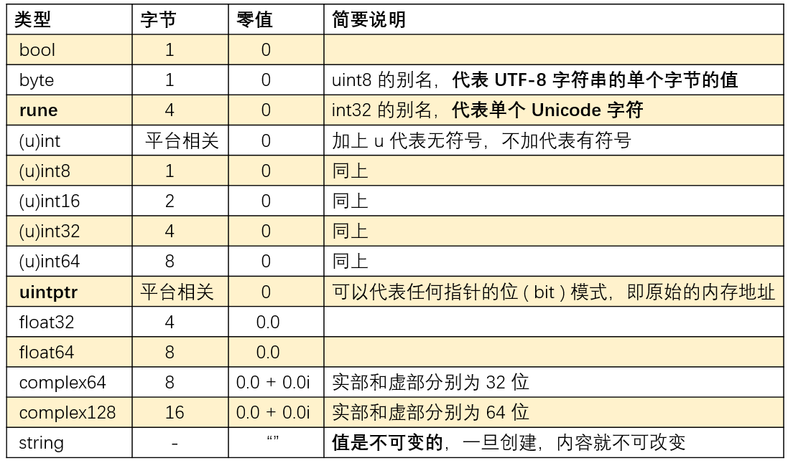

# 零散

## 变量基础使用

Go 语言中所有变量在赋值和作为参数传递时都将产生一次复制动作。

举例说明 Go 中如何使用变量：

```go
var i int = 10  // 使用 var 关键字声明变量
var s1,s2 string = "abc","def" //支持同时初始化多个变量
var a ,b ,s = 10,true,"def" //编译器可以根据值进行变量类型推断
// := 可以同时完成变量的声明和初始化，但这种写法只能用在函数内！！
m, n, e := 10,true,"def"
var (        //使用 var() 来集中定义变量
	age = 24
	sex = "male"
)
//可以借助 flag 包从命令行参数中获取变量值，见常用类库中 flag 包的笔记
const(  // 定义多个常量
	a string = "abc.txt"
  b int = 1024
)
```

**在 Go 语言中，定义了的变量必须被使用(全局变量和函数的参数定义后可以不使用，注意，赋值不算使用)！如果返回的多个值中有些不想要，可以使用 `_` 来获取：**

```go
//如果我们只想要取得第三个个返回值，可以：
_, _, nickName := GetName()  //GetName是一个有三个返回值的函数
```

## 平行赋值

**变量的平行赋值的步骤**：

1. 计算等号左边的索引表达式和取址表达式，接着计算等号右边的表达式；
2. 赋值。

```go
i := 1
s := []string{"A", "B", "C"}
// 1. 先计算 s[i-1] 即为 s[0]
// 2. 赋值：i,s[0] = 2,"Z"
i, s[i-1] = 2, "Z"
fmt.Printf("s: %v \n", s)  //  s: [Z,B,C]
```

## 值/引用类型

Go 语言中的类型主要分为值类型和引用类型，引用类型的零值均为 `nil。`

- 值类型包括：下面所有的基本类型和结构体

- 引用类型包括：切片（Slice）、map、chan、函数、接口、指针
  - Go **不支持指针的运算**，即不能通过 `指针+1` 访问下一个连续的内存空间！
  - **`nil` 只能赋值给引用类型(指针、chan、func、interface、map、slice)**
    - 如`var x = nil` 这种赋值是错误的

```go
var a int = 2
// pa 是一个对变量 a 的指针，类型为指向 int 的指针
var pa *int = &a // &a 是取变量 a 的地址
*pa = 3 				// 此时 a 的值被修改为3
fmt.Println(a) // 3
// 只声明的指针变量不能直接赋值
var b *int 		// 默认值为 nil
*b = 123  		// 报错，找不到地址！
var x = nil 	//由于不确定 x 的类型，错误
var x interface{} = nil // 正确
var x string = nil //错误
```

**指针不支持索引表达式！**

## \_type

`_type` 是描述 Go 中各种数据类型的结构体。\$GOROOT/src/runtime/type.go (go 1.13.7)中：

```go
type _type struct {
	size       uintptr // 类型大小
	ptrdata    uintptr // size of memory prefix holding all pointers
	hash       uint32  // 类型的哈希值
  tflag      tflag   // 类型的 flag，和反射相关
  // 内存对齐相关
	align      uint8
  fieldalign uint8
  // 类型的编号，有bool, slice, struct 等等等等
	kind       uint8
	alg        *typeAlg
	// gcdata stores the GC type data for the garbage collector.
	// If the KindGCProg bit is set in kind, gcdata is a GC program.
  // Otherwise it is a ptrmask bitmap. See mbitmap.go for details.
  // gc 相关
	gcdata    *byte
	str       nameOff
	ptrToThis typeOff
}
```

Go 语言各种数据类型都是在 \_type 字段的基础上，增加一些额外的字段来进行管理的，如：

```go
type arraytype struct {
	typ   _type
	elem  *_type
	slice *_type
	len   uintptr
}

type slicetype struct {
	typ  _type
	elem *_type
}
```

这些数据类型的结构体定义，是反射实现的基础。

# 基本类型

Go 语言的基本类型：



单个字符用单引号，多个字符是字符串要使用双引号。

常见的有 bool、数值型、字符、指针、数组等是可以比较的，而像切片、map、函数等是不能比较的。

Go 中没有 `long`、`double` 类型。

Java 的基本数据类型为：`byte`、`short`、`char`、`boolean`、`int`、`long`、`float`、`double`。

Go 中没有定义最大/小值常量，但是可以通过位元算自定义：

```go
// 无符号整型最小值为 0，其二进制表示的所有位都为 0
const UINT_MIN unit = 0
// 无符号整型最大值的二进制表示的所有位都为 1
const UINT_MAX uint = ^uint(0)
// 根据补码。有符号整型的最大值二进制表示：首位 0 其余 1
const INT_MAX int = int(^uint(0) >> 1)
// 根据补码，有符号整型的最小值二进制表示，首位 1，其余0
const INT_MIN int = ^INT_MAX
```

## string

string 类型不能与 nil 比较！

- 字符串的连接

```go
import (
	"fmt"
	"strings"
	"testing"
)

func TestStrConn(t *testing.T) {
	t.Log("test the connection of strings")
	// 方式一
	str1 := "abc" + "123"
	t.Log(str1)
	// 方式二
	str2 := fmt.Sprintf("abc%d", 123)
	t.Log(str2)
	// 方式三
	strs := []string{"abc", "1", "23"}
	// 第二个参数是连接每个字符串的连接符
	str3 := strings.Join(strs, "")
	t.Log(str3)
	// 方式四
	str4 := strings.Builder{}
	str4.WriteString("abc")
	str4.WriteString("123")
	t.Log(str4.String())
}
```

- `string`：其内存模型`reflect.StringHeader`包含一个指向字符串存储数据的指针和一个长度数据

`string` 用只读（即**不可变**）的 byte slice（见后面）来存储数据，`len()`函数可以返回其所包含的 byte 数；

用`+`来连接字符串时，会把所有被拼接的字符串依次拷贝到一个新的足够大的连续内存空间中，最后将持有相应指针值的 `string` 值返回；

字符串支持`s[i]`取出字符串对应位置的字符，但不可以对其重新赋值：

```go
func TestTmp(t *testing.T) {
	str := "hello"
	t.Logf("%T, %v",str[0],str[0])   // uint8, 104
	t.Log(str[0])  // 104
	//str[0] = 'x'  编译错误，字符串是只读的
}
```

可以使用 `range` 来遍历：**带 range 的 for 语句会先把被遍历的字符串拆成一个字节序列，然后再试图找出这个字节序列中包含的每个 UTF-8 编码值（即 Unicode 字符）**：

```go
func TestUtf(t *testing.T) {
	str := "Go 爱好者"
	for i, c := range str {
		t.Logf("%d: %q [% x]\n", i, c, []byte(string(c)))
	}
}
```

输出：

```go
0: 'G' [47]
1: 'o' [6f]
2: ' ' [20]
3: '爱' [e7 88 b1]
6: '好' [e5 a5 bd]   // 注意索引的变化
9: '者' [e8 80 85]
```

要将一个整型转为字符串，如 65 转为 `“65”`，需要借助 `strconv.ItoA()`，如果直接使用 `string(65)` 得到的是字母 A。

## rune

UTF-8 编码方案会把一个 Unicode 字符编码为一个长度在 1~4 范围内的字节序列，所以一个 `rune` 类型的值也可由一个或多个字节来表示。实际是 `rune` 是 `int32` 的一个别名类型，即一个 `rune` 值由四个字节宽度的空间存储，其空间总能存下一个 UTF-8 编码值。`rune` 的值相当于我们看到的外部表现，而其内部存储的 UTF-8 编码值则是内在表现。

- `rune`： Go 特有的一个基本数据类型，它的一个值代表一个 Unicode 字符。如 “G”、“o”、“爱”、“好”、“者” 代表的就是一个个 Unicode 字符。

含多个字符的序列可以使用 `rune` 类型的切片表示；

含多个字节的序列可以使用 `byte` 类型的切片表示。

```go
func TestUtf(t *testing.T) {
  str := "Go 爱好者"
  t.Logf("The string: %q\n", str)
  // 打印单个 Unicode 字符
  t.Logf(" => runes(char): %q\n", []rune(str))
  // 每个 rune 类型的值底层都是使用 UTF-8 编码值表示的
  t.Logf(" => runes(hex): %x\n", []rune(str))
  //中文字符对应的 UFT-8 编码都需要使用三个字节表示，将每个字符的 UTF-8 编码值拆成对应的字节序列
  t.Logf(" => bytes(hex): [% x]\n", []byte(str))
}
```

输出：

```go
The string: "Go 爱好者"
=> runes(char): ['G' 'o' ' ' '爱' '好' '者']
=> runes(hex): [47 6f 20 7231 597d 8005]
=> bytes(hex): [47 6f 20 e7 88 b1 e5 a5 bd e8 80 85]
```

注意：对于多字节的 UTF-8 编码值而言，可以把它当作一个整体转换为单一的整数，也可先把它拆成字节序列，再把每个字节分别转为一个整数。中文字符 ‘爱’ 的 UTF-8 编码值可以表示为单一整数 7231，也可表示为三个整数：e7、88、b1。

## 复数

```go
//这里不能写 4*i，否则编译器会将 i 当作未定义的变量，所以必须写 4i
c := 3 + 4i
fmt.Println(cmplx.Abs(c)) //cmplx 是复数的一个库，这里对复数取模

fmt.Println(cmplx.Exp(1i * math.Pi) + 1) //正确的输出结果应为 0，但由于complex类型也属于浮点型，计算结果是不准确的，所以输出：(0+1.2246467991473515e-16i)
```

## 别名类型

别名类型主要是为了代码重构而存在的。别名类型，如：`type String = string`

注意区分别名类型和类型再定义：

```go
//别名，String 和 string 是相同类型。注意：无法给 String 添加新的方法
// string 类型的值可直接赋值给 String 类型的变量，而不用经过类型转换！
type String = string

//类型再定义，myString 和 string 是不同类型，
// string 类型的值要想赋值给 String 类型的变量，必须经过强制类型转换
//可以给 myString 添加新方法
type myString string

func TestAlias(t *testing.T) {
	var name String
	t.Logf("%T", name)   // string
	var gender myString
	t.Logf("%T",gender)  // alias.myString
}
```

## 类型转换

**Go 语言中的类型转换必须是强制的，没有隐式类型转换！**别名类型间可以互相直接转换！

```go
func triangle() {
  var a, b int = 3, 4
  var c int
  //错误，因为Sqrt方法的参数类型为 float64，而 int 不能隐式转换为 float64
  c = math.Sqrt(a*a + b*b)
  //错误， Sqrt 方法的返回值必须是 float64，而 c 是 int
  c = math.Sqrt(float64(a*a + b*b))
  //正确的写法：
  c = int(math.Sqrt(float64(a*a + b*b)))
}
```

在 Java 中：

```java
byte b1 = 1,b2 = 2,b3;
b3 = b1 + b2;//b1、b2先提升为int再计算，导致编译出错，需要进行强制转型
```

# 高级类型

## 数组

**数组的长度是固定的，必须在声明时给定。长度也是数组类型的一部分，如 `[1]int` 和 `[2]int` 是不同类型的，且长度需要在编译期确定。**

数组的零值：每个元素为元素类型的零值。

```go
var arr1 [5]int // 每个元素会被初始化为元素类型的零值，即 [0 0 0 0 0]
arr2 := [3]int{1, 2, 3}
//长度根据初始化值得个数计算
arr3 := [...]bool{true, false, false}
var grid [2][2]int = {{1,2},{3,4}}
// 指定索引来初始化，未指定初始值的元素用零值初始化！！！
// 缺失索引的元素，其索引会在前一个索引基础之上加一，如 fourth 的索引为 4
// 切片也可以这样赋值！
a := [...]string{1: "first", 3: "third", "fourth"}
for i, v := range a {
  // 共计五个元素，其中索引为 0、2 的元素值为 string 的零值 ""
  fmt.Println(i,": ",v)
}
```

---

- 比较：

**相同维数且元素个数和类型相同的数组才可以用 `==` 比较**，此时，每个元素都相同，数组才相等。

```go
func TestOperations(t *testing.T) {
	a := [...]int{1, 2, 3, 4, 5}
	//b := [...]int{1, 2, 3, 4}
	c := [...]int{1, 2, 3, 4, 5}
	d := [...]int{1, 2, 3, 5, 4}
	//t.Logf(a == b) //编译无法通过
	t.Log(a == c) //true
	t.Log(a == d) //false
}
```

---

- 遍历：

```go
for i := 0; i < len(arr3); i++ {
    fmt.Println(arr3[i])
}

for i := range arr3 { // i接收下标！
    fmt.Println(arr3[i])
}

for i, v := range arr3 { // i接收下标，v接收值
    fmt.Println(i, v)
}
```

---

- 使用：

Go 语言中，**数组是一个值类型**。**如果向函数中传入数组，函数接收到的是数组的副本，而不是一个指向数组的指针**。且使用数组作为参数时，由于数组的特性，其长度也是固定的。

```go
// 如果数组很大，可以使用指针来传递数组，参数写成 arr *[5]int
// 使用指针时，修改也可以反映到原数组上
func printArray(arr [5]int)  {
	arr[0] = 100
	for _, v := range arr {
		fmt.Println( v)
	}
}
func main() {
	var arr1 [5]int
	arr2 := [3]int{1, 2, 3}
	printArray(arr1)   //输出 100 0 0 0 0，注意：不能传入 arr2
	fmt.Println(arr1) //输出 0 0 0 0 0 。可以看出数组的传递是值传递
}
```

---

- 对比 Java：

Java 中的数组在使用时必须进行初始化：

```java
@Test
public void TestArr() {
  int[] arr = new int[5];
  for (int i = 0; i < 5; i++) {
    arr[i] = 1 << i;
  }
  System.out.println(arr.length);  // 获取数组长度
  int[] array = {1,2,3,4,5,6};
  System.out.println(arr == array); // 不同维度的数组可以比较
  int[] ns;
  ns = new int[] { 68, 79, 91, 85, 62 };
}
```

## 切片 Slice

**函数参数传递机制导致传递大的数组类型是低效的，且对数组参数的任何修改都是在副本上的，而无法反映到原始的数组上，所以一般不直接使用数组！而使用 Slice(切片)。**

切片的零值是 `nil`，且长度、容量都为 0。

Slice 的容量是可伸缩的，不可以用 `==` 比较！**`[...]int`是数组而不是切片！**

在 \$GOROOT/src/runtime/slice.go 中定义了 slice：

```go
type slice struct {
  array unsafe.Pointer  //指向底层数组的指针
  len   int //记录切片中元素的个数
  cap   int //记录切片的容量
}
```

可见切片实际是一个结构体，所以传递时传递的是一个副本：

```go
func TestParam(t *testing.T) {
	arr := [5]string{"a", "b", "c","d"}
	slice := arr[:4]
	testSlice(slice) // 传入 slice 的副本，所以下面 slice 的值不变
	t.Log(slice) // a b c d
	t.Log(arr)   // a b c d e
	testSlicePoint(&slice) // 传入 slice 指针的副本，对 slice 进行修改
	t.Log(slice) // a b c d f
	t.Log(arr)   // a b c d f
}

func testSlice(stack []string) {
	stack = append(stack, "e")  // 对切片的底层数组进行了改变
}
func testSlicePoint(stack *[]string) {
	*stack = append(*stack, "f")  // 对切片的底层数组进行了改变
}
```

无论传递的是 slice 还是 slice 的指针，如果改变了 slice 底层的数据，都会反映到实参 slice 的底层数据。底层数据在 slice 结构体里是一个指针，尽管 slice 结构体自身不会被改变，也就是说底层数据地址不会被改变。 但是通过指向底层数据的指针，可以改变切片的底层数据。

Java 中没有切片。

### 创建

- 方法一：直接声明一个 Slice ，零值是 `nil`，然后添加元素

| 创建方式      | nil 切片(推荐)         | 空切片                    |
| ------------- | ---------------------- | ------------------------- |
| 方式一        | `var s1 []int`         | `var s2 = []int{}`        |
| 方式二        | `var s4 = *new([]int)` | `var s3 = make([]int, 0)` |
| 长度          | 0                      | 0                         |
| 容量          | 0                      | 0                         |
| 和 `nil` 比较 | `true`                 | `false`                   |

```go
func TestCreateSlice_1(t *testing.T) {
  var s []int  // 长度、容量均为 0，且此时 s == nil
  for i := 0; i < 5; i++ {
    //内置函数len()、cap() 分别可以获得切片 s 的长度和容量
    t.Logf("s = %v,len = %d, cap = %d\n", s,len(s), cap(s))
    s = append(s, 2*i+1)
  }
}
```

输出：

```go
s = [],len = 0, cap = 0
s = [1],len = 1, cap = 1
s = [1 3],len = 2, cap = 2
s = [1 3 5],len = 3, cap = 4   // 扩容为原来的两倍
s = [1 3 5 7],len = 4, cap = 4
最终的 s = [1 3 5 7 9]
```

---

- 方法二：使用初始化表达式创建

```go
// 使用了索引号来赋值，未注明的元素默认为零值
s1 := []int{0, 1, 2, 3, 8: 100}
fmt.Println(s1, len(s1), cap(s1))  // 9, 9
```

---

- 方法三：对已有数组进行切片

注意：**对已有数组切片时，区间为左闭右开区间**

截取的有两种特殊方式注意区分：

```go
// 截取 arr 索引范围为[i,j)的元素，长度和容量均为 j-i
s := arr[i:j]
// 截取 arr 索引范围为 [i,j) 的元素，长度为 j-i，但容量为 k-i
s := arr[i:j:k]
```

以下仅显示切片中容量内的元素，`_`是个人记录切片容量范围内但超出切片长度范围的元素（读取时可以读取到对应的底层数组的该元素），实际并没有`_`这种表示。

```go
func TestCreateSlice_2(t *testing.T) {
	arr := [...]int{0, 1, 2, 3, 4, 5, 6, 7, 8, 9}
	t.Log(arr[:6])//0, 1, 2, 3, 4, 5, _, _, _, _
	t.Log(arr[2:])//      2, 3, 4, 5, 6, 7, 8, 9
	t.Log(arr[:]) //0, 1, 2, 3, 4, 5, 6, 7, 8, 9

	s1 := arr[2:5]//      2, 3, 4, _, _, _, _, _
	s2 := s1[2:6:7]//           4, 5, 6, 7, _,
	t.Log(cap(s2)) // 容量为 5
	s2 = append(s2, 100)
	s2 = append(s2, 200) // 容量不足，扩容导致底层数组发生改变！！！
	s1[2] = 20
	t.Log(s1)     //      2, 3,20, _, _, _, _, _
	t.Log(s2)     //            4, 5, 6, 7,100,200
	t.Log(arr)    //0, 1, 2, 3,20, 5, 6, 7,100, 9
}
```

---

方法四：`make()`

```go
func TestCreateSlice_3(t *testing.T) {
	s1 := make([]int, 0)      //创建一个 len=0，cap=0 的 Slice
	s2 := make([]int, 16)     //创建一个 len=16，cap=16 的 Slice
	s3 := make([]int, 10, 32) //创建一个 len=10，cap=32 的 Slice
	t.Log(s1)                 // 什么也没有
	t.Log(s2)                 // 16 个 0
	t.Log(s3)                 // 10 个 0
	s1 = append(s1, 1)
	t.Log(s1)                 // 1
	s3 = append(s3, 23)
	t.Log(s3) 							 // 0 0 0 0 0 0 0 0 0 0 23
}
```

### append

内置函数 `func append(slice []Type, elems ...Type) []Type` 会向 slice 的末尾添加元素，并返回 slice。因为底层的数组可能被改变，该结果必须被返回，即**必须接收`append()`的返回值，否则编译失败**。**可以为没有初始化(即值为 nil )的切片增加元素！**

**添加元素时如果超过 cap，系统会重新分配更大的底层数组。**

如果要向 Slice 中添加一个 Slice：注意第二个参数的写法！

```go
s1 = append(s1, s2...)  // s1、s2 都是 Slice
```

扩容规则，注意下面的示例：

```go
func main() {
  s := []int{1,2}
  s = append(s,4,5,6) // 这里传入 growslice() 的新 slice 最小容量为 2+3=5，得到 newcap=5，之后会进行内存对齐，最终的新容量为 6
  fmt.Printf("len=%d, cap=%d",len(s),cap(s))  // len=5, cap=6
}
```

\$GOROOT/src/runtime/slice.go 中的 `growslice` 方法：

```go
// 参数分别为：元素类型、老的 slice、新 slice 的最小容量
func growslice(et *_type, old slice, cap int) slice {
	// ...
  newcap := old.cap
	doublecap := newcap + newcap
	if cap > doublecap {
		newcap = cap
	} else {
		if old.len < 1024 {
			newcap = doublecap
		} else {
			for 0 < newcap && newcap < cap {
				newcap += newcap / 4
			}
			if newcap <= 0 {
				newcap = cap
			}
		}
	}
  // 内存对齐
}
```

- 如果新 slice 的最小容量 cap > (旧 slice 的容量 \* 2)，则新的容量为 cap
- 如果新 slice 的最小容量 cap < (旧 slice 的容量 \* 2)
  - 旧 slice 的容量 < 1024，增长因子为 1，即扩容时新容量为旧容量的 2 倍
  - 旧 slice 的容量 >= 1024，增长因子为 0.25，即扩容时新容量为旧容量的 1.25 倍

之后还会进行内存方面的操作，所以这里得到的并不是最终的容量！

### 二维 Slice

定义并赋初值：

```go
file, _ := os.Open(filename)  //这里是从一个文件中读取
maze := make([][]int, row)
for i := range maze {
  maze[i] = make([]int, col)
  for j := range maze[i] {
    fmt.Fscanf(file, "%d", &maze[i][j])
  }
}
```

读取值：

```go
for _, row := range maze {
  for _, val := range row {
    fmt.Printf("%d ", val)
  }
  fmt.Println()
}
```

### 其他操作

- 遍历

使用 `range` 来遍历，与数组相同。

---

- copy

```go
copy(s2,s)  //把 s 复制到 s2
```

拷贝数量取两个切片长度的最小值，如，将长度为 10 的切片拷贝到长度为 5 的切片时，只会拷贝 5 个，即 copy 过程中不会发生扩容。

如何高效地 clone 一个切片呢？有以下两种方法：

```go
// 方法一：
b := make([]T, len(a))
copy(b, a)
// 方法二：
b = append(a[:0:0], a...)
```

其中方法二比方法一高效，且当 `a == nil` 时，方法一得到的 `b != nil`，而方法二可以得到 `b == nil`！

---

- 删除

Go 语言并没有内置的删除 Slice 元素的函数，可以通过`append(slice []Type, elems ...Type)`来完成，假设要删除索引为 3 的元素：

```go
func TestDeleteElementFromSlice(t *testing.T) {
	s := []int{1, 2, 3, 4, 5, 6}
	// 删除索引为 3 的元素
	s = append(s[:3], s[4:]...)
	// 删除中间元素，len-1、cap 不变
	t.Logf("%v, len = %d,cap = %d", s, len(s), cap(s))
	// 删除第一个元素，len-1、cap-1
	s = s[1:]
	t.Logf("%v, len = %d,cap = %d", s, len(s), cap(s))
}
```

输出：

```go
[1 2 3 5 6], len = 5,cap = 6
[2 3 5 6], len = 4,cap = 5
```

---

- 比较：slice 之间不能比较，所以不能使用 `==` 来判断两个 slice 是否完全相等

标准库提供了 `bytes.Equal(a, b []byte))` 函数来判断两个字节类型 slice 是否相等，但是对于其他类型的 slice，就必须自己展开每个元素进行比较。

slice 唯一合法的比较操作是和 `nil` 比较。见 Slice 创建的第一种方法。

### 数组&切片

举例说明：

```go
func TestRange(t *testing.T) {
	numbers2 := [...]int{1, 2, 3, 4, 5, 6} //数组
	maxIndex2 := len(numbers2) - 1  //5
  // 传入的是数组的副本，所以遍历的是 [1, 2, 3, 4, 5, 6] 这些数字
	for i, e := range numbers2 {
		if i == maxIndex2 {
			numbers2[0] += e
		} else {
			numbers2[i+1] += e
		}
	}
	t.Log(numbers2)
}
//输出为：[7 3 5 7 9 11]
```

```go
func TestRange(t *testing.T) {
	numbers2 := []int{1, 2, 3, 4, 5, 6}  //切片
	maxIndex2 := len(numbers2) - 1
  // 传入的是切片的副本，但由于下面的每次修改都对底层数据进行了修改，所以切片副本的底层数据也在不断改变
	for i, e := range numbers2 {
		if i == maxIndex2 {
			numbers2[0] += e
		} else {
			numbers2[i+1] += e
		}
	}
	t.Log(numbers2)
}
//输出为：[22 3 6 10 15 21]
```

## map

Go 中字典：键的类型受限，而元素可以是任意类型。字典不是并发安全的！

map 的零值为 `nil`。

在哈希表中查找某个键对应的元素时，先用哈希函数将键值转为哈希值（一个无符号整数），根据哈希值（的低几位）定位到一个哈希桶，再在哈希桶中找这个键值，由于键-元素时一起存储的，找到了键也就找到了元素。**会有两次比较的过程：比较哈希值从而找到哈希桶，比较键值从而找到键-元素对**。

由于上面的查找过程，**字典的键类型不能是函数、字典、切片类型**，**因为这三种类型是不可判等的**。此外，如果键的类型是接口类型，那么键的实际类型也不能是那三种类型，否则会引发 `panic`。

map 的 value：也可以是一个 map、还可以是一个函数。

**map 的 value 本身是不可取址的！**对于类似 `X=Y`这样的赋值操作，必须知道 X 的地址才能完成赋值操作，假设 map 的值(m)是一个结构体，`m[key].X=Y` 这种操作会在编译时报错。

### 基本使用

- 创建

**map 必须要初始化才能使用！不能对 nil 的 map 直接赋值。**

```go
// map[key的类型]值的类型
var m1 map[string]int // m3 == nil
m1["a"] = 100 // 上面声明后，还没有分配内存，不能直接赋值，这里会报错
// 字面量的方式直接初始化
m2 := map[string]int{ "id": 28}
// 推荐使用 make() 创建，可以指定 map 的初始容量但是会被忽略
m3 := make(map[string]int)  // m3 != nil，已经分配内存，可以直接赋值
fmt.Println(m1,m3) // map[] map[]
// 一个容器组合字面值中的常量键值(含索引下标)不可重复，该规则可被用来实现编译时刻断言，下面的例子就是要断言 S1、S2 在编译时都不能为空
const S1 = "Hello World"
const S2 = ""
// 正常
var _ map[bool]int{false: 0, len(S1)!=0: 1}
// 编译报错
var _ map[bool]int{false: 0, len(S2)!=0: 1}
```

---

- 遍历

```go
  for k, v := range m {
    fmt.Println(k, v)
  }
```

---

- 取值

```go
  m := map[string]string{
    "name": "fms5cmS",
    "course": "golang",
  }
	// 不能通过返回 nil 来判断元素是否存在！
	name := m["name"]  //如果取 map 中不存在的元素，会返回一个值类型的零值。
  name = m["nme"]  //这里将key拼错，但仍会得到一个空字符串（value的零值）
```

---

- 判断 key 是否存在

```go
	// ok用于接收要取得值是否存在，如果不存在，name == 值类型零值，ok == false
  if name, ok = m["nme"]; ok{
    fmt.Println(name)
  } else{
    fmt.Println("key does not exist")
  }
```

---

- 删除

```go
	//即使 "name" 这个 key 已经不存在了也可以安全执行
  delete(m,"name")
```

---

- 其他

使用`len()`可以获得元素个数。无法使用 `cap()` 获取 map 的容量！

**除了添加键-元素对以外，在值为 `nil` 的字典上做任何操作都不会引起错误！！！！**

**禁止对 map 的元素取址，因为 map 可能随着元素数量的增长而重新分配更大的内存空间，从而导致之前的地址无效！**所以 `bobAge = &ages["bob"]` 这样的写法无法通过编译。

map 的迭代顺序不确定，这是故意的，每次都使用随机的遍历顺序可以强制要求程序不会依赖具体的哈希函数实现。如果要按顺序遍历，必须显式地对 key 进行排序，如：

```go
names := make([]string, 0, len(ages))
for name := range ages {
  names = append(names, name)
}
sort.Strings(names)
for _, name := range names {
  fmt.Printf("%s\t%d\n", name, ages[name])
}
```

Go 的内置集合中没有 Set 实现，可以使用 `map[type]bool` 来实现。

### key 的类型选择

从性能上讲，求哈希和判等操作的速度越快，对应的类型就越适合做键类型。

- 以求哈希的操作为例，宽度越小（单个值占用的字节数）的类型，速度通常越快。
  - 如`bool`、`unit8`、`int8` 一个值占用一个字节，所以这些类型的宽度为 1；
  - `string` 的宽度不确定，需要看其值的具体宽度；
  - 对数组类型的值求哈希，实际上是依次求得它的每个元素的哈希值并进行合并，所以速度取决于它的元素类型即长度；
  - 对结构体类型的值求哈希实际上就是对它的所有字段值求哈希并进行合并，所以关键在于它的各个字段的类型以及字段的数量；
  - 而对于接口类型，具体的哈希算法，则由值的实际类型决定。

优先选择数值类型和指针类型作为键类型，如果非要选择字符串类型，最好对键值的长度进行额外约束。

### 底层

\$GOROOT/src/runtime/map.go 中 map 的数据结构：

```go
type hmap struct {
  count     int  //记录当前保存的元素个数，len(map) 返回这个值
  flags     uint8
  B         uint8  //指示 bucket 数组的个数
  noverflow uint16 //overflow 的 bucket 近似数
  hash0     uint32 // hash seed，计算 key 的哈希时会传入哈希函数

  buckets    unsafe.Pointer // bucket 数组指针，数组大小为2^B，如果元素个数为0，该值即为 nil
  oldbuckets unsafe.Pointer //扩容的时候，buckets 长度会是 oldbuckets 的两倍
  nevacuate  uintptr //指示扩容进度，小于此地址的 buckets 迁移完成

  extra *mapextra
}
```

哈希桶 bucket 的数据结构：

```go
type bmap struct {
	tophash [bucketCnt]uint8 //包含了 bucket 中每个 key 的高八位哈希值
}
```

编译期间会动态生成以下新的 bucket 结构：

```go
type bmap struct {
  topbits  [8]uint8
  keys     [8]keytype
  values   [8]valuetype
  pad      uintptr
  overflow uintptr
}
```

一个 bucket 中最多装 8 个 key。通过 key 的哈希值将 key 分配到某个 bucket，再根据哈希值的高八位决定 key 放到 bucket 的哪个位置。

## 函数

**Go 语言中，函数的参数传递，只有值传递，没有引用传递。**

Go 语言中函数和方法可以返回多个值。没有默认参数、可选参数、函数重载、操作符重载等。

**在 Go 里面，函数是一等公民，可以像普通变量一样被传递或使用！见匿名函数和闭包。**

Go 语言函数在函数调用时，都是通过栈空间 传递和调用参数、返回值。

### 定义

- 仅一个返回值：`func 函数名(参数列表) 返回值类型{}`

```go
//函数名为 eval，两个int型变量，一个string类型的变量，返回值类型为int
func eval(a, b int, op string) int {
    //...
}
```

- 多个返回值：`func 函数名(参数列表) (返回值类型列表){}`

```go
// 13 / 3 = 4...1
func div(a, b int) (int, int) {
	return a / b, a % b
}
```

- 给返回值命名：

```go
// 对返回值取名字，即定义了 q、r，可以直接使用
func div(a, b int) (q, r int) {
  q = a / b  // 可以直接使用 q，而不需要 q := a / b
  r = a % b
  return
}
```

- 可变参数

```go
func sum(numbers ...int) int{  //本质上 ...int 是一个切片
    s := 0
    for i := range numbers {
        s += numbers[i]
    }
    return s
}
```

### 内置函数

`cap()` 仅适用于 数组、切片、channel，对于 map 不适用！

- `new()`

`new()` 用于分配内存（适用于值类型），并返回一个指向该类型内存地址的指针即 \*T。注意，它会同时把分配的内存置零，即数据的值为 T 类型的零值。

```go
// The new built-in function allocates memory.
// The first argument is a type,not a value,
// and the value returned is a pointer to a newly
// allocated zero value of that type.
func new(Type) *Type
```

示例：

```go
type SyncedBuffer struct {
  lock    sync.Mutex
  buffer  bytes.Buffer
}

func main(){
  //在分配或仅声明后，p 和 v 可以直接使用而不需要对里面的字段进行初始化
  p := new(SyncedBuffer)  // type *SyncedBuffer
  var v SyncedBuffer      // type  SyncedBuffer
  //todo...
}
```

当我们在初始化结构体时，如果不指定结构体的字段值，此时两者是完全相等的，以 `File` 为例，`new(File)` == `&File{}`。

---

- `make()`

内置函数 `make(T, args)` 仅用于 slice、map、channnel 类型的内存分配和相应内部结构的初始化。返回 T 类型（不是 \*T）的值（不是零值）。

使用`make()` 创建 map 变量时可以指定第二个参数，但是会被忽略。

---

- `append()` 见切片部分

注意第一个参数必须是切片

### init 函数

- init 函数会在当前包中声明的所有变量被初始化赋值后才被调用；
  - 当前包中的变量是在所有被导入的包都被初始化以后才被初始化赋值的
- 在 main 被执行前，所有依赖的包的 init 函数都会被执行；
  - 不同包的 init 函数按照包导入的依赖关系决定执行顺序；
- 每个包可以有多个 init 函数；
  - 同一个包中多个 init 函数的执行顺序 go 语言没有明确的定义
- 包的每个源文件也可以有多个 init 函数！
- init 函数在代码中不能被显式调用，不能被引用（赋值给函数变量）！
- 引入包不可以出现死循环，如 A 引入 B，B 引入 A，编译会报错

init 函数通常用于在真正执行开始之前校验或修复程序状态的正确性：

### 匿名函数与闭包

- 匿名函数(Anonymous Function)由一个不带函数名的函数声明和函数体组成，如：

```go
func(a, b int, z float64) bool {
	return a*b < int(z)
}
```

使用示例：

```go
// 将匿名函数直接赋值给变量 f
f := func(x, y int) int {
	return x + y
}
// 直接执行匿名函数
func(ch chan int) {
	ch <- ACK
} (reply_chan) // 花括号后直接跟参数列表表示函数调用
```

---

- 闭包：当一个匿名函数所访问的变量（称为自由变量）定义在函数体的外部时，就称这样的匿名函数为闭包。

闭包捕获的变量和常量是引用传递而不是值传递。

Go 语言中的闭包同样也会引用到函数外的变量。闭包的实现确保只要闭包还被使用，那么被闭包引用的变量会一直存在。

```go
func appendStr() func(string) string {  //该函数返回一个闭包
  t := "Hello"
  c := func(b string) string {  //使用了自由变量 t，所以是一个闭包
    t = t + " " + b
    return t
  }
  return c
}

func main() {
  // a,b 都是闭包，它们绑定了各自的 t 值
  a := appendStr()
  b := appendStr()
  fmt.Println(a("World"))        //Hello World
  fmt.Println(b("Everyone"))   //Hello Everyone

  fmt.Println(a("Gopher"))       //Hello World Gopher
  fmt.Println(b("!"))         //Hello Everyone !
}
```

## 结构体

Go 语言没有构造函数！

```go
package tree

import (
	"fmt"
	"strconv"
)

//定义一个结构体
type Node struct {
	Value       int
	Left, Right *Node
}

//工厂函数
func CreateNode(Value int) *Node {
	return &Node{Value: Value} //注意：这里返回了局部变量的地址
}
//结构体 Node 的 String 方法
func (node *Node) String() string {
	fmt.Println()
	return strconv.Itoa(node.Value)
}
```

```go
package structUse

import (
	"testing"
	"zzk.com/go_learn/object/structUse/tree"
)

func TestObjectUse(t *testing.T) {
	var root tree.Node
	root = tree.Node{Value: 3}
	root.Right = &tree.Node{5, nil, nil}
	root.Left = &tree.Node{}
	//使用 new() 创建一个空的 treeNode，返回一个指针！
	root.Left.Right = new(tree.Node)
	//通过自定义的工厂函数初始化
	root.Right.Left = tree.CreateNode(2)
	t.Log(root)
}
```

上面的示例中，工厂函数返回了一个局部变量的地址，那么结构是创建在堆上还是栈上呢？不需要知道。

Go 语言有垃圾回收器，上例中如果创建的`Node`没有取地址并返回出去，编译器会认为这个变量不需要给别人用，就将其分配在栈上；而当编译器看到这个变量取地址并返回出去给别人用，这个`Node`就会去堆上分配，分配完以后，`Node`就会参与垃圾回收，当该变量被使用完后，会被回收掉。

空结构体 `struct{}` 的大小为 0，也不包含任何信息。可以用来代替 map 中布尔类型的 value（`map[string]struct{}`），只是强调 key 的重要性，不过语法比较复杂，通常会避免这样的写法。

**结构体是值类型，如果结构体的所有成员都是可比较的，那么结构体也是可比较的。可以使用 `==` 进行比较，比较时会对结构体的所有属性及属性顺序进行比较。**

```go
node := new(tree.Node)
t.Log(node == nil)    //false
```

如果希望结构体类型的值是不可变的：

1. 将该类型的所有字段的访问权限都设置为包级私有；
2. 编写一个创建和初始化该类型值的函数；
3. 编写必要得用来获取字段值得方法。这一步不是必需的，没有这一步则是要完全隐藏字段值，或字段的类型(如引用类型)导致不宜公开其值。

**不能使用短变量声明设置结构体字段值！**如：`data.result, err := work()`是错误的！

### 成员 Tag

一个结构体成员 Tag 是在编译阶段关联到到该成员的源信息字符串。结构体成员 Tag 可以是任意字符串，但通常用键值对序列，如：

```go
type Movie struct {
	Title string
	Year int `json:"released"`
	Color bool `json:"color,omitempty"`
	Actors []string
}
```

其中：

- key 对应于控制 encoding 下的包（这里是 json 包）的编码和解码行为
- value ：
  - 第一部分用于指定编码后对象的名字，如 Year 在转换为 JSON 后不再是 Year 而是 released
  - 上面例子的 Color 还有一个 omitempty 选项，表示当 Go 语言结构体成员为空或零值时不生成 JSON 对象

Tag 还可以用于验证，验证见[官网](https://godoc.org/gopkg.in/go-playground/validator.v9)

### 方法

方法类似于函数，区别是函数属于包，而方法属于任何命名类型 named type（除指针或接口）。

方法的语法：`func (变量名 接收者类型) 方法名(参数列表) 返回值列表{}`，接收者不必一定是结构体！且方法接收者可以是 `nil`，`nil`指针也能调用方法！！

接收者即可以是值类型，也可以是指针类型，无论是那种都不影响方法的实际调用：

- 调用者如果不是指针，那么它**仅拥有那些值方法（方法接收者为值接收者）**
  - 而之所以它可以调用指针方法（方法接收者为指针），是因为编译器做了特殊处理：
  - 假设 receiver 是一个结构体的实例，method() 是一个指针方法，调用时，编译器会将 `receiver.method()` 重写为 `&receiver.method()`
- 调用者如果是指针，那么它**拥有所有方法（值方法、指针方法）**

注意：一个类型的方法集合中有哪些方法与它能实现哪些接口类型(见后面)息息相关，如果一个基本类型和它的指针类型的方法集合是不同的，那么它们具体实现的接口类型的数量就也会有差异！！具体见接口部分的示例。

`Stringer` 接口仅有一个 `String()` 方法（该方法无参数、且返回值类型为 `string`），一旦结构体重写了该方法，在打印时会默认调用该方法。类似于 Java 中的 `toString()`

**注意：`String()` 要想打印出类型，方法的接收者必须是值类型！！！**

```go
type myString  string  //类型再定义

func (s myString) String() string {
	return fmt.Sprintf("myString's type is %T",s)
  // 不能写成 return fmt.Sprint(s) ，会递归调用 String() 从而报错
  // 可写为：return fmt.Sprint(string(s)),
  // 因为 string 类型没有 String() 方法
}

//func (s *myString) String() string {
//	return fmt.Sprintf("myString's type is %T",s)
//}

func TestString(t *testing.T) {
	var m myString = "666"
	t.Log(m) // type is stringtest.myString
}
```

### 扩充已有类型

- 类型再定义：注意和别名类型区分开

```go
type Integer int  //定义一个和 int 相同的新类型 Integer，便于添加新方法

//添加新方法
func (a Integer) Less(b Integer) bool {
	return a < b
}
//使用
func main() {
    var a Integer = 1
    if a.Less(2) {
    	fmt.Println(a, "Less 2")
    }
}
```

---

- 组合

非匿名组合：

```go
type myTreeNode struct {
  //组合了 tree.Node 结构体，并命名为 node
  //会“继承”该结构体的变量和方法，可以对继承的方法进行改写
	node *tree.Node
}
// 要想使用被“继承”的 tree.Node 的变量或方法，需要通过`node.`来访问和调用
```

匿名组合：

```go
type Job struct {  //定义一个类型，它匿名组合了一个 log.Logger 指针
  Command string
  //匿名组合类型相当于以其类型名称（去掉包名部分）作为成员变量的名字！
  //所以该变量名为Logger！！！！
  *log.Logger
}
//在 Job 类型的所有成员方法中可以很舒适地借用所有 log.Logger 提供的方法
func (job *Job)Start() {
  job.Log("starting now...")
  // ...
  job.Log("started.")
}
```

上例中，**对于`Job`的实现者来说，甚至根本就不用意识到`log.Logger`类型的存在**。

名字冲突问题：

正常：

```go
type X struct {
	Name string
}
//所有的 Y 类型的 Name 成员的访问都只会访问到最外层的那个 Name 变量
//X.Name 变量相当于被隐藏起来了，方法的情况类似
type Y struct {
    X
    Name string
}
```

出错：

```go
type Logger struct {
	Level int
}
//编译出错
//这里 Y 类型中就相当于存在两个名为 Logger 的成员，虽然类型不同
//这个编译错误并不是一定会发生的。假如这两个 Logger 在定义后再也没有被用过，那么编译器将直接忽略掉这个冲突问题，直至开发者开始使用其中的某个 Logger 。
type Y struct {
    *Logger
    Name string
    *log.Logger
}
```

## 接口

- 接口中只能有方法声明，方法只能有名称、参数、返回值，不能有方法体。
- 在 Go 中，一个类只需要实现了接口要求的**所有**方法，这个类就实现了该接口！
  - 假设某个类型有 m 个方法，接口有 n 个方法，如果直接按照方法的位置来判断该类型是否实现了接口，其复杂度为 $O(mn)$，所以 Go 会先对方法集的函数按照函数名的字典序进行排序然后再判断，这样的时间复杂度为 $O(m+n)$
- **如果一个函数的参数为接口，实际调用时必须传入一个指针！！**

```go
// 定义接口
type Fetcher interface {
  Get(url string) string  //这里不需要写 func
}
// 定义一个实现接口的结构体
type Retriever struct {}

// 实现接口的方法，注意该方法的接收者是指针类型！
func (r *Retriever) Get(url string) string {
  // ...
}

func main() {
  var r Retriever = &Retriever{}
  // var r Retriever = Retriever{} 编译报错！因为 Get 方法的接收者为 *Retriever
  fmt.Println(r.Get("http://www.bilibili.com"))
}
```

---

- Any 类型：**`interface{}`为空接口，可以表示任何类型**

```go
type Queue []interface{}  //则Queue可以是任何类型的Slice
```

### 类型断言

类型断言是对接口变量进行的操作。类型断言表达式：`value, ok := x.(T)`：判断 x 是否为 T 类型

- **右侧的 x 必须是一个接口类型**，不过具体是哪个接口类型无所谓！
- T 为要判断的类型，可以是具体的类型，如 `int` 或自定义的类型，也可以是 `type`
- ok 为判断的结果，`true` 或 `false`
- ok==true，则 x 会被转为 T 类型然后赋值给 value；ok == false，则 value == nil
- ok 可以没有！但是这样的话，当判断为 `false` 时会导致 panic。

```go
//先将 container 转为空接口，再断言其是否为 []string
value, ok := interface{}(container).([]string)
```

利用 switch 语句来判断接口类型：

```go
func doSomething(p interface{}) {
	switch v:=p.(type) {
	case int:
		fmt.Printf("Integer:%d\n",v)
	case string:
		fmt.Printf("String:%s\n", v)
	default:
		fmt.Println("Unknow type")
	}
}
```

每一个 case 会被顺序地考虑。当命中一个 case 时，就会执行 case 中的语句，因此 case 语句的顺序是很重要的，因为很有可能会有多个 case 匹配的情况！

### 底层

接口的底层结构体有两个：`iface`、`eface`，其中 `iface` 描述的接口包含方法，而 `eface` 则是不包含任何方法的空接口 `interface{}`。

\$GOROOT/src/runtime/runtime2.go (go 1.13.7)中：

```go
type iface struct {
	tab  *itab // 动态类型。接口的类型和实体类型会赋给这个itab的结构体
	data unsafe.Pointer // 动态值。指向接口具体的值，一般是一个指向堆内存的指针
}

type eface struct {
	_type *_type  // 表示空接口所承载的具体的实体类型
	data  unsafe.Pointer // 具体的值
}

type itab struct {
  inter *interfacetype // 接口的类型，包含接口的类型、定义接口的包名、接口定义的函数列表
  // _type 是描述 Go 中各种数据类型的结构体
  _type *_type // 接口的实体类型，包含了内存对齐方式、大小等
  // copy of _type.hash. Used for type switches.
	hash  uint32
  _     [4]byte
  // variable sized. fun[0]==0 means _type does not implement inter.
  fun   [1]uintptr // 仅保存实现接口的具体类型的第一个接口方法地址，故数组长度为 1，如果有更多的方法，在它之后的内存空间里继续存储，这些方法是按照函数名称的字典序进行排列的
}
```

会调用 \$GOROOT/src/runtime/iface.go 中的函数来构造 `iface` 或 `eface`。如 `convT2I` 构造 `iface`，`convT2E` 构造 `eface`，`convI2I` 则是将接口转为另一种接口(`iface`)，还有其他类似的函数。

接口的零值是指动态类型、动态值均为 `nil`，只有这种情况才会认为 `接口值 == nil`！！注，接口值包括动态类型和动态值。

```go
type coder interface {
	code()
}

type Gopher struct {
	language string
}

func (p Gopher) code() {
	fmt.Printf("I am coding %s language\n", p.language)
}

func TestInterface(t *testing.T) {
	var c coder
	t.Log(c == nil) // true
	// 动态类型和动态值均为 nil
	// c: <nil>, <nil>
	t.Logf("c: %T, %v\n", c, c)

	var g *Gopher
	t.Log(g == nil) // true

	c = g
	t.Log(c == nil) // false
	// c 的动态类型为 *interview.Gopher，动态值为 nil
	// c: *interview.Gopher, <nil>
	t.Logf("c: %T, %v\n", c, c)
}
```

### 编译器检测类型是否实现接口

```go
var _ io.Writer = (*myWriter)(nil)
```

上面这种奇怪的用法中，编译器会由此检查 `*myWriter` 类型是否实现了 `io.Writer` 接口！

```go
type myWriter struct{}

// func (w myWriter) Write(p []byte) (n int, err error) {
// 	return
// }

func TestJudge(t *testing.T) {
	// 检查 *myWriter 类型是否实现了 io.Writer 接口
	var _ io.Writer = (*myWriter)(nil)

	// 检查 myWriter 类型是否实现了 io.Writer 接口
	var _ io.Writer = myWriter{}
}
```

上面的代码运行会报错，去掉 `Write()` 方法的注释后可以正常运行。

赋值语句会发生隐式地类型转换，在转换的过程中，编译器会检测等号右边的类型是否实现了等号左边接口所规定的函数。

## chan

见并发编程部分

# 常量

使用`const`定义常量，**如果不指定常量的类型，则常量是无类型的，可作为各种类型使用。**常量是在**编译期被创建的（即使常量是一个函数的局部变量），且常量必须是数字、字符、字符串、布尔值！**由于编译期的限制，**定义常量的表达式必须是编译期可以计算的常量表达式**。

**不同于变量的在运行期分配内存，常量通常会被编译器在预处理阶段直接展开，作为指令数据使用，所以常量无法寻址**。

**常量必须在声明时被初始化，且一旦创建无法被修改。**

```go
func consts() {
  const filename string = "abc.txt"
  const a, b = 3, 4 //这里并没有指定 a、b 的类型
  // 注： Sqrt 的参数类型为 float64
  c := math.Sqrt(a*a + b*b) //可以正确输出
  fmt.Println(filename,c)
  const mask = 1 << 3  //可以给常量赋一个编译期运算的值
  // math.Sin() 的调用是在运行时发生的，所以下面的语句会报错
  const sin = math.Sin(math.Pi/4)
}
```

常量组中如不指定类型和初始化值，则与上一行非空常量的值相同：

```go
const (
  x uint16 = 120
  y   // 120
  s = "abc"
  z   // "abc"
)
```

## iota

Go 语言预定义了这些常量：`true`、`false`和`iota`。

- `iota`可以看作是一个可被编译器修改的常量，`iota`只能用在常量表达式中。
- **在每一个`const`关键字出现时被重置为 0**
  - **在下一个`const`出现之前，每出现一次`iota`，其所代表的数字会自动增 1**
  - **const中每新增一行常量声明将使 iota 计数一次！**

```go
const ( // iota被重设为0
  c0 = iota  // c0 == 0
  c1 = iota  // c1 == 1
  c2 = iota  // c2 == 2
)
const ( // iota被重设为0
	c = "c"  // 尽管这里没有 iota，但 iota = 0
	d = iota // 1
	e = iota // 2
)
```

如果两个`const`的赋值语句的表达式是一样的，那么可以省略后一个赋值表达式：

```go
const ( // iota被重设为0
  c0 = iota     // c0 == 0
  c1 			// c1 == 1
  c2 			// c2 == 2
)
```

---

- 跳过

```go
func enums() {
	const (
		cpp = iota
		_       //跳过了自增
		golang  // 2
		java = "J"  // iota=3
		python   // J  ,iota=4
		javascript = iota // 5
	)
  fmt.Println(cpp,golang,java,python,javascript) // 0 2 J J 5
}
```

---

Go 语言中并没有枚举类型，如果要定义枚举类型，直接定义为常量即可。

```go
func enums() {
  // 定义一组常量，表示 B、kB、MB、GB、TB、PB
  const (
    b  = 1 << (10 * iota)
    kb
    mb
    gb
    tb
    pb
  )
  fmt.Println(b, kb, mb, gb, tb, pb)
}
```

---

iota 与表达式结合：

```go
funv main(){
  	const (
		A, B = iota + 1, iota + 2 // iota = 0
		C, D  // iota = 1,所以 C,D = iota+1,iota+2
		E, F
	)
  fmt.Println(A, B, C, D, E, F)  // 1 2 2 3 3 4
}
```

# 零散

## 运算符

Go 语言的大部分运算符和其他语言相同。这里列出了位运算的运算符：

| 表达式   | 含义                                                | 示例     | 示例结果 |
| -------- | --------------------------------------------------- | -------- | -------- |
| `x << y` | 左移                                                | 124 << 2 | 496      |
| `x >> y` | 右移                                                | 124 >> 2 | 31       |
| `x ^ y`  | 异或                                                | 124 ^ 2  | 126      |
| `x & y`  | 与                                                  | 124 & 2  | 0        |
| `x | y`  | 或                                                  | 124 \| 2 | 126      |
| `^x`     | 取反                                                | ^ 2      | -3       |
| `x &^ y` | **按位置零(二进制数上，<br/>y==1 的位置对 x 置零)** | 1 &^ 1   | 0        |

不同于其他语言的 `~`，Go 中的取反是 `^`，按位取反之后返回一个每个 bit 位都取反的数，对于有符号的整数来说，是按照补码进行取反操作的（快速计算方法：对数 a 取反，结果为 -(a+1) ），对于无符号整数来说就是按位取反。

```go
func main() {
  var a int8 = 3
  var b uint8 = 3
  var c int8 = -3

  fmt.Printf("^%b=%b %d\n", a, ^a, ^a) // ^11=-100 -4
  fmt.Printf("^%b=%b %d\n", b, ^b, ^b) // ^11=11111100 252
  fmt.Printf("^%b=%b %d\n", c, ^c, ^c) // ^-11=10 2
}
```

如果作为二元运算符，`^` 表示按位异或，其计算结果与 `&^` 是完全相反的。

Go 语言中 `>>、<<、&、&^`这四个位运算符和 `*、/、%` 是同级的！这与其他语言不同。

**Go 语言没有前置的 ++、--，如 `++a` 是错误的！ `i++`、`i--` 是语句而不是表达式，因此不能赋值给其他变量，如 `j = i++` 是错误的**。

表达式通常是求值代码，可作为右值或参数使用。而语句表示完成一个任务，比如 if、for 语句等。表达式可作为语句使用，但语句不能当做表达式。

不支持三元运算符！

## 转义字符

这里仅列出部分

| verb    | 含义                                                                                                                               |
| ------- | ---------------------------------------------------------------------------------------------------------------------------------- |
| %x、%X  | 大小写方式显示十六进制整数，如果是 `%x`，在输出的每个字节之间也会有空格                                                            |
| %o      | 八进制整数                                                                                                                         |
| %b      | 二进制整数                                                                                                                         |
| %t      | 布尔值                                                                                                                             |
| %c      | 字符                                                                                                                               |
| %s      | 字符串                                                                                                                             |
| %q、%#q | 对 `string` 或 `[]byte` 类型的值输出时：带双引号、带反引号。输出为字符串<br>对整数和 rune 类型的值输出时：带单引号（两种输出都是） |
| %v      | 内置格式内容                                                                                                                       |
| %T      | 类型                                                                                                                               |
| %p      | 内存地址                                                                                                                           |
| %t      | 缩进                                                                                                                               |
| %d      | 十进制整数，使用 %+d 可以输出整数的正负号                                                                                          |

注意：在 `%+v` 可以在打印值的同时时打印出结构体中对应字段的名字；`%#v` 会以完整的 Go 语法来打印：

```go
type Time2 struct {
	a int
	b float64
	c string
}

func TestFmt(t *testing.T) {
	time := &Time2{7, -2.35, "abc\tdef" }
	t.Logf("%v\n", time) // &{7 -2.35 abc	def}
	t.Logf("%+v\n", time) // &{a:7 b:-2.35 c:abc	def}
	t.Logf("%#v\n", time) // &settest.Time2{a:7, b:-2.35, c:"abc\tdef"}
}
```

# 流程控制

## 条件语句

- if

**`if`的条件不需要括号！`{}`是必须有的！`{`必须与`if`或者`else`处于同一行。**

```go
func main() {
  const filename = "abc.txt"
  contents, err := ioutil.ReadFile(filename)
  if err != nil {
    fmt.Println(err)
  } else {
    fmt.Printf("%s\n",contents)
  }
}
```

**在`if`之后，条件语句之前，可以添加变量初始化语句，使用`;`间隔。**所以也可以写成：

```go
func main() {
  const filename = "abc.txt"
  //这种写法中，contents和err的作用域仅在if语句内部使用，外部不能再使用了
  if contents, err := ioutil.ReadFile(filename); err != nil {
    fmt.Println(err)
  } else {
    fmt.Printf("%s\n", contents)
  }
}
```

## switch

标准的 switch 语句如下，其中表达式 CompareOperand0 可以被省略，如果被省略，则 CompareOperand0 默认为 true：

```go
switch InitSimpleStatement; CompareOperand0{
  case CompareOperandList1:
    // todo something
  case CompareOperandList2:
    // todo something
  ...
  default:
    // todo something
}
```

**Go 语言中，`switch`会自动`break`，除非使用`fallthrough`；`switch`后面可以不写表达式。**

```go
func eval(a, b int, op string) int {
	var result int
  switch op {  //switch后面可以不写表达式直接写：switch{}，此时它会匹配 true
	case "+":
		result = a + b
	case "-":
		result = a - b
    fallthrough
	case "*":
		result = a * b
	case "/":
		result = a / b
	default:
		panic("unsupported operator:" + op)
	}
	return result
}

func main() {
	fmt.Println(eval(3,4,"-")) // 12
  // 先计算得 result=3-4=-1，由于 fallthrough，还会执行下一个 case，
  // 此时 result=3*4=12，没有 fallthrough 故 break，最后输出12
}
```

### 注意！

**switch 表达式的结果会和 case 语句中的结果判等，所以两者的类型必须相同！！**

```go
func TestSwitch(t *testing.T) {
	value1 := [...]int8{0, 1, 2, 3, 4, 5, 6}
  //无类型的常量 4 会被自动转换为这种常量的默认类型的值，这里是 int 类型的 4
	switch 1 + 3 {
  //case 中的类型为 int8，类型不同，所以无法通过编译！
	case value1[0], value1[1]:  // case 可通过逗号分隔来列举相同的处理条件
		t.Log("0 or 1")
	case value1[2], value1[3]:
		t.Log("2 or 3")
	case value1[4], value1[5], value1[6]:
		t.Log("4 or 5 or 6")
	}
}
```

**仅当 case 语句中的表达式结果为无类型常量时，会以 switch 表达式的结果类型为基准进行类型转换。**

```go
func TestSwitch(t *testing.T) {
	value2 := [...]int8{0, 1, 2, 3, 4, 5, 6}
	switch value2[4] {
  // case 中的结果值是无类型的常量，会被自动转换为 switch 表达式中的类型
  // 且该例中这几个整数都可以被转为 int8 类型，所以可以正确输出！
	case 0, 1:
		t.Log("0 or 1")
	case 2, 3:
		t.Log("2 or 3")
	case 4, 5, 6:
		t.Log("4 or 5 or 6")
	}
}
```

### case 的约束

switch 语句在 case 语句的选择上具有唯一性，所以 switch 语句不允许 case 表达式存在结果值相等的情况，如：

```go
value3 := [...]int8{0, 1, 2, 3, 4, 5, 6}
switch value3[4] {
case 0, 1, 2:
	fmt.Println("0 or 1 or 2")
case 2, 3, 4:
	fmt.Println("2 or 3 or 4")
case 4, 5, 6:
	fmt.Println("4 or 5 or 6")
}
```

上面的语句无法通过编译，但是，上面的约束只针对结果值为常量的表达式，所以下面的语句可以正常运行：

```go
value5 := [...]int8{0, 1, 2, 3, 4, 5, 6}
switch value5[4] {
case value5[0], value5[1], value5[2]:
	fmt.Println("0 or 1 or 2")
case value5[2], value5[3], value5[4]:
	fmt.Println("2 or 3 or 4")
case value5[4], value5[5], value5[6]:
	fmt.Println("4 or 5 or 6")
}

```

但是，在使用 switch 进行类型判断时，以上方法无法绕过约束，所以下面的代码无法通过编译：

```go
value6 := interface{}(byte(127))
switch t := value6.(type) {
case uint8, uint16:
	fmt.Println("uint8 or uint16")
case byte: // byte 是 uint8 的别名类型，所以无法通过编译
	fmt.Printf("byte")
default:
	fmt.Printf("unsupported type: %T", t)
}
```

## 循环语句

**Go 语言仅支持`for`关键字来实现循环语句！！且 `for`的条件不需要括号。**

```go
//整数转二进制
func convert2Bin(n int) string {
  result := ""
  for ; n > 0; n /= 2 {
    lsb := n % 2
    //strconv.Itoa将int转为字符串
    result = strconv.Itoa(lsb) + result
  }
  return result
}
func TestConv(t *testing.T) {
	t.Log(convert2Bin(12))   // 输出 1100
  t.log(convert2Bin(13)) //输出1101
}
```

**Go 语言中没有`while`，如果要使用`while`，可以使用仅有终止条件的`for`循环**，示例：

```go
func printFile(filename string) {
  file, _ := os.Open(filename)
  scanner := bufio.NewScanner(file)

  //Go语言中没有while，这种写法就是 Go 语言中的 while
  for scanner.Scan() {
    fmt.Println(scanner.Text()) //逐行读取文本内容
  }
}
```

死循环

```go
for {  //什么条件都没有，就是死循环
  fmt.Println("abc")
}
```

**Go 语言没有逗号操作符，且 `++` 和 `--` 是语句而非表达式。因此，如果想要在 for 中使用多个变量，应使用平行赋值的方式**，因为它会拒绝 `++` 和 `--`：

```go
for i, j := 0, len(a)-1; i < j; i, j = i+1, j-1 {
    a[i], a[j] = a[j], a[i]
}
```

## 跳转语句

```go
func myfunc() {
  i := 0
  HERE:
  fmt.Println(i)
  i++
  if i < 10 {
    goto HERE   // 跳转到本函数内的 HERE 标签
  }
}
```

`break`、`continu` 语句也可以接收标签。
