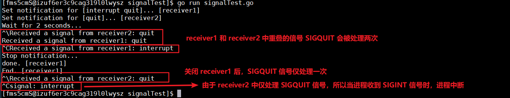

Go 支持的 IPC 方法有管道、信号、socket。

# 协程 goroutine

Go 语言对并发编程的原生支持是通过对协程的支持实现的。

**任何函数只需加上 `go` 就能送给调度器运行！！注意：函数如果有返回值，返回值会被丢弃，如果想要返回值，可以使用通道向外传递**。举例：

```go
func main()  {
  for i := 0; i < 10; i++ {
    go func() {
      fmt.Println(i)
    }()
  }
}
```

结果一：以上代码不会输出任何信息（大部分情况）

原因：for 循环会很快执行完毕，当它执行完时，那 10 个包装了 go 函数的 goroutine 通常还没有获得运行的机会。**一旦主 goroutine 即 main() 中的代码执行完，当前程序就会结束运行。**所以，如果在 Go 程序结束时，还有 goroutine 没有得到运行机会，那么它们中的代码就不会被执行了。

结果二：打印出 10 个 10

原因：for 循环很快执行完毕，此时 i == 10，再执行 10 个 goroutine，此时它们使用的 i == 10。要想按顺序打印出想要的顺序，可以将每次 i 的值保存下来，如将其通过函数参数的方式传入 goroutine 中。这种情况主要是由于变量作用域的原因！

结果三：乱序的打印 0~10 这几个数字

原因：Go 语言不保证 goroutine 的执行顺序是怎样的，所以结果不可预知。

---

**如何让主 goroutine 等待其他 goroutine？有以下方法**：

1. 让主 goroutine 睡眠：`time.Sleep(time.Millisecond)`，但时间不好控制；
2. 让其他 goroutine 执行完毕后通知主 goroutine：
   1. 使用通道，见后面；
   2. 使用 `sync.WaitGroup`，见后面

# 调度器

[30+张图讲解：Golang 调度器 GMP 原理与调度全分析](https://www.bilibili.com/read/cv5098443)

调度器是 Go 语言运行时系统的重要组成部分，负责统筹调配 Go 并发编程中模型中的三个主要元素：G（groutine）、P（processor）、M（machine）。

- M：系统级线程，即操作系统提供的线程，Go 的运行时系统会对其进行管理；
- P：一个 P 代表一个执行 Go 代码片段所必需的资源(上下文环境)。
  - 承载若干个 G ，且能使这些 G 适时地与 M 对接，并得到真正运行；
- G：一个 G 代表一个 Go 代码片段。P 是对 M 的一种封装。

由于 P 的存在，G 和 M 可以呈现出多对多的关系。

- 当一个正在与某个 M 对接并运行着的 G，需要因某个事件（等待 I/O 或锁的释放）而暂停运行时，调度器会及时地发现，并将这个 G 和那个 M 分离，以释放计算资源供那些等待运行的 G 使用。
- 而当一个 G 需要恢复运行时，调度器又会尽快为它寻找空闲的计算资源（包括 M）并安排运行，当 M 不够用时，调度器会向系统申请新的系统级线程，而当某个 M 无用时，调度器又会负责把它及时销毁。

注意：

当程序执行到一条 go 语句时，Go 的运行时系统会先试图从某个存放空闲的 G 的队列中获取一个 G，它只有在找不到空闲 G 的情况下才会去创建一个新的 G；

在拿到一个空闲的 G 之后，Go 的运行时系统会用这个 G 去包装当前的那个 go 函数（函数内的代码），然后再把这个 G 追加到某个存放可运行的 G 的队列中。

**只要 go 语句本身执行完毕，Go 程序完全不会等待 go 函数的执行，它会立刻去执行后边的语句。也即异步并发地执行。**

# 通道 chan

Go 中的并发通信模型是基于 CSP（Communicating Sequential Process）模型的，通过 channel 进行通讯的，channel 中无论是收发数据都是阻塞式的！

Go 语言中，处理并发数据访问的推荐方式是使用管道从一个 goroutine 中往下一个 goroutine 传递实际的数据。即“不要通过共享内存来通讯，而是通过通讯来共享内存”。

> Don't Communication by sharing memory; share memory by Communication.

channel 是 Go 语言在语言级别提供的 **goroutine 间的通信方式**。可以使用 channel 在两个或多个 goroutine 间传递消息，channel 是进程内的通信方式，如果需要跨进程通信，建议用分布式系统的方法来解决，比如使用 Socket 或者 HTTP 等通信协议。

**一般而言，通过睡眠的方式来让线程之间相互等待是不太可能的，可以通过 channel 来让一个 goroutine 等待另一个 goroutine。**

一个 `chan` 只能传递一种类型的值。`chan` 相当于一个 FIFO 的队列。

```go
// chan 的零值为 nil
// 声明一个 chan，并指定了 chan 中只能传递 int 类型的数据
var ch chan int
// 更常用的声明方式是：
c1 := make(chan int)
c2 := make(chan int, 3)  // 指定缓冲区长度为 3，详见后
```

`chan` 的使用：

```go
func main(){
  c := make(chan int)
  c <- 1   //向 channel 写入数据
  n := <- c  //从 channel 读取数据到变量 n
  fmt.Println(n)
}
```

以上的代码运行后会发生死锁，因为 **channel 是 goroutine 之间的交互，所以向 channel 发送了数据后，必须有另一个 goroutine 来接收数据**。修改为：

```go
func main() {
  c := make(chan int)
  // 创建一个 goroutine 来从 channel 中消费数据
  go func(name string,c chan int) {
    for{
      fmt.Printf("Worker %s received %d\n", name, <-c)
    }
  }("fS",c)

  c <- 1
  c <- 2
}
```

无缓冲的 chanel，只有在**发送方和接收方都准备就绪时**通信才能成功，即发送者将被阻塞，直到接收者接收到值。

**向/从一个为 nil 的 channel 发送/接收 数据，都会造成永远阻塞！**

## 缓冲

**可以使用 `cap()` 查看缓冲区长度**。

- 如果 channel 不带缓冲
  - 发送方会阻塞，直到接收方从 channel 中接收了值
  - 接收方在有值可接收前会一直阻塞
  - 对于传递单个数据的场景可以接受，但对于需要持续传输大量数据的场景就有些不合适了
- 如果 channel 带缓冲
  - 发送方会阻塞直到发送的值被**拷贝**到缓冲区内
  - 如果缓冲区已满，则发送方会发生阻塞，直到某个接收方获取到一个值
  - 接收方在有值可接收前会一直阻塞
  - 使用带缓冲的 channel 可以达到消息队列的效果

```go
func main(){
  c := make(chan int , 3) //缓冲区的长度为3
  c <- 1
  c <- 2
  c <- 3
  //只写入 3 个数据的话不会发生死锁，当写入第四个数据时会发生
  //c <- 4
}
```

```go
// 会将四个数据都打印出来，且不会发生死锁
func main() {
  c := make(chan int, 3)
  go func(id int, c chan int) {
    for {
      fmt.Printf("Worker %d received %c\n", id, <-c)
    }
  }(0, c)

  c <- 'a'
  c <- 'b'
  c <- 'c'
  c <- 'd'
  time.Sleep(time.Millisecond)
}
```

## select

`select` 语句可以检测多个通道，用法类似 `switch`，但并不像 `switch` 那样按照 `case` 顺序执行。执行到 `select` 语句时会产生阻塞，逐一检查每个事件的条件：

- 如果确定了其中的一个 case 满足，`select` 语句将执行那个事件；
- 如果不止一个 case 满足，`select` 语句会随机挑选一个事件执行；
- 如果任何 case 都不满足，则会执行 default（有 default 语句的话）；
- 空的 `select` 语句 `select{}` 会一直阻塞引起死锁

```go
select {  //这里不可以加判断条件
  //每个 case 语句里必须是一个IO操作！！！
  case <-chan1:
  	// TODO：chan1成功读到数据后进行的操作
  case chan2 <- 1:
  	// TODO：成功向chan2写入数据后进行的操作
  default:
  	// TODO：上面都没有成功才进行的操作
}
```

select 机制最大的一条限制就是每个 case 语句里必须是一个 IO 操作！

```go
// 输出为 3  2  1
// 第一次循环，写操作已经准备好，执行 o(3)
// 第二次，读操作准备好，执行 o(2)，并将 c 赋值为 nil
// 第三次，由于 c 为 nil，走的是 default 分支，执行 o(1)
func TestSelect(t *testing.T) {
	var o = t.Log
	c := make(chan int, 1)
	for range [3]struct{}{} {
		select {
		default:
			o(1)
		case <-c:
			o(2)
			c = nil
		case c <- 1:
			o(3)
		}
	}
}
```

## 超时机制

在并发编程的通信过程中，最需要处理的就是超时问题，即向 channel 写数据时发现 channel 已满，或者从 channel 试图读取数据时发现 channel 为空。如果不正确处理这些情况，很可能会导致整个 goroutine 锁死。

Go 语言没有提供直接的超时处理机制，但可以利用 select 机制来实现超时处理。下面的例子(代码不完整)中使用 tm 即可完成 10s 超时处理：

```go
// 计时器（一个 channel），这里设置 10s 后会向 channel 送入数据
tm := time.After(10 * time.Second)
// 定时器（一个 channel），每隔固定时间会向 channel 送入一个数据
tick := time.Tick(time.Second)
for {
  select {
    case <-tick:
    	fmt.Println("时间经过了 1s")
    case <-tm:  //如果能从tm中读取到数据
    	fmt.Println("timeout")
    	return
  }
}
```

## 单向 chan

channel 本身是同时支持读写的，但是我们可以对其增加限制，使其只能读或写数据。单向通道的主要用途是约束其他代码的行为。

```go
var ch1 chan int  // ch1是一个正常的channel，不是单向的
var ch2 chan<- float64// ch2是单向channel，只用于写入float64数据
var ch3 <-chan int  // ch3是单向channel，只用于读取int数据
```

双向 channel 是可以转换为单向 channel 的，反之则不行：

```go
ch4 := make(chan int)
ch5 := <-chan int(ch4) // ch5 是一个单向的读取channel
ch6 := chan<- int(ch4) // ch6 是一个单向的写入channel
```

**单向 channel 是不能被关闭的！**

## 关闭 chan

消息生产者使用 Go 内置的 `close()` 就可以关闭 channel：`close(ch)`。在 Go 语言中，**关闭函数应该只能是发送信息的函数，且一般在执行关闭操作时应做一些保护工作**。

**向关闭的 channel 发送数据会导致 panic；从关闭的 channel 接收数据，如果缓冲区为空，则返回一个零值**。

关闭 channel 后，如何判断一个 channel 是否已经被关闭了呢？可以在读取的时候使用多返回值的方式：

```go
func worker(id int, c chan int) {
  for {
    n, ok := <-c
    if !ok {   //返回值为 false 则 channel 已关闭
      break
    }
    fmt.Printf("Worker %d received %c\n", id, n)
  }
}
```

**所有的 channel 接收者都会在 channel 关闭时，立刻从阻塞等待中返回，且上述 ok 值为 false，n 的值为 channel 中类型的零值**。这个广播机制常被利用，进行向多个订阅者同时发送信号。

还可以使用更简便的方法，使用 `range`，`for`语句会依次读取发往管道的值，直到该管道关闭：

```go
func worker(id int, c chan int) {
  for n := range c{
    fmt.Printf("Worker %d received %c\n", id, n)
  }
}
```

应如何关闭通道呢？**在通道可以安全关闭时，使用其他通道来通知 goroutine**：

```go
func main() {
  msg := make(chan string)
  done := make(chan bool)
  until := time.After(5 * time.Second)

  go sendMessage(msg, done)

  for {
    select {
      case m := <-msg:
      fmt.Println(m)
      case <-until:
      done <- true
      time.Sleep(500 * time.Millisecond)
      return
    }
  }
}

func sendMessage(ch chan<- string, done <-chan bool) {
  for {
    select {
      case <-done:
      fmt.Println("Done")
      close(ch)
      return
      default:
      ch <- "Hello"
      time.Sleep(500 * time.Millisecond)
    }
  }
}
```

# 数据竞争

当两个线程并发访问同一个变量，且其中至少一个访问是写操作时，数据竞争就发生了。

如何检测数据竞争呢？

`go run -race go程序` 即可检测。竞争检测器只能发现在运行期确实发生的数据竞争？

```go
func main() {
  var a [10]int
  for i := 0; i < 10; i++ { //这里一共开了 10 个 goroutine
    go func() {
      for {
        a[i]++
        fmt.Printf("Hello from foroutine : %d \n", i)
      }
    }()
  }
  time.Sleep(time.Millisecond)
}
```

检查数据访问冲突(这里仅列出部分结果)：

```
==================
WARNING: DATA RACE
说明：7 号 goroutine 读取 0x00c000076068 地址的数据
Read at 0x00c000076068 by goroutine 7:
	main.main.func1()
	E:/mod/src/base/mooc/channel/test.go:15 +0x11e

说明：main goroutine 在 0x00c000076068 地址写数据
Previous write at 0x00c000076068 by main goroutine:
	main.main()
	E:/mod/src/base/mooc/channel/test.go:10 +0xfc

Goroutine 7 (running) created at:
	main.main()
	E:/mod/src/base/mooc/channel/test.go:13 +0xd8
==================
```

**避免数据竞争的唯一方式是线程间同步访问所有的共享可变数据**。有几种方式能够实现这一目标。Go 语言中，通常是使用管道或者锁。（sync 和 sync/atomic 包中还有更低层次的机制可供使用）

# Context

`Context` 类型可以提供一类代表上下文的值，该值是并发安全的，可以被传递给多个 goroutine。

```go
type Context interface {
  Deadline() (deadline time.Time, ok bool)
  // 调用 Done() 方法，会产生一个 chan，该 chan 会去感知当前 Context 值，
  // 一旦该 Context 值被“撤销”，chan 会关闭
  Done() <-chan struct{}
	// 返回“撤销”的原因，
  // 且只能是 context.Canceled 或 context.DeadlineExceeded 类型
  // 前者代表手动撤销，后者代表我们给定的过期时间已到而撤销
  Err() error
	// 用于获取数据，会先判断给定的 key 是否与当前 Context 中存储的 key 相等，
  // 如果相等就把当前 Context 中存储的值直接返回，否则就到其父 Context 中继续查找
  // 除了含数据的Context值以外，其他几种Context值都无法携带数据，所以会直接跨过那几种值
  Value(key interface{}) interface{}
}
```

可以通过一个`Context`值产生出任意个子值。这些子值可以携带其父值的属性和数据，也可以响应我们通过其父值传达的信号。因此，所有的`Context`值共同构成了一颗代表了上下文全貌的树形结构。这棵树的根节点是一个已经在`context`包中预定义好的`Context`值，它是全局唯一的。通过调用`context.Background()`函数就可以获取。

`context` 包中包含了四个用于生成 `Context` 值的函数：

- `WithCancel(parent Context) (ctx Context, cancel CancelFunc)`
  - 生成一个可撤销的 `Context` 值和一个用于触发撤销信号的函数

```go
func coordinateWithContext() {
	total := 12
	var num int32
	fmt.Printf("The number: %d [with context.Context]\n", num)
	cxt, cancelFunc := context.WithCancel(context.Background())
	for i := 1; i <= total; i++ {
		go addNum(&num, i, func() {
			if atomic.LoadInt32(&num) == int32(total) {
				cancelFunc()
			}
		})
	}
	<-cxt.Done()
	fmt.Println("End.")
}
func addNum(sum *int32, nums int, Done func()) {
	*sum = int32(nums)
	Done()
}
```

- `WithDeadline(parent Context, d time.Time) (Context, CancelFunc)`
  - 生成一个会定时撤销（借助其内部的定时器实现）的 `Context` 值，最后会停止并释放掉内部的计时器
- `WithTimeout(parent Context, timeout time.Duration) (Context, CancelFunc)`
  - 生成一个会定时撤销（借助其内部的定时器实现）的 `Context` 值
- `WithValue(parent Context, key, val interface{}) Context`
  - 生成一个会携带额外数据的 `Context` 值，注意：该 `Context` 不可撤销

# 同步

Go 语言中支持传统的共享内存同步机制。

## 同步锁

Go 中有两种同步锁类型：`sync.Mutex` 和 `sync.RWMutex`，都属于结构体类型！

使用互斥锁的注意事项：

- 不要重复锁定互斥锁
- 不要忘记释放互斥锁，必要时使用 `defer` 语句
- 不要对尚未锁定或已解锁的互斥锁解锁
- 锁是结构体类型，属于值类型。不要在多个函数间直接传递互斥锁！！
- 加锁后复制变量，会将锁的状态也复制！所以复制后的变量已经是加锁状态了，再次加锁会死锁。
- 将 `sync.Mutex` 作为匿名字段时，相关的方法必须使用指针接收者，否则会导致锁机制失效！
  - 或嵌入 `*sync.Mutex` 来避免复制的问题，但需要初始化!

---

`Mutex`：互斥锁。当一个 `goroutine` 获得 `Mutex` 后，其他 goroutine 就只能等到这个 goroutine 释放该 `Mutex`

```go
func TestCounter(t *testing.T) {
  var lock sync.Mutex
  counter := 0
  for i:=0;i<5000;i++{
    go func() {
      lock.Lock()  //加锁
      defer lock.Unlock()
      counter++
    }()
  }
  time.Sleep(1 * time.Second)
  t.Logf("want 5000 get %d",counter) //5000
}
```

---

`RWMutex`：读写锁(读/写互斥锁)。在读锁占用的情况下，阻止写，但不阻止读。

- `Lock()`、`UnLock()` 分别用于对写锁进行锁定、解锁
- `RLock()`、`RUnLock()` 分别用于对读锁进行锁定、解锁
- 对于同一个读写锁有如下规则：
  - 写锁被锁定时再试图锁定写锁，会阻塞当前的 goroutine
  - 写锁被锁定时试图锁定读锁，会阻塞当前的 goroutine
  - 读锁被锁定时试图锁定写锁，会阻塞当前的 goroutine
  - 读锁被锁定时再试图锁定读锁，不会阻塞当前的 goroutine
- **多个 goroutine 可同时获取读锁（调用 `RLock()` 方法）**；
- **写锁（调用 `Lock()` 方法）会阻止任何其他 goroutine（无论读和写）进来，整个锁相当于由该 goroutine 独占**。

## WaitGroup

```go
func TestWaitGroup(t *testing.T) {
  var wg sync.WaitGroup
  var lock sync.Mutex
  counter := 0
  for i:=0;i<5000;i++{
    //向 WaitGroup 中添加一个任务
    wg.Add(1)
    go func() {
      lock.Lock()
      defer lock.Unlock()
      counter++
      wg.Done()  //当前这一个任务完成后通知 WaitGroup
    }()
  }
  wg.Wait()  //阻塞当前 goroutine，知道 WaitGroup 中的所有任务完成
  t.Logf("want 5000 get %d",counter)
}
```

- `sync.WaitGroup` 中计数器的值不可以小于 0，否则会引发 panic
  - 向 `wg.Add()` 传入参数时是可以传入负数的，可通过编译，但运行时会报错
  - 不要在协程中使用 `wg.Add()`
- `sync.WaitGroup` 可以复用，但必须保证计数周期的完整性，即必须要上一个计数周期的 `wg.Wait()` 执行完成后(即任务数变为 0)，才能再次使用 `wg.Add()` 添加任务

```go
func coordinateWithWaitGroup() {
  total := 12
  stride := 3
  var num int32
  fmt.Printf("The number: %d [with sync.WaitGroup]\n", num)
  var wg sync.WaitGroup
  // 分批执行子任务，每次三个子任务执行完成后，重新向 wg 中增加子任务
  for i := 1; i <= total; i = i + stride {
    wg.Add(stride)
    for j := 0; j < stride; j++ {
      go addNum(&num, i+j, wg.Done)
    }
    wg.Wait()
  }
  fmt.Println("End.")
}

func addNum(sum *int32, nums int, Done func()) {
  *sum = int32(nums)
  Done()
}
```

## Once

对于从全局的角度只需要运行一次的代码，比如全局初始化操作，Go 语言提供了一个 `Once` 类型来保证全局的唯一性操作。

```go
type Once struct {
  m    Mutex
  // 记录 Do 方法被调用的次数，该字段的值只能是 0 或 1，
  // 一旦 Do() 方法的首次调用完成，值就会从 0 变为 1
  done uint32
  // done 字段只有两个值，但由于 Do() 会调用 atomic.LoadUint32() 获取
  // 该字段的值，所以 done 字段的类型为 uint32
}
// 类似于单例模式
func (o *Once) Do(f func()) {
  if atomic.LoadUint32(&o.done) == 1 {  // 第一次判断 done 的值
    return
  }
  // Slow-path.
  o.m.Lock()  // 加锁
  defer o.m.Unlock()
  if o.done == 0 { // 第二次判断 done 的值
    defer atomic.StoreUint32(&o.done, 1)  // 这一操作是在 defer 中的，因此无论 f 怎样结束(即使引发 panic)，done 都会变为 1
    f()
  }
}
```

`once.Do()` 方法只接受一个参数，且必须是无参、无返回值的函数 `func()`

- 该方法不是对每一种函数(`Do()`传入的参数)都只执行一次，而是只执行**首次被调用时传入的**那个函数，所以，如果有多个只需执行一次的函数，就应该为它们每一格都分配一个 `sync.Once`
- 方法可以保证在全局范围内只调用指定的函数一次，而且所有其他 goroutine 在调用到此语句时，将会先被阻塞，直至全局唯一的 `once.Do()` 调用结束后才继续
- 该方法是在参数函数执行完成后，才修改 done 为 1，如果参数函数执行需要很长时间或者就不会结束(守护进程)，可能会导致其他相关 goroutine 阻塞

## 条件变量

条件变量是基于互斥锁的。并不是用于保护临界区和共享资源的，而是用于协调想要访问共享资源的那些线程的。

## 信号

- Signal 接口

Go 命令会对其中一些以键盘输入为来源的标准信号做出响应。这是由于 go 命令使用了在 `os.Signal` 中被用于处理信号的 API。

```go
type Signal interface { //所有该接口类型的实现类型的值都应可以代表一个操作系统信号
  String() string
  Signal() // 仅作为该接口类型的标识！
}
```

Go 的标准库中，包含了与不同操作系统信号对应的程序实体。在 syscall 包中，为不同的操作系统所支持的每个标准信号都声明了一个响应的同名信号常量，其类型都是 `syscall.Signal` 的。

`sysccall.Signal` 是 `os.Signal` 接口类型的一个实现类型，同时也是 `int` 类型的别名类型。这就意味着，每个信号常量都隐含了一个整数值。而该整数值与信号常量代表的信号在操作系统中的编号一致。

---

- `Notify(c chan<- os.Signal, sig ...os.Signal)`

os/signal 包中的 `Notify()` 函数会把当前进程收到的信号（即第二个参数）放入通道 c （第一个参数）中，这样，函数调用方代码就可以从这个通道中按顺序获取信号并进行响应的处理。

```go
func main() {
	receiver := make(chan os.Signal,1)
	//Linux 中： SIGINT 是中断信号 Ctrl+C，SIGQUIT 是退出信号 Ctrl+\
	sigs := []os.Signal{syscall.SIGINT, syscall.SIGQUIT}
	signal.Notify(receiver,sigs...)
	for sig:=range receiver {
		fmt.Printf("Received a signal: %s\n",sig)
	}
}
```

上面的示例代码比较危险，因为我们忽略了当前进程本该处理的信号。上面的代码无论按下多少次 Ctrl+C 也无法停止程序，仅仅多打印几行信息。所以在类 Unix 系统下，有两种信号既不能被自行处理，也不会被忽略，那就是 SIGKILL、SIGSTOP。对它们的响应只能是执行系统默认操作！！！

注意：signal 处理程序在向 Signal 接收通道发送值时，不会因为通道已满而阻塞。因此`signal.Notify` 函数的调用方必须保证 Signal 接收通道有足够的空间缓存并传递接收到的信号，虽然可以创建一个足够长的 Signal 接收通道，不过更常用的方法是：只创建长度为 1 的接受通道，并时刻准备从中接收信号。

---

- `Stop(c chan<- os.Signal)`

对于其他信号我们除了能自行处理它们，还可以在之后的任意时刻恢复针对它们的系统默认操作，这就需要使用 os/signal 包中的 `Stop()`函数。该函数可以取消之前调用 `signal.Notify()` 时告知 signal 程序需要自行处理若干信号的行为。以之前的代码为例，必须传递 receiver 到 `Stop()` 中才可以。

`signal.Stop()` 调用完成后，作为其参数的 Signal 接受通道不会再被发送任何信号，如果继续从通道中获取信号值的话会被阻塞，所以需要关闭该通道。

如果只想取消对一部分信号的自行处理呢？

在 `Stop()` 之后，修改 receiver 的值，调用 `Notify()` 并传入 receiver 即可。注意，两次调用 `Notify()` 的 Signal 接受通道必须是同一个。

如果不同会怎样呢？

如果我们先后两次调用 `Notify()` ，且传递给它的 Signal 接受通道不同，则 signal 处理程序会认为两次调用无关，会分别看待这两次调用时所设定的信号的集合，一个进程接收到的一个信号会被发送到两个通道中（假设两次调用 `Notify()` 时传入的信号有重叠）。

```go
func main() {
  var wg sync.WaitGroup
  wg.Add(2)

  receiver1 := make(chan os.Signal, 1)
  sigs1 := []os.Signal{syscall.SIGINT, syscall.SIGQUIT}
  fmt.Printf("Set notification for %s... [receiver1]\n", sigs1)
  signal.Notify(receiver1, sigs1...)
  //直接使用输出通道中的数据会造成阻塞，所以这里使其并发执行，下面的类似
  go func() {
    for sig := range receiver1 {
      fmt.Printf("Received a signal from receiver1: %s\n", sig)
    }
    fmt.Printf("End. [receiver1]\n")
    wg.Done()
  }()

  receiver2 := make(chan os.Signal, 1)
  sigs2 := []os.Signal{syscall.SIGQUIT}
  fmt.Printf("Set notification for %s... [receiver2]\n", sigs2)
  signal.Notify(receiver2, sigs2...)

  go func() {
    for sig := range receiver2 {
      fmt.Printf("Received a signal from receiver2: %s\n", sig)
    }
    fmt.Printf("End. [receiver2]\n")
    wg.Done()
  }()
  fmt.Println("Wait for 2 seconds...")
  time.Sleep(2 * time.Second) //等待两秒用于测试信号的自行处理流程
  fmt.Println("Stop notification...")
  //关闭receiver1通道
  signal.Stop(receiver1)
  close(receiver1)
  fmt.Printf("done. [receiver1]\n")
  wg.Wait()
}
```

下面是一种示例结果：


