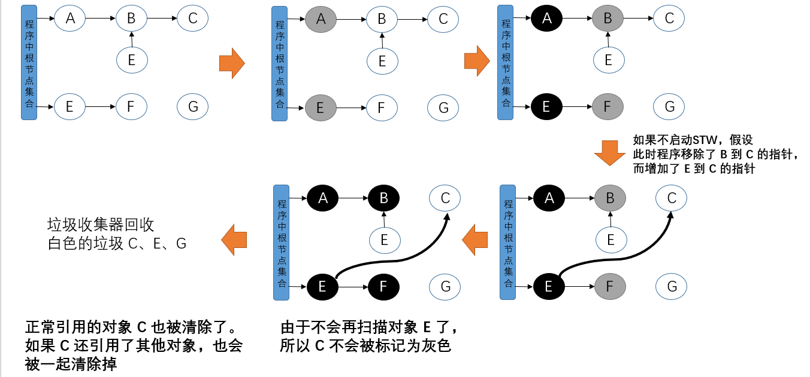
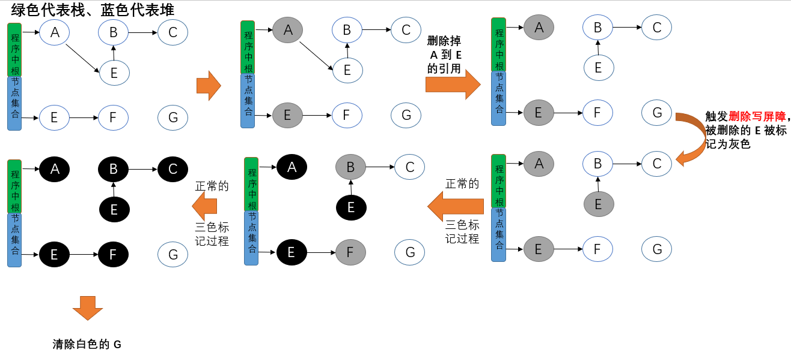

Go 虚拟内存布局使用的是稀疏堆（Go 1.10 及之前使用的是连续堆）的结构。

# Go 内存分配

[内存分配和GC基础了解](../Base/内存管理.md)

Go 使用的内存分配策略类似于空闲链表分配器中的隔离适应策略，并借鉴了 tcmalloc 的设计实现高速的内存分配，**使用多级缓存将对象根据大小分类，并按照类别实施不同的分配策略**。

因为程序中的绝大多数对象的大小都在 32KB 以下，而申请的内存大小影响 Go 语言运行时分配内存的过程和开销，所以分别处理大对象和小对象有利于提高内存分配器的性能。

与 tcmalloc 相同，Go 运行时分配器也是分级管理内存，维护了一个多级结构（多级分配见[内存分配和GC基础了解](../Base/内存管理.md)）：`mcache` -> `mcentral` -> `mheap` -> `heapArena` -> `pages`。

- `runtime.mcache`：线程缓存，与 P 绑定，本地内存分配操作，不需要加锁
  - 用于处理微对象和小对象的分配，会持有内存管理单元 `runtime.span`
- `runtime.mcentral`：中心缓存，分配时需要上锁，不同 spanClass（0~66 共 67 种） 使⽤不同的锁
  - `runtime.mheap` 持有 134 个中心缓存。每个类型的内存管理单元都会管理特定大小的对象，当内存管理单元中不存在空闲对象时，就会从中心缓存获取新的内存单元。
- `runtime.mheap`：全局唯⼀，从 OS 申请内存，并修改其内存定义结构时，需要加锁，是个全局锁

参考：[图解Go语言内存分配](https://www.cnblogs.com/qcrao-2018/p/10520785.html)

## 线程缓存 mcache

本地内存分配操作，不需要加锁。

线程缓存，与 P 绑定，主要用来缓存用户程序申请的微对象和小对象，每个线程缓存会持有 67*2 个（spanClass 有 67 个 ID，并各自区分 noscan 和 scan 两种状态）[内存管理单元 runtime.span](#内存管理单元 mspan)

```go
type mcache struct {
  alloc [numSpanClasses]*mspan // spans to allocate from, indexed by spanClass
  // 这三个字段用于分配微对象，专门管理 16B 以下的对象
  tiny             uintptr // 指向堆中的一块内存
	tinyoffset       uintptr // 下一个空闲内存所在的偏移量
	local_tinyallocs uintptr // number of tiny allocs not counted in other stats
  ...
}
```

runtime 初始化 P 时会调用 `runtime.allocmcache()` 来初始化线程缓存，会在系统栈中使用 `runtime.mheap` 的线程缓存分配器初始化新的 `runtime.mcache`：

```go
var emptymspan mspan

func allocmcache() *mcache {
	var c *mcache
	systemstack(func() {
		lock(&mheap_.lock)
		c = (*mcache)(mheap_.cachealloc.alloc())
		c.flushGen = mheap_.sweepgen
		unlock(&mheap_.lock)
	})
	for i := range c.alloc {
		c.alloc[i] = &emptymspan
	}
	c.next_sample = nextSample()
	return c
}
```

注意，刚初始化的 `runtime.mcache` 的所有 mspan 都是空的占位符 `emptymspan`。

`runtime.mcache.refill()` 会从**[中心缓存 mcentral](#中心缓存 mcentral)**为线程缓存申请一个指定 spanClass 的 `runtime.mspan`，被替换的单元不能包含空闲的内存空间，该内存管理单元中至少包含一个空闲对象用于内存分配。


## 内存管理单元 mspan

`runtime.mspan` 是 Go 内存管理的基本单元，通过 next、prev 构成了一个双向链表的结构，runtime 会使用 `runtime.mSpanList` 存储双向链表的头尾节点，并在线程缓存和中心缓存中使用。

每个 `mspan` 都管理 `mspan.npages` 个大小为 8KB 的页（不是指操作系统的内存页，这里的页会是操作系统内存页的整数倍）。

用户程序或线程向 `runtime.mspan` 申请内存时，它会使用 `allocCache` 字段，以对象为单位在管理的内存中快速查找待分配的空间；

当 `mapsn` 管理的内存不足时，runtime 会以页为单位向堆申请内存。

如果能在内存中找到空闲的内存单元会直接返回，当内存中不包含空闲内存时，上一级组件 `runtime.mcache` 会调用 `runtime.mcache.refill()` 更新内存管理单元以满足为更多对象分配内存的需求。

```go
type mSpanList struct {
	first *mspan // first span in list, or nil if none
	last  *mspan // last span in list, or nil if none
}

type mspan struct {
	next *mspan     // next span in list, or nil if none
	prev *mspan     // previous span in list, or nil if none
	// 这两个字段确定了该结构体管理的多个页（每页 8KB）所在的内存
	startAddr uintptr // 起始地址，address of first byte of span aka s.base()
	npages    uintptr // number of pages in span
	// 扫描页中空闲对象的初始索引
	freeindex uintptr
	nelems uintptr // number of object in the span.
	allocCache uint64  // allocBits 的补码，用于快速查找内存中未被使用的内存
	allocBits  *gcBits // 标记内存占用情况
	gcmarkBits *gcBits // 标记内存回收情况
  // spanClass 类型决定了内存管理单元中存储的对象大小和个数。
  spanclass   spanClass     // size class and noscan (uint8)
	...
}
```

补充：

`runtime.spanClass` 决定了内存管理单元中存储的对象大小和个数，饱含了对象大小从 8B 到 32KB 共计 67 种类型（还有一个 class 为 0 的预留给大对象的分配了。），每种都会存储特定大小的对象且包含特定数量的页及对象，这些数据都是计算好保存在 `runtime.class_to_size` 和 `runtime.class_to_allocnpages` 等变量中，见 sizeclasses.go。

```go
// class  bytes/obj  bytes/span  objects  tail waste  max waste
//     1          8        8192     1024           0     87.50%
//     2         16        8192      512           0     43.75%
//     3         32        8192      256           0     46.88%
//     4         48        8192      170          32     31.52%
//     5         64        8192      128           0     23.44%
...
//    66      32768       32768        1           0     12.50%
```

以 class = 4 为例，``runtime.mspan` 中对象大小上限为 48B，管理一个页（8KB），最多可以存储 170个对象，由于操作系统内存需要按页（操作系统的页 4KB）来管理，所以尾部会浪费 32B 的内存（每个操作系统页 4KB，可以存储 85 个对象，浪费 16B，两个操作系统页共计 32B），最多会浪费 31.52% 的资源（每个对象 33B 时）。

`runtime.spanClass` 不仅记录了 sizeClass 的信息，还包含了一个 noscan 的标记位，用于表示对象是否包含指针，GC 会对包含指针的 `runtime.mspan` 结构体进行扫描。

```go
// A spanClass represents the size class and noscan-ness of a span.
// Each size class has a noscan spanClass and a scan spanClass. The
// noscan spanClass contains only noscan objects, which do not contain
// pointers and thus do not need to be scanned by the garbage
// collector.
type spanClass uint8

func (sc spanClass) sizeclass() int8 {
	return int8(sc >> 1)
}

func (sc spanClass) noscan() bool {
	return sc&1 != 0
}
```

## 中心缓存 mcentral

`runtime.mcentral` 是 Allocator 的中心缓存，不同于线程缓存，访问中心缓存的内存管理单元需要使用互斥锁：

```go
type mcentral struct {
	lock      mutex
	spanclass spanClass
	nonempty  mSpanList // list of spans with a free object, ie a nonempty free list
	empty     mSpanList // list of spans with no free objects (or cached in an mcache)
	nmalloc uint64
}
```

线程缓存会通过中心缓存的 `runtime.mcentral.cacheSpan` 方法获取新的内存管理单元。

## 页堆 mheap

`runtime.mheap` 是内存分配的核心结构体，作为全局变量存储，堆上初始化的所有对象都由这个结构体统一管理。

runtime 会通过 `runtime.mheap.alloc()` 在系统栈中获取新的 `runtime.mspan` 单元。

```go
var mheap_ mheap

type mheap struct {
  // 全局的中心缓存列表
	central [numSpanClasses]struct {
		mcentral mcentral
		pad      [cpu.CacheLinePadSize - unsafe.Sizeof(mcentral{})%cpu.CacheLinePadSize]byte
	} 
  // 管理堆内存区域
  arenas [1 << arenaL1Bits]*[1 << arenaL2Bits]*heapArena
  ...
}

// runtime 使用二维的 runtime.heapArea 数组管理所有内存
// 每个单元都会管理 64MB 的内存空间
type heapArena struct {
  // 用于标识当前区域中的哪些地址保存了对象，位图中的每个字节都会表示堆区中的 32 字节是否空闲
	bitmap [heapArenaBitmapBytes]byte
  // 存储了指向内存管理单元 runtime.mspan 的指针，每个内存单元会管理几页的内存空间，每页 8KB
	spans [pagesPerArena]*mspan
	pageInUse [pagesPerArena / 8]uint8
	pageMarks [pagesPerArena / 8]uint8
  // 指向该结构体管理的内存的基地址
	zeroedBase uintptr 
}
```

## 内存分配

堆上所有的对象都会通过调用 `runtime.newobject` 函数分配内存，该函数会调用 `runtime.mallocgc` 分配指定大小的内存空间。

Go 的 Allocator 会根据申请分配的内存大小选择不同的处理逻辑，运行时将对象分为以下三类：

- 微对象 Tiny：**(0, 16B) 且没有指针**（没有指针，因此不需要被垃圾回收器扫描）
  - 先使用线程缓存上的 tiny 相关字段，再依次尝试线程缓存、中心缓存和堆分配内存
- 小对象 Small：**[16B, 32KB] 或有指针**
  - 依次尝试使用线程缓存、中心缓存和堆分配内存
- 大对象 Large：**[32KB, +∞]**
  - 直接在堆上分配内存


# GC

[Go 语言垃圾收集器的原理](<https://mp.weixin.qq.com/s?__biz=MzU5NTAzNjc3Mg==&mid=2247484261&idx=1&sn=b17ce0394a6da20aff6801c64cf5835d&chksm=fe795c6ec90ed578c6e820f30848fcc2713320f645431aa50b6b77bc2f0e4386546f4553acf3&scene=126&sessionid=1587216036&key=1cbf4f3ad1e1f448ff70999c66995296c8ccc96391fdb9aa56ce37be1eb3623f75c2482ad8bb5e2a2143601b278554ada2eb16ae1e9963a74752d9daab459fe2b8e3986b2e6052c8d07526def1dd0cae&ascene=1&uin=MjcyNTczMDYwNw%3D%3D&devicetype=Windows+10&version=62080079&lang=zh_CN&exportkey=Axt0Ngibtx%2FXvqNMT%2FoZVYQ%3D&pass_ticket=mxvEXT%2Fn8FSArAKzNDqXsxC%2FVkPt4mkJExF3gietPLa3yXsHRy4mJAGNbYcE29ql>)    未读完...

[[典藏版]Golang三色标记、混合写屏障GC模式图文全分析](<https://mp.weixin.qq.com/s?subscene=23&__biz=MzA5MjA2NTY5MA==&mid=2453248659&idx=1&sn=2d39fe04a11c84ddb71ff6814d79ddd1&chksm=87bfe066b0c86970f3be6663b4a5911d741f0a31384367e7cbbb41b804e0d6c524cc64f20031&scene=7&key=8c93de3f00d4c98db8129ff55aa4e29d5e29f4df62e966906eb8c12b6df479da572b78e77f963e56181a83c0366d49351255f7afef5f285377ee2abdb4101911dfb7f92df14fbe9c71b9d1436775aafd&ascene=0&uin=MjcyNTczMDYwNw%3D%3D&devicetype=Windows+10&version=62080079&lang=zh_CN&exportkey=Az5xB8qJwA6whmTj331P2M0%3D&pass_ticket=jqMy8H3w2X%2F0iWFQYh18BLKoCG569E97mWHMU49X%2FtosSBZB0W9Kl0N1hrbTjVmr>)

[Go GC 20 问](https://mp.weixin.qq.com/s/5xjH-LJ53XiNm2sMNQZiGQ)

- GC 的触发点：
  - 手动调用 runtime.GC
  - 内存分配时的 runtime.mallocgc
  - forcegchelper
- GC 的入口：gcStart

# 标准三色标记法

Golang 1.5 前主要采用 Mark-Sweep 算法，STW 时间会很长，1.5 及之后采用**无分代、不整理（回收过程中不对对象进行移动和整理）、并发（与用户代码并发执行，但仍需要一定时间的 STW）的[三色标记法]((https://blog.golang.org/ismmkeynote))**。

理解**三色标记法**的关键是理解对象的**三色抽象**以及**波面（wavefront）推进**这两个概念。

从垃圾回收器的视角来看，三色抽象规定了三种不同类型的对象，并用不同的颜色相称：

- 白色对象（可能死亡）：未被回收器访问到的对象。在回收开始阶段，所有对象均为白色，当回收结束后，白色对象均不可达。
  - 未扫描，collector 不知道任何相关信息
- 灰色对象（波面）：已被回收器访问到的对象，但回收器需要对其中的一个或多个指针进行扫描，因为他们可能还指向白色对象
  - 已经扫描完毕，子节点未扫描完毕（gcmarkbits = 1，在队列内）
- 黑色对象（确定存活）：已被回收器访问到的对象，其中所有字段都已被扫描，黑色对象中任何一个指针都不可能直接指向白色对象
  - 已经扫描完毕，子节点扫描完毕（gcmarkbits = 1，且在队列外）

当垃圾回收开始时，只有白色对象。随着标记过程开始进行时，灰色对象开始出现（着色），这时候波面便开始扩大。当一个对象的所有子节点均完成扫描时，会被着色为黑色。当整个堆遍历完成时，只剩下黑色和白色对象，这时的黑色对象为可达对象，即存活；而白色对象为不可达对象，即死亡。这个过程可以视为以灰色对象为波面，将黑色对象和白色对象分离，使波面不断向前推进，直到所有可达的灰色对象都变为黑色对象为止的过程。

垃圾收集器标记过程：

1. 程序中不存在任何黑色对象，所有新创建的对象默认被标记为白色，放在白色集合中；
2. 垃圾收集器从根节点开始遍历(**仅遍历一次**)所有对象，把遍历到的对象从原本的白色重新标记为灰色，放入灰色集合中；
3. 遍历灰色集合，将灰色对象引用的对象从白色集合移动到灰色集合，再将之前的灰色对象移动到黑色集合；
4. 重复以上两个步骤直到不存在灰色对象。

注意：垃圾收集器只会从灰色对象集合中取出对象开始扫描，当灰色集合中不存在任何对象时，标记阶段就会结束。

标记过程结束后，程序中只存在黑色的存活对象和白色的垃圾对象，垃圾收集器可以回收这些白色的垃圾。


如果没有 STW：



为了防止上面的问题发生，最简单的方式就是STW，直接禁止掉其他用户程序对对象引用关系的干扰，但是**STW的过程有明显的资源浪费，对所有的用户程序都有很大影响**，如何能在保证对象不丢失的情况下合理的尽可能的提高GC效率，减少STW时间呢？

# 写屏障机制

如果垃圾回收满足以下任一情况时就可以保证对象不丢失：

- 强三色不变性：禁止黑色对象引用白色对象
- 弱三色不变性：黑色对象可以引用白色对象，但是必须要保证有一个灰色对象引用该白色对象

实现机制：写屏障（write barrier。不同于并发中的写屏障，GC 中的写屏障指的是在指针修改之前，可以插入的一段代码）

## 插入写屏障

在Golang中，对栈上指针的写入添加写屏障的成本很高，所以Go选择**仅对堆上的指针插入增加写屏障**，这样就会出现在扫描结束后，栈上仍存在引用白色对象的情况，这时的栈是灰色的，不满足三色不变式，所以需要对栈进行重新扫描使其变黑，完成剩余对象的标记，这个过程需要STW。这期间会将所有goroutine挂起，当有大量应用程序时，时间可能会达到10～100ms。

- 具体操作：在 E 对象引用 Y 对象的时候，Y 对象被标记为灰色(见图示)。
  - 满足强三色不变式

下列图示省去了最开始的几步。


插入写屏障是一种相对保守的屏障技术，它会将**有存活可能的对象都标记成灰色**以满足强三色不变性。

## 删除写屏障

- 具体操作：被删除的对象，如果自身为灰色或者白色，那么被标记为灰色
  - 满足弱三色不变式



## 混合写屏障

以上两种方式都存在缺点：

- 插入写屏障：结束时需要 STW 来重新扫描栈，标记栈上引用的白色对象的存活
- 删除写屏障：回收精度低，一个对象即使被删除了最后一个指向它的指针也依旧可以活过这一轮，在下一轮GC中被清理掉。
  - GC 开始时 STW 扫描堆栈来记录初始快照，这个过程会保护开始时刻的所有存活对象

Go 1.8 版本引入了混合写屏障机制(hybrid write barrier)，结合了两者的优点，只需要在开始时并发扫描各个 goroutine 的栈，使其变黑并一直保持，这个过程不需要STW，而标记结束后，因为栈在扫描后始终是黑色的，也无需再进行re-scan操作了，减少了STW的时间。

- 满足变形的弱三色不变式，具体操作：
  1. GC 开始，将栈上的可达对象全部扫描并标记为黑色(之后不再进行第二次重复扫描，无需 STW)；
  2. GC 期间，任何在栈上创建的新对象，均为黑色；
  3. 被删除的对象标记为灰色
  4. 被添加的对象标记为灰色

# GC 缺点

Go的GC缺点是对于巨量的小对象处理起来比较不擅长，有可能出现垃圾的产生速度比收集的速度还快的情况。gcMark 线程占用高很大几率就是对象产生速度大于垃圾回收速度了。

runtime.gcBgMarkWorker 函数是 golang 垃圾回收相关的函数，用于标记（mark）出所有是垃圾的对象。一般情况下此函数不会占用这么多的 cpu，出现这种情况一般都是内存 gc 问题。影响 GC 性能的一般都不是内存的占用量，而是对象的数量。举例说明，10 个 100m 的对象和一亿个 10 字节的对象占用内存几乎一样大，但是回收起来一亿个小对象肯定会被 10 个大对象要慢很多。


# 如何观察 Go GC

```go
package main

func allocate() {
	_ = make([]byte, 1<<20)
}

func main() {
	for i := 1; i < 100000; i++ {
		allocate()
	}
}
```

## GODEBUG=gctrace=1

```shell
go build -o main  # 生成可执行文件
GODEBUG=gctrace=1 ./main
```

会有两类输出：

### 用户代码向运行时申请内存产生的垃圾回收

```
gc 1 @0.002s 4%: 0.12+0.52+0 ms clock, 0.97+0.033/0.033/0+0 ms cpu, 4->5->1 MB, 5 MB goal, 8 P
```

- gc 1：第一个 GC 周期
- 0.002：程序开始后的 0.002s
- 4%：该 GC 周期中 CPU 的使用率
- 0.12：标记开始时，STW 所花费的时间（wall clock）
- 0.52：标记过程中，并发标记所花费的时间（wall clock）
- 0：标记终止时， STW 所花费的时间（wall clock）
- 0.97：标记开始时， STW 所花费的时间（cpu time）
- 0.033：标记过程中，标记辅助所花费的时间（cpu time）
- 0.033：标记过程中，并发标记所花费的时间（cpu time）
- 0：标记过程中，GC 空闲的时间（cpu time）
- 0：标记终止时， STW 所花费的时间（cpu time）
- 4：标记开始时，堆的大小的实际值
- 5：标记结束时，堆的大小的实际值
- 1：标记结束时，标记为存活的对象大小
- 5：标记结束时，堆的大小的预测值
- 8：标记结束时，堆的大小的预测值

补充：

> - wall clock 是指开始执行到完成所经历的实际时间，包括其他程序和本程序所消耗的时间；
> - cpu time 是指特定程序使用 CPU 的时间
>
> wall clock < cpu time: 充分利用多核
> wall clock ≈ cpu time: 未并行执行
> wall clock > cpu time: 多核优势不明显

### 运行时向操作系统申请内存产生的垃圾回收

对于运行时向操作系统申请内存产生的垃圾回收（向操作系统归还多余的内存）：

```shell
# 向操作系统归还了 8KB 内存
scvg: 8 KB released
# 已分配给用户代码，正在使用的总内存大小为 3MB。MB used or partially used spans
# 空闲以及等待归还给操作系统的总内存大小为 60MB。MB spans pending scavenging
# 通知操作系统中保留的内存大小为 63MB。MB mapped from the system
# 已经归还给操作系统的（或者说还未正式申请）的内存大小为 57MB。MB released to the system
# 已经从操作系统中申请的内存大小为 6MB。MB allocated from the system
scvg: inuse: 3, idle: 60, sys: 63, released: 57, consumed: 6 (MB)
```


## go tool trace

```go
package main

import (
	"os"
	"runtime/trace"
)

func allocate() {
	_ = make([]byte, 1<<20)
}

func main() {
	file, _ := os.Create("./learn_gc/observe/tool/trace.out")
	defer file.Close()
	trace.Start(file)
	defer trace.Stop()
  // 实际要查看的程序
	for i := 1; i < 100000; i++ {
		allocate()
	}
}
```

运行以上代码，会得到 trace.out 文件，然后 `go tool trace trace.out` 启动可视化界面：


## debug.ReadGCStats

可以通过代码的方式来直接实现对感兴趣的指标的监控：

```go
package main

import (
	"fmt"
	"runtime/debug"
	"time"
)

func printGCStats() {
	ticker := time.NewTicker(time.Second) // 每隔 1s 打印一次
	stats := debug.GCStats{}
	for {
		select {
		case <-ticker.C:
			debug.ReadGCStats(&stats)
			fmt.Printf("gc %d last@%v, PauseTotal %v\n", stats.NumGC, stats.LastGC, stats.PauseTotal)
		}
	}
}

func main() {
	go printGCStats()  // 打印 GC 状态
	for i := 1; i < 100000; i++ {
		allocate()
	}
}

func allocate() {
	_ = make([]byte, 1<<20)
}
```

运行代码即可：

```
gc 897 last@2021-10-03 20:06:22.5030305 +0800 CST, PauseTotal 115.4998ms
gc 1946 last@2021-10-03 20:06:23.5106656 +0800 CST, PauseTotal 245.0511ms
gc 3042 last@2021-10-03 20:06:24.5105488 +0800 CST, PauseTotal 371.6697ms
gc 4125 last@2021-10-03 20:06:25.5099076 +0800 CST, PauseTotal 500.9634ms
gc 5214 last@2021-10-03 20:06:26.5105196 +0800 CST, PauseTotal 619.2716ms
```


## runtime.ReadMemStats

除了上面通过 debug 包提供的方法外，还可以直接通过运行时的内存相关的 API 进行监控：

```go
package main

import (
	"fmt"
	"runtime"
	"time"
)

func printMemStats() {
	ticker := time.NewTicker(time.Second) // 每秒监控一次数据
	stats := runtime.MemStats{}
	for {
		select {
		case <-ticker.C:
			runtime.ReadMemStats(&stats)
			fmt.Printf("gc %d last@%v, next_heap_size@%vMB\n",
				stats.NumGC,
				time.Unix(int64(time.Duration(stats.LastGC).Seconds()), 0),
				stats.NextGC/(1<<20))
		}
	}
}

func main() {
	go printMemStats()
	for i := 1; i < 100000; i++ {
		allocate()
	}
}

func allocate() {
	_ = make([]byte, 1<<20)
}
```

运行代码即可

```
gc 994 last@2021-10-03 20:16:32 +0800 CST, next_heap_size@6MB
gc 2068 last@2021-10-03 20:16:33 +0800 CST, next_heap_size@6MB
gc 3146 last@2021-10-03 20:16:34 +0800 CST, next_heap_size@6MB
gc 4167 last@2021-10-03 20:16:35 +0800 CST, next_heap_size@6MB
```


