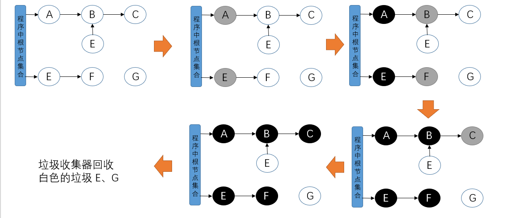
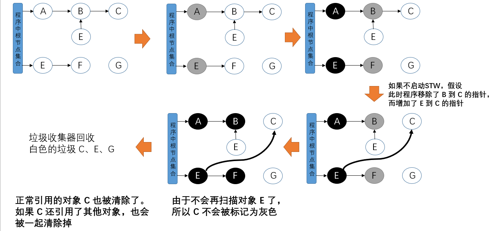
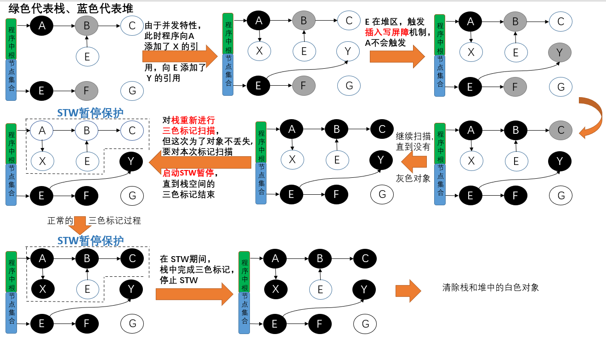
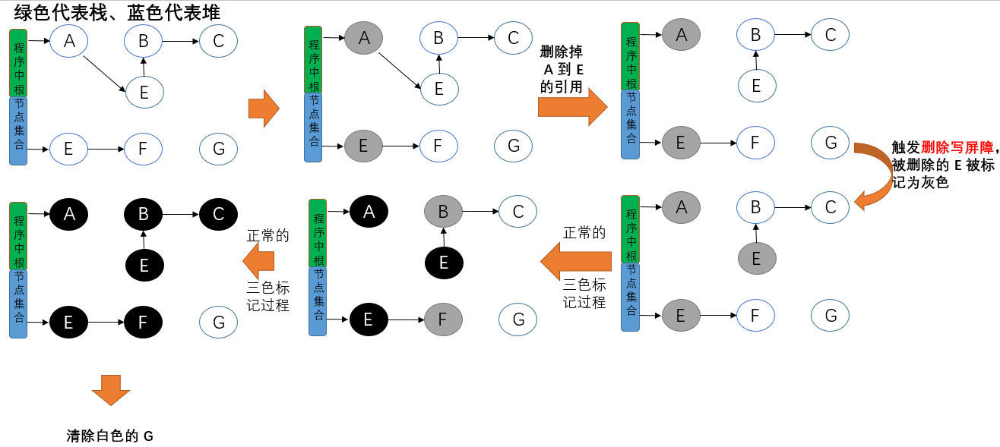

[Memory Alocator & Collector](../Base/MemoryAllocator_Collector.md)

# 内存分配

Go 使用的内存分配策略类似于空闲链表分配器中的隔离适应策略，并借鉴了 TCMalloc 的设计实现高速的内存分配，使用多级缓存将对象根据大小分类，并按照类别实施不同的分配策略。

Go 的 Allocator 会根据申请分配的内存大小选择不同的处理逻辑，运行时根据对象的大小将对象分为：

- 微对象：(0, 16B)
- 小对象：[16B, 32KB]
- 大对象：[32KB, +∞]

因为程序中的绝大多数对象的大小都在 32KB 以下，而申请的内存大小影响 Go 语言运行时分配内存的过程和开销，所以分别处理大对象和小对象有利于提高内存分配器的性能。

与 TCMalloc 相同，Go 运行时分配器也是分级管理内存。

参考：[Go 内存分配器的设计与实现](https://mp.weixin.qq.com/s?__biz=MzU5NTAzNjc3Mg==&mid=2247484249&idx=1&sn=72b97a3ad5ca8f8cdd5b3220bd1433aa&chksm=fe795c52c90ed54411ab519fb12587274bba6dd9d46c1e53fe3d79d482fb291667395920ff2a&scene=126&sessionid=1587216036&key=9de0b3367445c6d80fff3cbd3aca01121cf633ba22b9c4563750016eb80ef1178fce23a16a17aac83941fad82114f473f5bc1127c426bf4d3693ee4f4f8592c095f3761f7b6ccfb7fe410fc47e2e9541&ascene=1&uin=MjcyNTczMDYwNw%3D%3D&devicetype=Windows+10&version=62080079&lang=zh_CN&exportkey=A4Kz3iEJX7FzzuKfAOscBgg%3D&pass_ticket=mxvEXT%2Fn8FSArAKzNDqXsxC%2FVkPt4mkJExF3gietPLa3yXsHRy4mJAGNbYcE29ql)、[图解Go语言内存分配](https://www.cnblogs.com/qcrao-2018/p/10520785.html)

# GC

[Go 语言垃圾收集器的原理](<https://mp.weixin.qq.com/s?__biz=MzU5NTAzNjc3Mg==&mid=2247484261&idx=1&sn=b17ce0394a6da20aff6801c64cf5835d&chksm=fe795c6ec90ed578c6e820f30848fcc2713320f645431aa50b6b77bc2f0e4386546f4553acf3&scene=126&sessionid=1587216036&key=1cbf4f3ad1e1f448ff70999c66995296c8ccc96391fdb9aa56ce37be1eb3623f75c2482ad8bb5e2a2143601b278554ada2eb16ae1e9963a74752d9daab459fe2b8e3986b2e6052c8d07526def1dd0cae&ascene=1&uin=MjcyNTczMDYwNw%3D%3D&devicetype=Windows+10&version=62080079&lang=zh_CN&exportkey=Axt0Ngibtx%2FXvqNMT%2FoZVYQ%3D&pass_ticket=mxvEXT%2Fn8FSArAKzNDqXsxC%2FVkPt4mkJExF3gietPLa3yXsHRy4mJAGNbYcE29ql>)    未读完...

[[典藏版]Golang三色标记、混合写屏障GC模式图文全分析](<https://mp.weixin.qq.com/s?subscene=23&__biz=MzA5MjA2NTY5MA==&mid=2453248659&idx=1&sn=2d39fe04a11c84ddb71ff6814d79ddd1&chksm=87bfe066b0c86970f3be6663b4a5911d741f0a31384367e7cbbb41b804e0d6c524cc64f20031&scene=7&key=8c93de3f00d4c98db8129ff55aa4e29d5e29f4df62e966906eb8c12b6df479da572b78e77f963e56181a83c0366d49351255f7afef5f285377ee2abdb4101911dfb7f92df14fbe9c71b9d1436775aafd&ascene=0&uin=MjcyNTczMDYwNw%3D%3D&devicetype=Windows+10&version=62080079&lang=zh_CN&exportkey=Az5xB8qJwA6whmTj331P2M0%3D&pass_ticket=jqMy8H3w2X%2F0iWFQYh18BLKoCG569E97mWHMU49X%2FtosSBZB0W9Kl0N1hrbTjVmr>)

# 标准三色标记法

Golang 使用的[三色标记法](https://blog.golang.org/ismmkeynote)是在标记-清除(Mark-Sweep)算法的改进，GC 过程和其他用户 goroutine 可并发运行，但仍需要一定时间的 STW(stop the world)

三色标记算法将程序中的对象分为白色、黑色、灰色三类：

- 白色对象 — 潜在的垃圾，其内存可能会被垃圾收集器回收；
- 黑色对象 — 活跃的对象，包括不存在任何引用外部指针的对象以及从根对象可达的对象；
- 灰色对象 — 活跃的对象，因为存在指向白色对象的外部指针，垃圾收集器会扫描这些对象的子对象

垃圾收集器标记过程：

1. 程序中不存在任何黑色对象，所有新创建的对象默认被标记为白色，放在白色集合中；
2. 垃圾收集器从根节点开始遍历(**仅遍历一次**)所有对象，把遍历到的对象从原本的白色重新标记为灰色，放入灰色集合中；
3. 遍历灰色集合，将灰色对象引用的对象从白色集合移动到灰色集合，再将之前的灰色对象移动到黑色集合；
4. 重复以上两个步骤直到不存在灰色对象。

注意：垃圾收集器只会从灰色对象集合中取出对象开始扫描，当灰色集合中不存在任何对象时，标记阶段就会结束。

标记过程结束后，程序中只存在黑色的存活对象和白色的垃圾对象，垃圾收集器可以回收这些白色的垃圾。

如果没有 STW：

为了防止上面的问题发生，最简单的方式就是STW，直接禁止掉其他用户程序对对象引用关系的干扰，但是**STW的过程有明显的资源浪费，对所有的用户程序都有很大影响**，如何能在保证对象不丢失的情况下合理的尽可能的提高GC效率，减少STW时间呢？

# 屏障机制

如果垃圾回收满足以下任一情况时就可以保证对象不丢失：

- 强三色不变式：禁止黑色对象引用白色对象
- 弱三色不变式：所有被黑色对象引用的白色对象都处于灰色保护状态

## 插入写屏障

在Golang中，对栈上指针的写入添加写屏障的成本很高，所以Go选择**仅对堆上的指针插入增加写屏障**，这样就会出现在扫描结束后，栈上仍存在引用白色对象的情况，这时的栈是灰色的，不满足三色不变式，所以需要对栈进行重新扫描使其变黑，完成剩余对象的标记，这个过程需要STW。这期间会将所有goroutine挂起，当有大量应用程序时，时间可能会达到10～100ms。

- 具体操作：在 E 对象引用 Y 对象的时候，Y 对象被标记为灰色(见图示)。
  - 满足强三色不变式

下列图示省去了最开始的几步。

插入写屏障是一种相对保守的屏障技术，它会将**有存活可能的对象都标记成灰色**以满足强三色不变性。

## 删除写屏障

- 具体操作：被删除的对象，如果自身为灰色或者白色，那么被标记为灰色
  - 满足弱三色不变式

## 混合写屏障

以上两种方式都存在缺点：

- 插入写屏障：结束时需要 STW 来重新扫描栈，标记栈上引用的白色对象的存活
- 删除写屏障：回收精度低，一个对象即使被删除了最后一个指向它的指针也依旧可以活过这一轮，在下一轮GC中被清理掉。
  - GC 开始时 STW 扫描堆栈来记录初始快照，这个过程会保护开始时刻的所有存活对象

Go 1.8 版本引入了混合写屏障机制(hybrid write barrier)，结合了两者的优点，只需要在开始时并发扫描各个 goroutine 的栈，使其变黑并一直保持，这个过程不需要STW，而标记结束后，因为栈在扫描后始终是黑色的，也无需再进行re-scan操作了，减少了STW的时间。

- 满足变形的弱三色不变式，具体操作：
  1. GC 开始，将栈上的可达对象全部扫描并标记为黑色(之后不再进行第二次重复扫描，无需 STW)；
  2. GC 期间，任何在栈上创建的新对象，均为黑色；
  3. 被删除的对象标记为灰色
  4. 被添加的对象标记为灰色

# GC 缺点

Go的GC缺点是对于巨量的小对象处理起来比较不擅长，有可能出现垃圾的产生速度比收集的速度还快的情况。gcMark 线程占用高很大几率就是对象产生速度大于垃圾回收速度了。

runtime.gcBgMarkWorker 函数是 golang 垃圾回收相关的函数，用于标记（mark）出所有是垃圾的对象。一般情况下此函数不会占用这么多的 cpu，出现这种情况一般都是内存 gc 问题。影响 GC 性能的一般都不是内存的占用量，而是对象的数量。举例说明，10 个 100m 的对象和一亿个 10 字节的对象占用内存几乎一样大，但是回收起来一亿个小对象肯定会被 10 个大对象要慢很多。
