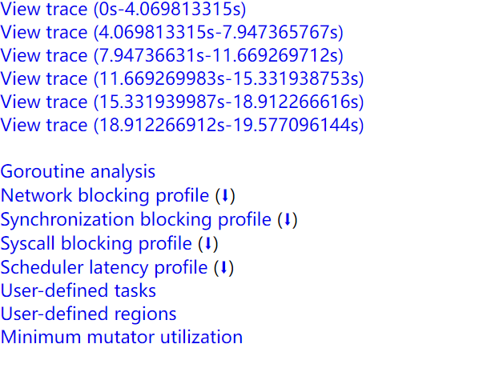

[Memory Allocator & Collector](../Base/MemoryAllocator_Collector.md)

内存管理中的三个角色

- Mutator：赋值器，本质上就是指用户态代码，即应用程序，它会不断修改对象的引用关系，即对象图
- Allocator：内存分配器，负责管理从操作系统分配出的内存空间
  - malloc 底层就有一个内存分配器的实现
  - tcmalloc 是 malloc 多线程改进版，Go 中的实现类似 tcmalloc
- Collector：垃圾收集器，负责清理对象，释放内存空间

# 内存分配

通常有线性分配器（Bump/Sequential Allocator）和空闲链表分配器（ Free List Allocator）两种实现。

- Free List Allocator 的算法有以下四种：使用链表串联内存块
  - First-Fit：每次从链表头开始遍历，第一个满足所申请内存大小的内存块用于分配内存
  - Next-Fit：从上一次分配成功的链表节点开始遍历，找满足的内存块，遍历到末尾也没有找到会回到链表头遍历，值到将链表的所有内存块都遍历完
  - Best-Fit：每次从链表头开始完整遍历链表，找到最适合的内存块再分配
  - Segregated-Fit：分级匹配，将内存块按相同大小分成多级，每次分配时找最接近的
    - Go 的内存分配器就是这种模式，可以减少分配产生的内存碎片

Go 使用的内存分配策略类似于空闲链表分配器中的隔离适应策略，并借鉴了 tcmalloc 的设计实现高速的内存分配，使用多级缓存将对象根据大小分类，并按照类别实施不同的分配策略。

Go 的 Allocator 会根据申请分配的内存大小选择不同的处理逻辑，运行时将对象分为以下三类：

- 微对象 Tiny：(0, 16B) 且没有指针（没有指针，因此不需要被垃圾回收器扫描）
- 小对象 Small：[16B, 32KB] 或有指针
- 大对象 Large：[32KB, +∞]

因为程序中的绝大多数对象的大小都在 32KB 以下，而申请的内存大小影响 Go 语言运行时分配内存的过程和开销，所以分别处理大对象和小对象有利于提高内存分配器的性能。

与 tcmalloc 相同，Go 运行时分配器也是分级管理内存，维护了一个多级结构：

mcache -> mcentral -> mheap

- mcache：与 P 绑定，本地内存分配操作，不需要加锁
- mcentral：中⼼分配缓存，分配时需要上锁，不同 spanClass（0~66 共 67 种） 使⽤不同的锁
- mheap：全局唯⼀，从 OS 申请内存，并修改其内存定义结构时，需要加锁，是个全局锁

结合 github 上的去看

微对象的内存分配：

先从当前 P 的 mcache 分配，而 mcache 优先在 tiny 块分配微对象，如果 tiny 块满了或者不够，会向 alloc 找；

alloc 是一个数组，根据 spanClass 来索引，分为有指针（偶数槽，scan 类型）和无指针（奇数槽，noscan 类型）两种，所以该数组长度为 67*2=134。微对象，如果 mcache 用完后都是从 alloc 的第五个槽的 mspan 中划分出一个对象来，然后将其放到 mcache.tiny 的开头位置。如果 alloc 的这个槽已经满了，说明这个 P 本地已经解决不了内存分配的问题了，就需要向 mheap 的 mcentral 中去找；

？？？

```go
type mcache struct {
	tiny        uintptr // 指向 tiny 块
	tinyoffset  uintptr // 指向 tiny 块尾部
  alloc [numSpanClasses]*mspan
  // ... 其他字段
}
```

小对象的内存分配，相比微对象，不用在 mcache 的 tiny 块找了，直接去 alloc。

大对象的内存分配，会跳过 mcache、mcentral，直接从 mheap 进行相应数量的 page 分配。

参考：[Go 内存分配器的设计与实现](https://mp.weixin.qq.com/s?__biz=MzU5NTAzNjc3Mg==&mid=2247484249&idx=1&sn=72b97a3ad5ca8f8cdd5b3220bd1433aa&chksm=fe795c52c90ed54411ab519fb12587274bba6dd9d46c1e53fe3d79d482fb291667395920ff2a&scene=126&sessionid=1587216036&key=9de0b3367445c6d80fff3cbd3aca01121cf633ba22b9c4563750016eb80ef1178fce23a16a17aac83941fad82114f473f5bc1127c426bf4d3693ee4f4f8592c095f3761f7b6ccfb7fe410fc47e2e9541&ascene=1&uin=MjcyNTczMDYwNw%3D%3D&devicetype=Windows+10&version=62080079&lang=zh_CN&exportkey=A4Kz3iEJX7FzzuKfAOscBgg%3D&pass_ticket=mxvEXT%2Fn8FSArAKzNDqXsxC%2FVkPt4mkJExF3gietPLa3yXsHRy4mJAGNbYcE29ql)、[图解Go语言内存分配](https://www.cnblogs.com/qcrao-2018/p/10520785.html)


# GC

[Go 语言垃圾收集器的原理](<https://mp.weixin.qq.com/s?__biz=MzU5NTAzNjc3Mg==&mid=2247484261&idx=1&sn=b17ce0394a6da20aff6801c64cf5835d&chksm=fe795c6ec90ed578c6e820f30848fcc2713320f645431aa50b6b77bc2f0e4386546f4553acf3&scene=126&sessionid=1587216036&key=1cbf4f3ad1e1f448ff70999c66995296c8ccc96391fdb9aa56ce37be1eb3623f75c2482ad8bb5e2a2143601b278554ada2eb16ae1e9963a74752d9daab459fe2b8e3986b2e6052c8d07526def1dd0cae&ascene=1&uin=MjcyNTczMDYwNw%3D%3D&devicetype=Windows+10&version=62080079&lang=zh_CN&exportkey=Axt0Ngibtx%2FXvqNMT%2FoZVYQ%3D&pass_ticket=mxvEXT%2Fn8FSArAKzNDqXsxC%2FVkPt4mkJExF3gietPLa3yXsHRy4mJAGNbYcE29ql>)    未读完...

[[典藏版]Golang三色标记、混合写屏障GC模式图文全分析](<https://mp.weixin.qq.com/s?subscene=23&__biz=MzA5MjA2NTY5MA==&mid=2453248659&idx=1&sn=2d39fe04a11c84ddb71ff6814d79ddd1&chksm=87bfe066b0c86970f3be6663b4a5911d741f0a31384367e7cbbb41b804e0d6c524cc64f20031&scene=7&key=8c93de3f00d4c98db8129ff55aa4e29d5e29f4df62e966906eb8c12b6df479da572b78e77f963e56181a83c0366d49351255f7afef5f285377ee2abdb4101911dfb7f92df14fbe9c71b9d1436775aafd&ascene=0&uin=MjcyNTczMDYwNw%3D%3D&devicetype=Windows+10&version=62080079&lang=zh_CN&exportkey=Az5xB8qJwA6whmTj331P2M0%3D&pass_ticket=jqMy8H3w2X%2F0iWFQYh18BLKoCG569E97mWHMU49X%2FtosSBZB0W9Kl0N1hrbTjVmr>)

[Go GC 20 问](https://mp.weixin.qq.com/s/5xjH-LJ53XiNm2sMNQZiGQ)

# 标准三色标记法

Golang 1.5 前主要采用 Mark-Sweep 算法，STW 时间会很长，1.5 及之后采用**无分代、不整理（回收过程中不对对象进行移动和整理）、并发（与用户代码并发执行，但仍需要一定时间的 STW）的[三色标记法]((https://blog.golang.org/ismmkeynote))**。

理解**三色标记法**的关键是理解对象的**三色抽象**以及**波面（wavefront）推进**这两个概念。

从垃圾回收器的视角来看，三色抽象规定了三种不同类型的对象，并用不同的颜色相称：

- 白色对象（可能死亡）：未被回收器访问到的对象。在回收开始阶段，所有对象均为白色，当回收结束后，白色对象均不可达。
- 灰色对象（波面）：已被回收器访问到的对象，但回收器需要对其中的一个或多个指针进行扫描，因为他们可能还指向白色对象。
- 黑色对象（确定存活）：已被回收器访问到的对象，其中所有字段都已被扫描，黑色对象中任何一个指针都不可能直接指向白色对象。

当垃圾回收开始时，只有白色对象。随着标记过程开始进行时，灰色对象开始出现（着色），这时候波面便开始扩大。当一个对象的所有子节点均完成扫描时，会被着色为黑色。当整个堆遍历完成时，只剩下黑色和白色对象，这时的黑色对象为可达对象，即存活；而白色对象为不可达对象，即死亡。这个过程可以视为以灰色对象为波面，将黑色对象和白色对象分离，使波面不断向前推进，直到所有可达的灰色对象都变为黑色对象为止的过程。

垃圾收集器标记过程：

1. 程序中不存在任何黑色对象，所有新创建的对象默认被标记为白色，放在白色集合中；
2. 垃圾收集器从根节点开始遍历(**仅遍历一次**)所有对象，把遍历到的对象从原本的白色重新标记为灰色，放入灰色集合中；
3. 遍历灰色集合，将灰色对象引用的对象从白色集合移动到灰色集合，再将之前的灰色对象移动到黑色集合；
4. 重复以上两个步骤直到不存在灰色对象。

注意：垃圾收集器只会从灰色对象集合中取出对象开始扫描，当灰色集合中不存在任何对象时，标记阶段就会结束。

标记过程结束后，程序中只存在黑色的存活对象和白色的垃圾对象，垃圾收集器可以回收这些白色的垃圾。


如果没有 STW：


为了防止上面的问题发生，最简单的方式就是STW，直接禁止掉其他用户程序对对象引用关系的干扰，但是**STW的过程有明显的资源浪费，对所有的用户程序都有很大影响**，如何能在保证对象不丢失的情况下合理的尽可能的提高GC效率，减少STW时间呢？

# 屏障机制

如果垃圾回收满足以下任一情况时就可以保证对象不丢失：

- 强三色不变式：禁止黑色对象引用白色对象
- 弱三色不变式：所有被黑色对象引用的白色对象都处于灰色保护状态

## 插入写屏障

在Golang中，对栈上指针的写入添加写屏障的成本很高，所以Go选择**仅对堆上的指针插入增加写屏障**，这样就会出现在扫描结束后，栈上仍存在引用白色对象的情况，这时的栈是灰色的，不满足三色不变式，所以需要对栈进行重新扫描使其变黑，完成剩余对象的标记，这个过程需要STW。这期间会将所有goroutine挂起，当有大量应用程序时，时间可能会达到10～100ms。

- 具体操作：在 E 对象引用 Y 对象的时候，Y 对象被标记为灰色(见图示)。
  - 满足强三色不变式

下列图示省去了最开始的几步。


插入写屏障是一种相对保守的屏障技术，它会将**有存活可能的对象都标记成灰色**以满足强三色不变性。

## 删除写屏障

- 具体操作：被删除的对象，如果自身为灰色或者白色，那么被标记为灰色
  - 满足弱三色不变式


## 混合写屏障

以上两种方式都存在缺点：

- 插入写屏障：结束时需要 STW 来重新扫描栈，标记栈上引用的白色对象的存活
- 删除写屏障：回收精度低，一个对象即使被删除了最后一个指向它的指针也依旧可以活过这一轮，在下一轮GC中被清理掉。
  - GC 开始时 STW 扫描堆栈来记录初始快照，这个过程会保护开始时刻的所有存活对象

Go 1.8 版本引入了混合写屏障机制(hybrid write barrier)，结合了两者的优点，只需要在开始时并发扫描各个 goroutine 的栈，使其变黑并一直保持，这个过程不需要STW，而标记结束后，因为栈在扫描后始终是黑色的，也无需再进行re-scan操作了，减少了STW的时间。

- 满足变形的弱三色不变式，具体操作：
  1. GC 开始，将栈上的可达对象全部扫描并标记为黑色(之后不再进行第二次重复扫描，无需 STW)；
  2. GC 期间，任何在栈上创建的新对象，均为黑色；
  3. 被删除的对象标记为灰色
  4. 被添加的对象标记为灰色

# GC 缺点

Go的GC缺点是对于巨量的小对象处理起来比较不擅长，有可能出现垃圾的产生速度比收集的速度还快的情况。gcMark 线程占用高很大几率就是对象产生速度大于垃圾回收速度了。

runtime.gcBgMarkWorker 函数是 golang 垃圾回收相关的函数，用于标记（mark）出所有是垃圾的对象。一般情况下此函数不会占用这么多的 cpu，出现这种情况一般都是内存 gc 问题。影响 GC 性能的一般都不是内存的占用量，而是对象的数量。举例说明，10 个 100m 的对象和一亿个 10 字节的对象占用内存几乎一样大，但是回收起来一亿个小对象肯定会被 10 个大对象要慢很多。


# 如何观察 Go GC

```go
package main

func allocate() {
	_ = make([]byte, 1<<20)
}

func main() {
	for i := 1; i < 100000; i++ {
		allocate()
	}
}
```

## GODEBUG=gctrace=1

```shell
go build -o main  # 生成可执行文件
GODEBUG=gctrace=1 ./main
```

会有两类输出：

### 用户代码向运行时申请内存产生的垃圾回收

```
gc 1 @0.002s 4%: 0.12+0.52+0 ms clock, 0.97+0.033/0.033/0+0 ms cpu, 4->5->1 MB, 5 MB goal, 8 P
```

- gc 1：第一个 GC 周期
- 0.002：程序开始后的 0.002s
- 4%：该 GC 周期中 CPU 的使用率
- 0.12：标记开始时，STW 所花费的时间（wall clock）
- 0.52：标记过程中，并发标记所花费的时间（wall clock）
- 0：标记终止时， STW 所花费的时间（wall clock）
- 0.97：标记开始时， STW 所花费的时间（cpu time）
- 0.033：标记过程中，标记辅助所花费的时间（cpu time）
- 0.033：标记过程中，并发标记所花费的时间（cpu time）
- 0：标记过程中，GC 空闲的时间（cpu time）
- 0：标记终止时， STW 所花费的时间（cpu time）
- 4：标记开始时，堆的大小的实际值
- 5：标记结束时，堆的大小的实际值
- 1：标记结束时，标记为存活的对象大小
- 5：标记结束时，堆的大小的预测值
- 8：标记结束时，堆的大小的预测值

补充：

> - wall clock 是指开始执行到完成所经历的实际时间，包括其他程序和本程序所消耗的时间；
> - cpu time 是指特定程序使用 CPU 的时间
>
> wall clock < cpu time: 充分利用多核
> wall clock ≈ cpu time: 未并行执行
> wall clock > cpu time: 多核优势不明显

### 运行时向操作系统申请内存产生的垃圾回收

对于运行时向操作系统申请内存产生的垃圾回收（向操作系统归还多余的内存）：

```shell
# 向操作系统归还了 8KB 内存
scvg: 8 KB released
# 已分配给用户代码，正在使用的总内存大小为 3MB。MB used or partially used spans
# 空闲以及等待归还给操作系统的总内存大小为 60MB。MB spans pending scavenging
# 通知操作系统中保留的内存大小为 63MB。MB mapped from the system
# 已经归还给操作系统的（或者说还未正式申请）的内存大小为 57MB。MB released to the system
# 已经从操作系统中申请的内存大小为 6MB。MB allocated from the system
scvg: inuse: 3, idle: 60, sys: 63, released: 57, consumed: 6 (MB)
```


## go tool trace

```go
package main

import (
	"os"
	"runtime/trace"
)

func allocate() {
	_ = make([]byte, 1<<20)
}

func main() {
	file, _ := os.Create("./learn_gc/observe/tool/trace.out")
	defer file.Close()
	trace.Start(file)
	defer trace.Stop()
  // 实际要查看的程序
	for i := 1; i < 100000; i++ {
		allocate()
	}
}
```

运行以上代码，会得到 trace.out 文件，然后 `go tool trace trace.out` 启动可视化界面：



## debug.ReadGCStats

可以通过代码的方式来直接实现对感兴趣的指标的监控：

```go
package main

import (
	"fmt"
	"runtime/debug"
	"time"
)

func printGCStats() {
	ticker := time.NewTicker(time.Second) // 每隔 1s 打印一次
	stats := debug.GCStats{}
	for {
		select {
		case <-ticker.C:
			debug.ReadGCStats(&stats)
			fmt.Printf("gc %d last@%v, PauseTotal %v\n", stats.NumGC, stats.LastGC, stats.PauseTotal)
		}
	}
}

func main() {
	go printGCStats()  // 打印 GC 状态
	for i := 1; i < 100000; i++ {
		allocate()
	}
}

func allocate() {
	_ = make([]byte, 1<<20)
}
```

运行代码即可：

```
gc 897 last@2021-10-03 20:06:22.5030305 +0800 CST, PauseTotal 115.4998ms
gc 1946 last@2021-10-03 20:06:23.5106656 +0800 CST, PauseTotal 245.0511ms
gc 3042 last@2021-10-03 20:06:24.5105488 +0800 CST, PauseTotal 371.6697ms
gc 4125 last@2021-10-03 20:06:25.5099076 +0800 CST, PauseTotal 500.9634ms
gc 5214 last@2021-10-03 20:06:26.5105196 +0800 CST, PauseTotal 619.2716ms
```


## runtime.ReadMemStats

除了上面通过 debug 包提供的方法外，还可以直接通过运行时的内存相关的 API 进行监控：

```go
package main

import (
	"fmt"
	"runtime"
	"time"
)

func printMemStats() {
	ticker := time.NewTicker(time.Second) // 每秒监控一次数据
	stats := runtime.MemStats{}
	for {
		select {
		case <-ticker.C:
			runtime.ReadMemStats(&stats)
			fmt.Printf("gc %d last@%v, next_heap_size@%vMB\n",
				stats.NumGC,
				time.Unix(int64(time.Duration(stats.LastGC).Seconds()), 0),
				stats.NextGC/(1<<20))
		}
	}
}

func main() {
	go printMemStats()
	for i := 1; i < 100000; i++ {
		allocate()
	}
}

func allocate() {
	_ = make([]byte, 1<<20)
}
```

运行代码即可

```
gc 994 last@2021-10-03 20:16:32 +0800 CST, next_heap_size@6MB
gc 2068 last@2021-10-03 20:16:33 +0800 CST, next_heap_size@6MB
gc 3146 last@2021-10-03 20:16:34 +0800 CST, next_heap_size@6MB
gc 4167 last@2021-10-03 20:16:35 +0800 CST, next_heap_size@6MB
```


