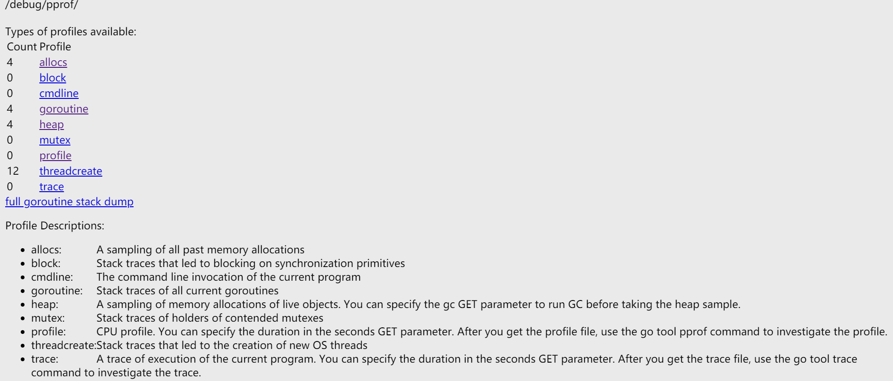

# cover

用于查看代码覆盖率。

```go
func Split(s, sep string) []string {
    var result []string
    i := strings.Index(s, sep)
    for i > -1 {
        result = append(result, s[:i])
        s = s[i+len(sep):]
        i = strings.Index(s, sep)
    }
    return append(result, s)
}

func TestSplit(t *testing.T) {
    tests := map[string]struct {
        input string
        sep   string
        want  []string
    }{
        "simple":    {input: "a/b/c", sep: "/", want: []string{"a", "b", "c"}},
        "wrong sep": {input: "a/b/c", sep: ".", want: []string{"a/b/c"}},
        "no sep":    {input: "abc", sep: "/", want: []string{"abc"}},
        "trailing sep":{input: "a/b/c/", sep: "/", want: []string{"a", "b", "c"}},
    }
    for name,tc := range tests{
        t.Log(name)
        got := Split(tc.input, tc.sep)
        if !reflect.DeepEqual(tc.want, got) {
            // 这里是 Errorf() 而不是 Fatalf()，后者在遇到一个失败的测试数据时，就会终止测试，之后的数据就无法测试了
            t.Errorf("%s: expected: %v, got: %v", name, tc.want, got)
        }
    }
}
```

命令行运行：`go test -cover profile=cover.out` 在测试的同时获取代码覆盖报告并输出到 c.out 文件中

- `go tool cover -func=c.out` 列出每个函数的代码覆盖率
- `go tool cover -html=c.out` 在网页查看代码覆盖信息

# compile

`go tool compile` 把 go -> 编译 -> .o 文件

补充：`go tool objdump` 把可执行文件 -> 反编译 -> 汇编

- `-m file.go` 打印编译优化信息（逃逸分析等）

```go
package main

func main(){
  s1 := "x"
  s2 := s1 + "y" + "x" + "z"
  s3 := s1 + "y" + s1 + "z" + s1
  s4 := s1 + "y" + s1 + "z" + s1 + "z"
  println(s2, s3, s4)
}
```

```shell
> go tool compile -m main.go
main.go:3:6: can inline main
# 可以看出字面量字符串的拼接在编译时就已经完成了
main.go:5:11: main s1 + "yxz" does not escape
main.go:6:28: main s1 + "y" + s1 + "z" + s1 does not escape
main.go:7:33: main s1 + "y" + s1 + "z" + s1 + "z" does not escape
```

- `-m=2` 还可以打印闭包函数的变量捕获、函数的内联调试信息（如不能内联的原因）、逃逸分析信息等

```go
package main

import "fmt"

// 变量捕获主要是针对闭包场景而言的，对于闭包函数引用闭包外的变量，需要明确在闭包中通过值引用或地址引用的方式来捕获变量。
// go tool compile -m=2 main.go | grep capturing
// main.go:14:15: main.func1 capturing by ref: a (addr=true assign=true width=8)
// main.go:14:18: main.func1 capturing by value: b (addr=false assign=false width=8)
// 变量 a 在闭包之后进行了其他赋值操作
// 可以看出，这个闭包程序中，是通过地址引用的方式对变量 a 进行操作的；而对变量 b 的引用则是通过直接值传递的方式进行
func main() {
    a, b := 1, 2
    go func() {
        fmt.Println(a, b)
    }()
    a = 99
}
```

```go
package main

func small() string {
    s := "hello, " + "world"
    return s
}

func fib(index int) int {
    if index < 2 {
        return index
    }
    return fib(index-1) + fib(index-2)
}

// go tool compile -m=2 main.go
// main.go:3:6: can inline small with cost 7 as: func() string { s := "hello, world"; return s }
// main.go:8:6: cannot inline fib: recursive
// 可以看出，small 函数可以被内联而 fib 函数由于是递归函数所以不能被内联
// 可以在 small 函数前增加 //go:noinline 再看一下调试信息
func main() {
    small()
    fib(65)
}
```

- `-S file.go` 查看代码编译后的汇编代码
  - 注意，此时输出的汇编代码还没有链接，呈现的地址都是偏移量
  - 也可以使用 `go build -gcflags -S file.go` 命令查看

```shell
> go tool compile -S main.go | grep concat
# 这里仅列出了汇编中调用字符串连接函数的内容
0x0068 00104 (main.go:5)    CALL    runtime.concatstring2(SB)
0x00eb 00235 (main.go:6)    CALL    runtime.concatstring5(SB)
0x0197 00407 (main.go:7)    CALL    runtime.concatstrings(SB)
rel 105+4 t=8 runtime.concatstring2+0
rel 236+4 t=8 runtime.concatstring5+0
rel 408+4 t=8 runtime.concatstrings+0
```

-n、-l

# pprof

[Profiling Go Programs](https://blog.golang.org/pprof)

profile 一般被称为性能分析，计算机程序的 profile 就是一个程序在运行时的各种概况信息，包括 cpu 占用情况，内存情况，线程情况，线程阻塞情况等等。知道了程序的这些信息，也就能容易的定位程序中的问题和故障原因。

golang 对于 profiling 支持的比较好，标准库就提供了 profile 库 "runtime/pprof" 和 "net/http/pprof"，而且也提供了很多好用的可视化工具来辅助开发者做 profiling。

可视化工具 Graphviz，在[官网](https://graphviz.gitlab.io/_pages/Download/Download_windows.html)下载，安装或解压后配置到环境变量 Path 中

- `go tool pprof xxxx`进入命令行交互模式：
  
  - `help` 查看可以进行的操作
  - `topN` 查看前 N 的信息
  - `web` 在网页查看
    - `web 函数名`可以指定查看包含了某个函数的相关信息
  - `quit`退出

- runtime/pprof 通常用于工具分析

- net/http/pprof 通常用于常驻服务进程分析

## 基本使用

**优先使用 CPU Profile，当发现定位困难时，尝试使用 MEM Profile**！！！！

方式一（推荐）：

```go
import (
    "log"
    "net/http"
    _ "net/http/pprof"
)

func main() {
    go func() {
        log.Println(http.ListenAndServe(":6060", nil))
    }()
  // 业务代码...
}
```

只要引入 net/http/pprof 这个包，然后在 main 函数中启动一个 http server 就相当于给线上服务加上 profiling 了，所有信息的访问路径都以 /debug/pprof 开始

```shell
# 注意，如果是本地应用的话，要用 127.0.0.1 而不能用 localhost
# 网页上查看 30s 内的 cpu 占用情况
go tool pprof -http=:1234 http://your-prd-addr:6060/debug/pprof/profile?seconds=30
```

- VIEW-Top，会有以下几项：
  
  - Flat：函数自身运行耗时
  - Flat%：函数自身耗时比例
  - Sum%：累计耗时比例
  - Cum：函数自身+其调用函数耗时
  - Cum%：函数自身+其调用函数比例
  - Name：函数名

- VIEW-Graph 视图呈现函数调用树
  
  - 可以方便地跟踪定位业务消耗源头，方框越大代表函数自身消耗越大。

- VIEW-Flame Graph 火焰图;
  
  - X 轴显示的是该性能指标分析中所占用的资源量，越宽占用资源越多
  - Y 轴表示调用栈，每一层都是一个函数，调用栈越深火焰越深，底部就是正在执行的函数，上方的都是其父函数
  - 最底部的边表示被占用的 CPU 时间，越宽占比越大。通常从最底部最宽边向上观察父函数，直到业务代码函数

```shell
# 查看堆内存信息，可视化分配的字节数或分配的对象数
go tool pprof -http=:1234 http://127.0.0.1:6060/debug/pprof/heap
```

- SAMPLE
  
  - alloc_objects：收集自程序启动以来累计的分配对象数
  - alloc_space：收集自程序启动以来累计的分配空间
  - inuse_objects：收集统计实时，正在使用的分配对象数
  - inuse_space：收集统计实时，正在使用的分配空间

- 如果要**减少内存消耗**，需要查看 inuse_space 在正常程序运行期间收集的配置文件；

- 如果要提高执行速度，查看 alloc_objects 大量运行时间后胡哦程序结束时收集的概要文件

---

方式二：

```shell
go tool pprof http://127.0.0.1:6060/debug/pprof/profile?seconds=30
```

会进入命令行交互模式

---

方式三：

网页直接访问 `http://localhost:6060/debug/pprof` 可以看到：



点击 heap、profile 等会下载一个相关信息的文件，下载后在该文件所在路径 `go tool pprof file_name`即可在交互模式下查看。

## 学习文章

[Go pprof 与线上事故：一次成功的定位与失败的复现](https://mp.weixin.qq.com/s?__biz=MzAxMTA4Njc0OQ==&mid=2651439418&idx=1&sn=e412c7ca7ab483ed72c851161f92010e&chksm=80bb1fc8b7cc96de448557c9ac06994446b99c1907f62ed6ef5ebfe7fc54ba6457160d5f167f&mpshare=1&scene=1&srcid=&sharer_sharetime=1590413320700&sharer_shareid=1e8fe0069cfda6b4b46c5f40d2300838&key=0556ab1ffe89d7835cd43614c233e3d9aa02a41e23bb78b89ae9a4f857cc34a7ad646047c32ceabc00c1b1743175dcd6ed05039328f64798b4204b10b094e584c0e3282524fbefe0a2527f331e91b4ce&ascene=1&uin=MjcyNTczMDYwNw%3D%3D&devicetype=Windows+10&version=62080079&lang=zh_CN&exportkey=A%2BMU%2B5RQ6AUTYb%2Bl4DPVg5I%3D&pass_ticket=bE1smrHTD%2BI5514qD8aPPktHYjEhDLcAINwgCWxpDe89%2FcBbOuLL%2BR2paSHNc18O)

[Go 语言 CPU 性能、内存分析调试方法大汇总](https://mp.weixin.qq.com/s?__biz=MzAxMTA4Njc0OQ==&mid=2651439006&idx=1&sn=0db8849336cc4172c663a574212ea8db&chksm=80bb616cb7cce87a1dc529e6c8bdcf770e293fc4ce67ede8e1908199480534c39f79803038e3&scene=21#wechat_redirect)

[滴滴实战分享：通过 profiling 定位 golang 性能问题 - 内存篇](https://mp.weixin.qq.com/s?__biz=MzAxMTA4Njc0OQ==&mid=2651439020&idx=1&sn=c2094f4dccb53385dc207958e7f42f9e&chksm=80bb615eb7cce8481eb7a8f09d4a13e2974b3785c241dd31245647cd7540dde414d64f2b3719&mpshare=1&scene=1&srcid=&sharer_sharetime=1588220488644&sharer_shareid=30b1625d468faac049cea9da9114245b&key=1cbf4f3ad1e1f448f93393b821ef9f1d62ff18d83f804cc5acacae2aef169871a7a4e0e4445e65e13458c8c252679347817919c9ba6bc3729e993c59a5245285b3919dbd07b322b629947857e5d41716&ascene=1&uin=MjcyNTczMDYwNw%3D%3D&devicetype=Windows+10&version=62080079&lang=zh_CN&exportkey=A2nZAFhDNmAf%2FrZhF9e4vss%3D&pass_ticket=VI6mkgjQFIqHIqFT0WEUxYSwo06lRYkWk%2BhmScfX7Xw8P7%2BI%2BB8HY7O77u%2BJWEdS)

[滴滴 Go 实战：高频服务接口超时排查&性能调优](https://mp.weixin.qq.com/s?__biz=MzAxMTA4Njc0OQ==&mid=2651438884&idx=1&sn=809c8d3041bf6913fa8bc1e57e6cb5c6&chksm=80bb61d6b7cce8c04ed610fe2fd333ff02afe24baeadf3d98ae84f7a8cef247687518239bc5f&scene=21#wechat_redirect)

## 基准测试

```go
var ints []int
func BenchmarkSort10k(b *testing.B) {
  slice := ints[0:10000]
    b.ResetTimer()
    for i := 0; i < b.N; i++ {
        sort.Ints(slice)
    }
}
// 函数签名是固定的，用于完成数据初始化的工作
func TestMain(m *testing.M) {
    rand.Seed(time.Now().Unix())
    ints = make([]int, 10000)

    for i := 0; i < 10000; i++ {
        ints[i] = rand.Int()
    }
    m.Run()
}
```

命令行运行：`go test -bench=. -cpuprofile=cpu.out -memprofile=mem.out` 会得到一个记录了 cpu 占用情况的 cpu.out 文件和记录内存信息的 mem.out 文件

- `go tool pprof file_name.out` 进入命令行交互模式来查看
- `go tool pprof -http=:6060 file.out` 自动在浏览器中打开一个页面
  - 左上角 View -> Flame graph 可以通过火焰图显示

# trace

用于分析程序动态执行的情况，且分析精度达到纳秒级别。

```shell
curl -o trace.out http://127.0.0.1:8081/debug/pprof/trace?seconds=2
go tool trace trace.out
```
