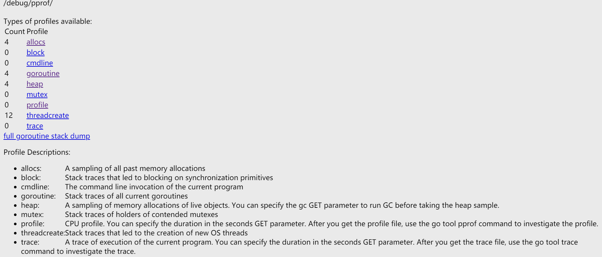

# cover

用于查看代码覆盖率。

```go
func Split(s, sep string) []string {
	var result []string
	i := strings.Index(s, sep)
	for i > -1 {
		result = append(result, s[:i])
		s = s[i+len(sep):]
		i = strings.Index(s, sep)
	}
	return append(result, s)
}

func TestSplit(t *testing.T) {
	tests := map[string]struct {
		input string
		sep   string
		want  []string
	}{
		"simple":    {input: "a/b/c", sep: "/", want: []string{"a", "b", "c"}},
		"wrong sep": {input: "a/b/c", sep: ".", want: []string{"a/b/c"}},
		"no sep":    {input: "abc", sep: "/", want: []string{"abc"}},
		"trailing sep":{input: "a/b/c/", sep: "/", want: []string{"a", "b", "c"}},
	}
	for name,tc := range tests{
		t.Log(name)
		got := Split(tc.input, tc.sep)
		if !reflect.DeepEqual(tc.want, got) {
			// 这里是 Errorf() 而不是 Fatalf()，后者在遇到一个失败的测试数据时，就会终止测试，之后的数据就无法测试了
			t.Errorf("%s: expected: %v, got: %v", name, tc.want, got)
		}
	}
}
```

命令行运行：`go test -coverprofile=cover.out` 在测试的同时获取代码覆盖报告并输出到 c.out 文件中

- `go tool cover -func=c.out` 列出每个函数的代码覆盖率
- `go tool cover -html=c.out` 在网页查看代码覆盖信息

# compile

`go tool compile`

- `-m file.go` 打印编译优化信息

```go
package main

func main(){
  s1 := "x"
  s2 := s1 + "y" + "x" + "z"
  s3 := s1 + "y" + s1 + "z" + s1
  s4 := s1 + "y" + s1 + "z" + s1 + "z"
  println(s2, s3, s4)
}
```

```shell
> go tool compile -m main.go
main.go:3:6: can inline main
# 可以看出字面量字符串的拼接在编译时就已经完成了
main.go:5:11: main s1 + "yxz" does not escape
main.go:6:28: main s1 + "y" + s1 + "z" + s1 does not escape
main.go:7:33: main s1 + "y" + s1 + "z" + s1 + "z" does not escape
```

- `-S file.go` 查看代码编译后的汇编代码
  - 注意，此时输出的汇编代码还没有链接，呈现的地址都是偏移量
  - 也可以使用 `go build -gcflags -S file.go` 命令查看

```shell
> go tool compile -S main.go | grep concat
# 这里仅列出了汇编中调用字符串连接函数的内容
0x0068 00104 (main.go:5)	CALL	runtime.concatstring2(SB)
0x00eb 00235 (main.go:6)	CALL	runtime.concatstring5(SB)
0x0197 00407 (main.go:7)	CALL	runtime.concatstrings(SB)
rel 105+4 t=8 runtime.concatstring2+0
rel 236+4 t=8 runtime.concatstring5+0
rel 408+4 t=8 runtime.concatstrings+0
```


# pprof

[Profiling Go Programs](https://blog.golang.org/pprof)

profile 一般被称为性能分析，计算机程序的 profile 就是一个程序在运行时的各种概况信息，包括 cpu 占用情况，内存情况，线程情况，线程阻塞情况等等。知道了程序的这些信息，也就能容易的定位程序中的问题和故障原因。

golang 对于 profiling 支持的比较好，标准库就提供了 profile 库 "runtime/pprof" 和 "net/http/pprof"，而且也提供了很多好用的可视化工具来辅助开发者做 profiling。 

可视化工具 Graphviz，在[官网](https://graphviz.gitlab.io/_pages/Download/Download_windows.html)下载，安装或解压后配置到环境变量 Path 中

- `go tool pprof xxxx`进入命令行交互模式：
  - `help` 查看可以进行的操作
  - `topN` 查看前 N 的信息
  - `web` 在网页查看
    - `web 函数名`可以指定查看包含了某个函数的相关信息
  - `quit`退出

## 示例

```go
import (
	"log"
	"net/http"
	_ "net/http/pprof"
)

func main() {
	go func() {
		log.Println(http.ListenAndServe(":6060", nil))
	}()
  // 业务代码...
}
```

只要引入 net/http/pprof 这个包，然后在 main 函数中启动一个 http server 就相当于给线上服务加上 profiling 了，所有信息的访问路径都以 /debug/pprof 开始

```shell
# 注意，如果是本地应用的话，要用 127.0.0.1 而不能用 localhost
# 查看堆内存信息
go tool pprof http://127.0.0.1:6060/debug/pprof/heap
# 查看 30s 内的 cpu 占用情况
go tool pprof http://127.0.0.1:6060/debug/pprof/profile?seconds=30
# 网页上查看 30s 内的 cpu 占用情况
go tool pprof -http=:1234 http://your-prd-addr:6060/debug/pprof/profile?seconds=30
```

也可以网页直接访问 `http://localhost:6060/debug/pprof` 可以看到：



点击 heap、profile 等会下载一个相关信息的文件，下载后在该文件所在路径 `go tool pprof file_name`即可在交互模式下查看。

[Go语言 CPU 性能、内存分析调试方法大汇总](<https://mp.weixin.qq.com/s?__biz=MzAxMTA4Njc0OQ==&mid=2651439006&idx=1&sn=0db8849336cc4172c663a574212ea8db&chksm=80bb616cb7cce87a1dc529e6c8bdcf770e293fc4ce67ede8e1908199480534c39f79803038e3&scene=21#wechat_redirect>)

[滴滴实战分享：通过 profiling 定位 golang 性能问题 - 内存篇](<https://mp.weixin.qq.com/s?__biz=MzAxMTA4Njc0OQ==&mid=2651439020&idx=1&sn=c2094f4dccb53385dc207958e7f42f9e&chksm=80bb615eb7cce8481eb7a8f09d4a13e2974b3785c241dd31245647cd7540dde414d64f2b3719&mpshare=1&scene=1&srcid=&sharer_sharetime=1588220488644&sharer_shareid=30b1625d468faac049cea9da9114245b&key=1cbf4f3ad1e1f448f93393b821ef9f1d62ff18d83f804cc5acacae2aef169871a7a4e0e4445e65e13458c8c252679347817919c9ba6bc3729e993c59a5245285b3919dbd07b322b629947857e5d41716&ascene=1&uin=MjcyNTczMDYwNw%3D%3D&devicetype=Windows+10&version=62080079&lang=zh_CN&exportkey=A2nZAFhDNmAf%2FrZhF9e4vss%3D&pass_ticket=VI6mkgjQFIqHIqFT0WEUxYSwo06lRYkWk%2BhmScfX7Xw8P7%2BI%2BB8HY7O77u%2BJWEdS>)

[滴滴Go实战：高频服务接口超时排查&性能调优](<https://mp.weixin.qq.com/s?__biz=MzAxMTA4Njc0OQ==&mid=2651438884&idx=1&sn=809c8d3041bf6913fa8bc1e57e6cb5c6&chksm=80bb61d6b7cce8c04ed610fe2fd333ff02afe24baeadf3d98ae84f7a8cef247687518239bc5f&scene=21#wechat_redirect>)

## 基准测试

```go
var ints []int
func BenchmarkSort10k(b *testing.B) {
  slice := ints[0:10000]
	b.ResetTimer()
	for i := 0; i < b.N; i++ {
		sort.Ints(slice)
	}
}
// 函数签名是固定的，用于完成数据初始化的工作
func TestMain(m *testing.M) {
	rand.Seed(time.Now().Unix())
	ints = make([]int, 10000)

	for i := 0; i < 10000; i++ {
		ints[i] = rand.Int()
	}
	m.Run()
}
```

命令行运行：`go test -bench=. -cpuprofile=cpu.out -memprofile=mem.out ` 会得到一个记录了 cpu 占用情况的 cpu.out 文件和记录内存信息的 mem.out 文件

- `go tool pprof file_name.out` 进入命令行交互模式来查看
- `go tool pprof -http=:6060 file.out` 自动在浏览器中打开一个页面
  - 左上角 View -> Flame graph 可以通过火焰图显示


