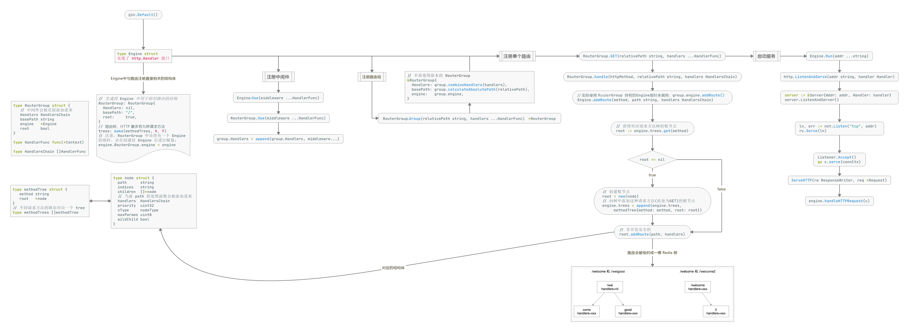

下载：`go get -u github.com/gin-gonic/gin`



# Hello World

```go
import (
	"fmt"
	"github.com/gin-gonic/gin"
	"net/http"
)

func main() {
  // 返回 Gin 的 Engine，包含了 RouterGroup，相当于创建一个路由 Handlers，可以后期绑定各类路由规则和函数、中间件等
  r := gin.Default()
	r.GET("/test", func(c *gin.Context) {
    // gin.H 就是一个 map[string]interface{}
		c.JSON(http.StatusOK, gin.H{"message": "test"})
	})
	s := &http.Server{
		Addr:     ":1321",
		Handler:  router,
	}
	s.ListenAndServe()
}
```

注意：查看 `gin.Default()` 源码，会在程序启动时打印 Warning 信息，且会添加 `Logger()`、`Recovery()` 中间件。

中间件使用见[02-中间件](02-中间件.md)。

# 路由

## 注册路由

```go
func InitRouter() *gin.Engine {
	r := gin.New()
	r.Use(gin.Logger())
	gin.SetMode("debug")
	apiv1 := r.Group("/api/v1")
	{
		// 获取标签列表，后面是对应的业务逻辑
		apiv1.GET("/tags", v1.GetTags)
		// 新建标签
		apiv1.POST("/tags", v1.AddTag)
	}
	return r
}
```

## GET

### 查询参数

访问路径：`http://localhost:1321/test?first_name=b&last_name=x`

```go
r.GET("/test", func(c *gin.Context) {
  // 获取 URL 中携带的查询参数
  firstName := c.Query("first_name")
  // 获取 URL 中携带的查询参数，如果没有，则使用默认值
  lastName := c.DefaultQuery("last_name", "default_last_name")
  c.String(http.StatusOK, "%s_%s", firstName, lastName)
})
```

### 路径变量

访问路径：`http://localhost:8080/user/zzk`

```go
r.GET("/user/:name/:id", func(c *gin.Context) {
  c.JSON(200,gin.H{
    "name": c.Param("name"),
  })
})
```

这是精确匹配，只能匹配一个，上面无法匹配 `/user/` 以及 `/user/zzk/24` 的。

```go
r.GET("/family/*name", func(c *gin.Context) {
  c.JSON(200,gin.H{
    "name": c.Param("name"),
  })
})
```

使用 `*` 就可以匹配多层路径了，如访问 `/family/who/is/mom` 显示 `{"name": "/who/is/mom"}`，而如果访问 `/family` 或被重定向到 `/family/` 显示 `{"name": "/"}`。

如果设置了 `r.RedirectTrailingSlash = false` 就不会自动重定向了。

## POST

### 表单参数

- 表单传输为 post 请求，http 常见的传输格式为四种：
  - application/json
  - application/x-www-form-urlencoded
  - application/xml
  - multipart/form-data

```go
r.POST("/body", func(c *gin.Context) {
  // PostForm() 默认解析的是 x-www-form-urlencoded 或 from-data 格式的参数
  firstName := c.PostForm("first_name")
  lastName := c.DefaultPostForm("last_name", "default_last_name")
  c.String(http.StatusOK, "%s %s", firstName, lastName)
})
```

### 上传文件

- http 的 multipart/form-data 格式用于文件上传

```html
<!DOCTYPE html>
<html lang="en">
<head>
    <meta charset="UTF-8">
    <meta name="viewport" content="width=device-width, initial-scale=1.0">
    <meta http-equiv="X-UA-Compatible" content="ie=edge">
    <title>Document</title>
</head>
<body>
<form action="http://localhost:8080/upload" method="post" enctype="multipart/form-data">
    上传单个文件: <input type="file" name="file">
    <input type="submit" value="提交">
</form>
<form action="http://localhost:8080/upload_more" method="post" enctype="multipart/form-data">
    上传多个文件: <input type="file" name="files" multiple>
    <input type="submit" value="提交">
</form>
</body>
</html>
```

```go
// 限制上传最大尺寸
r.MaxMultipartMemory = 8 << 20
// 上传单个文件
func upload(c *gin.Context) {
  file, err := c.FormFile("file")
  if err != nil {
    c.String(500, "上传图片出错")
  }
  // 保存文件，需指定路径及文件名
  c.SaveUploadedFile(file, file.Filename)
  c.String(http.StatusOK, file.Filename)
}
// 上传多个文件
func uploadmore(c *gin.Context) {
	form, err := c.MultipartForm()
	if err != nil {
		c.String(http.StatusBadRequest, fmt.Sprintf("get err %s", err.Error()))
	}
	// 获取所有图片
	files := form.File["files"]
	// 遍历所有图片保存
	for _, file := range files {
		if err := c.SaveUploadedFile(file, "./img/"+file.Filename); err != nil {
			c.String(http.StatusBadRequest, fmt.Sprintf("upload err %s", err.Error()))
			return
		}
	}
	c.String(200, fmt.Sprintf("upload ok %d files", len(files)))
}
```

如果想要对上传的文件有其他要求，如大小、格式等：

```go
func upload(c *gin.Context){
  _, headers, err := c.Request.FormFile("file")
  if err != nil {
      log.Printf("Error when try to get file: %v", err)
  }
  //headers.Size 获取文件大小
  if headers.Size > 1024*1024*2 {
      fmt.Println("文件太大了")
      return
  }
  //headers.Header.Get("Content-Type")获取上传文件的类型
  if headers.Header.Get("Content-Type") != "image/png" {
      fmt.Println("只允许上传png图片")
      return
  }
  c.SaveUploadedFile(headers, "./video/"+headers.Filename)
  c.String(http.StatusOK, headers.Filename)
}
```

# 数据解析和绑定

- JSON 数据

```go
func loginJSON(c *gin.Context) {
	var json models.Login
	// 将 request 的 body 中的数据，自动按照 json 格式解析到结构体
	if err := c.ShouldBindJSON(&json); err != nil {
		c.JSON(http.StatusBadRequest, gin.H{"error": err.Error()})
		return
	}
	if json.User != "root" && json.Password != "admin" {
		c.JSON(http.StatusBadRequest, gin.H{"status": "304"})
		return
	}
	c.JSON(http.StatusOK, gin.H{"status": "200"})
}
```

- Form 表单数据

```go
var form models.Login
// Bind() 默认解析并绑定 form 格式
// 根据请求头中 content-type 自动推断
if err := c.Bind(&form); err != nil {
  c.JSON(http.StatusBadRequest, gin.H{"error": err.Error()})
  return
}
```

- URI 数据

```go
var login Login
if err := c.ShouldBindUri(&login); err != nil {
  c.JSON(http.StatusBadRequest, gin.H{"error": err.Error()})
  return
}
```


# 静态资源

```go
  // 设置静态文件夹绑定，有以下两种写法
  r.Static("assets", "static/assets")
  r.StaticFS("/static",http.Dir("static/template"))
  // 设置静态文件
  r.StaticFile("/favicon.ico","static/favicon.ico")
```


# 渲染

## 各种数据格式的响应

```go
c.JSON(200, gin.H{"message": "someJSON", "status": 200})
// 美化输出的 JSON 字符串，使其缩进
c.IndentedJSON(200, user{ID: 456, Name: "李四", Age: 25})
// 保持原来的字符，不进行转义，不会使用字符对应的 Unicode 值替换 html 字符，所以下面的文字显示会被加粗
// JSON() 方法会默认对内容中的特殊字符进行转义
c.PureJSON(200, gin.H{
  "message": "<b>Hello, world!</b>",
})

c.XML(200, gin.H{"message": "abc"})
c.YAML(200, gin.H{"name": "zhangsan"})
```

## HTML模板

```go
func main() {
  r := gin.Default()
  r.LoadHTMLGlob("tem/*") // 加载模板文件
  r.GET("/index", func(c *gin.Context) {
    c.HTML(http.StatusOK, "user/index.html", gin.H{"title": "我是测试", "address": "www.5lmh.com"})
  })
  r.Run()
}
```

## 重定向

```go
r.GET("/index", func(c *gin.Context) {
  c.Redirect(http.StatusMovedPermanently, "http://www.5lmh.com")
})
```

## 同步&异步

使用 goroutine 机制实现异步处理，在启动新的 goroutine 时，不应该使用原始上下文，必须使用它的只读副本

```go
// 1.异步
r.GET("/long_async", func(c *gin.Context) {
  // 需要搞一个副本
  copyContext := c.Copy()
  // 异步处理
  go func() {
    time.Sleep(3 * time.Second)
    log.Println("异步执行：" + copyContext.Request.URL.Path)
  }()
})
// 2.同步
r.GET("/long_sync", func(c *gin.Context) {
  time.Sleep(3 * time.Second)
  log.Println("同步执行：" + c.Request.URL.Path)
})
```


