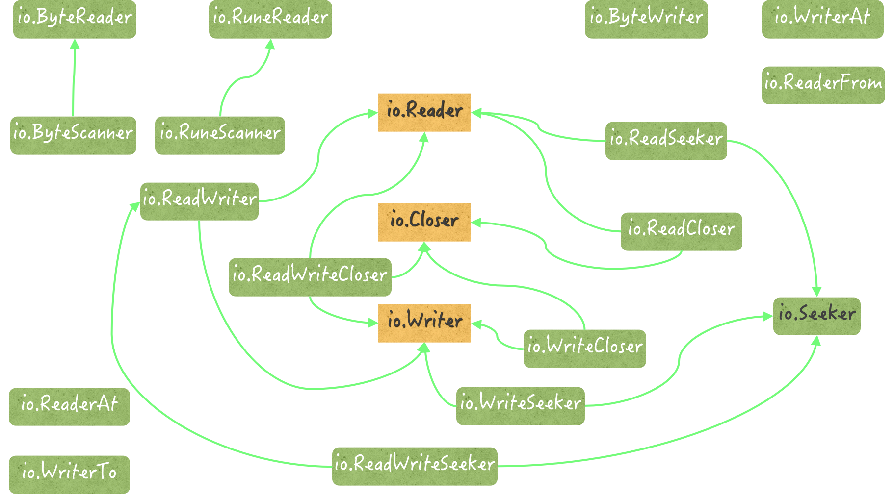

# unsafe

包含了一些打破 Go 语言“类型安全”的命令，一般的程序中不会被使用，可用在 C/C++ 程序的调用中。

`unsafe.Pointer` 类型也代表指针，可以表示任何指向可寻址（addressable）的值的指针。通过它，可以在指针值和 `uintptr` 这两种值之间进行转换。

`unsafe.Alignof` 返回相应类型的对齐系数，64 位是 8，32 位是 4。

`unsafe.Sizeof` 当前成员变量类型的长度。

[不可寻址的值](编程注意.md#不可寻址的值)

# io



在 io 包中，`io.Reader` 的扩展接口和实现类型都有哪些？它们分别都有什么功用？

- `io.ReadWriter`：既是`io.Reader`的扩展接口，也是`io.Writer`的扩展接口。该接口定义了一组行为，包含且仅包含了基本的字节序列读取方法`Read`，和字节序列写入方法`Write`。
- `io.ReadCloser`：除了包含基本的字节序列读取方法之外，还拥有一个基本的关闭方法`Close`。后者一般用于关闭数据读写的通路。这个接口其实是`io.Reader`接口和`io.Closer`接口的组合。
- `io.ReadWriteCloser`：`io.Reader`、`io.Writer`和`io.Closer`这三个接口的组合。
- `io.ReadSeeker`：有一个用于寻找读写位置的基本方法`Seek`，该方法可以根据给定的偏移量基于数据的起始位置、末尾位置，或者当前读写位置去寻找新的读写位置。这个新的读写位置用于表明下一次读或写时的起始索引。`Seek`是`io.Seeker`接口唯一拥有的方法。
- `io.ReadWriteSeeker`：`io.Reader`、`io.Writer`和`io.Seeker`的组合。

`io`包中的`io.Reader`接口的实现类型：

- `*io.LimitedReader`：此类型的基本类型会包装`io.Reader`类型的值，并提供一个额外的受限读取的功能。所谓的受限读取指的是，此类型的读取方法`Read`返回的总数据量会受到限制，无论该方法被调用多少次。这个限制由该类型的字段`N`指明，单位是字节。
- `*io.SectionReader`：此类型的基本类型可以包装`io.ReaderAt`类型的值，并且会限制它的`Read`方法，只能够读取原始数据中的某一个部分（或者说某一段）。
  这个数据段的起始位置和末尾位置，需要在它被初始化的时候就指明，并且之后无法变更。该类型值的行为与切片有些类似，它只会对外暴露在其窗口之中的那些数据。
- `*io.teeReader`：此类型是一个包级私有的数据类型，也是`io.TeeReader`函数结果值的实际类型。这个函数接受两个参数`r`和`w`，类型分别是`io.Reader`和`io.Writer`。
  其结果值的`Read`方法会把`r`中的数据经过作为方法参数的字节切片`p`写入到`w`。可以说，这个值就是`r`和`w`之间的数据桥梁，而那个参数`p`就是这座桥上的数据搬运者。
- `io.multiReader`：此类型也是一个包级私有的数据类型。类似的，`io`包中有一个名为`MultiReader`的函数，它可以接受若干个`io.Reader`类型的参数值，并返回一个实际类型为`io.multiReader`的结果值。
  当这个结果值的`Read`方法被调用时，它会顺序地从前面那些`io.Reader`类型的参数值中读取数据。因此，我们也可以称之为多对象读取器。
- `io.pipe`：此类型为一个包级私有的数据类型，它比上述类型都要复杂得多。它不但实现了`io.Reader`接口，而且还实现了`io.Writer`接口。
  实际上，`io.PipeReader`类型和`io.PipeWriter`类型拥有的所有指针方法都是以它为基础的。这些方法都只是代理了`io.pipe`类型值所拥有的某一个方法而已。
  又因为`io.Pipe`函数会返回这两个类型的指针值并分别把它们作为其生成的同步内存管道的两端，所以可以说，`*io.pipe`类型就是`io`包提供的同步内存管道的核心实现。
- `io.PipeReader`：此类型可以被视为`io.pipe`类型的代理类型。它代理了后者的一部分功能，并基于后者实现了`io.ReadCloser`接口。同时，它还定义了同步内存管道的读取端。

## 文件拷贝

- `io.Copy(dst Writer, src Reader) (written int64, err error)`

```go
func copy(src, dst string) error {
  // 获取 src 的信息
  srcInfo, _ := os.Stat(src)
  // 判断 src 是否是一个文件
  if !srcInfo.Mode().IsRegular() {
    return fmt.Errorf("%s is not a regular file", src)
  }
  source, _ := os.Open(src)
  defer source.Close()
  destination, _ := os.Create(dst)
  defer destination.Close()
  _, err := io.Copy(destination, source)
  return err
}
```

---

- `ReadFile(filename string) ([]byte, error)`
- `WriteFile(filename string, data []byte, perm os.FileMode) error`

```go
	data, _ := ioutil.ReadFile(src)
	err := ioutil.WriteFile(dst, data, os.ModePerm)
	if err != nil {
		fmt.Println("Creating file error", err)
	}
```

---

- `Read(b []byte) (n int, err error)`
- `Write(b []byte) (n int, err error)`

```go
func TestCopy(t *testing.T) {
	src, _ := os.Open("latex.pdf")
	dst, _ := os.Create("dst.pdf")
	defer src.Close()
	defer dst.Close()
	buf := make([]byte, 2*1024)
	for {
		_, err := src.Read(buf)
		if err == io.EOF{
			break
		}
		dst.Write(buf)
	}
}
```

# bytes

**面对的主要是字节和字节切片。**

## Buffer

实现了`io.Reader`、`io.ByteReader`、`io.RuneReader`、`io.ByteScanner`、`io.RuneScanner`、`io.WriterTo`、`io.Writer`、`io.ByteWriter`、`io.stringWriter`、`io.ReaderFrom` 、`fmt.Stringer`接口。

`bytes.Buffer` 主要用作字节序列的缓冲区。可以拼接、截断其中的字节序列，以各种形式导出其中的内容，还可以顺序地读取其中的子序列。

```go
type Buffer struct {
	buf      []byte // contents are the bytes buf[off : len(buf)]
	off      int    // 代表已读字节的计数
	lastRead readOp // last read operation, so that Unread* can work correctly.
}
```

```go
func TestBuffer(t *testing.T) {
	var byteBuf bytes.Buffer
	readBuf := make([]byte,2)
	byteBuf.WriteString("my favorite animation is clannad")
	t.Logf("未读的长度：%d\n", byteBuf.Len())
	t.Logf("容量：%d\n", byteBuf.Cap())
	byteBuf.Read(readBuf)
	t.Logf("读取 2 个字节后，未读的长度：%d\n", byteBuf.Len())
}
```

`bytes.Buffer` 并没有 `strings.Reader` 的 `Size()` 方法可以得到内容长度，所以复杂情况时很难估算出 `Buffer` 的已读计数。

**用于读回退的方法有 `UnreadByte` 和 `UnreadRune`。** 这两个方法分别用于回退一个字节和回退一个 Unicode 字符。调用它们一般都是为了退回在上一次被读取内容末尾的那个分隔符，或者为重新读取前一个字节或字符做准备。

退回的前提是，在调用它们之前的那一个操作必须是 “读取”，并且是成功的读取，否则这些方法就只能忽略后续操作并返回一个非`nil`的错误值。

`bytes.Buffer` 的已读计数 `off` 有什么用？

1. 读取内容时，相应方法会依据已读计数找到未读部分，并在读取后更新计数。
2. 写入内容时，如需扩容，相应方法会根据已读计数实现扩容策略。
3. 截断内容时，相应方法截掉的是已读计数代表索引之后的未读部分。
4. 读回退时，相应方法需要用已读计数记录回退点。
5. 重置内容时，相应方法会把已读计数置为 `0`。
6. 导出内容时，相应方法只会导出已读计数代表的索引之后的未读部分。
7. 获取长度时，相应方法会依据已读计数和内容容器的长度，计算未读部分的长度并返回

`bytes.Buffer` 的扩容策略：先判断底层字节切片的剩余容量是否足够容纳新的内容，如果可以，会在当前的字节切片上进行长度扩充；否则，可能会用新的字节切片（仅向其中拷贝了原来未读的内容）替代原有的字节切片，off 重置为 0，从而实现扩容。

注意：如果当前字节切片的容量的一半 >= 现有字节切片长度 + 需要的字节数，则会复用现有的字节切片，并把切片中未读部分的内容拷贝到头部位置，同时 off 重置为 0。

如果用新的字节切片替代原有的切片，新容量 = 2 \* 原容量 + 所需字节数。

对于零值的 `bytes.Buffer` 而言，如果第一次扩容时所需的字节数 <= 64，则会基于一个预先定义好的、长度为 64 的字节数组来创建 `bytes.Buffer` 的底层切片。
