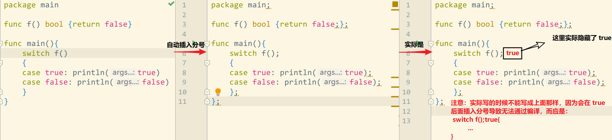

# Go 中的分号

Go 语言中分号自动插入的规则：

- 注释除外，如果一个代码行的最后一个语法词段(token)为下列所示之一，则 Lexer 会在该字段后(即行尾)自动插入一个分号：
  - 一个标识符，如`int`、`float64`
  - 一个整数、浮点数、虚部、码点或字符串字面表示形式
  - 跳转关键字：`break`、`continue`、`fallthrough`、`return`
  - `++` 或 `--`
  - 一个右括号：`)`、`}`、`]`
- 为了允许一条复杂语句完全显示在一个代码行中，分号可能被插入在一个 `)` 或 `}` 之前



为防止 IDE 自动格式化代码，在记事本中输入左侧代码后直接运行，输出：true。

左侧的代码在编译之前会自动插入一些分号得到中间那样的代码，而由于标准的 switch 语句格式是：

```go
// CompareOperand0 可以被省略，如果被省略，则 CompareOperand0 默认为 true
switch InitSimpleStatement; CompareOperand0{
  case CompareOperandList1:
    // todo something
  case CompareOperandList2:
    // todo something
  ...
  default:
    // todo something
}
```

最终等价于右侧的代码(仅用于说明)，故输出为 true。当然，如果是在 IDE 中编辑代码时不会遇到这一情况，因为会自动格式化代码，将 `{` 放到上一行的末尾。


# 变量或常量的使用

- 位移操作中，类型推断的结果因是否为变量或常量而异：

```go
func main(){
  var n uint = 10
  const N uint = 10
  // 位移操作中，
  // 目标类型 x 是 byte 类型，n 为变量，1 会被认为和目标类型相同
  var x byte = (1<<n) / 100  // 1 被推断为 byte，从而溢出
  // N 是常量，1 被认为是类型不确定的整数
  var y byte = (1<<N) / 100  // 1 被认为时类型不确定整数
  println(x, y)   // 0, 10
}
```

- 编译行为因是否为变量或常量而异：

这里也是由于上面的类型推断导致的。

```go
	const N = 2
  var m = 2
  
	// 编译均没问题
	var _ float64 = 1 << N
  var _ = float64(1 << N)
  
	// 1 被推断为 float64 类型
	// 均编译失败：浮点数不可被移位
	var _ float64 = 1 << m
	var _ = float64(1 << m)
```


# *rintf() 支持位置参数

包括 `Sprintf()`、`Fprintf()`、`Printf()` 都支持位置参数

```go
// 输出：coco
fmt.Printf("%[2]v%[1]v%[2]v%[1]v","o","c")
```