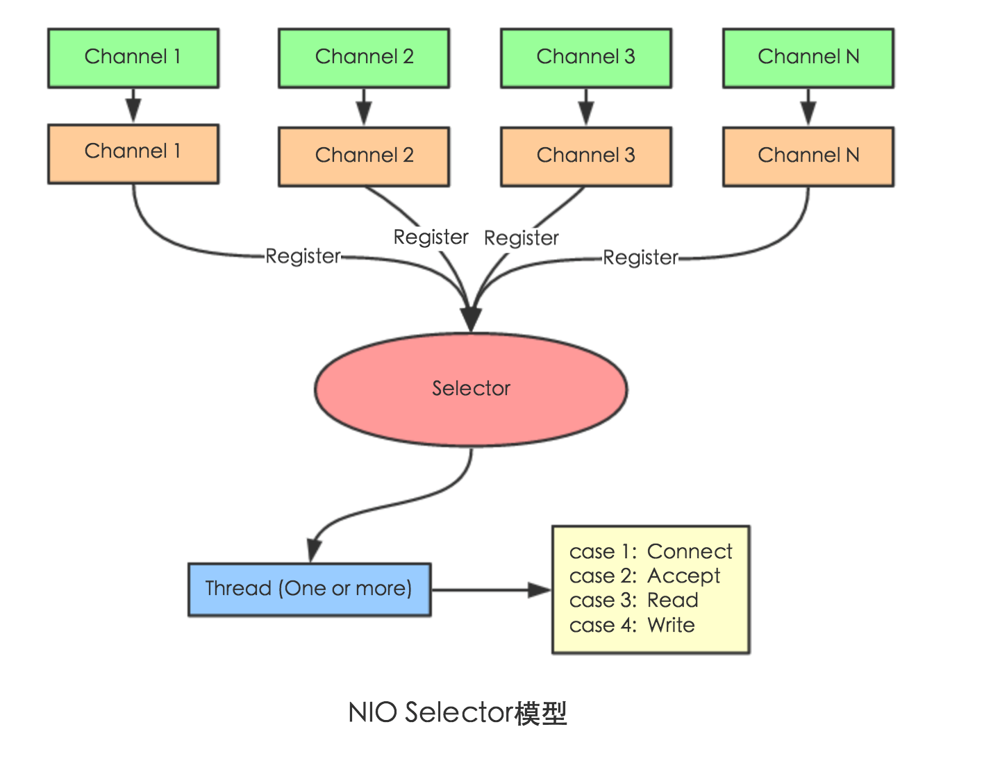

传统的 IO 流都是阻塞式的，即当一个线程调用`read()`或`write()`时，该线程会被阻塞，直到读取到或写入数据，而该线程在此期间无法执行其他任务。所以，网络通信进行 IO 操作时，由于线程会阻塞，服务器必须为每个客户端都提供一个单独的线程，当处理大量客户端时，性能也就急剧下降。

而 java NIO 是非阻塞式的。当线程从通道进行读写操作时，若没有数据可用，该线程可进行其他任务（通常会在其他通道执行 IO 操作，所以一个线程可以管理多个输入输出通道）。所以，NIO 可以让服务端使用有限个线程来处理所有连接到服务端的客户端。

- 使用NIO完成网络通信的三个核心： 
  - 通道Channel：负责连接 。
    - `java.nio.channels.Channel`接口：
      - `SelectableChannel`抽象类
        - `SocketChannel`
        - `ServerSocketChannel`
        - `DatagramChannel`
        - `Pipe.SinkChannel`
        - `Pipe.SourceChannel`
  - 缓冲区Buffer：负责数据的存取。
  - 选择器Selector：是`SelectableChannel`的多路复用器。用于监控`SelectableChannel`的 IO 状况。 

# SocketChannel

`SocketChannel`是一个连接到TCP网络套接字的通道。

- 创建方式：

  - 方式一：打开一个`SocketChannel`并连接到互联网上的某台服务器。

    ```java
    SocketChannel socketChannel = SocketChannel.open();
    socketChannel.connect(new InetSocketAddress("127.0.0.1", 9898));
    //也可以写成
    SocketChannel sChannel = SocketChannel.open(new InetSocketAddress("127.0.0.1", 9898));
    ```

  - 方式二：一个新连接到达`ServerSocketChannel`时，会创建一个`SocketChannel`。

    ```java
    SocketChannel sChannel = serverSocketChannel.accept();
    ```

- 读写数据：

  ```java
  ByteBuffer buf = ByteBuffer.allocate(48);
  int len = socketChannel.read(buf);
  ```

  ```java
  String newData = "New String to write to file..." + System.currentTimeMillis();
  ByteBuffer buf = ByteBuffer.allocate(48);
  buf.clear();
  buf.put(newData.getBytes());
  
  buf.flip();
  while(buf.hasRemaining()) {
      channel.write(buf);
  }
  //注意SocketChannel.write()方法的调用是在一个while循环中的。Write()方法无法保证能写多少字节到SocketChannel。所以，我们重复调用write()直到Buffer没有要写的字节为止。
  ```

- 非阻塞模式

  - 可以设置 `SocketChannel` 为非阻塞模式（non-blocking mode）。设置之后，就可以在异步模式下调用`connect()`,` read()` 和`write()`了。 

  - 该模式下调用`connect()`方法，该方法可能在连接建立之前就返回了。为了确定连接是否建立，可以调用`finishConnect()`的方法。 

    ```java
    socketChannel.configureBlocking(false);
    socketChannel.connect(new InetSocketAddress("127.0.0.1", 9898));
    while(! socketChannel.finishConnect() ){
        //wait, or do something else...
    }
    ```

  - 该模式下调用`write()`，`write()`在尚未写出任何内容时可能就返回了。所以需要在循环中调用`write()`。 例子见前。

  - 该模式下调用`read()`，`read()`在尚未读取到任何数据时可能就返回了。所以需要关注它的int返回值，它会告诉你读取了多少字节。 


# ServerSocketChannel

`ServerSocketChannel`是一个可以监听新进来的TCP连接的通道。

- 创建方式：

  ```java
  ServerSocketChannel ssChannel = ServerSocketChannel.open();
  ```

- `accept()`方法监听新进来的连接，并返回`SocketChannel`对象。

- 非阻塞模式

  - 在非阻塞模式下，`accept()` 方法会立刻返回，如果还没有新进来的连接,返回的将是`null`。 


# DatagramChannel

`DatagramChannel`是一个能收发UDP包的通道。因为UDP是无连接的网络协议，所以不能像其它通道那样读取和写入。它发送和接收的是数据包。 

- 创建方式：

  ```java
  DatagramChannel channel = DatagramChannel.open();
  channel.socket().bind(new InetSocketAddress(9898)); 
  ```

- 收发数据：

  ```java
  ByteBuffer buf = ByteBuffer.allocate(48);
  buf.clear();
  channel.receive(buf);
  //receive()方法会将接收到的数据包内容复制到指定的Buffer. 如果Buffer容不下收到的数据，多出的数据将被丢弃。
  ```

  ```java
  String newData = "New String to write to file..." + System.currentTimeMillis();
  ByteBuffer buf = ByteBuffer.allocate(48);
  buf.clear();
  buf.put(newData.getBytes());
  buf.flip();
  int bytesSent = channel.send(buf, new InetSocketAddress("jenkov.com", 80));
  //发送一串字符到”jenkov.com”服务器的UDP端口80。 因为服务端并没有监控这个端口，所以什么也不会发生。也不会通知你发出的数据包是否已收到，因为UDP在数据传送方面没有任何保证。
  ```

- 连接特定地址：

  - 可以将`DatagramChannel`“连接”到网络中的特定地址的。由于UDP是无连接的，连接到特定地址并不会像TCP通道那样创建一个真正的连接。而是锁住`DatagramChannel` ，让其只能从特定地址收发数据。 

    ```java
    channel.connect(new InetSocketAddress("jenkov.com", 80));
    //连接后，也可以使用read()和write()方法，就像在用传统的通道一样。只是在数据传送方面没有任何保证。
    int bytesRead = channel.read(buf);
    int bytesWritten = channel.write(but);
    ```


# 选择器（Selector）



Connect（连接就绪）、Accept（接受就绪）、Read（读就绪）、Write（写就绪）。


- 选择器是 `SelectableChannel`对象的多路复用器，`Selector` 可以同时监控多个 `SelectableChannel`的 IO 状况，从而仅使用单线程管理多个 `Channel`。如果应用打开多个链接（通道），但每个链接的流量都很低，使用`Selector`会很方便。

- 服务端：

  - 1.获取通道

    ```java
    ServerSocketChannel ssChannel = ServerSocketChannel.open();
    ```

  - 2.切换成非阻塞模式（与`Selector`一起使用时，`Channel`必须是非阻塞模式下的。也就是说`FileChannel`不能和`Selector`一起使用，因为它无法切换非阻塞模式）

    ```java
    ssChannel.configureBlocking(false);
    ```

  - 3.绑定连接

    ```java
    ssChannel.bind(new InetSocketAddress(9898));
    ```

  - 4.获取（创建）选择器

    ```java
    Selector selector = Selector.open();
    ```

  - 5.将通道注册到选择器上，第二个参数是一个“interest”集合，即说明`Selector`对什么事件感兴趣，用于来指定“监听事件”。可以监听的事件类型：

    |                       事件                        |           常量            |
    | :-----------------------------------------------: | :-----------------------: |
    |              读（有数据可读的通道）               |  `SelectionKey.OP_READ`   |
    |              写（等待写数据的通道）               |  `SelectionKey.OP_WRITE`  |
    | 连接（serverSocketChannel准备好接收新进入的连接） | `SelectionKey.OP_CONNECT` |
    |        接收（一个Channel成功连接到服务器）        | `SelectionKey.OP_ACCEPT`  |

    ```java
    SelectionKey key = ssChannel.register(selector, SelectionKey.OP_ACCEPT); 
    //如果对多个事件感兴趣，可以用 | 操作符将常量连接起来
    //返回的SelectionKey对象中包含很多属性
    ```

  - 6.轮询式的获取选择器上已经“准备就绪”的事件 

    ```java
    while(selector.select() > 0) {
      //获取当前选择器中所有注册的选择键（已经“准备就绪”的事件）
      Iterator<SelectionKey> it = selector.selectedKeys().iterator();
      //迭代获取
      while(it.hasNext()) {
        //获取准备就绪的事件
        SelectionKey sk = it.next();
        if(key.isAcceptable()) {
          // a connection was accepted by a ServerSocketChannel.
        } else if (key.isConnectable()) {
          // a connection was established with a remote server.
        } else if (key.isReadable()) {
          // a channel is ready for reading
        } else if (key.isWritable()) {
          // a channel is ready for writing
        }
        it.remove();//每次迭代末尾的remove()调用。Selector不会自己从已选择键集中移除SelectionKey实例。必须在处理完通道时自己移除。下次该通道变成就绪时，Selector会再次将其放入已选择键集中。
      }
    
    ```

    如：

    ```java
    while(selector.select() > 0) {
      Iterator<SelectionKey> it = selector.selectedKeys().iterator();
      while(it.hasNext()) {
        SelectionKey sk = it.next();
        //判断具体是什么事件准备就绪
        if(sk.isAcceptable()) {
          //若 “接受就绪”，获取客户端连接
          SocketChannel sChannel = ssChannel.accept();
    
          //切换到非阻塞模式
          sChannel.configureBlocking(false);
    
          //将该通道注册到选择器上
          sChannel.register(selector, SelectionKey.OP_READ);
        }else if(sk.isReadable()) {
          //若 “读就绪”，获取当前选择器上“读就绪”状态的通道
          SocketChannel sChannel = (SocketChannel) sk.channel();
          //读取数据
          ByteBuffer buf = ByteBuffer.allocate(1024);
    
          int len = 0;
          while((len = sChannel.read(buf)) > 0) {
            buf.flip();
            System.out.println(new String(buf.array(),0,len));
            buf.clear();
          }
        }
        //取消选择键SelectionKey
        it.remove();
      }
    }
    ```

  - 7.关闭通道

- 客户端

  ```java
  @Test
  public void client() throws IOException {
    // 1.获取通道
    SocketChannel sChannel = SocketChannel.open(new InetSocketAddress("127.0.0.1", 9898));
  
    //切换成非阻塞模式
    sChannel.configureBlocking(false);
  
    // 2.分配指定大小的缓冲区
    ByteBuffer buf = ByteBuffer.allocate(1024);
    // 3.发送到服务端
    Scanner sc = new Scanner(System.in);
  
    while(sc.hasNext()) {
      String str = sc.next();
      buf.put((new Data().toString() + "\n" + str).getBytes());
      buf.flip();
      sChannel.write(buf);
      buf.clear();
    }
  
    // 4.关闭通道
    sc.close();
    sChannel.close();
  }
  ```


# 通道Pipe

Java NIO 管道是2个线程之间的单向数据连接。`Pipe`有一个`source`通道和一个`sink`通道。数据会被写到`sink`通道，从`source`通道读取。 


使用见下面的例子：

```java
@Test
public void test1() throws IOException{
  //1. 获取管道
  Pipe pipe = Pipe.open();

  //2. 将缓冲区中的数据写入管道
  ByteBuffer buf = ByteBuffer.allocate(1024);

  Pipe.SinkChannel sinkChannel = pipe.sink();
  buf.put("通过单向管道发送数据".getBytes());
  buf.flip();
  sinkChannel.write(buf);

  //3. 读取缓冲区中的数据
  Pipe.SourceChannel sourceChannel = pipe.source();
  buf.flip();
  int len = sourceChannel.read(buf);
  System.out.println(new String(buf.array(), 0, len));

  sourceChannel.close();
  sinkChannel.close();
}
```

