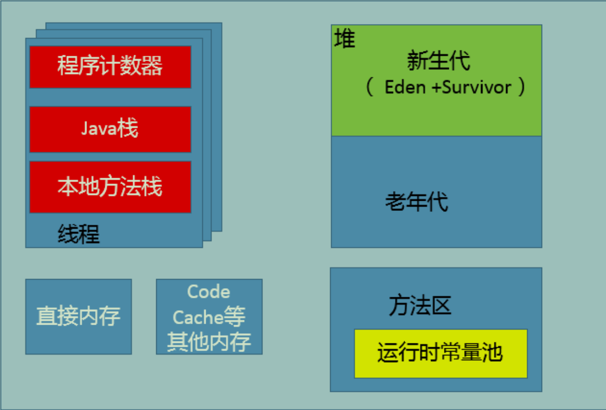
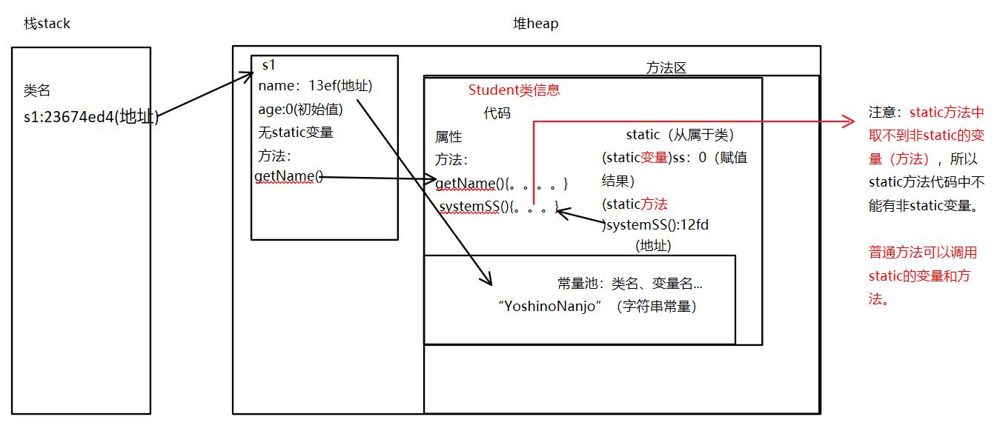
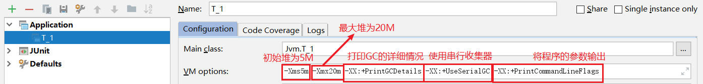

# 1.基础知识

JVM的Server模式和Client模式，使用`-Client`和`-Server`参数可以进行设置，如果没有设置虚拟机会根据当前计算机系统环境自动选择运行模式。可以使用`java -version`查看当前系统中JVM的运行模式。

与client模式相比，server模式的启动比较慢，因为server模式会尝试收集更多的系统性能信息，使用更复杂的优化算法对程序进行优化。因此当系统完全启动并进入运行稳定期后，server模式的执行速度会远远快于client模式，所以在对于后台长期运行的系统，使用-server参数启动对系统的整体性能可以有不小的帮助，但对于用户界面程序，运行时间不长，又追求启动速度建议使用-client模式启动。


## 1.1 内存区域



JVM 所管理的内存分为以下几个区域：

- 程序计数器（Program Counter Register）
  - 线程私有区域。
  - 如果线程正在执行的是一个 Java 方法，该计数器记录的是正在执行的虚拟机字节码指令的地址；如果正在执行的是 Native 方法，该计数器则为空（Undefined）。
  - 该内存区域是唯一一个在Java虚拟机规范中没有规定任何`OutOfMemoryError`情况的区域。
- Java 虚拟机栈
  - 线程私有区域。
  - 描述的是 Java 方法执行的内存模型：每个方法在执行的同时创建一个栈帧（Stack Frame）用于存储局部变量表、操作数栈、动态链接、方法出口等信息。
    - 局部变量表所需内存空间在编译器完成分配，当进入一个方法时，该方法需要在帧中分配多大的局部变量空间是完全确定的，在方法运行期间不会改变。
  - 如果线程请求的栈深度大于虚拟机允许的深度(如：不断进行递归调用且没有退出条件)，会抛出`StackOverflowError`异常；
  - 如果虚拟机栈可以动态扩展，且扩展时无法申请到足够的内存，会抛出`OutOfMemoryError`异常。
- 本地方法栈
  - 线程私有区域，
  - 也会抛出`StackOverflowError`和`OutOfMemoryError`异常。
- Java 堆
  - **线程共享区域**。
  - 是一个不连续的内存空间
  - 所有的对象实例及数组都在堆上分配(JDK 1.8后永久代被元数据区取代，Intern 字符串缓存和静态变量并不是被转移到元数据区，而是直接在堆上分配)。
  - 是垃圾收集器管理的主要区域。
  - 从内存回收角度看，先在收集器基本都采用分代收集算法，所以 Java 堆可细分为：新生代（Eden 空间、From Survior 空间、To Survior 空间）和老年代。
  - 从内存分配角度看，线程共享的 Java 堆可能划分出多个线程私有的分配缓冲区（Thread Local Allocation Buffer，TLAB）。
  - 如果在堆中没有内存分配实例，且堆无法再扩展，会抛出`OutOfMemoryError`异常。
- PermGeneration（永久代，JDK1.8以后被移除，增加了 Metaspace 元空间 ）
  - **线程共享区域**。
  - 永久代和元空间，都是对JVM规范中方法区的实现，不过元空间和永久代的区别在于：元空间不在虚拟机内存中，而是使用本地内存
  - 存储已被虚拟机加载的类信息、常量、静态变量、即时编译器编译后的代码等数据。
  - 当方法区无法满足内存分配需求时，会抛出`OutOfMemoryError`异常。
  - 问题：
    1. 字符串存在永久代中，容易出现性能问题和内存溢出。 
    2. 类及方法的信息等比较难确定其大小，因此对于永久代的大小指定比较困难，太小容易出现永久代溢出，太大则容易导致老年代溢出 。
    3. 永久代会为 GC 带来不必要的复杂度，并且回收效率偏低。 
- 直接内存
  - java 的 NIO 库允许 Java 程序使用直接内存，从而提高性能，通常直接内存速度会优于 Java 堆。读写频繁的场合可能会考虑使用。 
  - 也会抛出 `OutOfMemoryError` 异常。


- 联系：
  - 堆解决的是数据存储的问题，即数据怎么放、放在哪儿；
  - 栈解决程序的运行问题。即程序如何执行、或者说如何处理数据；
  - 方法区则是辅助堆栈的永久区（Perm），解决堆栈信息的产生，是先决条件。 

图示：




# 2.垃圾收集器

## 2.1 谁“死”了？

垃圾收集器在对堆内存进行回收前，首先要判断哪些对象还“存活着”，哪些对象已经“死”（不可能再被任何途径使用）了。

- 引用计数法（Reference Counting）
  - 给对象中添加一个引用计数器，每当有被引用一次，计数器值加一，当引用失效时，计数器值减一。任何时刻计数器值为 0 的对象就是不可能再被使用的。
  - 优点：实现简单，判定效率高。
  - 缺点：很难解决对象之间循环引用的问题。
- **可达性分析算法**（Reachability Analysis）
  - 以一系列被称为“GC　Roots"的对象作为起始点，从这些点开始向下搜索，搜索所走过的路径称为引用链（Reference Chain），当一个对象到 GC Roots 没有任何引用链项链时，说明该对象是不可用的。
  - 可作为 GC Roots 的对象：
    - 虚拟机栈（栈帧中的本地变量表）中引用的对象；
    - 方法区中类静态属性引用的对象；
    - 方法区中常量引用的对象；
    - 本地方法栈中 JNI（即一般说的 Native 方法）引用的对象
  - 注意：进行可达性分析时需要让整个系统冻结在某个时间点上，对外表现为所有工作进程都停止下来。是为了让可达性分析算法准确获取到GC Roots节点。 


### 引用分类

在 JDK1.2 后，Java 对引用的概念进行了扩充，将引用分为：强引用（`StrongReference`） 、软引用（`SoftReference`） 、弱引用（`WeakReference`） 、虚引用（`PhantomReference`，也叫幻象引用） 。这四种引用强度依次减弱。

- 强引用（`StrongReference`）：引用指向对象，GC运行时不回收 
  - 如果想中断强引用和某个对象之间的关联，可以显式地将引用赋值为`null`，这样一来的话，JVM在合适的时间就会回收该对象。比如`Vector`类的`clear()`方法中就是通过将引用赋值为`null`来实现清理工作的。
- 软引用（`SoftReference`）：GC运行时可能回收（jvm内存不够） 
  - 适合实现缓存，如网页缓存、图片缓存等。
- 弱引用（`WeakReference`）：GC运行时立即回收（无论内存是否足够）
- 虚引用（`PhantomReference`）：类似于无引用，主要跟踪对象被回收的状态，不能单独使用，必须与引用队列（`ReferenceQueue`）联合使用。 
  - 当垃圾回收器准备回收一个对象时，如果发现它还有虚引用，就会把这个虚引用加入到与之 关联的引用队列中。程序可以通过判断引用队列中是否已经加入了虚引用，来了解被引用的对象是否将要被垃圾回收。如果程序发现某个虚引用已经被加入到引用队列，那么就可以在所引用的对象的内存被回收之前采取必要的行动。 

 

## 2.3 谁回收？

HotSpot虚拟机的垃圾收集器：


两个垃圾收集器之间存在连线，则他们可以搭配使用。


### Serial 收集器

- Serial 收集器
  - 算法：复制算法
  - 作用区域：新生代
  - 单线程收集器
    - 只会使用一个 CPU 或一条收集线程去完成垃圾收集工作；
    - 在进行垃圾收集时，必须暂停其他所有的工作线程（即Stop The World），直到它收集结束。注意：是在用户不可见的情况下把用户正常工作的线程全部停掉的。
  - 简单高效（与其他收集器的单线程相比）
  - 虚拟机运行在 Client 模式下的默认新生代收集器。


### ParNew 收集器

- ParNew 收集器
  - 算法：复制算法
  - 作用区域：新生代
  - 实际上就是 Serial 收集器的多线程版本
  - 是使用`-XX:+UseConcMarkSweepGC`选项后的默认新生代收集器，也可以使用`-XX:+UseParNewGC`选项来强制指定。
  - 默认开启的收集线程数与CPU数量相等，可以使用`-XX:ParallelGCThreads`参数限制垃圾收集的线程数。
  - 虚拟机运行在 Server 模式下首选的新生代收集器，其中一个与性能无关但很重要的原因是，除了Serial收集器外，目前只有它能与CMS（Concurrent Mark Sweep）收集器配合工作。


### Parallel Scavenge 收集器

- Parallel Scavenge 收集器（“吞吐量优先”收集器）
  - 算法：复制算法
  - 作用区域：新生代
  - 并行的多线程收集器
  - 与ParNew收集器的不同：Parallel Scavenge 收集器的目标是达到一个可控制的吞吐量。
    - 吞吐量（Throughout）：CPU用于运行用户代码的时间与CPU总消耗时间的比值，即吞吐量=运行用户代码时间 / (运行用户代码时间+垃圾收集时间)；
    - 其他收集器的关注点是尽可能地缩短垃圾收集时用户线程停顿的时间；
    - 停顿时间越短越适合需要与用户交互的程序；而高吞吐量可以高效率地利用CPU时间，尽快完成程序地运算任务，适合在后台运算而不需要太多交互地任务。
  - `-XX:MaxGCPauseMillis`参数控制最大垃圾收集停顿时间。
    - 设置一个大于0的毫秒数，收集器尽可能保证内存回收花费时间不超过设定值。
    - 是以牺牲吞吐量和新生代空间来换取的：系统把新生代调小一些，300M新生代当然比500M收集快，但也导致了垃圾收集发生的频繁一些，虽然停顿时间下降了，但吞吐量也降低了。
  - `-XX:GCTimeRatio`参数直接设置吞吐量大小。
    - 设置一个大于0且小于100的整数，也就是垃圾收集时间占总时间的比率，相当于吞吐量的倒数。
  - `-XX:+UseAdaptiveSizePolicy`参数
    - 打开该参数后，不用手动指定新生代大小(`-Xmn`)、Eden与Survivor区的比例(`-XX:SurvivorRatio`)、晋升老年代对象大小(`-XX:PretenureSizeThreshold`)等细节参数，虚拟机会动态调整这些参数来提供合适的停顿时间或最大的吞吐量。
    - 这种方式称为：GC自适应的调节策略(GC Ergonomics)。


### Serial Old 收集器

- Serial Old 收集器
  - 算法：标记-整理算法
  - 作用区域：老年代
  - 单线程收集器
  - 主要用于给Client模式下的虚拟机使用
  - 在Server模式下，主要用于：在JDK1.5及之前版本中与Parallel Scavenge收集器搭配使用；作为CMS收集器的后备预案，在并发收集发生Concurrent Mode Failure时使用。


### Parallel Old 收集器

- Parallel Old 收集器
  - 算法：标记-整理算法
  - 作用区域：老年代
  - 并行的多线程收集器
  - 在注重吞吐量及CPU资源敏感的场合，都可以优先考虑 Parallel Scavenge 加上 Parallel Old 收集器


### CMS 收集器

- CMS (Concurrent Mark Sweep) 收集器
  - 算法：标记-清除算法
  - 作用区域：老年代
  - 以获取最短回收停顿时间为目标的收集器。
  - 运作步骤：
    1. 初始标记（CMS initial mark）：标记GC Roots能直接关联的对象，很快；
    2. 并发标记（CMS concurrent mark）：进行GC Roots Tracing
    3. 重新标记（CMS remark）：修正并发标记期间因用户程序继续运作而导致标记产生变动的对象的标记记录；
    4. 并发清除（CMS concurrent sweep）
  - 其中，初始标记、重新标记仍会“Stop The World”。
  - 总体而言，CMS收集器的内存回收过程是与用户线程一起并发执行的。
  - 缺点：
    - 吞吐量低 ：由于CMS在垃圾收集过程使用用户线程和GC线程并行执行，从而线程切换会有额外开销，因此CPU吞吐量就不如在垃圾收集过程中停止一切用户线程的方式来的高。
    - 无法处理浮动垃圾（Floating Garbage），可能出现“Concurrent Mode Failure”而发生Full GC 
      - 由于垃圾清除过程中，用户线程和GC线程并发执行，也就是用户线程仍在执行，那么在执行过程中会产生垃圾，这些垃圾称为“浮动垃圾”。 
      - 如果CMS在垃圾清理过程中，用户线程需要在老年代中分配内存时发现空间不足时，就需要再次发起Full GC，而此时CMS正在进行清除工作，因此此时只能由Serial Old临时对老年代进行一次Full GC。
    - 基于标记-清除算法而导致收集结束后出现大量空间碎片，解决方法：
      - 开启`-XX:+UseCMSCompactAtFullCollection `参数，每次Full GC完成后都会进行一次内存压缩整理，但停顿时间不得不变长，所以提供了另一个参数：
      - `-XX:CMSFullGCsBeforeCompaction `参数用于设置执行多少次不压缩的Full GC 后，再执行一次带压缩的。该参数默认值为0，表示每次进入Full GC都进行碎片整理。


### G1 收集器

G1 (Garbage-First) 收集器：不需要其他收集器配合就能独立管理整个GC堆。

- 特点：
  - 并发与并行：使用多个CPU来缩短“Stop The World”停顿的时间，通过并发的方式让Java程序和GC一起执行；
  - 分代收集；
  - 空间整合：从整体看，G1收集器是基于“标记-整理”算法实现的，从局部看，G1收集器是基于“复制”算法实现的，也就意味着G1运作期间不会产生内存碎片；
  - 可预测的停顿：低停顿，可以建立可预测的停顿时间模型，让使用者明确指定在一个长度为M毫秒的时间片段内，垃圾收集的时间不超过N毫秒。

- 内存布局
  - 使用G1收集器时，Java堆会被划分为多个大小相等的独立区域（Region），虽然还保留新生代、老年代的概念，但新生代和老年代不再是物理隔离的，而都是一部分Region（不需要连续）的集合。

G1收集器之所以能建立可预测的停顿时间模型，是因为它可以有计划地避免在整个Java堆中进行全区域地垃圾收集。G1跟踪各个Region中地垃圾堆积的价值（回收所获得的空间大小、回收所需时间），在后台维护一个优先列表，每次根据允许的收集时间，优先回收价值最大的Region。这也是 Garbage-First 名称的由来。

- Remembered Set
  - 问题：Region不可能是孤立的，如果在其他Region中引用了当前Region中的对象，那么在做可达性分析时，岂不是还要扫描整个Java堆？
  - 解决方案：虚拟机使用Remembered Set来避免全堆扫描。G1中每个Region都有一个与之对应的Remembered Set，用来记录在其他Region对本Region中对象的相关引用信息。在进行内存回收时，在GC Roots根节点的枚举范围内加入Remembered Set即可保证不对全堆扫描也不会遗漏。
- 运作步骤：
  1. 初始标记（Initial Marking）：标记GC Roots能直接关联的对象，并修改TAMS（next Top At Mark Start）的值，让下一阶段用户程序并发运行时，能在正确的Region中创建新对象。需要停顿线程，但耗时很短；
  2. 并发标记（Concurrent Marking）：对堆中对象进行可达性分析，耗时较长，但可与用户程序并发执行；
  3. 最终标记（Final Marking）：修正并发标记期间因用户程序继续运作而导致标记产生变动的对象的标记记录，虚拟机将这段时间对象变化记录在Remembered Set中，需要停顿线程，但可并发执行；
  4. 筛选回收（Live Data Counting and Evacuation）：对各个Region的回收价值和成本进行排序，根据用户期望的GC停顿时间制定回收计划。


# 3.虚拟机参数

## 3.1 常用

`-XX` 表示系统级别（jvm）的配置

`+`表示 启用 

`-`表示 禁用 

- GC优化配置

| 配置                | 描述                 |
| ------------------- | -------------------- |
| `-Xms `             | 设置初始化堆内存大小 |
| ` -Xmx`             | 设置堆内存最大值     |
| ` -Xmn `            | 设置新生代大小       |
| `-XX：PermSize `    | 设置初始化永久代大小 |
| `-XX：MaxPermSize ` | 设置永久代最大容量   |

- GC类型设置（垃圾收集器内容见后）

| 配置                      | 描述                                                         |
| ------------------------- | ------------------------------------------------------------ |
| ` -XX:+UseSerialGC `      | Client模式下的默认值，开启串行收集器组合：Serial + Serial Old |
| ` -XX:+UseParallelGC `    | Server模式下的默认值，开启收集器组合：Parallel Scavenge + Serial Old |
| `-XX:+UseConcMarkSweepGC` | 开启并发标记清除收集器组合：ParNew + CMS + Serial Old        |
| `-XX:ParallelCMSThreads ` | 设值并行GC时内存回收的线程数                                 |
| `-XX:UseParallelOldGC`    | 开启收集器组合：Parallel Scavenge + Parallel Old             |
| `-XX:+UseG1GC `           | G1收集器                                                     |
| `-XX:+UseParNewGC`        | ParNew+Serial Old，在JDK1.8被废弃，在JDK1.7还可以使用        |

如何使用？

如果是在命令行下运行程序的话，将虚拟机参数直接跟在`java Xxx`后面，如：`java Test -Xmx12m`。如果是借助 IDEA 来运行的话，在 配置编辑（Edit configurations）中选中对应的应用程序，然后在 VM options 中填写虚拟机参数。多个参数之间使用空格分隔。


## 3.2 GC日志阅读

下面列出了一个使用 Serial+Serial Old 收集器组合打印出的GC日志（这里为了方便查看，手动进行了换行）：

```java
[GC (Allocation Failure)
 [DefNew: 1564K->61K(1856K), 0.0018035 secs]
 [Tenured: 1695K->1756K(4096K), 0.0022827 secs] 2044K->1756K(5952K), 
 [Metaspace: 3443K->3443K(1056768K)], 0.0044346 secs] 
[Times: user=0.00 sys=0.00, real=0.00 secs] 
```

- `GC`说明了发生的是Minor GC，同时也说明了这次垃圾收集的停顿类型，如果是`Full GC`，有“Full”说明这次GC发生了Stop The World；
- `Allocation Failure`是引起GC的原因，本次GC是由于新生代没有足够的空间来进行分配；
- `DefNew`、`Tenured`、`Metaspace`表示GC发生的区域。这里显式的区域名与使用GC收集器相关
  - Serial收集器中，新生代为Default New Generation，所以显示为`DefNew`
  - ParNew收集器中，新生代为Parallel New Generation，显示为`ParNew`
  - Parallel Scavenge收集器中，新生代显示为`PSYoungGen`
- GC发生区域后面的`1564K->61K(1856K)`含义为：GC前该内存区域已使用容量 -> GC后该内存区域已使用容量(该内存区域总容量)
- 再后面的`0.0018035 secs`表示该内存区域GC所占去的时间，单位为秒
- `[]`外面的`2044K->1756K(5952K)`表示：GC前Java堆已使用容量 -> GC后Java堆已使用容量(Java堆总容量)
- `[Times:...]`中是具体时间，`user`是用户态消耗的CPU时间、`sys`是内核消耗的CPU时间、`real`是操作从开始到结束所经过的Wall Clock Time（这一时间与CPU时间的区别：Wall Clock Time包含各种非运算的等待耗时，如等待磁盘I/O、等待线程阻塞。系统多CPU或多核时，多线程操作会叠加这些CPU时间，所以`user`或`sys`会查过`real`）


## 3.3 堆上的参数

常用参数：

- `-Xms`：设置Java程序启动时初始堆大小 
- `-Xmx`：设置Java程序能获得的最大堆大小 
- `-XX:+PrintGC` 使用这个参数，虚拟机启动后，只要遇到GC就会打印日志。
- `-XX:+UseSerialGC` 配置Serial+Serial Old收集器
- `-XX:+PrintGCDetails` 发生GC行为时打印回收内存日志，并在进程退出时输出当前内存各区域分配情况
- `-XX:PrintCommandLineFlags`可以将传给虚拟机的参数输出，无论这个参数时显式或隐式传给虚拟机的。 

总结：**实际工作中可以直接将初始堆大小和最大堆大小设置相等，这样可以减少程序运行时的垃圾回收次数，从而提高性能**。 

新生代的配置：

- `-Xmn`：可以设置新生代的大小，设置一个比较大的新生代回减少老年代的大小，这个参数对系统性能及GC行为有很大影响，新生代大小一般会设置整个堆空间的１/3到1/4左右。
- `-XX:SurvivorRatio`：用来设置新生代中 Eden 空间和 from 或 to 空间的比例。含义：SurvivorRatio=eden/from=eden/to 

总结：**不同的堆分布情况会对系统执行产生一定影响，在实际工作中，应根据系统特点做出合理的配置，基本策略：尽可能将对象预留在新生代，减少老年代的GC次数**； 

**除了可以设置新生代的绝对大小（--Xmn），还可以使用（-XX:NewRatio）设置新生代和老年代的比例：-XX:NewRatio=老年代/新生代**。

堆溢出处理：

 如果堆空间不足，会抛出内存溢出的错误（Out of Memory）OOM，一旦这类问题发生在生产环境，可能会引起严重的业务中断，Java虚拟机提供了 `-XX:+HeapDumpOnOutOfMemoryError`，使用该参数可以在内存溢出时导出整个堆信息，与之分配使用的还有参数：`-XX:HeapDumpPath`，可以设置导出堆的存放路径。 

eg：`-XX:+HeapDumpOnOutOfMemoryError -XX:HeapDumpPath=d:/TT3.dump `注意导出信息的参数有 + 号，而路径没有 + 号，路径 

案例1：测试常用参数的设置

```java
public class T_1 {
  public static void main(String[] args) {
    //-Xms5m -Xmx20m -XX:+PrintGCDetails -XX:+UseSerialGC -XX:+PrintCommandLineFlags

    //查看GC信息
    System.out.println("max memory : " + Runtime.getRuntime().maxMemory());
    System.out.println("free memory : " + Runtime.getRuntime().freeMemory());
    System.out.println("motal memory : " + Runtime.getRuntime().totalMemory());
    System.out.println("++++++++++++++++++++++++++++++++++++++++++");

    byte[] b1 = new byte[1*1024*1024];
    System.out.println("分配了1M");
    System.out.println("max memory : " + Runtime.getRuntime().maxMemory());
    System.out.println("free memory : " + Runtime.getRuntime().freeMemory());
    System.out.println("motal memory : " + Runtime.getRuntime().totalMemory());
    System.out.println("++++++++++++++++++++++++++++++++++++++++++");

    byte[] b2 = new byte[4*1024*1024];
    System.out.println("分配了4M");
    System.out.println("max memory : " + Runtime.getRuntime().maxMemory());
    System.out.println("free memory : " + Runtime.getRuntime().freeMemory());
    System.out.println("motal memory : " + Runtime.getRuntime().totalMemory());
  }
}
```

虚拟机参数设置：



输出结果：

```java
//-XX:+PrintCommandLineFlags，所以在最开始打印了虚拟机参数信息
-XX:InitialHeapSize=5242880 -XX:MaxHeapSize=20971520 -XX:+PrintCommandLineFlags -XX:+PrintGCDetails -XX:+UseCompressedClassPointers -XX:+UseCompressedOops -XX:-UseLargePagesIndividualAllocation -XX:+UseSerialGC 
//-XX:+PrintGCDetails，所以发生GC行为时打印回收内存日志
[GC (Allocation Failure) [DefNew: 1664K->191K(1856K), 0.0040118 secs] 1664K->672K(5952K), 0.0047052 secs] [Times: user=0.02 sys=0.00, real=0.02 secs] 
max memory : 20316160
free memory : 5049736
motal memory : 6094848
++++++++++++++++++++++++++++++++++++++++++
分配了1M
max memory : 20316160
free memory : 4001144
motal memory : 6094848
++++++++++++++++++++++++++++++++++++++++++
//-XX:+PrintGCDetails，所以发生GC行为时打印回收内存日志
[GC (Allocation Failure) [DefNew: 1564K->61K(1856K), 0.0018035 secs][Tenured: 1695K->1756K(4096K), 0.0022827 secs] 2044K->1756K(5952K), [Metaspace: 3443K->3443K(1056768K)], 0.0044346 secs] [Times: user=0.00 sys=0.00, real=0.00 secs] 
分配了4M
max memory : 20316160
free memory : 4332784
motal memory : 10358784 //初始内存为5M，已经分配了1M，现在又需要分配4M，容量不足，会向JVM申请内存，只要不超过最大内存，就不会报错
//-XX:+PrintGCDetails，所以在进程退出时输出当前内存各区域分配情况
Heap
 def new generation   total 1920K, used 49K [0x00000000fec00000, 0x00000000fee10000, 0x00000000ff2a0000)
  eden space 1728K,   2% used [0x00000000fec00000, 0x00000000fec0c5c0, 0x00000000fedb0000)
  from space 192K,   0% used [0x00000000fedb0000, 0x00000000fedb0000, 0x00000000fede0000)
  to   space 192K,   0% used [0x00000000fede0000, 0x00000000fede0000, 0x00000000fee10000)
 tenured generation   total 8196K, used 5852K [0x00000000ff2a0000, 0x00000000ffaa1000, 0x0000000100000000)
   the space 8196K,  71% used [0x00000000ff2a0000, 0x00000000ff8573e0, 0x00000000ff857400, 0x00000000ffaa1000)
 Metaspace       used 3449K, capacity 4496K, committed 4864K, reserved 1056768K
  class space    used 376K, capacity 388K, committed 512K, reserved 1048576K
```


案例2：测试新生代参数的设置

```java
public class T_2 {
  public static void main(String[] args) {
    //第一次配置                 eden 2 = from 1 + to 1
    //-Xms20m -Xmx20m -Xmn1m -XX:SurvivorRatio=2 -XX:+PrintGCDetails -XX:+UseSerialGC

    //第二次配置
    //-Xms20m -Xmx20m -Xmn7m -XX:SurvivorRatio=2 -XX:+PrintGCDetails -XX:+UseSerialGC

    //第三次配置
    //-XX:NewRatio=老年代/新生代
    //-Xms20m -Xmx20m -XX:NewRatio=2 -XX:+PrintGCDetails -XX:+UseSerialGC

    byte[] b = null;
    //连续向系统申请10M空间
    for(int i=0;i<10;i++) {
      b = new byte[1*1024*1024];
    }
  }
}
```

第一次配置的结果

```java
[GC (Allocation Failure) [DefNew: 506K->256K(768K), 0.0008786 secs] 506K->431K(20224K), 0.0009138 secs] [Times: user=0.00 sys=0.00, real=0.00 secs] 
[GC (Allocation Failure) [DefNew: 768K->169K(768K), 0.0009501 secs] 943K->599K(20224K), 0.0009719 secs] [Times: user=0.00 sys=0.00, real=0.00 secs] 
[GC (Allocation Failure) [DefNew: 681K->61K(768K), 0.0009861 secs] 1111K->660K(20224K), 0.0010129 secs] [Times: user=0.00 sys=0.00, real=0.00 secs] 
Heap
 def new generation   total 768K, used 528K [0x00000000fec00000, 0x00000000fed00000, 0x00000000fed00000)
  eden space 512K,  91% used [0x00000000fec00000, 0x00000000fec74b90, 0x00000000fec80000)
  from space 256K,  24% used [0x00000000fecc0000, 0x00000000feccf738, 0x00000000fed00000)
  to   space 256K,   0% used [0x00000000fec80000, 0x00000000fec80000, 0x00000000fecc0000)
 tenured generation   total 19456K, used 10839K [0x00000000fed00000, 0x0000000100000000, 0x0000000100000000)
   the space 19456K,  55% used [0x00000000fed00000, 0x00000000ff795d58, 0x00000000ff795e00, 0x0000000100000000)
 Metaspace       used 3447K, capacity 4496K, committed 4864K, reserved 1056768K
  class space    used 376K, capacity 388K, committed 512K, reserved 1048576K
```

第二次配置的结果：

```java
[GC (Allocation Failure) [DefNew: 3089K->1754K(5376K), 0.0020294 secs] 3089K->1754K(18688K), 0.0020685 secs] [Times: user=0.00 sys=0.00, real=0.00 secs] 
[GC (Allocation Failure) [DefNew: 4893K->1024K(5376K), 0.0015036 secs] 4893K->1748K(18688K), 0.0015234 secs] [Times: user=0.00 sys=0.00, real=0.00 secs] 
[GC (Allocation Failure) [DefNew: 4156K->1024K(5376K), 0.0005341 secs] 4880K->1748K(18688K), 0.0005531 secs] [Times: user=0.00 sys=0.00, real=0.00 secs] 
Heap
 def new generation   total 5376K, used 4231K [0x00000000fec00000, 0x00000000ff300000, 0x00000000ff300000)
  eden space 3584K,  89% used [0x00000000fec00000, 0x00000000fef21f10, 0x00000000fef80000)
  from space 1792K,  57% used [0x00000000ff140000, 0x00000000ff240010, 0x00000000ff300000)
  to   space 1792K,   0% used [0x00000000fef80000, 0x00000000fef80000, 0x00000000ff140000)
 tenured generation   total 13312K, used 724K [0x00000000ff300000, 0x0000000100000000, 0x0000000100000000)
   the space 13312K,   5% used [0x00000000ff300000, 0x00000000ff3b51a8, 0x00000000ff3b5200, 0x0000000100000000)
 Metaspace       used 3447K, capacity 4496K, committed 4864K, reserved 1056768K
  class space    used 376K, capacity 388K, committed 512K, reserved 1048576K
```

第三次配置的结果：

```java
[GC (Allocation Failure) [DefNew: 5143K->639K(6144K), 0.0019038 secs] 5143K->1754K(19840K), 0.0019382 secs] [Times: user=0.00 sys=0.00, real=0.00 secs] 
[GC (Allocation Failure) [DefNew: 5865K->0K(6144K), 0.0015328 secs] 6979K->2778K(19840K), 0.0015471 secs] [Times: user=0.00 sys=0.00, real=0.00 secs]
//从下面看出：新生代的总的空间和老年代总的空间比列为1：2，所以NewRatio配置成功
Heap
 def new generation   total 6144K, used 2257K [0x00000000fec00000, 0x00000000ff2a0000, 0x00000000ff2a0000)
  eden space 5504K,  41% used [0x00000000fec00000, 0x00000000fee34658, 0x00000000ff160000)
  from space 640K,   0% used [0x00000000ff160000, 0x00000000ff160000, 0x00000000ff200000)
  to   space 640K,   0% used [0x00000000ff200000, 0x00000000ff200000, 0x00000000ff2a0000)
 tenured generation   total 13696K, used 2778K [0x00000000ff2a0000, 0x0000000100000000, 0x0000000100000000)
   the space 13696K,  20% used [0x00000000ff2a0000, 0x00000000ff556978, 0x00000000ff556a00, 0x0000000100000000)
 Metaspace       used 3447K, capacity 4496K, committed 4864K, reserved 1056768K
  class space    used 376K, capacity 388K, committed 512K, reserved 1048576K
```


## 3.4 栈上参数

- `-Xss`来指定线程的最大栈空间，整个参数也直接决定了函数可调用的最大深度。 

```java
/**
 * VM args:-Xss128k
 * 这里通过减少栈容量来测试StackOverFlowError
 * 也可以通过在方法中定义大量变量，增大方法栈中局部变量表的长度，结果也会抛出StackOverFlowError。
 * 在单线程下，无论是栈帧过大还是VM栈容量太小，当内存无法分配时，都会抛出StackOverFlowError
 */
public class JVMStackSOF {
  private int stackLength = 1;

  public void stackLeak(){
    stackLength++;
    stackLeak();
  }

  public static void main(String[] args) {
    JVMStackSOF sof = new JVMStackSOF();
    try {
      sof.stackLeak();
    } catch (Throwable e){
      System.out.println("stack Length:"+sof.stackLength);
      throw e;
    }
  }
}
```


## 3.5 元空间参数

[参考](<https://blog.csdn.net/bolg_hero/article/details/78189621> )

Metaspace 使用的是本地内存，而不是堆内存，也就是说在默认情况下 Metaspace 的大小只与本地内存大小有关。

- `-XX:MetaspaceSize`  这个参数是初始化的 Metaspace 大小，该值越大触发Metaspace GC的时机就越晚。随着GC的到来，虚拟机会根据实际情况调控 Metaspace 的大小，可能增加上线也可能降低。在默认情况下，这个值大小根据不同的平台在12M到20M浮动。使用`java -XX:+PrintFlagsInitial`命令查看本机的所有初始化参数，`-XX:Metaspacesize`为21810376B（大约20.8M）。 
- `-XX:MaxMetaspaceSize` 这个参数用于限制 Metaspace 增长的上限，防止因为某些情况导致Metaspace 无限的使用本地内存，影响到其他程序。在本机上该参数的默认值为4294967295B（大约4096MB）。 
- `-XX:MinMetaspaceFreeRatio` 当进行过 Metaspace GC 之后，会计算当前 Metaspace 的空闲空间比，如果空闲比<u>小于</u>这个参数，那么虚拟机将增长 Metaspace 的大小。在本机该参数的默认值为40，也就是40%。设置该参数可以控制 Metaspace 的增长的速度，太小的值会导致 Metaspace 增长的缓慢，Metaspace 的使用逐渐趋于饱和，可能会影响之后类的加载。而太大的值会导致 Metaspace 增长的过快，浪费内存。 
- `-XX:MaxMetasaceFreeRatio` 当进行过 Metaspace GC 之后， 会计算当前 Metaspace 的空闲空间比，如果空闲比<u>大于</u>这个参数，那么虚拟机会释放 Metaspace 的部分空间。在本机该参数的默认值为70，也就是70%。 
- `-XX:MaxMetaspaceExpansion` ： Metaspace 增长时的最大幅度。在本机上该参数的默认值为5452592B（大约为5MB）。 
- `-XX:MinMetaspaceExpansion` ： Metaspace增长时的最小幅度。在本机上该参数的默认值为340784B（大约330KB为）。 


# 4.JVM工具

JDK自带的虚拟机性能监控与故障处理工具，位于JDK的bin目录中。这些命令行工具大多是jdk/lib/tools.jar类库的包装。这里列出几种工具：

| 名称          | 功能                                                         |
| ------------- | ------------------------------------------------------------ |
| jps           | JVM Process Status Tool，显示指定系统内所有的HotSpot虚拟机进程，可以获得线程id |
| jstat         | JVM Statistics Monitoring Tool，收集HotSpot虚拟机运行数据    |
| jinfo         | Configuration Info for Java，显示虚拟机配置信息              |
| jmap          | Memory Map for Java，生成虚拟机的内存转储快照（heapdump文件） |
| jhat          | JVM Heap Dump Browser，用于分析heapdump文件，会建立一个HTTP/HTML服务器，让用户可以在浏览器上查看分析结果 |
| jstack        | Stack Trace for Java，显示虚拟机的线程快照                   |
| javap         | 查看编译后的字节码                                           |
| jcmd          | 一个多功能工具，可用于导出堆、查看java进程、导出线程信息、执行GC、查看性能相关数据等 |
| jconsole      | 基于JMX的可视化监视、管理工具，可查看内存、线程、类、CPU信息，对JMX MBean进行管理 |
| **jvisualvm** | 监控内存泄漏、跟踪垃圾回收、执行时内存分析、CPU分析、线程分析等 |


例：启动 Tomcat 后

- `jps -l`，显示JVM中当前运行的线程id

  - `-v`除了线程id外还会显示配置信息：

  ```shell
  13220 sun.tools.jps.Jps 
  2652 org.apache.catalina.startup.Bootstrap  # 前面的数字是java程序的PID
  ```

- `jstat -gc 2653 250 20`，将pid=2652的程序的GC情况再250毫秒内输出20次：（以下的各自含义可百度）

  ```shell
  S0C  S1C  S0U   S1U   EC   EU    OC   OU   MC   MU   CCSC  CCSU   YGC   YGCT  FGC  FGCT  GCT
  ```


