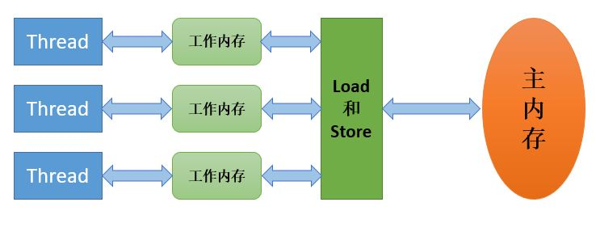
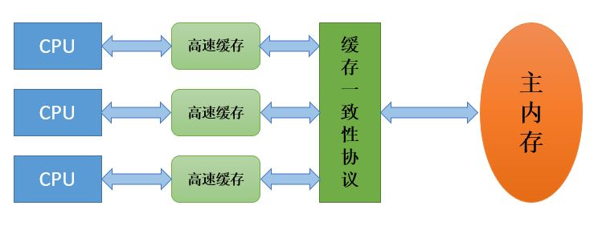
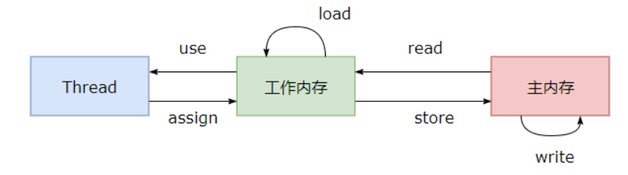

# Java 内存模型

现代计算机处理器上的寄存器的读写的速度比内存快几个数量级，为了解决这种速度矛盾，在它们之间加入了高速缓存：将运算需要用到的数据复制到缓存中，让运算可以快速进行，当运算结束后再从缓存同步回内存中，这样，处理器就不用等待缓慢的内存读写了。

基于高速缓存的存储交互很好地解决了处理器与内存的速度矛盾，却也带来了新的问题：缓存一致性（Cache Coherence）。在多处理器系统中，每个处理器都有自己的高速缓存，而它们又共享同一块主内存，如果多个处理器地运算任务都涉及同一块主内存区域时，将可能导致各自的缓存数据不一致。为了解决这一问题，需要各个处理器访问缓存时遵循一些协议，在读写时根据协议来进行操作。

Java 内存模型（JMM）试图屏蔽各种硬件和操作系统的内存访问差异，以实现让 Java 程序在各种平台下都能达到一致的内存访问效果。见下图：

所有的变量都存储在主内存中，每个线程还有自己的工作内存，工作内存存储在高速缓存或寄存器中，保存了该线程使用的变量的主内存副本拷贝。线程只能直接操作工作内存中的变量，不同线程之间的变量值传递需要通过主内存来完成。

# 内存间交互操作

JMM定义了 8 个操作来完成主内存和工作内存的交互操作。 见下图：

- `read`：把一个变量的值从主内存传输到工作内存中
- `load`：在`read`之后执行，把`read`得到的值放入工作内存的变量副本中
- `use`：把工作内存中一个变量的值传递给执行引擎
- `assign`：把一个从执行引擎接收到的值赋给工作内存的变量
- `store`：把工作内存的一个变量的值传送到主内存中
- `write`：在`store`之后执行，把`store`得到的值放入主内存的变量中
- `lock`：作用于主内存的变量，把一个变量标识为一条线程独占的状态。
- `unlock`：作用于主内存的变量，把一个处于锁定状态地变量释放。

要把一个变量从主内存复制到工作内存，需要顺序地执行`read`和`load`操作；把变量从工作内存复制到主内存，要顺序执行`store`和`write`操作。注意：==JMM只要求上述两个操作必须**顺序执行**，但**不保证连续执行**==。

# 三大特性

- 原子性
  - Java 内存模型保证了 `read`、`load`、`use`、`assign`、`store`、`write`操作具有原子性。
  - 如果需要一个更大范围的原子性保证，Java内存模型还提供了 `lock `和 `unlock` 操作来满足这种需求，尽管 JVM 没有将这两个操作直接给开发者使用，但提供了字节码指令 `monitorenter` 和 `monitorexit`来隐式地使用这两个操作，而这两个字节码指令反映到 java 代码中就是 `synchronized`关键字。
  - 尽管8种内存间交互操作都具有原子性，但对于 64 位的数据类型（`long`、`double`），允许虚拟机将没有被 `volatile`修饰的 64 位数据的读写操作划分为两次 32 位的操作进行，即允许虚拟机实现选择可以不保证 64 位数据类型的 `load`、`store`、`read `和 `write` 这四个操作的原子性。
- 可见性
  - 可见性指当一个线程修改了共享变量的值，其它线程能够立即得知这个修改。 
  - Java 内存模型是通过在变量修改后将新值同步回主内存，在变量读取前从主内存刷新变量值来实现可见性的。 
  - `volatile`可保证可见性（但不保证原子性）。 
  - `synchronized` 也能够保证可见性，对一个变量执行 `unlock` 操作之前，必须把变量值同步回主内存。 
  - `final` 关键字也能保证可见性：被 `final`关键字修饰的字段在构造器中一旦初始化完成，并且没有发生 this 逃逸（其它线程可以通过 `this` 引用访问到初始化了一半的对象），那么其它线程就能看见 `final `字段的值。 
- 有序性
  - 在本线程内观察，所有操作都是有序的。在一个线程观察另一个线程，所有操作都是无序的，无序是因为发生了指令重排序、工作内存与主内存同步延迟。
  - `volatile` 可以保证有序性。通过添加内存屏障的方式来禁止指令重排序，即重排序时不能把后面的指令放到内存屏障之前。 
  - `synchronized` 也可以保证有序性。它保证每个时刻只有一个线程执行同步代码，相当于是让线程顺序执行同步代码。 

# 先行发生原则

JVM可以用 `volatile` 和 `synchronized`来保证有序性。除此之外，JVM 还规定了先行发生原则，让一个操作无需控制就能先于另一个操作完成。 

- 1.单一线程原则 Single Thread Rule：
  - 在一个线程内，程序中写在前面的代码对应的操作先行发生于后面的操作。
- 2.管程锁定规则 Monitor Lock Rule：
  - 一个 unlock 操作先行发生于后面对同一个锁的 lock 操作。（指时间的先后）
- 3.volatile变量规则 Volatile Variable Rule ：
  - 对一个volatile变量的写操作先行发生于后面对这个变量的读操作。（指时间的先后）
- 4.线程启动规则 Thread Start Rule：
  - Thread 对象的 start() 方法先行发生于此线程的每一个动作。
- 5.线程加入规则 Thread Join Rule：
  - join() 方法返回先行发生于 Thread 对象的结束。
- 6.线程中断规则 Thread Interruption Rule：
  - 对线程 interrupt() 方法的调用先行发生于被中断线程的代码检测到中断事件的发生，可以通过 Thread.interrupted() 方法检测到是否有中断发生。
- 7.对象终结规则Finalizer Rule：
  - 一个对象的初始化完成（构造函数执行结束）先行发生于它的 `finalize()`方法的开始。
- 8.传递性 Transitivity：
  - 如果操作 A 先行发生于操作 B，操作 B 先行发生于操作 C，那么操作 A 先行发生于操作 C。 

