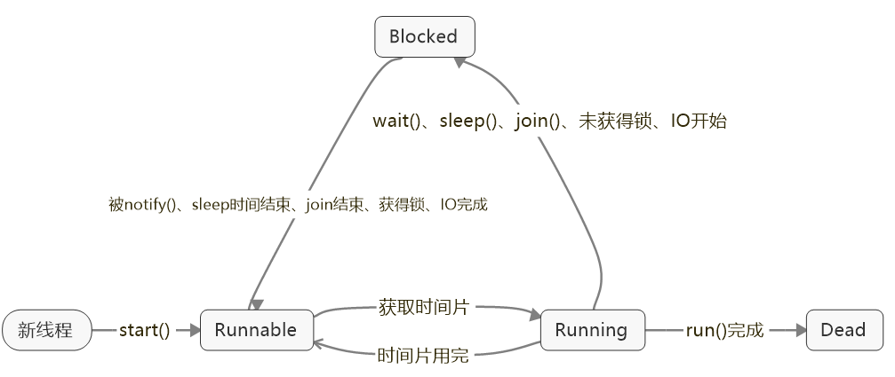
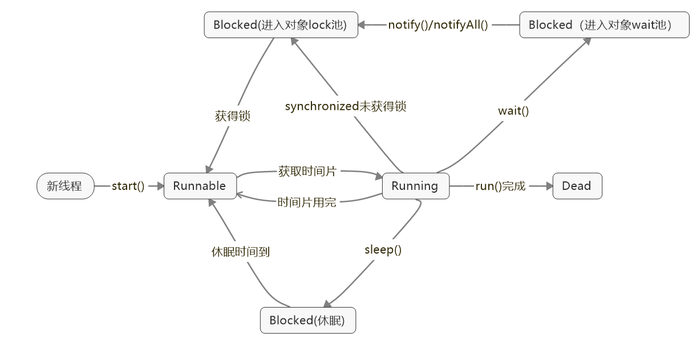

线程安全是一个多线程环境下正确性的概念，也就是保证多线程环境下共享的、可修改的状态的正确性，这里的状态反映在程序中其实可以看作是数据。换个角度来看，如果状态不是共享的，或者不是可修改的，也就不存在线程安全问题，进而可以推理出保证线程安全的两个办法：

- 封装：通过封装，我们可以将对象内部状态隐藏、保护起来。
- 不可变。

线程安全需要保证几个基本特性：

- 原子性，简单说就是相关操作不会中途被其他线程干扰，一般通过同步机制实现。
- 可见性，是一个线程修改了某个共享变量，其状态能够立即被其他线程知晓，通常被解释为将线程本地状态反映到主内存上，`volatile`就是负责保证可见性的。
- 有序性，是保证线程内串行语义，避免指令重排等。


# 创建线程

**方式一**: 继承 `Thread` 类  +   重写 `run() `方法： 通过调用`start()`来启动线程。

缺点：如果类已经从另外一个类继承，则无法再继承`Thread`类

**方式二**：实现` Runnable 接口` +  重写` run() `方法；需要将实现`Runnable`接口的类作为参数传入`Thread`类的构造器中，然后调用`start()`来启动线程。

优点：可以同时实现继承，实现Runnable接口方式要通用一些，便于共享资源 

缺点：无法获取返回值

**方式三**：实现`Callable<T> 接口`（`T`是方法`call()`的返回类型）+  重写`call()`方法 

优点：可获取返回值，可抛出异常。 之前的两种方法只能try处理，无法抛出异常（`Runnable`中没有声明异常）。 

```java
Demo d = new Demo();    //class Demo implements Callable<Integer>

//执行Callable方式，需要FutureTask实现类的支持，用于接收运算结果
FutureTask<Integer> result = new FutureTask<>(d);//将实现Callable接口的类作为参数传给FutureTask
new Thread(result).start();    //借助 Thread 类启动线程

//接收运算后的结果
Integer sum = result.get();  //或产生异常，需要 try-catch 捕获
```

**方式四**：线程池。详见线程池部分


# 线程状态





- 停止线程：不建议调用`Thread`的`stop()`方法。
- 阻塞状态 ：
  - ` join() `合并线程
  - `yield()`暂停当前执行的线程对象，并执行其他线程。声明了当前线程已经完成了生命周期中最重要的部分，可以切换给其它线程来执行。该方法只是对线程调度器的一个建议，而且也只是建议具有相同优先级的其它线程可以运行。
  - `sleep() `休眠，不会释放锁。`sleep() `可能会抛出` InterruptedException`，因为异常不能跨线程传播回 `main()` 中，因此必须在本地进行处理。线程中抛出的其它异常也同样需要在本地进行处理。 常用于：1.与时间相关，如倒计时；2.模拟网络延时 。
  - `wait()`会释放锁。

**高优先级的线程要让给低优先级的线程，最好调用`sleep()`方法，同优先级的让步调用`yield()`方法 。**

线程优先级：

1. `MAX_PRIORITY`：10    
2. `NORM_ PRIORITY`：5（默认优先级）
3. `MIN_PRIORITY`：1   


## Synchronized(隐式锁)

多个线程多个锁：多个线程，每个线程都可以拿到自己指定的锁，分别获得锁后，执行`synchronized`方法体的内容。

使用方式：

1. 同步方法：

   1. 实例方法：锁当前对象。

      - 当线程执行`synchronized`的方法时，该线程会持有该方法所属对象的锁(Lock)。如果有两个对象，线程获得的就是两个不同的锁，两者互不影响。

        ```java
        public synchronized void add(int value){
        	this.count += value;
        }
        ```
   2. 静态方法：锁当前类的`Class`对象。因为在Java虚拟机中一个类只能对应一个类对象，所以同时只允许一个线程执行同一个类中的静态同步方法。

      - 多个对象得到的是同一把锁。

        ```java
        public static synchronized void add(int value){
        	count += value;
        }
        ```

2. 同步块：锁住`()`中的内容(即监视器对象)

   ```java
   synchronized(引用类型/this/类.class){ }
   //引用类型：用来锁一个变量（属性），必须是一个引用。
   //this：锁当前类。子类的synchronized(this)锁定的是子类，当调用了父类的同步方法时，此时父类该方法锁定的也是子类。 
   //类.class ：用于静态方法（没有this）
   ```

原理： `JVM` 是通过进入、退出对象监视器( `Monitor` )来实现对方法、同步块的同步的。 

实现：编译之后会在同步块前后形成`monitorenter`和`monitorexit`两个字节码 。

本质是对一个对象监视器( `Monitor` )进行获取，这个获取过程具有排他性从而达到了同一时刻只能一个线程访问的目的。 

`synchronized`遇到异常，然后被抛出，锁就会被释放。 

注意：不要使用String的常量加锁，会出现死循环问题。

示例：

```java
//每次只有一个线程能够在两个同步块中任意一个方法内执行。
public class MyClass {
  public synchronized void log1(String msg1, String msg2){
    log.writeln(msg1);
    log.writeln(msg2);
  }
  //如果这里不是同步在this实例对象上，那么两个方法可以被线程同时执行
  public void log2(String msg1, String msg2){
    synchronized(this){
      log.writeln(msg1);
      log.writeln(msg2);
    }
  }
}
```


## ReentrantLock(显式锁)

 基于 `AQS(AbstractQueuedSynchronizer)`来实现的 ，`AQS` 是 `Java` 并发包里实现锁、同步的一个重要的基础框架。 

`synchronized `是 JVM 实现的，而 `ReentrantLock` 是 JDK 实现的 。

从性能上来讲，新版本的 JDK 已经对 `synchronized`进行了很多优化，所以 `ReentrantLock`的性能和`synchronized`已经基本持平，且`synchronized`有更大的优化空间，所以优先考虑`synchronized`。只有在使用`ReentrantLock`的高级功能时才会考虑使用`ReentrantLock`。

`ReentrantLock`的==高级功能==：

1. 等待可中断（当持有锁的线程长期不释放锁的时候，正在等待的线程可以选择放弃等待，改为处理其他事情，可中断特性对处理执行时间非常长的同步块很有帮助。） 
2. 公平锁 (默认的`synchronized`都是不公平的锁。
3. 锁可以绑定多个条件 

注意：必须手动释放锁，所以一般将加锁部分放到 `try块`中。


### 公平锁

如果一个线程因为CPU时间全部被其他线程抢走而得不到CPU运行时间，这种状态被称之为“饥饿”。而该线程被“饥饿致死”正是因为它得不到CPU运行时间的机会。解决饥饿的方案被称之为“公平性” – 即所有线程均能公平地获得运行机会。

Java中导致饥饿的原因：

- 高优先级线程吞噬所有的低优先级线程的CPU时间。
- 线程被永久堵塞在一个等待进入同步块的状态，因为其他线程总是能在它之前持续地对该同步块进行访问。
- 线程在等待一个本身也处于永久等待完成的对象(比如调用这个对象的`wait()`方法)，因为其他线程总是被持续地获得唤醒。

在Java中实现公平性方案，需要:

- 使用锁`Lock`，而不是同步块。
- 公平锁。
- 注意性能方面。

```java
private static ReentrantLock lock = new ReentrantLock(true);//参数为true表示公平锁，不写参数或false为非公平锁（效率和吞吐量都比公平锁高的多）。
```


### tryLock

使用`reentrantlock`可以进行 “尝试锁定” `trylock`，这样无法锁定，或者在指定时间内无法锁定，线程可以决定是否继续等待。 

```java
public class ReentrantLock{  
  Lock lock = new ReentrantLock();   
  void m1() {
    lock.lock(); //上锁，相当于synchronized(this)
    try {
      for(int i=0;i<10;i++) {
        TimeUnit.SECONDS.sleep(1);         
        System.out.println(i);
      }
    } catch (InterruptedException e) {
      e.printStackTrace();
    } finally {
      lock.unlock();   //释放锁
    }
  }
  /**
     * 使用trylock进行尝试锁定，不管锁定与否，方法都将继续执行
     * 可以根据trylock的返回值来判定是否锁定
     * 也可以指定trylock的时间，由于trylock(time)抛出异常，所以要注意unlock的处理，必须放到finally中
     */
  void m2() {
    boolean locked = false;         
    try {
      //指定时间长度、单位。尝试等锁5秒，5秒后再继续（根据拿到锁与否执行不同操作）
      locked = lock.tryLock(5,TimeUnit.SECONDS);
      if(locked)
        System.out.println("m2 get...");
      else
        System.out.println("m2 waiting...");
    } catch (InterruptedException e) {
      e.printStackTrace();
    } finally {
      if(locked)
        lock.unlock();
    }

  }
  public static void main(String[] args) {
    ReentrantLock2 r1 = new ReentrantLock2();
    new Thread(r1::m1).start();
    try {
      TimeUnit.SECONDS.sleep(1);
    } catch (InterruptedException e) {
      e.printStackTrace();
    }
    new Thread(r1::m2).start();
  }
}
```


### 响应中断请求

使用`reentrantlock`还可以调用`lockInterruptibly`方法，可以对线程`interrupt()`方法做出响应。在一个线程等待锁的过程中，可以被打断。 

```java
public static void main(String[] args) {
  Lock lock = new ReentrantLock();

  Thread t1 = new Thread(()->{
    try {
      lock.lock();
      System.out.println("t1 start");
      TimeUnit.SECONDS.sleep(Integer.MAX_VALUE);
      System.out.println("t1 end");
    } catch (InterruptedException e) {
      e.printStackTrace();
    }finally {
      lock.unlock();
    }
  });
  t1.start();

  Thread t2 = new Thread(()->{
    try {
      //lock.lock();如果使用lock方法，那么是无法打断的
      lock.lockInterruptibly();//可以对interrupt方法做出响应
      System.out.println("t2 start");
      TimeUnit.SECONDS.sleep(5);
      System.out.println("t2 end");
    } catch (InterruptedException e) {
      System.out.println("interrupted");//被打断时会抛出异常
    }finally {
      //lock.unlock();
    }
  });
  t2.start();

  try {
    TimeUnit.SECONDS.sleep(1);
  } catch (InterruptedException e) {
    e.printStackTrace();
  }
  t2.interrupt();//打断线程2的等待
}
```


### 绑定条件变量

`synchronized`+`wait()`+`notifyAll()`中，`wait()`一定要和`while()`一起使用。

 使用==ReebtrantLock+Condition==来替代，可以更加精确的指定那些线程被唤醒。 

典型应用场景：标准类库中的`ArrayBlockingQueue`等，下面是部分`ArrayBlockingQueue`源码：

```java
/** Condition for waiting takes */
private final Condition notEmpty;

/** Condition for waiting puts */
private final Condition notFull;

public ArrayBlockingQueue(int capacity, boolean fair) {
  if (capacity <= 0)
    throw new IllegalArgumentException();
  this.items = new Object[capacity];
  lock = new ReentrantLock(fair);
  //通过同一个可重入锁获取条件变量
  notEmpty = lock.newCondition();
  notFull =  lock.newCondition();
}
//从队列中获取队首元素
public E take() throws InterruptedException {
  final ReentrantLock lock = this.lock;
  lock.lockInterruptibly();
  try {
    while (count == 0) //队列为空时
      notEmpty.await(); //试图take的线程的正确行为是等待入队发生，而不是直接返回
    return dequeue();
  } finally {
    lock.unlock();
  }
}
//入队操作
private void enqueue(E x) {
  // assert lock.getHoldCount() == 1;
  // assert items[putIndex] == null;
  final Object[] items = this.items;
  items[putIndex] = x;
  if (++putIndex == items.length)
    putIndex = 0;
  count++;
  notEmpty.signal();  //通知等待的线程“非空条件已经满足”，于是上面等待的take线程就可以从队列中获取元素了
}
```

通过`signal`/`await`的组合，完成了条件判断和通知等待线程，非常顺畅就完成了状态流转。注意，`signal`和`await`成对调用非常重要，不然假设只有`await`动作，线程会一直等待直到被打断（interrupt）


# volatile

`volatile`关键字的主要作用是使遍历在多个线程间可见。强制线程到主内存里去读取变量，而不去线程工作内存读取，从而实现多个线程间变量的可见。

只能保证可见性，不保证原子性。要实现原子性建议使用atomic类的系列对象，支持原子性操作。注意atomic类只保证本身方法原子性，不保证多次操作的原子性。

`synchronized`和`volatile`的区别：

- **volatile关键字**是线程同步的**轻量级实现**，所以**volatile性能肯定比synchronized关键字要好**。但是**volatile关键字只能用于变量而synchronized关键字可以修饰方法以及代码块**。synchronized关键字在JavaSE1.6之后进行了主要包括为了减少获得锁和释放锁带来的性能消耗而引入的偏向锁和轻量级锁以及其它各种优化之后执行效率有了显著提升，**实际开发中使用 synchronized 关键字的场景还是更多一些**。
- **多线程访问volatile关键字不会发生阻塞，而synchronized关键字可能会发生阻塞**
- **volatile关键字能保证数据的可见性，但不能保证数据的原子性。synchronized关键字两者都能保证。**
- **volatile关键字主要用于解决变量在多个线程之间的可见性，而 synchronized关键字解决的是多个线程之间访问资源的同步性。**


# 线程通信

- 通过共享对象通信
- 忙等待：准备处理数据的线程B正在等待数据变为可用。换句话说，它在等待线程A的一个信号
- `wait()`、`notify()`、`notifyAll()`
  - 忙等待没有对运行等待线程的CPU进行有效的利用，除非平均等待时间非常短。否则，让等待线程进入睡眠或者非运行状态更为明智，直到它接收到它等待的信号。
  - Java有一个内建的等待机制(通过以上三个方法)来允许线程在等待信号的时候变为非运行状态。
  - 使用`wait`、`notify`方法实现线程间通信，必须配合`synchronized`使用，`wait`会释放锁。