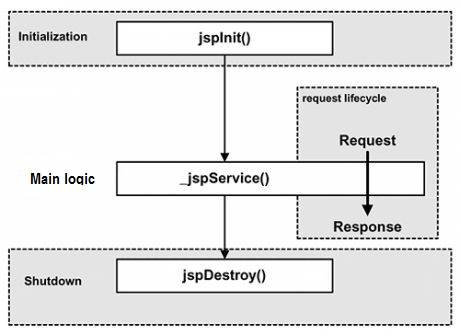

*声明：这部分内容参考了[阿里云大学的JSP教程](https://edu.aliyun.com/lesson_503_5643?spm=5176.10731542.0.0.9TDFD7#_5643)*

# 简介

JSP（Java Server Pages）是简化Servlet编写的一种技术，将 Java 代码和 HTML 语句混合在同一个文件中编写，只对网页中的要动态产生的内容采用Java代码来编写，而静态内容采用普通静态HTML页面的方式编写。

JSP 文件可以放置在 Web 应用程序中的除了 WEB-INF 及其子目录外的其他任何目录中，JSP 页面的访问路径与普通HTML页面的访问路径形式也完全一样。

每个 JSP 页面第一次被访问时，JSP 引擎将它翻译成一个 Servlet 源程序，再把这个 Servlet 源程序编译成Servlet的 class 文件，然后再由 Web 容器（Servlet引擎）像调用普通 Servlet 程序一样的方式来装载和解释执行这个由 JSP 页面翻译成的 Servlet 程序。

一般情况下，JSP 引擎会检查 JSP 文件对应的 Servlet 是否已经存在，并且检查 JSP 文件的修改日期是否早于 Servlet。如果 JSP 文件的修改日期早于对应的 Servlet，那么容器就可以确定 JSP 文件没有被修改过并且Servlet 有效。 

一个简单的 JSP 文件：

```jsp
<%@ page language="java" contentType="text/html; charset=UTF-8"
         pageEncoding="UTF-8" %>
<!DOCTYPE html PUBLIC "-//W3C//DTD HTML 4.01 Transitional//EN" "http://www.w3.org/TR/html4/loose.dtd">
<html>
    <head>
        <meta http-equiv="Content-Type" content="text/html; charset=UTF-8">
        <title>Insert title here</title>
    </head>
    <body>
			脚本片段
    </body>
</html>
```


- 生命周期
  - 编译阶段：Servlet 容器编译 Servlet 源文件，生成 Servlet 类。
    - 当浏览器请求JSP页面时，JSP引擎会首先去检查是否需要编译这个文件。如果这个文件没有被编译过，或者在上次编译后被更改过，则编译这个JSP文件。 编译的过程包括三个步骤： 
      - 解析 JSP 文件
      - 将 JSP 文件转为 Servlet
      - 编译 Servlet 
  - 初始化阶段：加载与 JSP 对应的 Servlet 类，创建其实例，并调用它的初始化方法。
    - 容器载入JSP文件后，它会在为请求提供服务前调用`jspInit()`方法。如果要执行自定义的JSP初始化任务，覆盖`jspInit()`方法即可。 
    - 一般来讲程序只初始化一次，Servlet 也是如此。通常情况下可以在`jspInit()`方法中初始化数据库连接、打开文件和创建查询表。 
  - 执行阶段 :调用与 JSP 对应的 Servlet 实例的服务方法。 
    - 当 JSP 网页完成初始化后，JSP 引擎将会调用`_jspService()`方法。 
    - `_jspService()`方法需要一个`HttpServletRequest`对象和一个`HttpServletResponse`对象作为它的参数。 
    - `_jspService()`方法在每个 request 中被调用一次并且负责产生与之相对应的 response，并且它还负责产生所有7个HTTP方法的回应，比如GET、POST、DELETE等等。 
  - 销毁阶段： 调用与 JSP 对应的 Servlet 实例的销毁方法，然后销毁 Servlet 实例。 
    - `jspDestroy()`方法在JSP中等价于 Servlet 中的销毁方法。当需要执行任何清理工作时覆盖`jspDestroy()`方法，比如释放数据库连接或者关闭文件夹等等。 




# 中文乱码

在JSP页面输入中文，请求页面后不出现乱码：保证`contentType="text/html; charset=UTF-8"`。

`pageEncoding="UTF-8"`中 `charset`和 `pageEncoding`的编码一致，且都支持中文。通常取值为UTF-8。

还需保证浏览器显示的字符编码也和请求的 JSP 页面的编码一致。  

- 获取中文参数值：默认参数在传输过程中使用的编码为 `IOS-8859-1`

  - 对于 POST 请求，只要在获取请求信息之前（在调用`request.getParameter`或`request.getReader`等前），调用 `request.setCharacterEncoding("UTF-8")`;
  - 对于 GET 请求，前面的方式对于 GET 请求无效。可以通过修改 Tomcat 的 server.xml 文件的方式，为 Connector 节点添加 `useBodyEncodingforURI=“true”`属性即可。 

  ```xml
  <Connector port="8080" protocol="HTTP/1.1" connectionTimeout="20000"
             redirectPort="8443" useBodyEncodingforURI="true"/>
  ```

