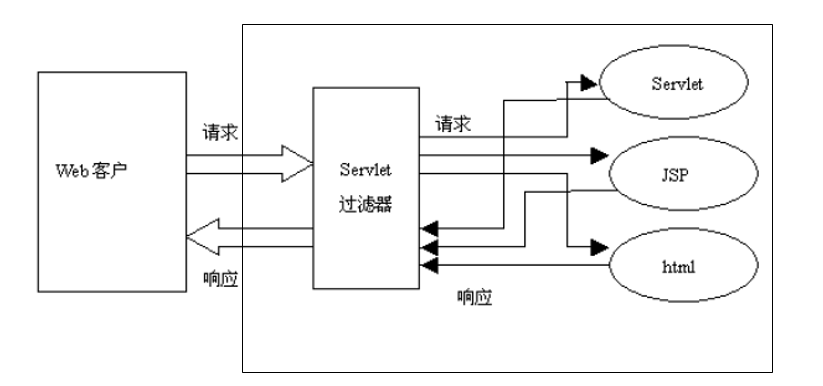

# 3.过滤器Filter

过滤器的功能是对 Servlet 容器调用 Servlet 的过程进行拦截，从而在 Servlet 进行响应处理的前后实现一些特殊的功能。

过滤器是一个实现了`Filter`接口的 Java 类，与 Servlet 程序相似，它由 Servlet 容器进行调用和执行。

过滤器可以对发送到 Servlet 的请求进行拦截，并对响应也进行拦截，可以决定是否将请求继续传递给 Servlet 程序，以及对请求和相应信息是否进行修改。

过滤器需要在 web.xml 文件中进行注册和设置它所能拦截的资源：可拦截 Jsp, Servlet, 静态图片文件和静态 html 文件。



每个过滤器都可以对一个或一组Servlet程序进行拦截。

若有多个过滤器对某个Servlet程序的访问过程进行拦截，当针对该Servlet的访问请求到达时，web容器将把这多个过滤器组成一个过滤器链。过滤器链中各个过滤器的拦截顺序与它们在web.xml 中**映射**的顺序一致。


## 3.1 HelloWorld

1. 创建一个Filter类并实现`javax.servlet.Filter`接口

   ```java
   public class HelloFilter implements Filter {
       @Override
       public void init(FilterConfig filterConfig) throws ServletException {
           System.out.println("init...");
       }
   
       @Override
       public void doFilter(ServletRequest request, ServletResponse response, FilterChain chain) throws IOException, ServletException {
           System.out.println("doFilter");
       }
   
       @Override
       public void destroy() {
           System.out.println("destroy...");
       }
   }
   ```

2. 在web.xml中注册并映射过滤器

   ```xml
       <filter>
           <filter-name>hello</filter-name>
           <filter-class>filters.HelloFilter</filter-class>
       </filter>
       <filter-mapping>
           <filter-name>hello</filter-name>
           <!--指定该 Filter 可以拦截哪些资源, 即可以通过哪些 url 访问到该 Filter-->
           <url-pattern>/test.jsp</url-pattern>
       </filter-mapping>
   ```

## 3.2 Filter接口API

- `public void init(FilterConfig filterConfig)`类似于Servlet的`init`方法，用于对当前的 Filter 进行初始化操作

  - 在创建 Filter 对象(Filter 对象在 Servlet 容器加载当前 WEB 应用时就被创建)后, 立即被调用, 且只被调用一次。

  - Filter 实例是单例的。

  - 参数`FilterConfig`类似于`ServletConfig`，包含 Filter的配置和运行环境

    - Servlet规范将代表 ServletContext 对象和Filter 的配置参数信息都封装在该对象中。

  - 可以在 web.xml 文件中配置当前 Filter 的初始化参数。配置方式和 Servlet 类似。在过滤器中，可以使用`FilterConfig`接口对象来访问初始化参数。

    ```xml
        <filter>
            <filter-name>hello</filter-name>
            <filter-class>filters.HelloFilter</filter-class>
            <init-param>
    			<param-name>name</param-name>
    			<param-value>root</param-value>
    		</init-param>
        </filter>
    ```

- `public void doFilter(ServletRequest request, ServletResponse response,FilterChain chain)`

  - 过滤器真正的实现逻辑，每次拦截都会调用该方法。
  - `FilterChain`（过滤器链）：多个过滤器可以构成一个过滤器链
    - 过滤器链使用`doFilter(ServletRequest request, ServletResponse response)`把请求传给过滤器链的下一个 Filter，若当前 Filter 是 Filter 链的最后一个 Filter,，将把请求给到目标 Serlvet(或 JSP)
    - 多个 Filter 拦截的顺序和`<filter-mapping>`配置的顺序有关, 靠前的先被调用

- `public void destroy()`释放当前 Filter 所占用的资源的方法，在 Filter 被销毁之前被调用，且只被调用一次。


## 3.3 自定义的HttpFilter

实际上jar包中并没有该类。这里是为了以后方便使用而创建的。

```java
import javax.servlet.*;
import javax.servlet.http.HttpServletRequest;
import javax.servlet.http.HttpServletResponse;
import java.io.IOException;

/**自定义的 HttpFilter, 实现自 Filter 接口*/
public abstract class HttpFilter implements Filter {

	/**用于保存 FilterConfig 对象*/
	private FilterConfig filterConfig;
	
	/**不建议子类直接覆盖. 若直接覆盖, 将可能会导致 filterConfig 成员变量初始化失败 */
	@Override
	public void init(FilterConfig filterConfig) throws ServletException {
		this.filterConfig = filterConfig;
		init();
	}

	/**供子类继承的初始化方法. 可以通过 getFilterConfig() 获取 FilterConfig 对象*/
	protected void init() {}

	/**直接返回 init(ServletConfig) 的 FilterConfig 对象*/
	public FilterConfig getFilterConfig() {  return filterConfig; }
	
	/**
	 * 原生的 doFilter 方法, 在方法内部把 ServletRequest 和 ServletResponse 
	 * 转为了 HttpServletRequest 和 HttpServletResponse, 并调用了 
	 * doFilter(HttpServletRequest request, HttpServletResponse response, FilterChain filterChain)
	 * 
	 * 若编写 Filter 的过滤方法不建议直接继承该方法. 而建议继承
	 * doFilter(HttpServletRequest request, HttpServletResponse response, 
	 *		FilterChain filterChain) 方法
	 */
	@Override
	public void doFilter(ServletRequest req, ServletResponse resp,	FilterChain chain) throws IOException, ServletException {
		HttpServletRequest request = (HttpServletRequest) req;
		HttpServletResponse response = (HttpServletResponse) resp;
		
		doFilter(request, response, chain);
	}
	
	/**
	 * 抽象方法, 为 Http 请求定制. 必须实现的方法. 
	 * @param request
	 * @param response
	 * @param filterChain
	 * @throws IOException
	 * @throws ServletException
	 */
	public abstract void doFilter(HttpServletRequest request, HttpServletResponse response,	FilterChain filterChain) throws IOException, ServletException;

	/**空的 destroy 方法*/
	@Override
	public void destroy() {}
}
```


## 3.4 Filter的映射

场景：假设有两个页面：a.jsp 和 target.jsp，一个过滤器对发送到 target.jsp 的请求进行拦截。如果a.jsp中直接发送请求(GET或POST)，拦截器会产生作用；而如果先在有第三个页面 b.jsp，它通过转发的方式到达 target.jsp，那么此时拦截器就不再起作用了。可以通过`<filter-mapping>`的`<dispatcher>`标签来设置。


`<filter-mapping>`标签用于设置一个Filter所负责拦截的资源。一个Filter拦截的资源可通过两种方式来指定：Servlet名称和资源访问的请求路径(url样式)。

- `<filter-name>`子标签用于设置Filter的注册名称。该值必须是在`<filter>`标签中声明过的过滤器的名字；

- `<url-pattern>`子标签设置 Filter 所拦截的请求路径(过滤器关联的URL样式)

- `<servlet-name>`子标签指定过滤器所拦截的Servlet名称

- `<dispatcher>`指定过滤器所拦截的资源被 Servlet 容器调用的方式，可以是`REQUEST`、`INCLUDE`、`FORWARD`和`ERROR`之一，默认`REQUEST`.可以设置多个`<dispatcher> `标签用来指定 Filter 对资源的多种调用方式进行拦截

  - `REQUEST`：当用户直接访问页面时，Web容器将会调用过滤器。如果目标资源是通过`RequestDispatcher`的`include()`或`forward()`方法访问时，那么该过滤器就不会被调用。通过 GET 或 POST 请求直接访问。 

  - `INCLUDE`：如果目标资源是通过`RequestDispatcher`的`include()`方法或 `<jsp:include file="/..." />`访问时，那么该过滤器将被调用。除此之外，该过滤器不会被调用。

  - `FORWARD`：如果目标资源是通过`RequestDispatcher`的`forward()`方法访问时，那么该过滤器将被调用，除此之外，该过滤器不会被调用。或 `<jsp:forward page="/..." /> `或 通过`page`指令的`errorPage`转发页面. `<%@ page errorPage="test.jsp" %>`

  - `ERROR`：如果目标资源是通过声明式异常处理机制调用时，那么该过滤器将被调用。除此之外，过滤器不会被调用。在 web.xml 文件中通过`<error-page>`节点进行声明:

    ```xml
    <error-page>
    	<exception-type>java.lang.ArithmeticException</exception-type>
    	<location>/test.jsp</location>
    </error-page>
    
    <filter-mapping>
    	<filter-name>secondFilter</filter-name>
    	<url-pattern>/test.jsp</url-pattern>
    	<dispatcher>REQUEST</dispatcher>
    	<dispatcher>FORWARD</dispatcher>
    	<dispatcher>INCLUDE</dispatcher>
    	<dispatcher>ERROR</dispatcher>
    </filter-mapping>
    ```


## 3.5 典型应用

### 禁用浏览器缓存

- 有 3 个 HTTP 响应头字段都可以禁止浏览器缓存当前页面，它们在 Servlet 中的示例代码如下：
  - `response.setDateHeader("Expires",-1);`
  - `response.setHeader("Cache-Control","no-cache"); `
  - `response.setHeader("Pragma","no-cache");`
- 并不是所有的浏览器都能完全支持上面的三个响应头，因此最好是同时使用上面的三个响应头

可以通过网页的图片查看缓存情况：a页面有图片A，超链接到b页面。从a页面跳转到b页面。然后将a页面的图片换为B，从b页面退回a页面，看到的仍为图片A，所以存在缓存。

```java
public class NoCacheFilter extends HttpFilter { //这里使用了4.3中的 HttpFilter
	@Override
	public void doFilter(HttpServletRequest request,HttpServletResponse response, FilterChain filterChain)throws IOException, ServletException {
		System.out.println("cacheFilter's doFilter..");
		
		response.setDateHeader("Expires",-1);
		response.setHeader("Cache-Control","no-cache");
		response.setHeader("Pragma","no-cache");
		
		filterChain.doFilter(request, response);
	}
}
```

注意注册和配置过滤器，这里没有列出。


### 字符编码过滤

### 权限管理


## 3.6 装饰请求&响应

了解！！

- 场景：将用户的敏感词语替换为"****"。这需要在`HttpServlet`对象到达Servlet前把用户输入的敏感词替换掉，而`HttpServletRequest`对象中的请求参数实际上都是包含在`java.util.Map`对象中，Map是不允许修改的，所以包含在`HttpServletRequest`对象中的请求参数无法被修改。
- 解决方案：
  1. 对于一个类的方法不满意，需要进行重写，常见的方式是：继承父类， 重写方法。由于该方法的对象是由应用程序中的另一个子系统（这里是Tomcat服务器的Servlet容器，更换了服务器就不再适用）负责构造， 继承方案将无法使用。  
  2. 直接写一个`HttpServletRequest`接口的实现类：很麻烦，也和具体的容器相耦合。。
  3. 采用Decorator(装饰器)模式装饰当前`HttpServletRequest`对象：
     - 创建一个类，该类实现`HttpServletRequest`接口，把当前`doFilter`中的`request`传入到该类中，作为其成员变量，使用该成员变量去实现接口的全部方法。


Servlet API 中提供了一个`HttpServletRequestWrapper`类来包装原始的`request`对象，`HttpServletRequestWrapper`类实现了`HttpServletRequest`接口中的所有方法, 这些方法的内部实现都是仅仅调用了一下所包装的的 request 对象的对应方法。使用时，仅需要继承该类，然后重写需要的方法即可。

```java
public class MyHttpServletRequest extends HttpServletRequestWrapper{

	public MyHttpServletRequest(HttpServletRequest request) {
		super(request);
	}
	
	@Override
	public String getParameter(String name) {
		String val = super.getParameter(name);
		if(val != null && val.contains(" fuck ")){
			val = val.replace("fuck", "****");
		}
		return val;
	}
}
```

而在过滤器中使用时：

```java
public class ContentFilter extends HttpFilter{

    public void doFilter(HttpServletRequest request,HttpServletResponse response, FilterChain filterChain)throws IOException, ServletException {
		//利用 MyHttpServletRequest 替换传入的 HttpServletRequest
    	HttpServletRequest req = new MyHttpServletRequest(request);
    	
    	//将上面经过处理后的 req 对象传给下一个过滤器！此时到达目标 Servlet 或 JSP 的 HttpServletRequest 实际上是 MyHttpServletRequest
    	filterChain.doFilter(req, response);
    }
}
```


类似的，Servlet API 也提供了一个`HttpServletResponseWrapper`类来包装原始的`response`对象。

`HttpServletRequestWrapper`和`HttpServletResponseWrapper`用于对`HttpServletRequest`或`HttpServletResponse`的某一个方法进行修改或增强.

