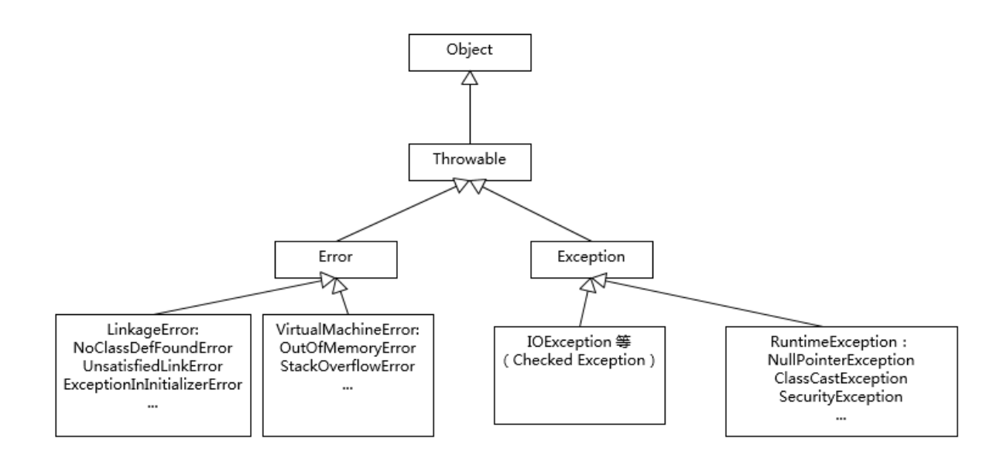

# Q

Q：对比 Exception 和 Error。运行时异常和一般异常有什么区别？

A：`Exception`和`Error`都继承了`Throwable`类，在 Java 中只有`Throwable`类型的实例才可以被抛出(throw) 或捕获 (catch) ，它是异常处理机制的基本组成类型。

`Exception`和`Error`体现了 Java 平台设计者对不同异常情况的分类：

- `Exception`是程序正常运行中，可以预料的意外情况，可能并且应该被捕获，进行相应处理。
  - `Exception`又可分为可检查(checked)异常和不检查(unchecked)异常：
    - 可检查异常在源代码中必须显式地进行捕获处理，这是编译期检查的一种；
    - 不检查异常就是运行时异常，类似`NullPointException`、`ArrayIndexOutOfBoundsException`之类，通常是可以编码避免的逻辑错误，具体根据需要来判断是否需要捕获，并不会在编译期强制要求。

- `Error`是指在正常情况下，不大可能出现的情况，绝大部分的`Error`都会导致程序处于非正常的、不可恢复状态。常见的如`OutOfMemoryError`之类，都是`Error`的子类。




# 扩展

异常处理机制的目的是解决代码的可读性和健壮性。 

JVM 怎么处理异常流程的？ 

 一般来说，异常发生时，会在堆上生成一个异常对象「包含当前栈帧的快照」；然后停止当前的执行流程，将上面的异常对象从当前的 context 丢出「便于卸掉解决问题的职责」；此刻便由异常处理机制接手，寻找能继续执行的适当地点「即异常处理函数」，使程序继续执行。 


## 异常处理原则

异常处理的两个基本原则：

1. 尽量不要捕获类似`Exception`这样的通用异常，而是应该捕获特定异常。

   ```java
   try {
   	// 业务代码
   	Thread.sleep(1000L); //抛出的是 InterruptedException
   } catch (Exception e) { // 这里应该捕获 InterruptedException，而不是Exception这样的通用异常
   	//...
   }
   ```

   - 因为日常的开发和合作中，读代码的机会往往超过写代码，软件工程是一门协作的艺术，所以有义务让自己的代码能直观地体现出尽量多的信息。
   - 也要保证程序不会捕获到我们不希望捕获的异常，如，可能更希望`RuntimeException`被扩散处来而不是被捕获。

2. 不要生吞(swallow)异常，否则可能会导致难以诊断的诡异情况。

   - 生吞异常往往是基于假设这段代码可能不会发生，或感觉忽略异常是无所谓的，但千万不要在产品代码做这种假设！
   - 如果不抛出异常，或也没有输出到日志之类，程序可能在后续代码以不可控方式结束，无法轻易判断是哪里抛出异常，以及什么愿意产生了异常。

“throw early , catch late”：在发现问题的时候第一时间抛出，能够更加清晰地反映问题，如对方法入参的空判断；如果不知道如何处理异常，可以选择保留原有异常的 cause 信息，直接再抛出或构建新的异常抛出去，而在更高层面，因为有了清晰的业务逻辑，往往更清楚合适的处理方式是什么。


## 自定义异常

自定义异常除了保证提供足够的信息，还有两点要考虑：

1. 是否定义成 Checked Exception，这种类型设计的初衷是为了从异常情况恢复；
2. 在保证诊断信息足够的同时，也要考虑避免包含敏感信息(如用户数据)，因为那样可能导致潜在的安全问题
   - 如：`java.net.ConnectException`的出错信息是“Connection refused(Connection refused)”，而不会包含具体的机器名、IP、端口等。


## 注意

- 在 try 和 catch 中执行到`system.exit(1)`会直接退出程序，不再执行 finally 块的语句
  - `system.exit(1)`表示非正常退出，无论程序正在执行与否，都退出。
  - `System.exit(0)`表示将整个虚拟机里的内容都释放，JVM停止工作，此时程序正常执行结束退出。 
- **try、catch、finally块的返回值**：
  - 在 try 中 return，在 finally 执行前会把结果保存起来，即使在finally 中有修改也以 try 中保存的值为准；
  - 如果 finally 块也有返回值 return，则 finally 的返回值会覆盖 try 的返回值；
  - 如果返回值是引用类型，即使 finally 块中没有 return，修改的属性会以 finally 对其修改后的为准。
  - 建议不要在 finally 块中使用 return 语句。
- 什么时候使用finally？ 
  - 某些事物（除内存外）在异常处理完后需要恢复到原始状态，如：开启的文件，网络连接等。


## 性能

Java 的异常处理机制中有两个性能昂贵的地方：

1. try-catch 代码段会产生额外的性能开销，即往往会影响到 JVM 对代码进行优化，所以建议捕获有必要的代码段，尽量不要一个大的 try 包住整段代码；利用异常控制代码流程远比条件语句低效；
2. Java 每实例化一个 `Exception`，都会对当时的栈进行快照，这是一个较重的操作，耗时较多，如果发生的频繁，这个开销就不能忽略了。
   - 主要是由于`Throwable`基类中的`fillInStackTrace()`方法记录异常时的栈信息是一个` synchronized`方法。所以 对性能要求比较高的系统需要对异常设计进行优化。如果我们在开发时不需要关注栈信息，则可以将其覆盖来提升性能。 


## 遇到的

- `ConcurrentModificationException`并发修改异常：`java.util`包下的集合类是快速失败的，如果在进行序列化或迭代操作时，由于集合类的结构发生变化，导致比较操作前后的`modCount`改变，所以抛出该异常。 
- 常见的类加载错误：
  - `ClassNotFoundException`；
  - `NoClassDefFoundError`；
  - `UnsatisfiedLinkError`； 
  - `ClassCastException`类型转换异常；
  - `ExceptionInInitializerError `。
- `InterruptedException` 线程的中断异常
- `ArrayIndexOutOfBoundException`数组下标越界异常
- `FileNotFoundException`
- java虚拟机栈、本地方法栈： 
  - 如果线程请求的栈深度大于虚拟机所允许的深度，将抛出`StackOverflowError`错误；
  - 如果虚拟机栈在扩展时无法申请到足够的内存，会抛出`OutOfMemoryError`错误。 
- Java堆：        
  - 如果在堆上没有内存完成实例分配，且堆也无法再扩展时，将会抛出`OutOfMemoryError`错误。
  - 当方法区无法满足内存分配需求时，将会抛出`OutOfMemoryError`错误。 


