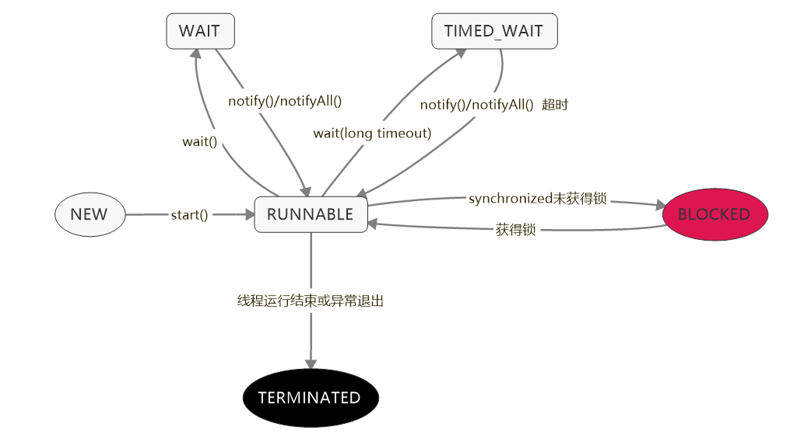

# Q

Q：一个线程两次调用`start()`方法会出现什么情况？谈谈线程的生命周期和状态转移。

A：Java 的线程是不允许启动两次的，第二次调用必然会抛出`IllegalThreadStateException`，这是一种运行时异常，多次调用`start()`被认为是编程错误。

线程生命周期的不同状态，在 Java 5 以后，线程状态被明确定义在其公共内部枚举类型`java.lang.Thread.State`中：

- 新建（NEW），表示线程被创建出来还没真正启动的状态，可以认为它是个 Java 内部状态；
- 就绪（RUNNABLE），表示该线程已经在 JVM 中执行，当然由于执行需要计算资源，它可能是正在运行，也可能还在等待系统分配给它 CPU 片段，在就绪队列里面排队；
- 阻塞（BLOCKED），这个状态和我们前面两讲介绍的同步非常相关，阻塞表示线程在等待Monitor lock。比如，线程试图通过`synchronized`去获取某个锁，但是其他线程已经独占了，那么当前线程就会处于阻塞状态；
- 等待（WAITING），表示正在等待其他线程采取某些操作。一个常见的场景是类似生产者消费者模式，发现任务条件尚未满足，就让当前消费者线程等待（`wait`），另外的生产者线程去准备任务数据，然后通过类似`notify`等动作，通知消费线程可以继续工作了。`Thread.join()`也会令线程进入等待状态；
- 计时等待（TIMED_WAIT），其进入条件和等待状态类似，但是调用的是存在超时条件的方法，比如`wait`或`join`等方法的指定超时版本；
- 终止（TERMINATED），不管是意外退出还是正常执行结束，线程已经完成使命，终止运行，也叫作死亡。

# 扩展

## 线程是什么？

从操作系统的角度，可以简单认为，线程是系统调度的最小单元，一个进程可以包含多个线程，作为任务的真正运作者，有自己的栈（Stack）、寄存器（Register）、本地存储（ThreadLocal）等，但是会和进程内其他线程共享文件描述符、虚拟地址空间等。

在具体实现中，线程还分为内核线程、用户线程，Java 的线程实现其实是与虚拟机相关的。现在的模型是一对一映射到操作系统内核线程，而不再是Green Thread(用户调度的线程)。

## 可能影响线程的状态的因素

主要有：

- 线程自身的方法，除了`start`，还有多个`join`方法，等待线程结束；`yield`是告诉调度器，主动让出 CPU；另外，是一些被标记为过时的`resume`、`stop`、`suspend`之类，在 JDK 最新版本中，`destory`/`stop`方法将被直接移除。
- 基类 Object 提供了一些基础的`wait`/`notify`/`notifyAll`方法。如果我们持有某个对象的Monitor 锁，调用`wait`会让当前线程处于等待状态，直到其他线程`notify`或者`notifyAll`。所以，本质上是提供了 Monitor 的获取和释放的能力，是基本的线程间通信方式。
- 并发类库中的工具，比如`CountDownLatch.await()`会让当前线程进入等待状态，直到 latch 被计数为 0，这可以看作是线程间通信的 Signal。