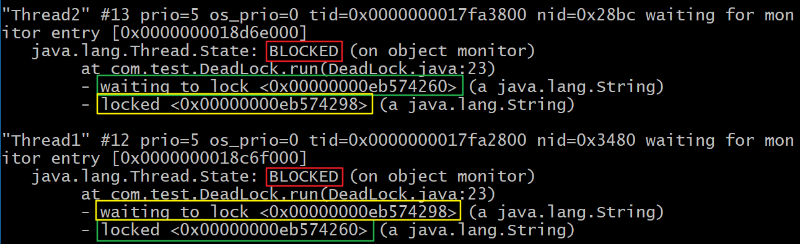

# Q

Q：什么情况下 Java 程序会产生死锁？如何定位、修复？

A：死锁是一种特定的程序状态，在实体之间，由于循环依赖导致彼此一直处于等待之中，没有任何个体可以继续前进。死锁不仅仅是在线程之间会发生，存在资源独占的进程之间同样也可能出现死锁。通常来说，我们大多是聚焦在多线程场景中的死锁，指两个或多个线程之间，由于互相持有对方需要的锁，而永久处于阻塞的状态。

定位死锁最常用的工具就是利用 jstack 等工具获取线程栈，然后定位相互之间的依赖关系，进而找到死锁。如果是比较明显的死锁，往往 jstack 工具就能直接定位，类似 JConsole 甚至可以在图形界面进行有限的死锁检测。

如果程序运行时发生了死锁，绝大多数情况下都是无法在线解决的，只能重启、修正程序本身问题。


# 扩展

## 死锁程序&定位

```java
public class DeadLock extends Thread{
	private String first;
	private String second;
	public DeadLock(String name,String first,String second){
		super(name);
		this.first=first;
		this.second=second;
	}
    @Override
	public void run(){
		synchronized(first){
			System.out.println(this.getName()+" obtained:"+first);
			try{
				Thread.sleep(1000L);
				synchronized (second) {
					System.out.println(this.getName()+" obtained:"+second);
				}
			}catch(InterruptedException e){
				//Do nothing
			}
		}
	}
	
	public static void main(String[] args) throws InterruptedException{
		String lockA="lockA";
		String lockB="lockB";
		DeadLock t1=new DeadLock("Thread1", lockA, lockB);
		DeadLock t2=new DeadLock("Thread2", lockB, lockA);
		t1.start();
		t2.start();
        //下面的代码是为了获取进程id，name的值中 @ 符号前面的数字即为pid
		String name = ManagementFactory.getRuntimeMXBean().getName();
         System.out.println(name);
	}
}
```

调用 jstack 获取线程栈：

```shell
${JAVA_HOME}\bin\jstack your_pid
```

得到的输出片段：



在实际应用中，死锁情况未必有如此清晰的输出，但是总体上可以理解为：

**区分线程状态 -> 查看等待目标 -> 对比 Monitor 等持有状态**


## 预防死锁

基本上死锁的发生是因为：

- 互斥条件，类似 Java 中 Monitor 都是独占的，要么是我用，要么是你用；
- 互斥条件是长期持有的，在使用结束之前，自己不会释放，也不能被其他线程抢占；
- 循环依赖关系，两个或者多个个体之间出现了锁的链条环

避免死锁：

如果可能的话，尽量避免使用多个锁，并且只有需要时才持有锁；

如果必须使用多个锁，尽量设计好锁的获取顺序，可以参看[银行家算法](https://en.wikipedia.org/wiki/Banker%27s_algorithm)；

使用带超时的方法，为程序带来更多可控性。