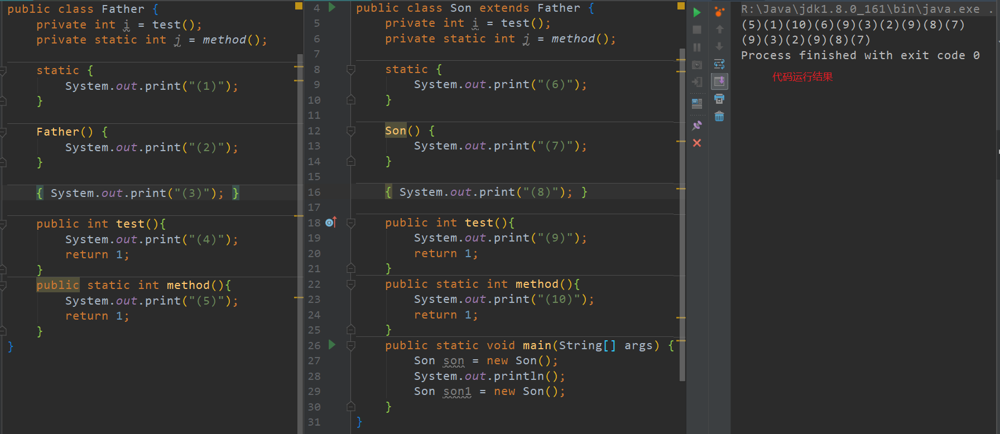

#  ==与equals

- `==`：判断两个对象的地址是否相等。(基本数据类型使用`==`比较的是值，引用类型使用`==`比较的是内存地址)：
  - 比较基本数据类型和包装类，只要`==`一侧有基本数据类型，比较的就是值；
  - 如果比较的一侧有运算符（如：`a+b`），那么比较的是具体数值。
- `equals()`：也是比较两个对象是否相等：
  - 类没有覆盖该方法，此时使用`equals()`比较该类的两个对象时，实际是通过`==`来比较；
  - 类覆盖了该方法，一般使用`equals()`方法比较两个对象的内容是否相等。
  - 包装类在使用`equals()`方法比较时，先比较两者的类型是否相同，如果相同再比较对应的基本数据类型的值是否相同。

# 字符型/字符串常量

区别：

1. 形式上: 字符常量是单引号引起的一个字符 字符串常量是双引号引起的若干个字符
2. 含义上: 字符常量相当于一个整型值(ASCII值),可以参加表达式运算 字符串常量代表一个地址值(该字符串在内存中存放位置)
3. 占内存大小 字符常量只占一个字节 字符串常量占若干个字节(至少一个字符结束标志)

#  初始化★★★

- 类初始化过程
  - 一个类要创建实例需要先加载并初始化该类
    - main方法所在的类需要先加载和初始化
  - 子类要初始化需要先初始化父类
  - 类的初始化就是执行`<clinit>`方法
    - `<clinit>`方法由静态类变量显式赋值代码和静态代码块组成，这两部分从上到下执行
    - 该方法只执行一次
- 实例初始化过程
  - 实例初始化就是执行`<init>()`方法
    - 该方法可能重载有多个，有几个构造器就有几个该方法
    - 该方法由非静态实例变量显式赋值代码和非静态代码块、对应的构造器代码组成
    - 非静态实例变量显式赋值代码和非静态代码块从上到下执行，对应的构造器最后执行
    - 每次创建实例对象，调用对应构造器，执行的就是对应的`<init>()`方法
    - `<init>()`方法的首行是`super(参数)`，即对应父类的`<init>()`方法
    - 在子类构造器中一定会调用父类构造器！
- 方法的重写Override
  - **非静态方法前面其实有一个默认的对象`this`，它在构造器标识的是正在创建的对象，由于main中创建的是Son对象，因此Father类中`i=test()`执行的是子类重写的`test()`方法**
  - 哪些方法不可以被重写？
    - final方法；
    - 静态方法
    - private等子类中不可见方法
  - 对象的多态性
    - 子类如果重写了父类的方法，通过子类对象调用的一定是子类重写过的方法；
    - 非静态方法默认的调用对象是this
    - this对象在构造器(或`<init>()`方法)中就是正在创建的对象

# 变量

局部变量和成员变量的区别：

- 声明位置：
  - 局部变量：方法体`{}`中、形参、代码块`{}`中
  - 成员变量：类中方法外
    - 类变量：static修饰
    - 实例变量：非static修饰
- 修饰符：
  - 局部变量：final
  - 成员变量：public、protected、private、final、static、volatile、transient
- 值存储位置：
  - 局部变量：栈
  - 实例变量：堆
  - 类变量：方法区
- 初始值：
  - 成员变量如果没有被赋初值，则会自动以类型的默认值而赋值（一种情况例外被final修饰但没有被static修饰的成员变量必须显示地赋值）；而局部变量则不会自动赋值。
- 作用域：
  - 局部变量：从声明处开始到所属的`}`结束
  - 实例变量：当前类中使用`this.`(this可省略，this可区分同名变量)访问，其他类中使用`对象.`访问
  - 类变量：当前类中使用`类名.`(类名可省略，this可区分同名变量)访问，其他类中使用`对象.`或`类名.`访问
- 生命周期：
  - 局部变量：每个线程每次调用执行都是新的声明周期；
  - 实例变量：随对象创建而初始化，随对象被回收而小王，每个对象的实例变量都是独立的
  - 类变量：随着类的初始化而初始化，随着类的卸载而消亡，同一个类的所有对象的类变量是共享的
