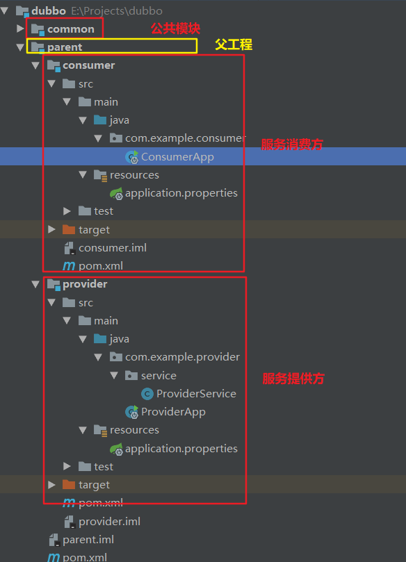

# HelloWorld

订单服务 Web 模块：创建订单等；

用户服务 service 模块：查询用户地址等。

预期结果：订单服务web模块在A服务器，用户服务模块在B服务器，A可以远程调用B的功能。

- 将接口定义、Java Bean等放在一个单独的模块，其他模块通过 pom 文件的方式来引入该模块

- 将服务提供者注册到注册中心(暴露服务)

  1. 导入 Dubbo 依赖

     ```xml
     <!--引入Dubbo-->
     <dependency>
         <groupId>com.alibaba</groupId>
         <artifactId>dubbo</artifactId>
         <version>2.6.2</version>
     </dependency>
     <!--由于注册中心使用的是Zookeeper，需要引入Zookeeper客户端
     	Dubbo 2.6以前的版本引入zkclient操作zookeeper
     	Dubbo 2.6及以后的版本引入curator操作zookeeper
     -->
     <dependency>
         <groupId>org.apache.curator</groupId>
         <artifactId>curator-framework</artifactId>
         <version>2.12.0</version>
     </dependency>
     ```

  2. 配置服务提供者

     ```xml
     <?xml version="1.0" encoding="UTF-8"?>
     <beans xmlns="http://www.springframework.org/schema/beans"
            xmlns:xsi="http://www.w3.org/2001/XMLSchema-instance" xmlns:dubbo="http://dubbo.apache.org/schema/dubbo"
            xsi:schemaLocation="http://www.springframework.org/schema/beans http://www.springframework.org/schema/beans/spring-beans.xsd http://dubbo.apache.org/schema/dubbo http://dubbo.apache.org/schema/dubbo/dubbo.xsd">
         <!--1.指定当前服务/应用的名字-->
         <dubbo:application name="user-service-provider"/>
         <!--2.指定注册中心的位置-->
         <dubbo:registry address="zookeeper://127.0.0.1:2181"/>
         <!--<dubbo:registry protocol="zookeeper" address="127.0.0.1:2181"/>-->

         <!--3.指定通信规则(协议、端口)-->
         <dubbo:protocol name="dubbo" port="20880"/>

         <!--服务的实现-->
         <bean id="userServiceImpl" class="com.zzk.service.impl.UserServiceImpl"/>

         <!--4.暴露服务 retries是注册服务失败后的重试次数(不包含第一次调用) interface是对外暴露的服务接口 ref来指向真正实现服务的对象-->
         <dubbo:service retries="3" interface="com.zzk.service.UserService" ref="userServiceImpl"/>

     </beans>
     ```

- 服务消费者

  1. 引入 Dubbo 依赖

  2. 配置服务消费者

     ```xml
     <?xml version="1.0" encoding="UTF-8"?>
     <beans xmlns="http://www.springframework.org/schema/beans"
            xmlns:xsi="http://www.w3.org/2001/XMLSchema-instance" xmlns:dubbo="http://dubbo.apache.org/schema/dubbo"
            xsi:schemaLocation="http://www.springframework.org/schema/beans http://www.springframework.org/schema/beans/spring-beans.xsd http://dubbo.apache.org/schema/dubbo http://dubbo.apache.org/schema/dubbo/dubbo.xsd">

         <context:component-scan base-package="com.zzk.service.impl"/>

         <dubbo:application name="user-service-consumer"/>

         <dubbo:registry address="zookeeper://127.0.0.1"/>

         <!--声明需要调用的远程服务的接口，生成远程服务代理-->
         <dubbo:service interface="com.zzk.service.UserService" id="userService"/>

     </beans>
     ```


# SpringBoot整合

使用Zookeeper作为注册中心。


## 公共模块

将接口定义、Java Bean等放在一个单独的模块，其他模块通过 pom 文件的方式来引入该模块！！

common模块：创建接口

```java
public interface DemoService {
    String sayHello(String name);
}
```


## 父工程

注意：之后的服务提供方、消费方都是以该模块为父工程，所以在创建提供方、消费方时，不要使用Spring Initializr的方式(这种方式创建出的工程是以`spring-boot-starter-parent`为父工程的)，直接创建Maven工程即可。

parent模块：管理依赖，其pom文件：

```xml
    <modules>
        <module>provider</module>
        <module>consumer</module>
    </modules>
    <properties>
        <spring-boot.version>2.1.3.RELEASE</spring-boot.version>
        <dubbo.version>2.7.0</dubbo.version>
    </properties>

    <dependencyManagement>
        <dependencies>
            <!-- Spring Boot的依赖关系 -->
            <dependency>
                <groupId>org.springframework.boot</groupId>
                <artifactId>spring-boot-dependencies</artifactId>
                <version>${spring-boot.version}</version>
                <type>pom</type>
                <scope>import</scope>
            </dependency>

            <!-- Aapche Dubbo  -->
            <dependency>
                <groupId>org.apache.dubbo</groupId>
                <artifactId>dubbo-dependencies-bom</artifactId>
                <version>${dubbo.version}</version>
                <type>pom</type>
                <scope>import</scope>
            </dependency>

            <dependency>
                <groupId>org.apache.dubbo</groupId>
                <artifactId>dubbo</artifactId>
                <version>${dubbo.version}</version>
                <exclusions>
                    <exclusion>
                        <groupId>org.springframework</groupId>
                        <artifactId>spring</artifactId>
                    </exclusion>
                    <exclusion>
                        <groupId>javax.servlet</groupId>
                        <artifactId>servlet-api</artifactId>
                    </exclusion>
                    <exclusion>
                        <groupId>log4j</groupId>
                        <artifactId>log4j</artifactId>
                    </exclusion>
                </exclusions>
            </dependency>
        </dependencies>
    </dependencyManagement>

    <dependencies>
        <!-- Dubbo Spring Boot Starter -->
        <dependency>
            <groupId>org.apache.dubbo</groupId>
            <artifactId>dubbo-spring-boot-starter</artifactId>
            <version>2.7.0</version>
        </dependency>

        <dependency>
            <groupId>org.apache.dubbo</groupId>
            <artifactId>dubbo</artifactId>
        </dependency>
    </dependencies>
```


## 服务提供者

创建服务提供方：provider。注意：这里是直接创建的Maven工程而不是使用Spring Initializr创建的SpringBoot工程

- pom文件：以 parent 模块为父模块：

  ```xml
      <parent>
          <artifactId>parent</artifactId>
          <groupId>com.example</groupId>
          <version>1.0-SNAPSHOT</version>
      </parent>
      <modelVersion>4.0.0</modelVersion>
  
      <dependencies>
          <!--引入公共模块-->
          <dependency>
              <groupId>com.example</groupId>
              <artifactId>common</artifactId>
              <version>1.0-SNAPSHOT</version>
          </dependency>
          <dependency>
              <groupId>org.springframework.boot</groupId>
              <artifactId>spring-boot-starter</artifactId>
          </dependency>
          <dependency>
              <groupId>org.apache.dubbo</groupId>
              <artifactId>dubbo-spring-boot-starter</artifactId>
              <version>2.7.0</version>
          </dependency>
          <dependency>
              <groupId>org.apache.dubbo</groupId>
              <artifactId>dubbo</artifactId>
          </dependency>
          <dependency>
              <groupId>org.apache.zookeeper</groupId>
              <artifactId>zookeeper</artifactId>
          </dependency>
          <dependency>
              <groupId>org.apache.curator</groupId>
              <artifactId>curator-framework</artifactId>
          </dependency>
          <dependency>
              <groupId>org.apache.curator</groupId>
              <artifactId>curator-recipes</artifactId>
          </dependency>
      </dependencies>
  ```

- 创建application.properties：

  ```properties
  dubbo.application.name=provider
  # 设置扫描的包，该包下的服务会被发布出去
  dubbo.scan.base-packages=com.example.provider.service
  dubbo.registry.address=zookeeper://192.168.*.*:2181
  dubbo.protocol.name=dubbo
  dubbo.protocol.port=2181
  ```

- 创建实际的服务：

  ```java
  @Service(version = "1.0.2") //将服务发布出去(该注解是dubbo的而不是Spring的)
  public class ProviderService implements DemoService {
      @Value("${dubbo.application.name}")
      private String serviceName;
  
      @Override
      public String sayHello(String name) {
          return String.format("[%s] : Hello, %s", serviceName, name);
      }
  }
  ```

- 创建SpringBoot引导程序：

  ```java
  @EnableAutoConfiguration
  public class ProviderApp {
      public static void main(String[] args) {
          SpringApplication.run(ProviderApp.class);
      }
  }
  ```

启动引导程序后，在ZooKeeper客户端中可以发现服务已经被注册了。


## 服务消费者

创建服务消费者：consumer。注意：这里是直接创建的Maven工程而不是使用Spring Initializr创建的SpringBoot工程

- pom文件，和provider模块的pom文件相同，为了后面的测试，多加入了Lombok插件

- 创建application.properties：

  ```properties
  dubbo.application.name=consumer
  dubbo.registry.address=zookeeper://192.168.*.*:2181
  ```

- 创建服务消费：

  ```java
  @Slf4j
  @EnableAutoConfiguration
  public class ConsumerApp {
      @Reference(version = "1.0.2")
      private DemoService demoService;
  
      public static void main(String[] args) {
          SpringApplication.run(ConsumerApp.class).close();
      }
  
      @Bean
      public ApplicationRunner runner() {
          return args -> {
              log.info(demoService.sayHello("mercyblitz"));
          };
      }
  }
  ```

运行程序后，可在控制台找到输出（这里使用的默认的格式）：

2019-03-21 11:30:53.385  INFO 2740 --- [    main] com.example.consumer.ConsumerApp   : [provider] : Hello, mercyblitz

工程结构：

