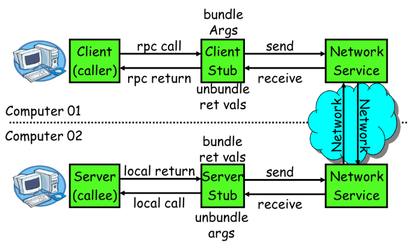
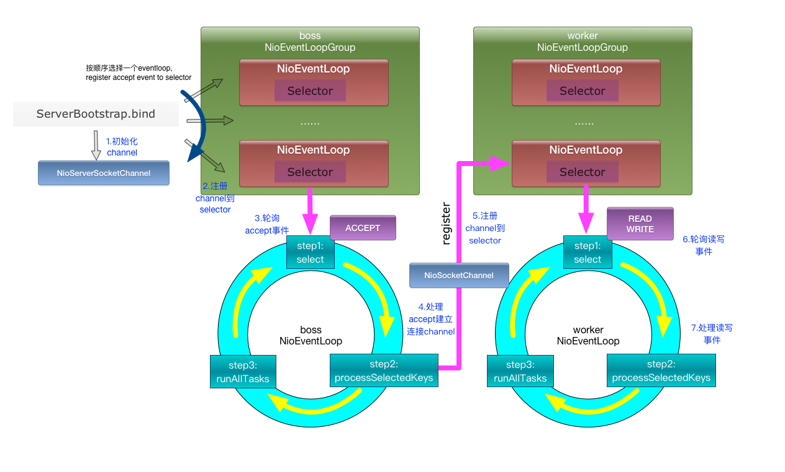

# RPC原理

一次完整的RPC同步调用流程如下： 

1. 服务消费方（client）调用以本地调用方式调用服务；
2. client stub接收到调用后负责将方法、参数等组装成能够进行网络传输的消息体； 
3. client stub找到服务地址，并将消息发送到服务端； 
4. server stub收到消息后进行解码(消息的传输会通过序列化，所以还需要解码)； 
5. server stub根据解码结果调用本地的服务； 
6. 本地服务执行并将结果返回给server stub； 
7. server stub将返回结果打包成消息并发送至消费方； 
8. client stub接收到消息，并进行解码； 
9. 服务消费方得到最终结果。

RPC框架的目标就是要2~8这些步骤都封装起来，这些细节对用户来说是透明的，不可见的。

# Netty 通信原理

Netty是一个异步事件驱动的网络应用程序框架， 用于快速开发可维护的高性能协议服务器和客户端。极大地简化了 TCP 和 UDP 套接字服务器等网络编程。

# Dubbo 原理

## 框架设计

见官网：http://dubbo.apache.org/zh-cn/docs/dev/design.html

## 标签解析

