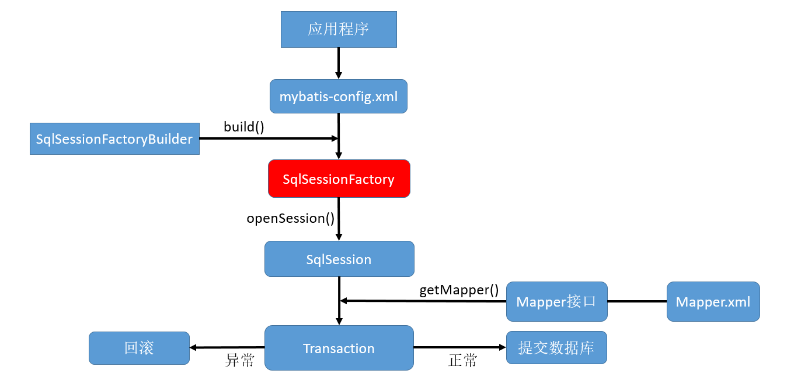

# 1.1 了解

MyBatis 是一个半自动化的持久层框架。（JDBC是纯手工；而Hibernate则是全自动的框架）。几乎消除了所有的 JDBS 代码、参数的手动设置，以及查询结果的返回。[下载地址](https://github.com/mybatis)。

- 好处：
  - 把SQL语句从Java中独立出来，自己编写，更加灵活；
  - 封装了底层JDBC、API的调用，且能将结果集自动转换成JavaBean对象，简化了Java数据库编程的重复工作；
  - 入参无需用对象封装，使用`@Param`。

Maven 下载：

```xml
<dependency>
    <groupId>org.mybatis</groupId>
    <artifactId>mybatis</artifactId>
    <version>3.4.6</version>
</dependency>
<!--还需要导入mysql-connector-java包-->
```

- 核心组件：
  - `SqlSessionFactoryBuilder`：会根据配置或代码来生成`SqlSessionFactory`
  - `SqlSessionFactory`
  - `SqlSession`：代表和数据库的一次会话，用完必须关闭。两个实现类：
    - `DefaultSqlSession`：单线程使用
    - `SqlSessionManager`：多线程环境下使用
    - 在MyBatis和Spring整合包中还有一个`SqlSessionTemplate`，这也是线程安全的
  - SQL Mapper：由一个Java接口和XML文件(注解)构成，需给出对应的SQL和映射规则
    - `Mapper` 接口没有实现类，但是 MyBatis 会为其生成一个代理对象。
- 两个重要的配置文件： 
  - MyBatis 的全局配置文件：包含数据库连接池信息、事务管理器信息等系统运行环境信息；
  - **SQL 映射文件**：保存了每一个 SQL 语句的映射信息。从而将SQL抽取出来。 




# 1.2 HelloWorld

步骤：

1. 创建 Java Bean：`Employee`：字段有 `id`、`lastName`、`email`、`gender `

2. 创建接口 `EmployeeMapper` 

   ```java
   public interface EmployeeMapper {
       public Employee getEmpById(Integer id);
   }
   ```

3. SQL映射文件 EmployeeMapper.xml （与接口同名）与接口绑定

   ```xml
   <?xml version="1.0" encoding="UTF-8"?>
   <!DOCTYPE mapper
   PUBLIC "-//mybatis.org//DTD Mapper 3.0//EN"
   "http://mybatis.org/dtd/mybatis-3-mapper.dtd">
   <mapper namespace="dao.EmployeeMapper">
   <!--
        namespace:名称空间,指定为接口的全类名
        id:唯一标识,指定为接口方法的id
        resultType：返回值类型
        #{id}：从传递过来的参数中取出id值
    -->
        <select id="getEmpById" resultType="bean.Employee">
            select id,last_name lastName,email from tb1_employee where id=#{id}
        </select>
   </mapper>
   ```

4. MyBatis 的配置文件mybatis-config.xml （名字不是固定的），注意将SQL映射文件注册。配置文件中包含了MyBatis系统的核心设置，包括：数据源（用于获取数据库连接实例）、事务管理器。

   ```xml
   <?xml version="1.0" encoding="UTF-8" ?>
   <!DOCTYPE configuration
   PUBLIC "-//mybatis.org//DTD Config 3.0//EN"
   "http://mybatis.org/dtd/mybatis-3-config.dtd">
   <configuration>
        <!-- 使用db.properties数据库配置文件 -->
        <properties resource="db.properties"/>
        <environments default="development">
            <environment id="development">
                 <transactionManager type="JDBC" />
                 <dataSource type="POOLED">
                     <property name="driver" value="${driver}" />
                     <property name="url" value="${url}" />
                     <property name="username" value="${username}" />
                     <property name="password" value="${password}" />
                 </dataSource>
            </environment>
        </environments>
        
        <!-- 将 SQL 映射文件（EmployeeMapper.xml）注册到全局配置文件（mybatis-config.xml）中 -->
        <mappers>
            <mapper resource="mybatis/mapper/EmployeeMapper.xml" />
        </mappers>
   </configuration>
   ```

5. 代码（这里为了使用 Junit 测试，所以将其写在了方法内部）

   ```java
   public void hello() throws IOException {
       //mybatis的配置文件
       String resource = "mybatis-config.xml";
       //MyBatis 提供了一个多功能的类 Resources，这个类有很多方法，可以很简单地将类路径和其他位置的配置文件加载进来。
       InputStream inputStream = Resources.getResourceAsStream(resource);
       //构建sqlSession的工厂
       SqlSessionFactory sqlSessionFactory = new SqlSessionFactoryBuilder().build(inputStream);
       //获取 SqlSession 实例，能直接执行已经映射的 SQL 语句。获取到的 SqlSession 不会自动提交数据
       SqlSession openSession = sqlSessionFactory.openSession();
       try {
           //获取接口的实现类
           //会为接口自动创建一个代理对象，代理对象来执行增删改查方法
           EmployeeMapper mapper = openSession.getMapper(EmployeeMapper.class);
           Employee employee = mapper.getEmpById(1);
           System.out.println(mapper.getClass());    //class com.sun.proxy.$Proxy5
   //也可使用：Employee employee = session.selectOne("dao.EmployeeMapper.getEmpById",1) 
           System.out.println(employee);
       } finally {
           openSession.close();
       }
   }
   ```

   注意：使用`Employee employee = session.selectOne("dao.EmployeeMapper.getEmpById",1)`时，会被映射到和`namespace`同名的 Mapper 类的一个方法上，该方法会匹配方法名、传入的参数、返回值类型。原本的方法相对于该方式更加安全

   - MyBatis 对于所有配置元素包括`statements`(上面的`dao.EmployeeMapper.getEmpById`就是`statement`)、`result maps`、`caches`等使用了下面两种名称规则（name resolution rules）：
     - Fully qualified names。如：`dao.EmployeeMapper.getEmpById`
     - Short names。如：`getEmpById`。这种方式用于应用意义明确的对象。如果有两个及以上的话（如：`dao.EmployeeMapper.getEmpById`和`dao.MyEmployeeMapper.getEmpById`），就会产生异常。

- 补充：偶尔也可以使用注解来映射 SQL，这样就不用写 SQL 映射文件了，但不建议这么做：

  ```java
  public interface EmployeeMapperAnnotation { 
      @Select("select * from tb1_employee where id = #{id}")
      public Employee getEmpById(Integer id);
  }
  ```

同时存在XML方式和注解方式时，XML方式时会覆盖注解方式。