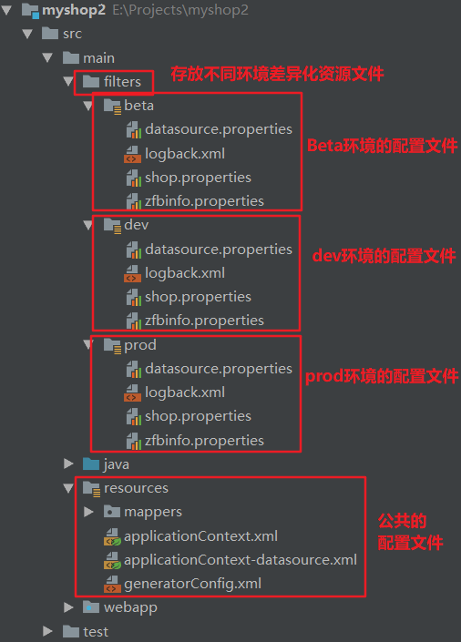

常见的 Maven 命令 

注意：执行与构建过程相关的Maven命令（编译、测试、打包。。。），必须进入pom.xml所在的目录。

| 常用命令                                 | 含义         |
| ---------------------------------------- | ------------ |
| mvn clean                                | 清理         |
| mvn compile                              | 编译主程序   |
| mvn test-compile                         | 编译测试程序 |
| mvn test                                 | 执行测试     |
| mvn package                              | 打包         |
| mvn install                              | 安装         |
| mvn site                                 | 生成站点     |
| mvn clean package -Dmaven.test.skip=true | 跳过单元测试 |
| mvn dependency:tree                      | 形成依赖树   |


# 1.介绍+安装

自动化构建工具：Maven

- ①Maven是一款服务于java平台的自动化构建工具。

- ②借助Maven，可以将jar包仅仅保存在“仓库”中，有需要使用的工程引用这个文件接口，并不需要把jar包复制过来。  借助Maven可以以一种规范的方式下载jar包，因为所有知名框架或第三方工具的jar包已经按照统一的规范存放在Maven的中央仓库中。同时Maven会自动将依赖的jar包导入进来。 

- ③开发过程中，所有的路径或配置文件中配置的类路径等都是以编译结果的目录结构为标准的。 

  将工程编译的结果放到服务器指定目录下的过程叫做**部署**。

  

- ④构建过程中的各个环节 ：

  - 【1】清理：将以前的旧的class字节码文件删除，为下一次编译做准备    
  - 【2】编译：将Java源程序编译成class字节码文件    
  - 【3】测试：自动测试，自动调用 JUnit 程序    
  - 【4】报告：测试程序执行的结果    
  - 【5】打包：动态Web工程打war包，Java工程打jar包    
  - 【6】安装：将本地工程 jar 上传到本地仓库 
  - 【7】部署：将动态Web工程生成的war包复制到Servlet容器的指定目录下，使其可以运行 

- ⑤自动化构建 

- ⑥联网的问题： 

  - Maven的核心程序仅仅定义了抽象的生命周期，但是具体的工作必须由特定插件来完成。而插件本身并不包含在核心程序中 。
  - 执行的Maven命令需要用到某些插件时，Maven核心程序会首先到本地仓库中查找。 
  - 本地仓库默认路径：`[系统中当前用户的家目录]\.m2\repository `
  - 如果找不到需要的插件，会自动连接外网，到中央仓库下载。如果无法连接外网，构建失败。 
  - 修改默认本地仓库的位置可以让Maven核心程序到指定的目录下查找插件 :
    - 1.找到Maven解压目录 \conf\settings.xml 
    - 2.在文件中找到`<localRepository>`标签
    - 3.将` <localRepository> /path/to/local/repo </localRepository>`从注释中取出来修改为 `<localRepository>自己想要设置的仓库目录</localRepository> `

- 安装

  - ①配置JAVA_HOME环境变量（命令行输入： `echo %JAVA_HOME% ` 查看）
  - ②解压Maven核心程序的压缩包    
  - ③配置Maven相关的环境变量：
    -  `MAVEN_HOME 或 M2_HOME`：`D:\DevelopInstall\apache-maven-3.5.2 `
    - `Path` ：追加`D:\DevelopInstall\apache-maven-3.5.2\bin `
  - ④运行 mvn -v 命令查看Maven版本验证是否配置成功 


- http://mvnrepository.com/ 搜索需要的jar包的依赖信息 


# 2.配置

## eclipse

- 不同的工作区需要重新设置 ！
- Windows——>perferences——>Maven——>

  - Installations   指定Maven核心程序，不建议使用插件自带的程序，而是使用自己解压的。
  - User Settings  指定conf/settings.xml的位置，进而获取本地仓库的位置。 


在修改了本地仓库后，使用eclipse第一次创建Maven工程会很慢。创建Maven工程时注意勾选 Create a simple project（skip archetype selection） 

- 【1】创建Maven版Java工程 :
  - New——>Maven Project——>勾选 Create a simple project（skip archetype selection）——>Next——>输入GroupId、ArtifactId——>默认Packaging选择jar——>Finish 
- 【2】创建Maven版Web工程 :
  - New——>Maven Project——>勾选 Create a simple project（skip archetype selection）——>Next——>输入GroupId、ArtifactId——>Packaging选择war——>Finish 
  - 然后在创建的工程上右键——>Properties——>Project Facets——>取消Dynamic Web Module的勾选——>Apply——>再勾选Dynamic Web Module——>点击下方出现的Further configuration avaliable...——>将Content directory修改为 src/main/webapp 

- 【3】执行Maven命令： 
  - 找到pom.xml文件 ——> 右键 ——> Run As 会出现命令的选项 ;如果选择了 Maven build... 选项，可以在Goals中输入命令，如compile，然后run 


## IDEA

- Settings——>Build,Execution,Deployment——>Build Tools——>Maven——>
  - Maven home directory  指定Maven核心程序，不建议使用插件自带的程序，使用自己解压的。
  - User settings file  指定conf/settings.xml的位置，进而获取本地仓库的位置。


- 【1】创建Maven版Java工程对应骨架：maven-archetype-quickstart

- 【2】创建Maven版Web工程：

  1. 不选择任何骨架直接创建Java工程
  2. 进入Product Structure选项
  3. 选中Facets，点击加号给当前工程添加Web框架支持，会自动跳转到Modules
  4. 在Web Resource Directories中编辑Web Resource Directory为：当前项目\src\main\webapp，会自动创建文件夹
  5. 在Deployment Descriptors中编辑Path属性为：当前项目\src\main\webapp\WEB-INF\web.xml，保存后自动创建web.xml文件

  - 可以添加Tomcat的配置来运行；也可以在Maven中配置Tomcat的插件

    ```xml
        <build>
             <plugins>
                  <plugin>
                       <groupId>org.apache.tomcat.maven</groupId>
                       <artifactId>tomcat7-maven-plugin</artifactId>
                        <version>2.2</version>
                      <configuration>
                           <port>9999</port>
                           <path>/</path>
                      </configuration>
                  </plugin>
             </plugins>
         </build>
    ```

- 【3】创建一个多模块的 Maven 工程：

  1. 创建一个普通的 Maven 工程，删除产生的文件(夹)，仅留下 .idea 文件夹；
  2. 新建 Module ，parent 模块用于集中定义全局的配置，如：依赖的模块、第三方jar包、插件，且打包类型为 pom；
  3. 在 parent 模块上新建子模块....


## 配置JDK

- 设置通过Maven创建的工程的JDK版本 ：

  - 方法一.配置Maven的默认配置(适用于所有创建的Maven工程) 

    - 【1】打开settings.xml文件
    - 【2】找到 profiles 标签
    - 【3】按注释中的例子增加配置，添加： 

    ```xml
    <profile>
         <id>jdk-1.8</id>
         <activation>
             <activeByDefault>true</activeByDefault>
             <jdk>1.8</jdk>
         </activation>
         <properties>
              <maven.compiler.source>1.8</maven.compiler.source>
              <maven.compiler.target>1.8</maven.compiler.target>
              <maven.compiler.compilerVersion>1.8</maven.compiler.compilerVersion>
         </properties>   
    </profile> 
    ```

  - 方法二：修改Maven项目的配置（适用于当前项目） 。在pom.xml中加入： 

    ```xml
        <build>
             <plugins>
                  <plugin>
                       <groupId>org.apache.maven.plugins</groupId>
                       <artifactId>maven-compiler-plugin</artifactId>
                      <configuration>
                        <source>1.8</source>
                        <target>1.8</target>
                        <encoding>UTF-8</encoding>
                      </configuration>
                  </plugin>
             </plugins>
         </build>
    ```


# 3.核心概念

- 核心概念

  - ==①约定的目录结构==
  - ==②POM==
  - ==③坐标==
  - **==④依赖==**
  - ⑤仓库
  - ⑥生命周期/插件/目标
  - ⑦继承
  - ⑧聚合 

- 目录结构 

  - ① 创建约定的目录结构

    

  - ②自己定义的东西想让框架或工具知道，有两种办法：

    - 以配置的方式明确告诉框架，如： `<param-value>calsspath:spring-context.xml</param-value>`
    - 遵守框架内部已经存在的约定       
      - 约定>配置>编码  ：能以配置解决的问题尽量不用编码的方式解决 

  - ③POM （Project Object Model项目对象模型 ）

    - pom.xml对于Maven工程是核心配置文件，与构建过程相关的一切设置都在这个文件中进行配置。


## 坐标+仓库

- Maven的坐标：gav（首字母） 。 使用下面三个向量在仓库中唯一定位一个Maven工程 ：

  - groupid：公司或组织域名倒序+项目名 `<groupid>com.zhangzekai_fS.maven</groupid> `
  - artifactid：模块名称 `<artifactid>Hello</artifactid> `
  - version：版本 `<version>1.0.0</version> `

- Maven工程的坐标与仓库中路径的对应关系 (举例说明)

  ```xml
  <groupId>com.google.guava</groupId>
  <artifactId>guava-parent</artifactId>
  <version>24.0-jre</version>
  ```

  对应的本地仓库中文件的路径 :

  <u>com/google/guava</u> / <u>guava-parent</u> / <u>24.0-jre</u> / <u>guava-parent-24.0-jre.jar</u> 

- 仓库：

  - 分类：
    - 本地仓库：当前电脑上部署的仓库目录，为当前电脑上所有Maven工程服务。 
    - 远程仓库 ：
      - 私服：搭建在局域网环境下，为当前局域网范围内的所有Maven工程服务。如Nexus
      - 中央仓库：假设在Internet上，为全世界所有Maven工程服务。
      - 中央仓库镜像：架设在各个大洲，为中央仓库分担流量，减轻中央仓库负担，提升用户访问速度。 
  - 仓库中保存的内容：Maven工程 
    - Maven自身所需的插件
    - 第三方框架或工具的jar包
    - 自己开发的Maven工程 


## 依赖

- Maven解析依赖信息时会到本地仓库中查找被依赖的jar包 
  - 对于自己开发的Maven工程，进入无法找到的路径下，使用 `mvn install `命令安装后就可以进入仓库 


### **依赖范围**

- `<scope> </scope>`默认值为 `compile `

  - compile：运行期有效，需打入包中
  - provided：编译期有效，运行期不需要，不会打入包中
  - runtime：编译不需要，在运行期有效，需要打入包中
  - test：测试需要，不会打入包中
  - system：非本地仓库引入、存在系统的某个路径下的jar。（一般不使用）

  | 范围                     | compile     | test   | provided        |
  | ------------------------ | ----------- | ------ | --------------- |
  | 对主程序（编译）是否有效 | 有效        | 无效   | 有效            |
  | 对测试程序是否有效       | 有效        | 有效   | 有效            |
  | 是否参与打包             | 参与        | 不参与 | 不参与          |
  | 是否参与部署             | 参与        | 不参与 | 不参与          |
  | 典型例子                 | spring-core | junit  | servlet-api.jar |

  - ==依赖关系弄错可能会发生jar包与jar包之间的冲突，导致jsp文件抛出空指针异常==


### 依赖传递性

下图中实线是直接依赖，虚线是传递导致的依赖 


​	Friend、MakeFriends工程由于 Hello工程依赖A、X jar包，所以也会依赖A、X jar包 。

​	依赖传递性的好处：可以传递的依赖不必再每个模块工程中都重复声明，在“最下面”的工程中声明一次即可； 

​	注意：**非compile的依赖无法传递。所以在各个工程模块中，如果有需要就得重复声明依赖**


- 依赖的排除（排除也有传递性，在Friend排除依赖后，MakeFriends也会排除该依赖） 

  - 假设X.jar不太稳定 Friend 想要排除依赖，在 Friend 的pom.xml中依赖 Hello 工程的`<dependency>`标签中加入： 

    ```xml
    <exclusions>
        <exclusion>
            <groupId>xxxxxx</groupId>
            <artifactId>xxxxxxxxxX</artifactId>
        </exclusion>
    </exclusions>
    ```

- ==依赖的原则==

  - 作用：解决模块工程之间的jar包冲突问题 

  - **路径最短者优先原则**

    

    - Hello 和 Friend 两个工程依赖于不同版本的 A.jar，而 MakeFriends 工程并没有直接声明依赖于哪个，则由于 Maven 内部的就近原则，MakeFriends 会依赖于离工程更近的 A-1.2.14，如果想要依赖于 A-1.2.17，可以直接在工程中声明 。
    - 如果在项目的pom文件中增加了 A 依赖，会覆盖掉依赖传递引入的 A 依赖。

  - **==路径相同时先声明者优先原则，先声明指的是dependency标签的声明顺序==**

    

### 依赖管理

- 统一管理依赖的版本 

  - 如果Spring各个jar包的版本都是4.0.0，现在需要同一升级为4.1.1，怎么办？ 

    - 1.使用 `<properties>` 标签内使用自定义标签统一声明版本号 

      ```xml
      <properties>
         <zzk.spring.version>4.1.1.RELEASE</zzk.spring.version>
      </properties>
      ```

    - 2.在需要统一版本的位置，使用  `${自定义标签名}` 引用声明的版本号 

      ```xml
      <dependency>
          <groupId>org.springframework</groupId>
          <artifactId>spring-core</artifactId>
          <version>${zzk.spring.version}</version>
          <scope>compile</scope>
      </dependency>
      ```

其实properties标签配合自定义标签声明数据的配置并不是只能用于声明依赖的版本号。凡是需要统一声明后再引用的场合都可以使用。如配置编码方式 


##     生命周期

- 生命周期：

  - 各个构建环节执行的顺序，不能打乱，必须按既定的正确顺序执行。
  - Maven的核心程序中定义了抽象的生命周期，生命周期中各个阶段的具体任务是由插件来完成的。
  - Maven核心程序为更好的实现自动化构建，按这一特点执行生命周期的各个阶段：不论现在要执行生命周期中的哪一个阶段，都是从这个生命周期最初的位置开始执行。

- 插件：

  - 生命周期的各个阶段仅仅定义了要执行的任务是什么；

  - 各个阶段和插件的目标是对应的；

  - 相似的目标由特定的插件完成 。eg：

    | 生命周期阶段 | 插件目标    | 插件                  |
    | ------------ | ----------- | --------------------- |
    | compile      | compile     | maven-compiler-plugin |
    | test-compile | testCompile | maven-compiler-plugin |

  - 可以将插件目标看作“调用插件功能”的命令 。

## 继承

由于test范围的依赖不能传递，必然会分散在各个工程模块工程中，容易造成版本不一致。以junit为例 ：

- 需求：统一管理各个模块工程中对junit依赖的版本。

- 解决思路：将 junit 依赖版本统一提取到“父”工程中，在子工程中声明junit依赖时不指定版本，以父工程中统一设定的为准，同时也便于修改。 

- 步骤：

  - 1.创建一个Maven工程作为父工程。注意，打包方式为pom 

    ```xml
    <groupId>com.zzk.maven</groupId>
    <artifactId>Parent</artifactId>
    <version>0.0.1-SNAPSHOT</version>
    <packaging>pom</packaging>
    ```

  - 2.在子工程中声明对父工程的引用 

    ```xml
    <!-- 子工程中声明父工程 -->
    <parent>
        <groupId>com.zzk.maven</groupId>
        <artifactId>Parent</artifactId>
        <version>0.0.1-SNAPSHOT</version>
                  
        <!-- 以当前工程的pom.xml文件为基准的父工程pom.xml文件的相对路径 -->
        <relativePath>../Parent/pom.xnl</relativePath>
    </parent>
    ```

  - 3.将子工程的坐标中与父工程坐标中重复的内容删除

  - 4.在父工程中统一管理 junit的依赖 

    ```xml
    <!-- 配置聚合 -->
    <modules>
        <!-- 指定各个子工程的相对路径 -->
        <module>../WebProject01</module>
        <module>../JavaProject01</module>
    </modules>
    
    <!-- 配置依赖的管理 -->
    <dependencyManagement>
        <dependencies>
            <dependency>
                <groupId>junit</groupId>
                <artifactId>junit</artifactId>
                <version>4.0</version>
                <scope>test</scope>
            </dependency>
        </dependencies>
    </dependencyManagement>
    ```

  - 5.在子工程中删除junit依赖的版本号部分 

    ```xml
    <!-- 查看父工程对子工程的依赖管理 -->
    <dependency>
        <groupId>junit</groupId>
        <artifactId>junit</artifactId>
        <version>4.9</version>    出现警告：提示父工程已经管理，所以删除这一行
        <scope>test</scope>
    </dependency>
    ```

		注意：配置继承后，执行安装命令时，需要先安装父工程。 

## 聚合

- 聚合

  - 作用：一键安装各个模块工程

  - 配置方式：在一个总的聚合工程中配置各个参与聚合的模块。可以在父工程中配置，也可以重新创建一个工程去聚合。 

    ```xml
    <!-- 配置聚合 -->
    <modules>
        <!-- 指定各个子工程的相对路径 -->
        <module>../WebProject01</module>
        <module>../JavaProject01</module>
    </modules>
    ```

  - 使用方式：在聚合工程的pom.xml文件上点右键——>Run As——>Maven Install 

# 4.特殊设置

## 4.1 插件

```xml
<!-- 配置当前工程构建过程中的特殊设置 -->
<build>
    <finalName>SessionWeb</finalName> <!-- 工程最终的名字 -->
    <!-- 配置构建过程中需要使用的插件 -->
    <plugins>
        <plugin>

            <!-- 针对插件进行的配置 -->
            <configuration>
                <container>

                </container>
            </configuration>

            <!-- 配置插件在什么情况下执行 -->
            <executions>
                <execution>
                    <id> </id>

                    <!-- 声明周期的阶段 -->
                    <phase>install</phase>
                    <goals>
                        <!-- 插件的目标 -->
                        <goal>run</goal>
                    </goals>
                </execution>
            </executions>
        </plugin>
    </plugins>
</build>
```

常用插件：

```xml
<!-- 编译插件，此处用来设置jdk的版本，否则默认的版本很低 -->
<plugin>
    <groupId>org.apache.maven.plugins</groupId>
    <artifactId>maven-compiler-plugin</artifactId>
    <configuration>
        <source>1.8</source>
        <target>1.8</target>
        <encoding>UTF-8</encoding>
        <!-- 可以将本地jar包也发布到服务器上-->
        <compilerArguments>
            <extdirs>${project.basedir}/src/main/webapp/WEB-INF/lib</extdirs>
        </compilerArguments>
    </configuration>
</plugin>
<!-- 资源文件处理插件，必须配置 -->
<plugin>
    <groupId>org.apache.maven.plugins</groupId>
    <artifactId>maven-resources-plugin</artifactId>
    <configuration>
        <encoding>UTF-8</encoding>
    </configuration>
</plugin>
```


## 4.2 环境隔离

- 实际的项目环境：
    - 本地开发环境(Local)
    - 开发环境(Dev)
    - 测试环境(Beta)
    - 线上生产环境(Prod)

环境之间各种配置的差异，如：FTP服务器相关配置不同、数据库配置不同...

Maven环境隔离用于解决环境之间各种配置的差异，可以分环境编译、打包、部署。

使用步骤：

1. 在pom.xml的build节点中增加：

   ```xml
   <resources>
       <!-- 不同环境的资源文件 -->
       <resource>
           <directory>src/main/filters/${deploy.type}</directory>
           <excludes>
               <!--这里排除是因为jsp不需要环境隔离-->
               <exclude>*.jsp</exclude>
           </excludes>
       </resource>
       <!-- 所有公共资源文件 -->
       <resource>
           <directory>src/main/resources</directory>
       </resource>
   </resources>
   ```

2. 在pom.xml中增加profiles节点

   ```xml
       <profiles>
           <profile>
               <id>dev</id>
               <activation>
                   <!--默认激活的是dev环境-->
                   <activeByDefault>true</activeByDefault>
               </activation>
               <properties>
                   <deploy.type>dev</deploy.type>
               </properties>
           </profile>
           <profile>
               <id>beta</id>
               <properties>
                   <deploy.type>beta</deploy.type>
               </properties>
           </profile>
           <profile>
               <id>prod</id>
               <properties>
                   <deploy.type>prod</deploy.type>
               </properties>
           </profile>
       </profiles>
   ```

3. 新建对应的文件夹，并把要隔离的文件分开，公共的留下

   - maven标准目录中，提供了一个filters目录用于存放资源过滤文件。推荐在filters目录下创建，而不是resources目录，因为resources目录中的文件默认情况下是不会被过滤的，还需在resources节点下额外的配置一些东西；这样的话结构也较清晰，**resource目录存放公共资源文件，filters目录存放不同环境差异化资源文件**。

     

4. 在IDEA右侧Maven Products，选中本地开发环境对应的环境

5. 打包命令：在Maven命令后加入参数`-P${环境标识}`(这里的$只是用来引用环境，不要写上去)，如：`mvn clean package -Dmaven.test.skip=true -Pbeta`

注意，还需要导入资源文件处理插件!