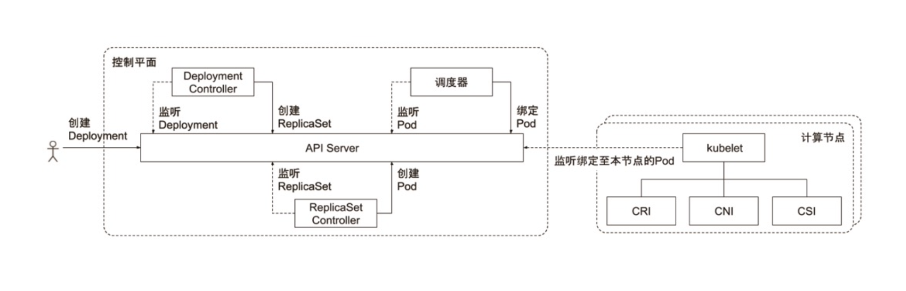
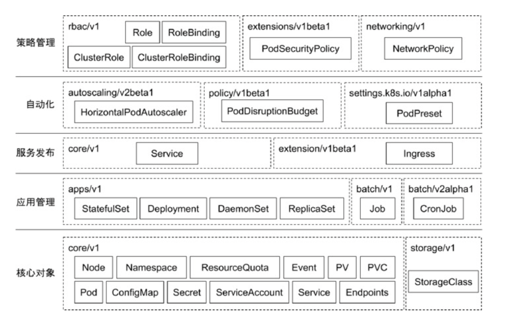

- Imperative 命令式，如何做
- Declarative 声明式，做什么。K8s 是声明式的系统

Kubernetes 所有管理能力构建在对象抽象的基础上，核心对象包括：
- Node，**计算节点的抽象**，用于描述计算节点的资源抽象、健康状态等，是 Pod 真正运行的主机，可以物理机，也可以是虚拟机
- Namespace，**资源隔离的基本单位**，对一组资源和对象的抽象集合
- Pod，**描述应用实例**，包括镜像地址、资源需求，是最核心的对象，是一组紧密关联的容器集合，支持多个容器在一个 Pod 中共享网络和文件系统，可以通过进程间通信和文件共享这 种简单高效的方式组合完成服务
- Service，服务如何将应用发布成服务，本质上是负载均衡和域名服务的声明

两类节点：master node，worker node

# master node

- API Server，整个集群的 API 网关，唯一带有用户可访问 API 及用户可交互的组件，会暴露一个 RESTful 的 API 
- Cluster Data Store，K8s 使用 etcd
- Controller Manager，包括了节点控制器、副本控制器、端点(endpoint)控制器以及服务账户等
- Scheduler，会监控新建的 pods(一组或一个容器)并将其分配给节点

## API Server

功能：

- 提供集群管理的 RESTful API 接口，包括
    - 认证 Authentication
    - 授权 Authorization
    - 准入 Admission（Mutating & Valiating），相当于校验收到的请求是否合法
- 提供其他模块之间的数据交互和通信的枢纽
    - 其他模块通过 APIServer 查询或修改数据，**只有 APIServer 才直接操作 etcd**
- APIServer 提供 etcd 数据缓存以减少集群对 etcd 的访问

## Cluster Data Store

K8s 使用 etcd 作为 Cluster Data Store。

etcd 是基于 Raft 开发的分布式 key-value 存储，可用于服务发现、共享配置以及一致性保障(如数据库选主、分布式锁等)。

## Controller Manager

作用是确保 Kubernetes 遵循声明式系统规范，确保系统的真实状态（Actual State）与用户定义的期望状态（Desired State）一致；

Controller Manager 是多个控制器的组合，每个 Controller 事实上都是一个 control loop，负责侦听其管控的对象，当对象发生变更时完成配置；

Controller 配置失败通常会触发自动重试，整个集群会在控制器不断重试的机制下确保最终一致性( Eventual Consistency)。

> 控制器的实现都可以看作是生产者-消费者模型。

Controllers 的协同工作：



### 创建pod/删除pod/增加副本流程！

```yaml
apiVersion: apps/v1
kind: Deployment
metadata:
  name: nginx
spec:
  replicas: 1
  selector:
    matchLabels:
      app: nginx
  template:
    metadata:
      labels:
        app: nginx
    spec:
      containers:
        - name: nginx
          image: nginx
```

创建 pod 流程：

- 1.通过 `kubectl create -f nginx-deploy.yaml` 创建了一个 deployment 发送给 API Server；
- 2.API Server 认证、鉴权完成后，将这个 deployment 存储到 etcd 中；
- 3.Controller Manager 中的 **Deployment Controller** 监听到有一个 deployment 对象，于是创建 ReplicaSet 对象发到 API Server 并存储到 etcd；
- 4.Controller Manager 中的 **ReplicaSet Controller** 监听到了 ReplicaSet 被创建了，于是创建 Pod 对象发到 API Server 并存储到 etcd；
- 5.Scheduler 监听到有一个 pod 被创建，该 pod 有一个 nodeName 属性值为空（ `kubectl get pod xxx -oyaml` 查看），于是找到合适的 Node 将该 pod 部署上去并将 Node 写入 nodeName 属性中，然后调度器将结果写入 API Server；
- 6.Wroker Node 上的 kubelet 会在本地查看该 pod 是否正在运行，如果没有，说明是一个新的 pod，就会创建 pod

> K8s 不会使用 Docker 的网络！K8s 在启 docker 时只启 runtime，并不会挂载网络，且之后也是使用 CNI 调用网络插件来给 pod 添加网络的
>
> K8s 是使用 CSI 来为 pod 挂载存储的
>
> Deployment Controller 会把 template 的内容计算哈希值，所以变化时，Deployment Controller 就认为你是要做版本变更

删除 pod 但不修改副本数流程：

- 1.通过 `kubectl delete pod xx` 删除 pod，会产生一个 pod delete 的事件
- 2.ReplicaSet Controller 会监听到这个事件，通过比对配置文件中 replicas 的值与实际的 pod 数量，发现实际的数量少了，就会创建一个新的 pod（保证用于期望的和实际的相同）发送到 API Server，之后的过程同上面的 4 及之后的步骤。

为了高可用，需要冗余部署，增加副本数流程：

- 1.通过 `kubectl edit deployment nginx` 将配置文件中的 replicas 改为 3；

> 也可以通过 `kubectl scale deploy deployment-name --replicas=3` 命令调整副本数

- 2.Deployment Controller 监听到 replicas 被改变，将 ReplicaSet 调整为 3，同样会发送到 API Server 并存储
- 3.ReplicaSet Controller 会创建 3 个 pod 发送到 API Server
- 4.三个 pod 会被调度器调度到 Node 然后运行，这样就实现了冗余部署，但是此时三个 nginx 服务有多个 IP，所以需要负载均衡，对外提供一个相对稳定的静态的同一入口
- 5.`kubectl expose deploy nginx --selector app=nginx --port=80 --type=NodePort` 创建了一个 Service 来对 nginx 这个 deployment 中的多个服务通过 NodePort 的方式/类型 暴露出来提供统一的服务，暴露的服务端口是 80

> selector 后面是用来选择多个 pod 共有的标签的，`kubectl get pod --show-labels` 查看标签

## scheduler

负责分配调度 Pod 到集群内的节点上，它监听 kube-apiserver，查询还未分配 Node 的 Pod，然后根据调度策略为这些 Pod 分配节点（更新 Pod 的 nodeName 字段）。

监控当前集群所有未调度的 Pod，并且获取当前集群所有节点的健康状况和资源使用情况，为待调度 Pod 选择最佳计算节点，完成调度。

调度阶段：
- Predicate：过滤不满足条件的节点，如资源不足、端口冲突等。
- Priority：按既定要素将满足调度需求的节点评分，选择最佳节点。
- Bind：将计算节点与 Pod 绑定，完成调度。

# worker node

- kubelet，负责调度到对应节点的 Pod 的生命周期管理
- kube-proxy，负责节点的网络，在主机上维护网络规则并执行连接转发。它还负责对正在服务的 pods 进行负载平衡。

## kubelet

K8s 的初始化系统（init system），每个节点都会有这个组件。

负责调度到对应节点的 Pod 的生命周期管理，执行任务并将 Pod 状态报告给主节点的渠道，通过 container runtime（拉取镜像、启动和停止容器等）来运行这些容器。还会定期执行被请求的容器的健康探测程序。

## kube-proxy

监控集群中用户发布的服务，并完成**负载均衡**配置。

每个 node 的 Kube-Proxy 都会配置相同的负载均衡策略，使整个集群的服务发现建立在分布式负载均衡器之上，服务调用无需经过额外的网络跳转（Network Hop）。

LB（负载均衡）基于不同插件实现：userspace；iptables；ipvs。

# 非核心组件

- kube-dns，负责为整个集群提供 DNS 服务
- Ingress Controller，为服务提供外网入口
- MetricsServer，提供资源监控
- Fluentd-Elasticsearch，提供集群日志采集、存储、查询

# kubectl 常用命令

K8s 的命令行工具，默认读取配置文件 ~/.kube/config。

kubectl 相关命令加上`-v 9`就相当于开启了 debug，可以看到 kubectl 执行具体命令的过程，如 `kubectl get ns -v 9` 

`kubectl api-resources` 可以查看 kubernetes 中提供的对象，长名及对应的短名。

kubectl 命令都是向 API Server 发送 RESTful 请求完成的，如果 xx.yaml 文件修改了，

可以使用`kubectl replace -f xx.yaml` 的方法去更新，这个请求其实就是发送了 PUT 请求(可通过debug 方式查看)，会把 xx.yaml 的文件内容全部作为请求体发送过去，如果文件内容较大效率会比较低；

可以使用 `kubecrl apply -f xx.yaml` 的方法去更新，这个请求是发送的 PATCH 请求，会在客户端比较新旧对象，将当前对象的增量发送到 API Server 的，类似于将原本的配置和增量配置做了 merge，如果想要替换掉原本的部分配置，需要使用 replace。

- kubectl get
```shell
kubectl get 对象类型 (具体的对象) 具体的操作
# 如果要看一个对象的细节
# -oyaml 输出详细信息为 yaml 格式
# -w watch 看该对象的后续变化
# -owide 以详细列表的格式查看对象
kubectl get ns default -oyaml # 获取 default 这个 namespace 的细节
kubectl get pod -n kube-system # 获取 kube-system 这个 namespace 下的 pod
kubectl get pod -l app=nginx # 获取标签满足 app=nginx 的 pod
```

- kubectl describe  展示资源的详细信息和**相关 Event**
```powershell
kubectl describe 对象类型 (具体的对象)
kubectl describe deployment nginx
```

- kubectl exec 提供进入运行容器的通道，可以进入容器进行 debug 操作，类似于 docker exec
```powershell
# 在命令前面加 --
kubectl exec -it etcd_vm210 -- sh
```

- kubectl logs 查看 pod 标准输出的日志，如果日志没有写到 stdout，那就 exec 进去看日志文件
```powershell
kubectl logs -f xxx 
kubectl logs exec -it xxx -- tail -f /xx.log
```

- kubectl label 打标签
```powershell
# 给 vm100 的 node 打标签
kubectl label node vm100 disktype=ssds
# 给 vm100 的 node 移除标签
kubectl label node vm100 disktype-
```

- kubectl taint 给 node 标记污点
```powershell
# 添加污点，key 是 for-special-user，value 是 zzk，效果是 NoSchedule
kubectl taint nodes vm100 for-special-user=zzk:NoSchedule
# 移除污点
kubectl taint nodes vm100 for-special-user=zzk:NoSchedule-
```

# API 对象

API 对象是 K8s 集群中的管理操作单元，每个 API 对象包含四大类属性：
- TypeMeta，对象的基本定义
  - Group，将对象依据其功能范围归入不同分组
  - Kind，定义对象基本类型，如 Node、Pod、Deployment 等
  - Version
- MetaData，有两个最重要的属性：Namespace 和 Name，分别定义了对象的 Namespace 归属及名字，这两个属性**唯一定义了某个对象实例**
  - Label，k-v 形式，对象的标签，不具有唯一性
  - Annotation，k-v 形式，是作为属性扩展，更多面向于系统管理员和开发人员
- Spec，用户期望的状态，由创建对象的用户端定义
- Status，对象的实际状态，由对应的 Controller 收集实际状态更新

# Pod 的健康检查

探针类型：
- LivenessProbe，探测应用是否处于健康状态，如果不健康则删除并重新创建容器。
- ReadinessProbe，探测应用是否就绪并且处于正常服务状态，如果不正常则不会接收来自 Kubernetes Service 的流量
- StartupProbe，探测应用是否启动完成，如果在 failureThreshold*periodSeconds 周期内未就绪，则应用进程会被重启

探活方式：
- exec，在容器里面执行一个脚本
- tcp socket，类似于看 ip 和端口是否通
- http，相当于做一次 http 请求（主业务的 API 一般会有一个健康检查的 API 用于探活）

# 常用对象

常用 K8s 对象：



## ConfigMap 

用来将非机密性的数据保存到键值对中。使用时，Pods 可以将其用作环境变量、命令行参数或者存储卷中的配置文件

也可以在 Pod 中使用 Volumn 和 VolumeMounts 来将外挂存储挂载到 Pod 中来使用。

- Volume，定义 Pod 可以使用的存储卷来源
- VolumeMounts，定义存储卷如何 Mount 到容器内部

```yaml
apiVersion: v1
kind: Pod
metadata:
  name: configmap-volume-pod
spec:
  containers:
    - name: test-container
      image: k8s.gcr.io/busybox
      command: [ "/bin/sh", "-c", "ls /etc/config/" ]
      volumeMounts:
      - name: config-volume
        mountPath: /etc/config
  volumes:
    - name: config-volume
      configMap:
        # Provide the name of the ConfigMap containing the files you want
        # to add to the container
        name: special-config
  restartPolicy: Never
```

## Secret

用来保存和传递密码、密钥、认证凭证这些敏感信息的对象。避免把敏感信息明文写在配置文件里。

## Service

Service 是应用服务的抽象，通过 labels 为应用提供负载均衡和服务发现。匹配 labels 的 Pod IP 和端口列表组成 endpoints，由 Kube-proxy 负责将服务 IP 负载均衡到这些 endpoints 上。

每个 Service 都会自动分配一个 cluster IP(仅在集群内部可访问的虚拟地址) 和 DNS 名，其他容器可以通过该地址或 DNS 来访问服务，而不需要了解后端容器的运行。

## ReplicaSet

副本集 ReplicaSet，其允许用户定义 Pod 的副本数，每一个 Pod 都会被当作一个无状态的成员进行管理，K8s 保证总是有用户期望的数量的 Pod 正常运行。

当因业务负载发生变更而需要调整扩缩容时，可以方便地调整副本数量。

## StatefulSet 有状态服务集

适合于 StatefulSet 的业务包括数据库服务 MySQL 和 PostgreSQL，集群化管理服务 ZooKeeper、etcd 等有状态服务。

StatefulSet 中的 Pod，每个 Pod 挂载自己独立的存储，如果一个 Pod 出现故障，从其他节点启动一个同样名字的 Pod，要挂载上原来 Pod 的存储继续以它的状态提供服务。

类似于 Deployment，也会创建 ReplicaSet，不同之处：
- 每个 Pod 的身份标识序号从 0 开始增加，而 Deployment 生成的 Pod 命名为 镜像-哈希值-随机串。
- StatefulSet 允许用户定义 volumeClaimTemplates，Pod 被创建的同时，Kubernetes 会以 volumeClaimTemplates 中定义的模板创建存储卷，并挂载给 Pod
- 升级策略不同：onDelete、滚动升级、分片升级

## CustomResourceDefinition

CRD 就像数据库的开放式表结构，允许用户自定义 Schema。

有了这种开放式设计，用户可以基于 CRD 定义一切需要的模型，满足不同业务的需求。

