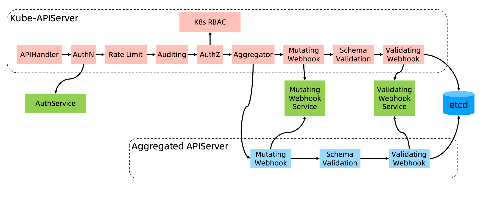

K8s API的每个请求都会经过多阶段的访问控制之后才会被接受，这包括认证、授权以及准入控制(Admission Control)等。



- AuthN（Authentication），认证；
- Rate Limit，限流
- Auditing，审计，类似于记录访问日志；
- AuthZ（Authorization），授权；
- Aggregator，聚合器，用于扩展自定义的 API Server 然后内嵌到原生 API Server 中。如果不是 K8s 内置的对象想发布到 API Server 上，可以通过这个组件不走 K8s 默认的流程（图中上半部分），而是走下面自己实现类似 K8s 的流程；
- Mutating，类似拦截器，比如某个请求过来后对其添加一个属性
- Validation，校验器

# AuthN，认证

开启TLS时，所有的请求都需要首先认证。

K8s 支持多种认证机制，并支持同时开启多个认证插件（只要有一个认证通过即可）。如果认证成功，则用户的 username 会传入授权模块做进一步授权验证；而对于认证失败的请求则返回 HTTP 401。

～/.kube/config 中默认配置的认证（对应的认证插件为 X509证书）有：

```yaml
clusters: # 集群
- cluster:
    certificate-authority-data: xxx
    server: xxx
  name: docker-desktop
- context: # 连接信息
    cluster: docker-desktop # 连接哪个集群
    user: docker-desktop # 使用哪个用户连接集群
  name: docker-desktop
users: # 用户的认证信息
- name: docker-desktop
  user:
    client-certificate-data: xxxx
    client-key-data: xxxxx
```

## 基于 Webhook 的认证集成

只支持 token 方式！通常和 API Server 一起运行的，而不使用容器去部署，否则还需要等 kubelet 将服务拉起才能认证。

需要依照 K8s 规范用于认证 tokenreview request，认证服务需要满足：
- 需要有 URL
- Method：POST
- Input：标准的 K8s 的 TokenReview 对象
- Output：将解出来的 token 信息写入 TokenReview 对象中返回给 API Server

Input 示例：

```json
{
  "apiVersion": "authentication.k8s.io/v1beta1",
  "kind": "TokenReview",
  "spec": {
    "token": "(BEARERTOKEN)"
  }
}
```

Output 示例：

```json
{
  "apiVersion": "authentication.k8s.io/v1beta1",
  "kind": "TokenReview",
  "status": {
    "authenticated": true,
    "user": {
      "username": "janedoe@example.com",
      "uid": "42",
      "groups": [
      "developers",
      "qa"
      ]
    }
  }
}
```
