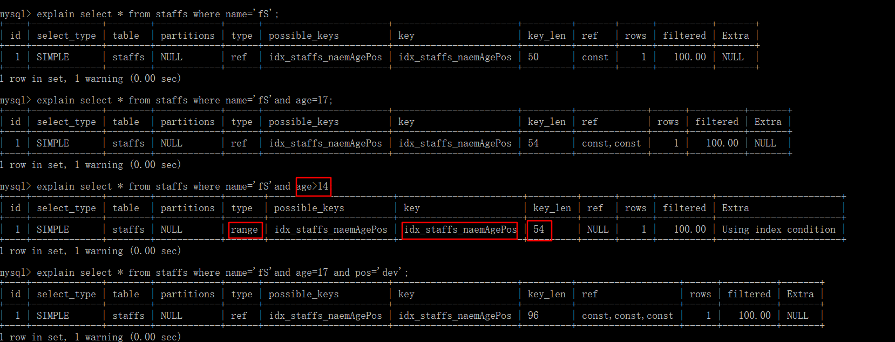
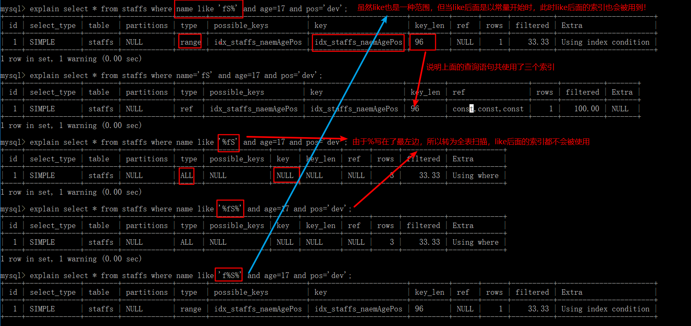

# 索引

**索引（Index）是帮助 MySQL 高效获取数据的数据结构。可以理解为排好序的快速查找数据结构**。索引的目的在于提高查询效率。

**在数据之外，数据库系统还维护着满足特定查找算法的数据结构，这些数据结构以某种方式引用（指向）数据，这样就可以在这些数据结构上实现高级查找算法。这种数据结构就是索引。**例如，可以使用二叉查找树的方式，每个节点包含索引键值和一个指向对应数据记录物理地址的指针，这样就可以运用二叉查找在一定复杂度内获取需要的数据，从而快速检索出符合条件的记录。

一般来说索引本身也很大，不可能全部存储在内存中，因此索引常以索引文件的形式存储在磁盘上。

如果没有特别说明，索引都是指 **B树（多路搜索树，并不一定是二叉的）结构组织的索引**。其中聚集索引、次要索引、覆盖索引、复合索引、前缀索引、唯一索引默认都是使用 B+树索引，统称为索引。当然，除了 B+树这种类型的索引外，还有哈希索引等。

- MySQL 的**索引分类**：

单值索引：一个索引只包含单个列，一个表可以有多个单值索引；

唯一索引：索引列的值必须唯一，但允许有空值；

复合索引：一个索引包含多个列。

- 索引的优势：

提高数据检索的效率，降低数据库的 IO 成本；

通过索引列对数据进行排序，降低数据排序的成本，降低了CPU的消耗

- 索引的劣势：

索引是一张表，保存了主键和索引字段，并指向实体表的记录，所以索引列也是要占用空间的；

索引大大提高了查询速度，但会降低更新表（`INSERT`、`UPDATE`、`DELETE`）的速度。因为更新表时，MySQL不仅要保存数据，还要保存索引文件每次更新所添加的索引列字段，调整因更新带来的键值变化后的索引信息；

索引只是提高效率的一个因素，若 MySQL 有大数据量的表，就需要花时间研究建立最优秀的索引，或优化查询。


## 语法

索引名的命名格式是：`idx_表名_索引列`，如果是复合索引，索引列采用驼峰式命名。

- 创建索引

```sql
-- 唯一索引，加上UNIQUE；如果写一个列名则为单值索引，多个则为复合索引
CREATE [UNIQUE] INDEX 索引名 ON 表名(列名);
-- 也可以使用如下方式创建索引
ALTER TABLE 表名 ADD PRIMARY KEY (列名); -- 主键索引
ALTER TABLE 表名 ADD UNIQUE (列名); -- 唯一索引
ALTER TABLE 表名 ADD INDEX 索引名(列名); -- 普通索引(可以是复合索引)
ALTER TABLE 表名 ADD FULLTEXT (列名); -- 全文索引
```

---

- 删除索引

```sql
DROP INDEX [索引名] ON 表名;
```

---

- 查看索引

```sql
SHOW INDEX FROM 表名
```


## 结构

- **BTree 索引**
  - 实际情况中，3层的B+树可以表示上百万的数据，也就是说上百完的数据只需查找三次 IO，如果没有索引，每个数据项都要发生一次IO，总共需要百万次IO，显然索引对于查找性能的提升是非常巨大的。
- Hash 索引
- FULLTEXT 全文索引
- R-Tree 索引


## 使用！

索引的选择性是指索引列中不同值的数目与表中记录数的比。如果一个表中有2000条记录，表索引列有1980个不同的值，那么该索引的选择性就是$1980/2000=0.99$。一个索引的选择性越接近于1，这个索引的效率就越高。

- 那些情况需要创建索引？

主键自动建立唯一索引；

频繁作为查询条件的字段应该创建索引；

查询中与其它表关联的字段，外键关系建立索引；

在高并发下倾向于创建复合索引而不是单值索引；

查询中排序的字段，排序字段若通过索引去访问将大大提高排序速度；

查询中统计或分组字段。

---

- 那些情况不要创建索引？

表记录太少；

经常增删改的表或字段；

`WHERE`条件里用不到的字段不创建索引；

过滤性不好的不适合建索引（数据重复且分布平均的表字段，如果某个数据列包含许多重复的内容，为它建立索引没有太大的实际效果）。

因此应该只为经常查询和最经常排序的数据列建立索引。


# 索引优化

## 索引分析

### 单表案例

表名：article 

字段：`id`（`int`、无符号、非空、主键、自增）；`author_id`（`int`、无符号、非空）；`category_id`（`int`、无符号、非空）；`views`（`int`、无符号、非空）；`comments`（`int`、无符号、非空）；`title`（`varbinary`、非空）；`content`（`text`、非空）。

```sql
#查询 category_id=1 且 comments>1 的情况下，views 最多的 id
EXPLAIN SELECT id,author_id FROM article WHERE category_id=1 AND comments>1 ORDER BY views DESC LIMIT 1;
-- 显然type=ALL，即最坏的情况。Extra中出现Using filesort，也是最坏的情况，所以优化是必须的。
```

---

优化：

第一次尝试：

```sql
-- 新建索引，使用了三个字段来建立复合索引
#ALTER TABLE article ADD INDEX idx_article_ccv(category_id,comments,views);或使用下面的方法
CREATE INDEX idx_article_ccv ON article(category_id,comments,views);
-- 再次EXPLAIN，发现索引失效
EXPLAIN SELECT id,author_id FROM article WHERE category_id=1 AND comments>1 ORDER BY views DESC LIMIT 1;
```

上面的结论：

`trpe=range`，这是可以接受的，但`Extra`中`Using filesort`仍是无法接受的。我们已经建立了索引，为什么没有用呢？

这是由于 BTree 索引的工作原理，先排序`category_id`，如果遇到相同的`category_id`则再排序`comments`，遇到相同的`comments`后再排序`views`。当`comments`字段在联合索引里处于中间位置时，由于`comments>1`条件是一个范围值，MySQL无法利用索引再对后面的`views`部分进行检索，即`range`类型查询字段后面的索引无效。

---

第二次尝试：

```sql
-- 删除第一次的索引
DROP INDEX idx_article_ccv ON article;
-- 建立新的索引，使用了两个字段来建立复合索引
CREATE INDEX idx_article_cv ON article(category_id,views);
-- 再次EXPLAIN，type=ref 且 Using filesort消失，结果理想
EXPLAIN SELECT id,author_id FROM article WHERE category_id=1 AND comments>1 ORDER BY views DESC LIMIT 1;
```


### 双表案例

表名：class（商品类别）

字段：`id`（`int`、无符号、非空、主键、自增）；`card`（`int`、无符号、非空）（类别卡号）。

表名：book

字段：`bookid`（`int`、无符号、非空、主键、自增）；`card`（`int`、无符号、非空）（类别卡号）。

```sql
EXPLAIN SELECT * FROM class LEFT JOIN book ON class.card = book.card;
-- table值为 book 、class的查询中 type 均为 ALL,需要优化
```

---

优化：

第一次尝试：

```sql
-- 左连接在右表（book）上添加索引
ALTER TABLE book ADD INDEX Y(card);
-- 再次EXPLAIN，发现 table=book 的 查询中 type=ref，且 rows 的优化也比较明显
EXPLAIN SELECT * FROM class LEFT JOIN book ON class.card = book.card;
```

第二次尝试：

```sql
-- 删除第一次创建的索引
DROP INDEX Y ON book;
-- 左连接在左表（class）上添加索引
ALTER TABLE class ADD INDEX Y(card);
-- 再次EXPLAIN，发现 table=class 的 查询中 type=index，而 rows 相比于无索引时没有变化
EXPLAIN SELECT * FROM class LEFT JOIN book ON class.card = book.card;
```

结论：

**左连接时，索引加载右表上**；

与上面的尝试类似，可得出：**右连接时，索引加载左表上**。


### 三表案例

在两表案例的两个表外添加一个新表。

表名：phone

字段：phoneid（int、无符号、非空、主键、自增）；card（int、无符号、非空）。

使用 InnoDB 存储引擎（直接在建表语句的`()`后面加上`ENGINE=INNODB`）。

```sql
EXPLAIN SELECT * FROM class INNER JOIN book ON class.card=book.card INNER JOIN phone ON book.card=phone.card;
-- Extra 中出现 Using join buffer
-- 在工作中，左连接和右连接使用较多
EXPLAIN SELECT * FROM class LEFT JOIN book ON class.card=book.card LEFT JOIN phone ON book.card=phone.card;
-- 所有的 type 均为 ALL
```

---

优化：

```sql
-- 对两次左连接的两个右表创建索引
ALTER TABLE phone ADD INDEX Z(card);
ALTER TABLE book ADD INDEX Y(card);
-- 再次EXPLAIN。后两行的 type 都是 ref，且总的 rows 优化很好，效果不错。
EXPLAIN SELECT * FROM class LEFT JOIN book ON class.card=book.card LEFT JOIN phone ON book.card=phone.card;
```


## 索引失效

- 口诀：

全值匹配我最爱，最左前缀要遵守；

带头大哥不能死，中间兄弟不能断；

索引列上少计算，范围之后全失效；

`like`(的)`%`加右边，覆盖索引不写`*`；

不等空值少用`or`，字符串里有引号。

建议：

- 定值、范围还是排序，一般`order by`给个范围
- `group by`是分组，但分组之前基本上都会进行排序，会有临时表产生。
- 对于单值索引，尽量选择针对当前 query 过滤性更好的索引；
- 在选择复合索引时，当前 query 中过滤性最好的字段在索引字段顺序中，位置越靠前越好；
- 在选择复合索引时，尽量选择可以包含当前 query 中的 where 子句中更多字段的索引；
- 尽可能通过分析统计信息和调整 query 的写法来达到选择合适索引的目的。


示例：

```sql
CREATE TABLE staffs(
  id INT PRIMARY KEY AUTO_INCREMENT,
  name VARCHAR(24) NOT NULL DEFAULT '' COMMENT '姓名',
  age INT NOT NULL DEFAULT 0 COMMENT '年龄',
  pos VARCHAR(20) NOT NULL DEFAULT '' COMMENT '职位',
  add_time TIMESTAMP NOT NULL DEFAULT CURRENT_TIMESTAMP COMMENT '入职时间'
);
-- 创建复合索引
ALTER TABLE staffs ADD INDEX idx_staffs_naemAgePos(name,age,pos);
```


- 全值匹配


可以看出，随着精度的提高，所花费的代价（`key_len`）也越来越大。

---

- 最佳左前缀法则：如果索引了多列，要遵守最左前缀法则。指的**查询条件**从索引的最左列开始且**不跳过索引中的列**。

如：创建的索引为`name`、`age`、`pos`列，那么如果要想在查询中使用到索引，查询条件必须以`name`开始。


注意：如果是常量级别的查询，那么查询条件的顺序可以不遵守该法则。因为MySQL底层的优化器对语句进行了优化，不过建议查询条件的顺序仍遵守该法则，避免底层的优化。优化后的顺序必须遵守该法则！


---

- 不在索引列上做任何操作（计算、函数、自动/手动类型转换），否则会导致索引失效而转向全表扫描


---

- 存储引擎不能使索引中范围条件右边的列



从`key_len`可以看出尽管查询条件`age`是一个范围，但仍会用到索引。不过与`name`不同的是，`name`用于查询，而`age`则是用于排序

---

- 尽量使用覆盖索引（只访问索引的查询（索引列和查询列一致）），减少`select *`
- MySQL在使用不等于（`!=`或`<>`）时无法使用索引会导致全表扫描
- `is null`、`is not null`也无法使用索引


---

- `like`以**通配符开头**（如:`%abc`），MySQL索引失效会变成全表扫描的操作。
  - 使用覆盖索引。

like`虽然也是范围，但是，当后面的字符为`字符串%`形式时，此时也算是一种特殊的常量，所以如果在`like`子句后面还有索引列的使用的话，该索引并不会失效。



---

- 字符串不加单引号索引失效


---

- 少用`or`，用它来连接时会索引失效

---

一般情况下，如果`order by`后面的排序列的顺序与索引中这些列顺序不一致，在`Extra`中就会出现`Using filesort`，如：`select * from test where c1='a1' order by c3,c2`（复合索引：c1,c2,c3,c4）；但是，当排序列出现常量时，由于不必排序，所以不会出现`Using filesort`，如：`select * from test where c1='a1' c2='a2' order by c3,c2`