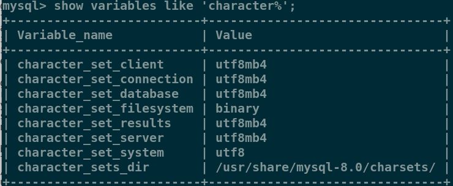
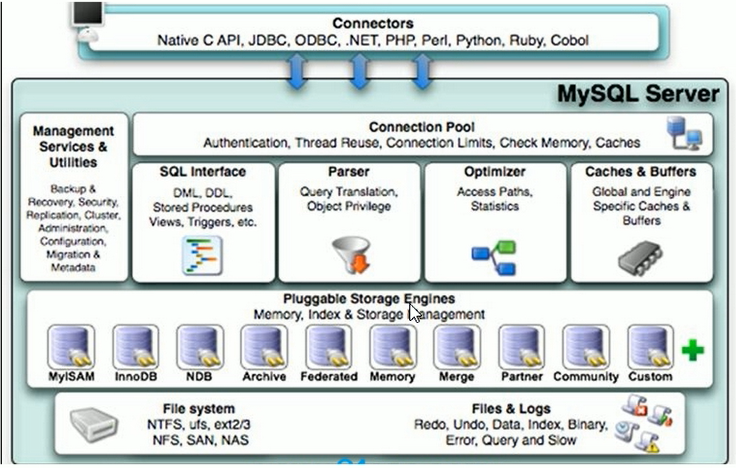
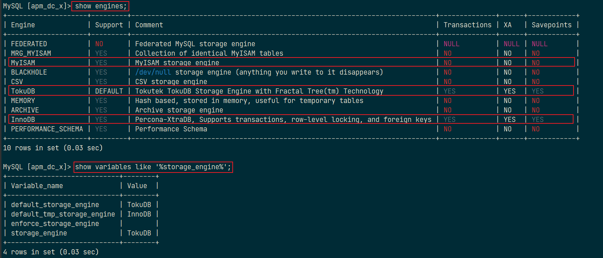

在 MySQL 数据表设计中，一般有这么一个原则：如果存在大字段数据，而且它一般不变，应该将不变的字段单独放入另外一个表中。

# Linux 下安装

- 查看旧版本 MySQL：`rpm -qa | grep mysql`
- 删除旧的组件：`rpm -e --nodeps 上面出现的组件`

CentOS 7 下 MySQL 的 YUM 安装方式：可以查看：[官方文档](https://dev.mysql.com/doc/mysql-yum-repo-quick-guide/en/)

1. [下载 yum 源](https://dev.mysql.com/downloads/repo/yum/)，选择 **Red Hat Enterprise Linux 7 / Oracle Linux 7 (Architecture Independent), RPM Package** ，下载后文件放入 Linux 系统中；

2. 在文件所在目录下的终端输入`yum localinstall mysql80-community-release-el7-1.noarch.rpm`安装 MySQL YUM 资源库；

3. 为了不安装最新版本，需要先安装`yum-config-manager`命令所在的 yum-utils 包：`yum -y install yum-utils`；

4. 查看可安装的 MySQL：`yum repolist all | grep mysql`

5. 设置默认安装 5.7 的 MySQL 而不是最新的 MySQL：

   ```shell
   sudo yum-config-manager --disable mysql80-community
   sudo yum-config-manager --enable mysql57-community
   ```

6. 安装 MySQL：`yum install -y mysql-community-server`；

7. 启动 MySQL 服务器：`systemctl start mysqld.service`

8. 修改密码，

   1. 首先查看 系统给 root 用户随机生成的密码：`sudo grep 'temporary password' /var/log/mysqld.log`，冒号后面的就是密码；
   2. 使用 root 用户和上面得到的密码登录 MySQL：`mysql -uroot -p`，然后输入密码；
   3. 修改密码：`ALTER USER 'root'@'localhost' IDENTIFIED BY '密码'`

9. 退出 MySQL 登录后，在 Linux 的终端中查看 MySQL 安装时创建的的 mysql 用户组和 mysql 组：`cat /etc/group|grep mysql`或`mysqladmin --version` ，如果出现信息，说明安装成功；

10. 设置自启动：`systemctl enable mysqld.service`

11. 在 MySQL 的命令行输入`show variables like 'character%'`查看字符集，下表是 8.0 的默认字符集。

    

12. MySQL 的配置文件：Windows 中是 my.ini；Linux 中是`/etc/my.cnf`，主要的配置：

    - 二进制日志 log-bin：主要用于主从复制。
    - 错误日志 log-error：默认关闭，记录严重的警告和错误信息，每次启动和关闭的详细信息等。
    - 查询日志 log：默认关闭，记录查询的 sql 语句，如果开启会降低 mysql 的整体性能，因为记录日志也需要消耗系统资源。
    - 数据文件：
      - .frm 文件：存放表结构
      - .myd 文件：存放表数据
      - .myi 文件：存放表索引

注意：mysqld 是服务端程序  ； mysql 是命令行客户端程序 。

# 逻辑架构



MySQL 的架构（上图所示）可以在多种不同场景中应用并发挥良好作用。主要体现在存储引擎的架构上，插件式的存储引擎架构将查询处理和其他的系统任务及数据的存储提取相分离。这种架构可以根据业务的需求和实际需求选择合适的存储引擎。可以看出，整个 MySQL 被分成四层：

1. 连接层

   最上层是一些客户端和连接服务，包含本地 Socket 通信和大多数基于客户端/服务端工具实现的类似于 TCP/IP 的通信。主要完成一些类似于连接处理、授权认证、及相关的安全方案。在该层上引入了线程池的概念，为通过认证安全接入的客户端提供线程。同样在该层上可以实现基于 SSL 的安全链接。服务器也会为安全接入的每个客户端验证它所具有的操作权限。

2. 服务层

   第二层架构主要完成大多数的核心服务功能，如 SQL 接口，并完成缓存查询，SQL 的分析和优化及部分内置函数的执行，所有跨存储引擎的功能也在这一层实现，如过程，函数等，在该层，服务层会解析查询并创建相应的内部解析树，并对其完成相应的优化，如确认查询表的顺序，是否利用索引等，最后生成相应的执行操作，如果是`select`语句，服务器还会查询内部的缓存，如果缓存空间足够大，这样就解决大量读操作的环境中能够很好的提供系统性能。

3. 引擎层

   存储引擎层，存储引擎真正的负责了 MySQL 中数据的存储和提取，服务器通过 API 与存储引擎进行通信，不同的存储引擎具有的功能不同，这样我们可以根据自己的实际需要进行选取，例如：MyISAM 和 InnoDB。

4. 存储层

   数据存储层，主要将数据存储在运行于裸设备的文件系统之上。并完成存储引擎的交互。

# 存储引擎

MySQL 中存储引擎的主要作用是负责数据的存储和提取，MySQL 的默认存储引擎 InnoDB 使用的是 B+ 树来存储数据。

MySQL 中用的最多的存储引擎：`innodb`、`myisam`、`memory` 等。其中`innodb`支持事务，而`myisam`、`memory`等不支持事务。

```sql
-- 查看MySQL所支持的的存储引擎
show engines;
-- 查看MySQL当前默认的存储引擎
show variables like '%storage_engine%';
```



主要的两种存储引擎的区别：

|        | MyISAM                                                         | InnoDB                                                                    |
| ------ | -------------------------------------------------------------- | ------------------------------------------------------------------------- |
| 主外键 | 不支持                                                         | 支持                                                                      |
| 事务   | 不支持                                                         | 支持                                                                      |
| 行表锁 | 表锁<br>即使操作一条记录也会锁住整个表。<br>不适合高并发操作。 | 行锁。<br>操作时只锁住某一行，不对其它行有影响。<br/>**适合高并发操作**。 |
| 缓存   | 只缓存索引，不缓存真实数据                                     | 同时缓存索引、真实数据，对内存要求较高，<br>且内存大小对性能有决定性影响  |
| 表空间 | 小                                                             | 大                                                                        |
| 关注点 | 性能                                                           | 事务                                                                      |

# 分析

分析步骤：

1. 观察，至少跑一天，看看生产的慢 SQL 情况；
2. 开启慢查询日志，设置阈值，比如超过 5s 的就是慢 SQL，并将它抓取出来；
3. `explain`+ manSQL 分析；
4. show profile；
5. 运维经理或 DBA 进行 SQL 数据库服务器的参数调优。

总结：

1. 慢查询的开启并捕获；
2. `explain`+manSQL 分析；
3. `show profile` 查询 SQL 在 MySQL 服务器里面的执行细节和声明周期情况；
4. SQL 数据库服务器的参数调优。

# 数据导入/出

## 导出

- into outfile 导出：

在 my.ini 文件中设置`secure-file-priv=""`，就可以将导出文件放置在任意位置。

```sql
select * from user
	into outfile '/tmp/user.csv' -- 指定导出目录和文件名(该文件必须是不存在的)
	fields terminated by ','  -- 定义字段间的分隔符
	optionally enclosed by '"'  -- 定义包围字段的字符（数值型字段无效）
	lines terminated by '\r\n'; -- 定义每行的分隔符
```

注意：输出不能是一个已存在的文件，防止文件数据被篡改。

---

- 导出表作为原始数据：

`mysqldump`是 MySQL 用于转存储数据库的实用程序。主要产生一个 SQL 脚本，其中包含从头重新创建数据库所必需的命令 `CREATE TABLE` `INSERT`等。

使用`mysqldump`导出数据需要使用`--tab`选项来指定导出文件指定的目录，该目标必须是可写的。

在 MySQL 的安装目录下的 bin 目录进入命令行（不要进入数据库终端），执行：

```sql
mysqldump -u用户名 -p 数据库 要导出的表 > 文件目录和文件名
-- 如：mysqldump -uroot -p ssm_crud tbl_emp > d:\s.sql
```

如果要导出整个数据库的数据：`mysqldump -u用户名 -p 数据库名 > data.txt`

如果要导出所有数据库：`mysqldump -u用户名 -p --all-databases > data.txt`

## 导入

- mysql 命令导入

```sql
mysql -u用户名 -p < 要导入的数据库数据
-- 如：mysql -uroot -p < s.sql
```

---

- source 命令导入

登录到数据库终端——>创建数据库——>使用该数据库——>输入：`source 文件`。

如：`source d:\s.sql`

---

- load data 命令导入

```sql
load data [local] infile '文件' into table 表名;
-- 使用了 local 关键字，则从客户主机上按路径读取文件
-- 不使用，则文件在服务器上按路径读取文件
```

也可以像`into outfile`命令那样指定分隔符，使用相同：

- `fields terminated by ‘字段间分隔符’`：定义字段间的分隔符
- `lines terminated by ‘行间分隔符’`：定义每行的分隔符

`LOAD DATA`默认情况下是按照数据文件中列的顺序插入数据的，如果数据文件中的列与插入表中的列不一致，则需要指定列的顺序。如，在数据文件中的列顺序是 a,b,c，但在插入表的列顺序为 b,c,a，则数据导入语法如下：

```sql
LOAD DATA LOCAL INFILE 'dump.txt' INTO TABLE mytbl (b, c, a);
```

---

- mysqlimport 命令导入

在 MySQL 的安装目录下的 bin 目录下进入命令行(不用进数据库终端)，执行：

```sql
mysqlimport -u用户名 -p --local 数据库名 文件
```

可使用`--column`选项设置列的顺序，如：

```shell
mysqlimport -u root -p --local --columns=b,c,a database_name dump.txt
```
