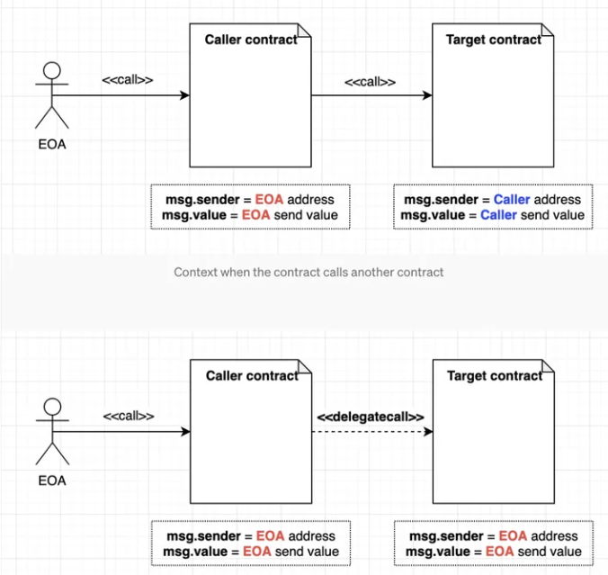

# 函数重载

Solidity 是允许函数重载的，但不允许修饰器重载！

```solidity
contract Overloading {
  function saySomething() public pure returns (string memory) {
    return "nothing";
  }

  function saySomething(string  memory something) public pure returns (string memory) {
    return something;
  }
}
```

在调用重载函数时，会把输入的实参与入参的类型匹配！如果出现多个匹配的重载参数，则会报错。

```solidity
// 如果调用 f(50)，则因为 50 既可以转为 uint8 也可以转为 uint256，会报错
contract F {
  function f(uint8 _in) public pure returns (uint8 out) {
    out = _in;
  }

  function f(uint256 _in) public pure returns (uint256 out) {
    out = _in;
  }
}
```

# import

- 通过源文件相对位置导入：`import './father.sol';`
-

通过源文件网址导入网络中的合约：`import 'https://github.com/OpenZeppelin/openzeppelin-contracts/blob/master/contracts/utils/Address.sol';`

- 通过 npm 目录导入：`import '@openzeppelin/contracts/access/Ownable.sol';`
- 通过全局符号导入特定合约：`import {Father} from './father.sol';`

# library

库合约相比普通合约的不同之处：

1. 不能存在状态变量
2. 不能继承或被继承
3. 不能接收 ETH
4. 不可以被销毁

```solidity
library Strings {
  // ...
}

contract UseLibrary {
  // 使用库合约中函数的方式一：user for  
  using Strings for uint256;
  function getString1(uint256 _number) public pure returns (string memory) {
    return _number.toHexString();
  }

  // 使用库合约中函数的方式二：通过库合约名称调用库函数
  function getString2(uint256 _number) public pure returns (string memory) {
    return Strings.toHexString(_number);
  }
}
```

如 [Strings 合约](https://github.com/OpenZeppelin/openzeppelin-contracts/blob/master/contracts/utils/Strings.sol)

# 接收&发送ETH

## 接收

Solidity 支持两种特殊的回调函数：`receive()`、`fallback()`。当向合约发送交易时，如果没有指定某个函数，就会触发这两个特殊函数：

```
     Ether is sent to contract：
              is msg.data empty?
              /                \
             yes               no
             /                  \
        has receive()?       has fallback()?
         /   \                   /
       yes   no                /
      /        \             /
    receive()  has fallback()?
                  /   \
                yes    no
                /       \
         fallback()     error
```

- receive

一个合约最多有一个 `receive()` 函数，且仅用于接收 ETH。定义时不需要 `function`
关键字，且不允许有任何参数，不能返回任何值，必须包含 `external` 和 `payable` 关键字！！

当合约接收 ETH 时，就会触发 `receive()` 。该函数最好不要执行太多逻辑，如果太复杂可能会触发 Out of Gas。

```solidity
contract Receive {
  event Received(address sender, uint value);

  receive() external payable {
    emit Received(msg.sender, msg.value);
  }
}
```

- fallback

`fallback()` 会在调用合约不存在的函数时被触发，可用于接收 ETH，也可用于代理合约。声明时同样不需要 `function`
关键字，必须有 `external`，一般也会有 `payable`。

```solidity
contract Fallback {
  event fallbackCalled(address sender, uint value, bytes data);

  fallback() external payable {
    emit fallbackCalled(msg.sender, msg.value, msg.data);
  }
}
```

## 发送

Solidity 有三种方法向其他合约发送 ETH：`transfer()`、`send()`、`call()`，推荐使用 `call()`。

```solidity
contract SendETH {
  // payable 使得在部署的时候可以转 ETH 进去！
  constructor() payable{}
  // 接收 ETH 时触发
  receive() external payable {}

  error SendFailed();
  error CallFailed();

  // 利用 transfer 发送 ETG：接收方地址.transfer(转账 ETH 金额)
  // transfer() 的 gas 限制时 2300，足够用于转账，但对方合约的 fallback() 或 receive() 不能实现太复杂的逻辑
  // transfer() 如果转账失败，会自动 revert
  function transferETH(address payable _to, uint256 amount) external payable {
    _to.transfer(amount);
  }

  // 利用 send 发送 ETH：接收方地址.send(转账 ETH 金额)
  // send() 的 gas 限制时 2300，同样对方合约的 fallback() 或 receive() 不能实现太复杂的逻辑
  // send() 如果转账失败，不会自动 revert
  // send() 返回值时 bool，代表转账是否成功，所以还需要额外的代码处理逻辑
  function sendETH(address payable _to, uint256 amount) external payable {
    bool success = _to.send(amount);
    if (!success) {
      revert SendFailed();
    }
  }

  // 利用 call 发送 ETH：接收方地址.call{value: 转账 ETH 金额}("")
  // call() 没有 gas 限制，可以支持对方合约的 fallback() 或 receive() 实现复杂的逻辑
  // call() 如果转账失败，不会自动 revert
  // call() 的返回值时 (bool, data)，其中第一个参数代表转账是否成功，所以还需要额外的代码处理逻辑
  function callETH(address payable _to, uint256 amount) external payable {
    (bool success,) = _to.call{value: amount}("");
    if (!success) {
      revert CallFailed();
    }
  }
}
```

# 调用合约

```solidity
contract OtherContract {
  uint256 private x;

  event Log(uint amount, uint gas);

  function setX(uint256 _x) external payable {
    x = _x;
    if (msg.value > 0) {
      emit Log(msg.value, gasLeft());
    }
  }

  function getX() external view returns (uint _x) {_x = x;}
}

contract CallContract {
  // 方式一：传入合约的地址
  function callSetX(address otherContractAddress, uint256 x) external {
    OtherContract(otherContractAddress).setX(x);
  }

  // 方式二：传入合约的引用（底层类型仍为 address）
  function callGetX(OtherContract _address) external view returns (uint x) {
    x = _address.getX();
  }

  // 方式三：创建合约变量
  function callGetX2(address _address) external view returns (uint x) {
    OtherContract oc = OtherContract(_address);
    x = oc.getX();
  }

  // 调用合约并发送 ETH
  function setXTransferETH(address otherContractAddress, uint256 x) payable external {
    OtherContract(otherContractAddress).setX{value: msg.value}(x);
  }
}
```

# call

`call()` 是 `address` 类型的低级成员函数，用来与其他合约交互，返回值有两个，第一个标识交互是否成功，第二个则为目标函数的返回值。

- 推荐使用 `call()` 来触发 `receive()`、`fallback()`
- 不推荐使用 `call()` 来调用另一个合约！
- 当不知道对方合约的源代码或 ABI 时是无法创建合约变量的，这时，仍可通过 `call()` 调用对方合约的函数

使用规则：

- `目标合约地址.call(二进制编码);` 其中 二进制编码 利用结构化编码函数 `abi.encodeWithSignature` 获得
    - `abi.encodeWithSignature("函数签名", 逗号分割的具体参数)`
- `call()` 在调用合约时，可以指定交易发送的 ETH 数额和 gas：`目标合约地址。call{value: 发送 ETH 数额, gas: gas数额}(二进制编码);`

# delegatecall

类似于 `call()`，`ledegatecall()` 是 Solidity 中地址类型的低级函数。使用规则类似 `call()`，但是在调用合约时，`delegatecall()` 只能指定交易发送的 gas，不能指定发送的 ETH 数额。

> 注意：`delegatecall()` 有安全隐患，使用时要保证当前合约和目标合约的状态变量存储结构(包含顺序)相同，并且目标合约安全，不然会造成资产损失。



`delegatecall()` 使用场景：
- 用于代理合约。将智能合约的存储合约、逻辑合约分开时，代理合约（Proxy Contract）存储所有相关变量，并保存逻辑合约的地址；而逻辑合约（Logic Contract）中保存所有函数，并通过 `delegatecall()` 来执行，升级时，仅需将代理合约指向新的逻辑合约即可；
- EIP-2535 Diamonds（钻石），钻石是一个支持构建可在生产中扩展的模块化智能合约系统的标准。钻石是具有多个实施合约的代理合约

# 合约创建合约

```solidity
contract Pair {
  address public factory; // 工厂合约地址
  address public token0; // 代币1
  address public token1; // 代币2

  // 将 factory 赋值为工厂合约的地址
  constructor() payable {
    factory = msg.sender;
  }

  // called once by the factory at time of deployment
  function initialize(address _token0, address _token1) external {
    require(msg.sender == factory, 'UniswapV2: FORBIDDEN'); // sufficient check
    token0 = _token0;
    token1 = _token1;
  }
}
```

## create

new 一个合约，并传入新合约构造函数所需的参数：`ContractName c = new ContractName{value: _value}(params)`，如果构造函数是 `payable`，可以在创建时传入 _`value` 数量的 ETH，`params` 是新合约构造函数的参数。

智能合约可以由其他合约、普通用户利用 create 操作码创建，新合约的地址计算方式：`新地址 = hash(创建者地址, nonce)`，创建者地址不变，但 nonce 可能会随事件而改变，因此使用 create 创建的合约地址不好预测。

```solidity
contract PairFactory {
  mapping(address => mapping(address => address)) public getPair; // 通过两个代币地址查Pair地址
  address[] public allPairs; // 保存所有Pair地址

  function createPair(address tokenA, address tokenB) external returns (address pairAddr) {
    // 创建新合约
    Pair pair = new Pair();
    // 调用新合约的initialize方法
    pair.initialize(tokenA, tokenB);
    // 更新地址map
    pairAddr = address(pair);
    allPairs.push(pairAddr);
    getPair[tokenA][tokenB] = pairAddr;
    getPair[tokenB][tokenA] = pairAddr;
  }
}
```

## create2

create2 的目的是为了让合约地址独立于未来的事件！create2 创建的合约地址由四部分决定：`新地址 = hash("0xFF", 创建者地址, salt, bytecode)`，其中，`0xFF` 是一个常数，避免与 create 冲突，salt（盐） 是创建者给定的数值，bytecode 是待部署合约的字节码。

create2 用法类似 create：`ContractName x = new ContractName{salt: _salt, value: _value}(params)`，如果构造函数是 `payable`，可以在创建时传入 _`value` 数量的 ETH，`params` 是新合约构造函数的参数。

create2 让我们可以在部署合约前确定它的合约地址，这也是一些 layer2 项目的基础。

场景：

- 交易所为新用户预留创建钱包合约地址；
- 由 create2 驱动的 factory 合约，在 UniSwapV2 中，交易对的创建是在 Factory 中调用 create2 完成。这样做的好处是: 它可以得到一个确定的 pair 地址, 使得 Router 中就可以通过 (tokenA, tokenB) 计算出 pair 地址, 不再需要执行一次 Factory.getPair(tokenA, tokenB) 的跨合约调用。

```solidity
contract PairFactory2 {
  mapping(address => mapping(address => address)) public getPair; // 通过两个代币地址查Pair地址
  address[] public allPairs; // 保存所有Pair地址

  function createPair2(address tokenA, address tokenB) external returns (address pairAddr) {
    require(tokenA != tokenB, 'IDENTICAL_ADDRESSES'); //避免tokenA和tokenB相同产生的冲突
    // 计算用tokenA和tokenB地址计算salt
    (address token0, address token1) = tokenA < tokenB ? (tokenA, tokenB) : (tokenB, tokenA); //将tokenA和tokenB按大小排序
    bytes32 salt = keccak256(abi.encodePacked(token0, token1));
    // 用create2部署新合约
    Pair pair = new Pair{salt: salt}();
    // 调用新合约的initialize方法
    pair.initialize(tokenA, tokenB);
    // 更新地址map
    pairAddr = address(pair);
    allPairs.push(pairAddr);
    getPair[tokenA][tokenB] = pairAddr;
    getPair[tokenB][tokenA] = pairAddr;
  }

  // 在合约部署前计算 pair 合约地址
  function calculateAddr(address tokenA, address tokenB) public view returns (address predictedAddress){
    require(tokenA != tokenB, 'IDENTICAL_ADDRESSES'); //避免tokenA和tokenB相同产生的冲突
    // 计算用tokenA和tokenB地址计算salt
    (address token0, address token1) = tokenA < tokenB ? (tokenA, tokenB) : (tokenB, tokenA); //将tokenA和tokenB按大小排序
    bytes32 salt = keccak256(abi.encodePacked(token0, token1));
    // 计算合约地址方法 hash()
    predictedAddress = address(uint160(uint(keccak256(abi.encodePacked(
      bytes1(0xff),
      address(this),
      salt,
      keccak256(type(Pair).creationCode)
    )))));
  }
}
```

# 删除合约

`selfdestruct` 命令可以用来删除智能合约，并将该合约剩余 ETH 转到指定地址。

```solidity
contract DeleteContract {
  uint public value = 10;

  constructor() payable {}

  receive() external payable {}

  function deleteContract() external {
    // 调用 selfdestruct 销毁合约，并把剩余的 ETH 转给 msg.sender
    selfdestruct(payable(msg.sender));
  }

  function getBalance() external view returns (uint balance){
    balance = address(this).balance;
  }
}
```

注意：
1. 对外提供合约销毁接口时，最好设置为只有合约所有者可以调用，可以使用函数修饰符onlyOwner进行函数声明。 
2. 当合约被销毁后与智能合约的交互也能成功，并且返回0。 
3. 当合约中有 `selfdestruct` 功能时常常会带来安全问题和信任问题，合约中的 `selfdestruct` 功能会为攻击者打开攻击向量(例如使用 `selfdestruct` 向一个合约频繁转入 token 进行攻击，这将大大节省了 gas 的费用，虽然很少人这么做)，此外，此功能还会降低用户对合约的信心。

# abi 编解码

[ABI 规则](https://learnblockchain.cn/docs/solidity/abi-spec.html)

场景：

1. 在合约开发中，ABI 常配合 `call` 来实现对合约的底层调用
2. ethers.js 中常用 ABI 实现合约的导入和函数调用
3. 对不开源合约进行反编译后，某些函数无法查到函数签名，这样就无法通过构造合约来调用，但可通过 ABI（`abi.encodeWithSelector`） 进行调用

## 编码

```solidity
contract Encode {
  uint x = 10;
  address addr = 0x7A58c0Be72BE218B41C608b7Fe7C5bB630736C71;
  string name = "0xAA";
  uint[2] array = [5, 6];

  // 由于 abi.encode 将每个数据都填充为32字节，中间有很多 0：
  // 0x000000000000000000000000000000000000000000000000000000000000000a0000000000000000000000007a58c0be72be218b41c608b7fe7c5bb630736c7100000000000000000000000000000000000000000000000000000000000000a00000000000000000000000000000000000000000000000000000000000000005000000000000000000000000000000000000000000000000000000000000000600000000000000000000000000000000000000000000000000000000000000043078414100000000000000000000000000000000000000000000000000000000
  function encode() public view returns (bytes memory result) {
    result = abi.encode(x, addr, name, array);
  }

  // abi.encodePacked 类似 abi.encode，但是会把其中填充的很多 0 省略，如，只用 1 字节来编码 uint 类型。当你想省空间，并且不与合约交互的时候，可以使用 abi.encodePacked
  // 0x000000000000000000000000000000000000000000000000000000000000000a7a58c0be72be218b41c608b7fe7c5bb630736c713078414100000000000000000000000000000000000000000000000000000000000000050000000000000000000000000000000000000000000000000000000000000006
  function encodePacked() public view returns (bytes memory result) {
    result = abi.encodePacked(x, addr, name, array);
  }

  // 与 abi.encode 功能类似，只不过第一个参数为函数签名，等同于在 abi.encode 编码结果前加上了 4 字节的函数选择器
  // 0xe87082f1000000000000000000000000000000000000000000000000000000000000000a0000000000000000000000007a58c0be72be218b41c608b7fe7c5bb630736c7100000000000000000000000000000000000000000000000000000000000000a00000000000000000000000000000000000000000000000000000000000000005000000000000000000000000000000000000000000000000000000000000000600000000000000000000000000000000000000000000000000000000000000043078414100000000000000000000000000000000000000000000000000000000
  function encodeWithSignature() public view returns (bytes memory result) {
    result = abi.encodeWithSignature("foo(uint256,address,string,uint256[2])", x, addr, name, array);
  }

  // 与 abi.encodeWithSignature 功能类似，只不过第一个参数为函数选择器，为函数签名 Keccak 哈希的前 4 个字节。
  // 与 abi.encodeWithSignature 结果一样。
  // 0xe87082f1000000000000000000000000000000000000000000000000000000000000000a0000000000000000000000007a58c0be72be218b41c608b7fe7c5bb630736c7100000000000000000000000000000000000000000000000000000000000000a00000000000000000000000000000000000000000000000000000000000000005000000000000000000000000000000000000000000000000000000000000000600000000000000000000000000000000000000000000000000000000000000043078414100000000000000000000000000000000000000000000000000000000
  function encodeWithSelector() public view returns (bytes memory result) {
    result = abi.encodeWithSelector(bytes4(keccak256("foo(uint256,address,string,uint256[2])")), x, addr, name, array);
  }
}
```

## 解码

```solidity
contract Encode {
  // abi.decode 用于解码 abi.encode 生成的二进制编码，将它还原成原本的参数。
  function decode(bytes memory data) public pure returns (uint dx, address daddr, string memory dname, uint[2] memory darray) {
    (dx, daddr, dname, darray) = abi.decode(data, (uint, address, string, uint[2]));
  }
}
```

# try-catch

```solidity
contract Catch {
  function test() public {
    // 某个外部合约的函数调用
    // 可以使用 this.f() 来替代 externalContract.f()，this.f() 也被视作为外部调用，但不可在构造函数中使用！因为此时合约还未创建
    try externalContract.f() {
      // call成功的情况下 运行一些代码
    } catch {
      // call失败的情况下 运行一些代码
    }

    // 调用的函数有返回值，那么必须在 try 之后声明 returns(returnType val)，并且在 try 模块中可以使用返回的变量；如果是创建合约，那么返回值是新创建的合约变量。
    try externalContract.f() returns (returnType val){
      // call成功的情况下 运行一些代码
    } catch Error(string memory reason) {
      // 捕获失败的 revert() 和 require()
    } catch (bytes memory reason) {
      // 捕获失败的 assert()
    }
  }
}
```
