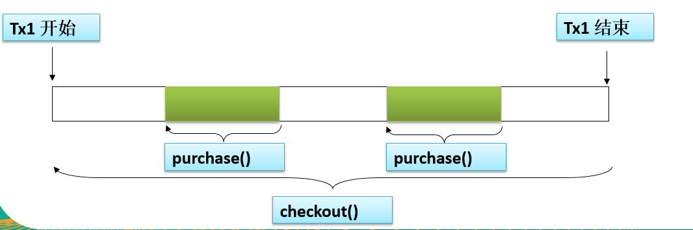
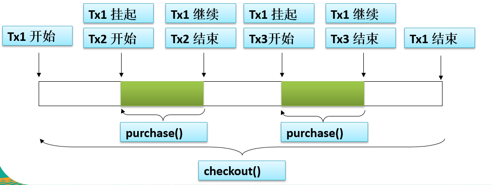

# 5.0 介绍

- Spring既支持编程式事务管理，也支持声明式事务管理。
  - 编程式事务管理：将事务管理代码嵌入业务方法中来控制事务的提交和回滚。必须在每个事务操作中包含额外的事务管理代码；
  - ==声明式事务管理==：将事务管理代码从业务方法中分离出来，以声明的方式实现事务管理。事务管理作为一种横切关注点，可通过AOP方法模块化。Spring通过Spring AOP 框架支持声明式事务管理。
    - Spring AOP 是基于代理的方法, 只能增强公共方法. 因此, ==只有公有方法才能通过 Spring AOP 进行事务管理.== 
- Spring的核心事物管理抽象是` interface PlatformTransactionManager`，管理封装了一组独立于技术的方法。 
- Spring 中事务管理器的实现： 
  - `class DataSourceTransactionManager`：在应用程序中只需要处理一个数据源，且通过JDBC存取；
  - `class JtaTransactionManager`：在Java EE应用服务器上用 JTA（Java Transaction API）进行事务管理
  - `class HibernateTransactionManager`：用 Hibernate 框架存取数据库
  - 。。。
  - 事务管理器以普通的 Bean 形式声明在Spring IoC容器中 


导入依赖：如果使用Hibernate操作底层数据库，可以导入spring-orm包。

```xml
<!--spring-jdbc依赖于spring-tx，所以没有显式配置spring-tx-->
<dependency>
    <groupId>org.springframework</groupId>
    <artifactId>spring-jdbc</artifactId>
    <version>4.3.16.RELEASE</version>
</dependency>
<dependency>
    <groupId>mysql</groupId>
    <artifactId>mysql-connector-java</artifactId>
    <version>6.0.6</version>
</dependency>
<dependency>
    <groupId>com.mchange</groupId>
    <artifactId>c3p0</artifactId>
    <version>0.9.5.2</version>
</dependency>
```


# 5.1 注解配置

## 声明式事务

步骤：

1. ==配置数据源、JDBC Template操作数据库==：

   ```java
   @EnableTransactionManagement //开启事务注解
   @ComponentScan("com.zzk.tx")
   @Configuration
   public class TxConfig {
       @Bean
       public DataSource dataSource() throws PropertyVetoException {
           ComboPooledDataSource dataSource = new ComboPooledDataSource();
           dataSource.setUser("root");
           dataSource.setPassword("123456");
           dataSource.setDriverClass("com.mysql.cj.jdbc.Driver");
           dataSource.setJdbcUrl("jdbc:mysql://localhost:3306/myemployees?serverTimezone=UTC&useSSL=false");
           return dataSource;
       }
   
       @Bean
       public JdbcTemplate jdbcTemplate() throws PropertyVetoException {
           //Spring对配置类会特殊处理，只要方法是给容器中添加组件的，该方法多次调用都只是在容器中找组件
           JdbcTemplate jdbcTemplate = new JdbcTemplate(dataSource());
           return jdbcTemplate;
       }
       
   	/**配置事务管理器!!!!!!!!!!!!!!*/
       @Bean
       public DataSourceTransactionManager transactionManager() throws PropertyVetoException {
           return new DataSourceTransactionManager(dataSource());
       }
   }
   ```

2. ==开启事务注解==，两种方法：

   1. 在配置文件中配置 

   ```xml
     <!-- 启用事务注解，注意导入 tx 命名空间 -->
   <tx:annotation-driven transaction-manager="transactionManager"/>
   ```

   1. 在==配置类上标注`@EnableTransactionManagement`==，见上面的代码

3. 在==对应方法上添加注解`@Transactional`：注意只能标注公有方法==

   - 注意，如果不添加注解的话，该方法不是事务，如果库存足够而余额不足，即使第3步异常，第2步仍会执行，无法回滚 

   ```java
   	//添加事务注解
       @Transactional
       @Override
       public void purchase(String username, String isbn) {
            //1.获取书的单价
            int price = bookShopDao.findBookPriceByIsbn(isbn);
            
            //2.更新书的库存
            bookShopDao.updateBookStock(isbn);
            
            //3.更新用户余额
            bookShopDao.updateUserAccount(username, price);
            
       }
   ```

   - 可以在方法或者**类级别**上添加`@Transactional`注解. 当把这个注解应用到类上时, 这个类中的所有公共方法都会被定义成支持事务处理的. 


## 事务传播属性

当事务方法被另一个事务方法调用时, 必须指定事务应该如何传播. 例如: 方法可能继续在现有事务中运行, 也可能开启一个新事务, 并在自己的事务中运行。

事务的传播行为可以由传播属性指定. Spring 定义了 7 种类的传播行为。前两种最常用 

| 传播特性                     | 值   | 描述                                 |
| ---------------------------- | ---- | ------------------------------------ |
| PROPAGATION_REQUIRED（默认） | 0    | 当前有事务就用当前的，没有就用新的   |
| PROPAGATION_SUPPORTS         | 1    | 事务可有可无，不是必须的             |
| PROPAGATION_MANDATORY        | 2    | 当前一定要有事务，不然抛出异常       |
| PROPAGATION_REQUIRES_NEW     | 3    | 无论是否有事务，都起一个新的事务     |
| PROPAGATION_NOT_SUPPORTED    | 4    | 不支持事务，按非事务方式运行         |
| PROPAGATION_NEVER            | 5    | 不支持事务，如果有事务则抛出异常     |
| PROPAGATION_NESTED           | 6    | 当前有事务就在当前事务里再起一个事务 |

 

```java
//使用 propagation 指定事务的传播行为，即当前的事务方法A被另一个事务方法B调用时，如何使用事务
//默认取值为 REQUIRED ，即使用调用方法B的事务
//REQUIRES_NEW，使用自己A的事务，调用方法B的事务被挂起
    @Transactional(propagation=Propagation.REQUIRES_NEW)
    @Override
    public void purchase(String username, String isbn) {
         //1.获取书的单价
         int price = bookShopDao.findBookPriceByIsbn(isbn);
         
         //2.更新书的库存
         bookShopDao.updateBookStock(isbn);
         
         //3.更新用户余额
         bookShopDao.updateUserAccount(username, price);
    }

	@Transactional
    @Override
    public void checkout(String username, List<String> isbns) {
         for(String isbn:isbns) {
             bookShopService.purchase(username, isbn);
         }
    }
```

 假设钱购买任意一本，但不够买两本。

- REQUIRED传播行为        两本都买不到 



- REQUIRES_NEW传播行为        买到了第一本 




## 其他属性

**事务隔离级别**

事务的隔离级别要得到底层数据库引擎的支持, 而不是应用程序或者框架的支持. 

**回滚属性**

```java
//1.使用 propagation 指定事务的传播行为，即当前的事务方法A被另一个事务方法B调用时，如何使用事务
//默认取值为 REQUIRED ，即使用调用方法B的事务;REQUIRES_NEW，使用自己A的事务，调用方法B的事务被挂起
//2.使用 isolation 指定事务的隔离级别，常用的取值为 READ_COMMITTED
//3.默认情况下，Spring的声明式事务对所有的运行时异常回滚。也可以通过对应的属性进行设置，通常情况下取默认值即可，如：noRollbackFor：对哪些异常不进行回滚；还有其余三个
@Transactional(propagation=Propagation.REQUIRES_NEW,
         isolation=Isolation.READ_COMMITTED,
         noRollbackFor= {UserAccountException.class})
```

由于事务可以在行和表上获得锁, 因此长事务会占用资源, 并对整体性能产生影响.如果一个事物只读取数据但不做修改, 数据库引擎可以对这个事务进行优化. 

**只读属性**：

表示这个事务只读取数据但不更新数据, 这样可以帮助数据库引擎优化事务.若真的是一个只读取数据库的方法，应设置readOnly=true 。

**过期属性**：

事务在强制回滚之前可以保持多久. 这样可以防止长期运行的事务占用资源. 

```java
//4.使用 readOnly 指定事务是否为只读。
//5.timeout 指定强制回滚之前事务可以占用的时间,单位是 秒
@Transactional(propagation=Propagation.REQUIRES_NEW,
         isolation=Isolation.READ_COMMITTED,
         readOnly=false,
         timeout=3)
```


# 5.2 XML配置

```xml
<!-- 导入数据源文件 -->
<context:property-placeholder location="classpath:db.properties"/>
<!-- 配置C3P0数据源 -->
<bean id="dataSource" class="com.mchange.v2.c3p0.ComboPooledDataSource">
     <property name="user" value="${jdbc.user}"></property>
     <property name="password" value="${jdbc.password}"></property>
     <property name="driverClass" value="${jdbc.driverClass}"></property>
     <property name="jdbcUrl" value="${jdbc.url}"></property>
     
     <property name="initialPoolSize" value="${jdbc.initPoolSize}"></property>
     <property name="maxPoolSize" value="${jdbc.maxPoolSize}"></property>
</bean>
<!-- 配置Spring的JDBCTemplate -->
<bean id="jdbcTemplate" class="org.springframework.jdbc.core.JdbcTemplate">
     <property name="dataSource" ref="dataSource"></property>
</bean>


！！！！！！！！！！！！！！！！！不同于注解的地方！！！！！！！！！！！！！！！！！！
<!-- 配置Bean -->
<bean id="bookShopDao" class="spring.transaction.xml.BookShopDaoImpl">
     <property name="jdbcTemplate" ref="jdbcTemplate"></property>
</bean>
<bean id="bookShopService" class="spring.transaction.xml.service.Impl.BookShopServiceImpl">
     <property name="bookShopDao" ref="bookShopDao"></property>
</bean>
<bean id="cashier" class="spring.transaction.xml.service.Impl.CashierImpl">
     <property name="bookShopService" ref="bookShopService"></property>
</bean>
<!-- 1.配置事务管理器 -->
<bean id="transactionManager" class="org.springframework.jdbc.datasource.DataSourceTransactionManager">
     <property name="dataSource" ref="dataSource"></property>
</bean>
<!-- 2.配置事务属性 -->
<tx:advice id="txAdvice" transaction-manager="transactionManager">
     <tx:attributes>
         <!-- 根据方法名指定事务的属性，还有其他属性可以自己试 -->
         <tx:method name="purchase" propagation="REQUIRES_NEW"/> 以purchase开头的方法其事务传播行为是REQUIRES_NEW
         <tx:method name="get*" read-only="true"/> 以get开头的方法只读设置为填入
         <tx:method name="find*" read-only="true"/>
         <tx:method name="*"/>
     </tx:attributes>
</tx:advice>
<!-- 3.配置事务切入点及把事务切入点和事务属性关联起来，需要导入AspectJ包 -->
<aop:config>
     <aop:pointcut expression="execution(* spring.transaction.xml.service.*.*(..))" id="txPointCut"/>
     <aop:advisor advice-ref="txAdvice" pointcut-ref="txPointCut"/>
</aop:config>
```

