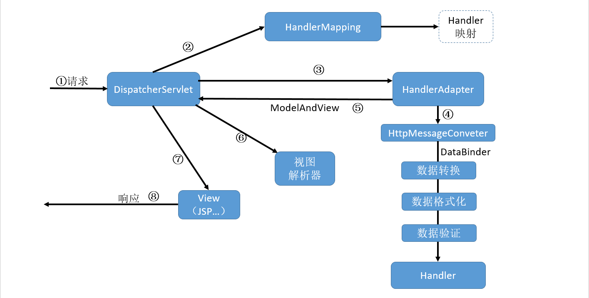

# 1.1 SpringMVC流程

SpringMVC的执行流程：



- ①：SpringMVC所有的请求都会经过一个前端控制器(`DispatcherServlet`)，这个**单实例**的Servlet将请求委托给应用程序的其他组件来执行实际的处理；
- ②：`DispatcherServlet`对请求URL进行解析，得到URI。判断请求URI对应的映射，
  - 如果映射不存在：
    - 判断是否配置了`<mvc:default-servlet-handler>`
      - 如果没有配置，控制台报映射查找不到，客户端显式404；
      - 如果有配置，则执行目标资源(一般为静态资源)
  - 如果映射存在，调用`HandlerMapping`获得该Handler配置的相关对象，包括`Handler`对象及`Handler`对象对应的拦截器，这些对象会被封装到一个`HandlerExecutionChain`对象中返回；
- ③：`DispatcherServlet`根据得到的`Handler`(处理器：可实际处理请求的方法，即标注了`@RequestMapping()`注解的方法)，选择一个合适的`HandlerAdapter`(它会被用于处理多种`Handler`，调用`Handler`实际处理请求的方法)；
- ④：提取请求中的模型数据，开始执行`Handler`(Controller)。在填充`Handler`的入参过程中，根据配置，Spring会做一些额外工作：
  - 消息转换：将请求信息转换为一个对象，将对象转换为指定的响应信息；
  - 数据转换：对请求信息进行数据转换，如：`String`转为`Integer`等；
  - 数据格式化：对请求信息进行数据格式化，如：字符串转为格式化数字/日期等；
  - 数据验证：验证数据的有效性(长度、格式等)，验证结果存储到`BindingResult`或`Error`中。
- ⑤：Handler执行完成后，向`DispatcherServlet`返回一个`ModelAndView`对象，其中包含模型和逻辑视图名；
- ⑥：根据返回的`ModelAndView`对象，选择合适的`ViewResolver`(必须是已经注册了的)给`DispatcherServlet`；
  - 也会判断是否存在异常，存在，则执行`HandlerExceptionResolver`处理异常
- ⑦：`ViewResolver`渲染视图；
- ⑧：将视图渲染结果返回给客户端。


SpringMVC将Web进行了职责解耦，基于请求-响应模型。

- 组件说明：
  - 前端控制器`DispatcherServlet`：SpringMVC的入口函数，接受请求、响应结果，可以减少其他组件之间的耦合度。相当于MVC模式中的C。
  - `Controller`：处理器/页面控制器，控制逻辑转移到前端控制器，用于对请求进行处理；
  - 处理器映射器`HandlerMapping`：根据请求的url查找Handler。`HandlerMapping`负责根据用户请求找到Handler即处理器（Controller），SpringMVC提供了不同的映射器实现不同的映射方式，例如：配置文件方式，实现接口方式，注解方式等。
  - 处理器适配器`HandlerAdapter`：按照特定规则(`HandlerAdapter`要求的规则)去执行Handler 通过`HandlerAdapter`对处理器进行执行，这是适配器模式的应用，通过扩展适配器可以对更多类型的处理器进行执行。
  - 处理器Handler(需根据业务需求开发)：继`DispatcherServlet`前端控制器的后端控制器，在`DispatcherServlet`的控制下Handler对具体的用户请求进行处理。 
  - 视图解析器(View Resolver)：将逻辑视图名解析为物理视图。
  - 视图(View)
  - 其他常用组件：
    - `LocalResolver`：本地化、国际化
    - `MultipartResolver`：文件上传解析器
    - `HandlerExceptionResolver`：异常处理器


# 1.2 HelloWorld

- 导入的jar包：
  - spring-core.jar
  - spring-context.jar
  - spring-aop.jar
  - spring-beans.jar
  - spring-expression.jar
  - spring-web.jar
  - spring-webmvc.jar（该包依赖于以上的包，使用Maven导入时，仅导入这一个就会自动导入上面的）
  - commons-logging.jar


web.xml

```xml
<!--定义SpringMVC的前端控制器DispatcherServlet-->
<servlet>
    <servlet-name>dispatcherServlet</servlet-name>
    <servlet-class>org.springframework.web.servlet.DispatcherServlet</servlet-class>
    <!--配置DispatcherServlet的初始化参数，用于指定SpringMVC配置文件的位置和名称-->
    <!--也可以不通过contextConfigLocation这个初始化参数配置SpringMVC配置文件，而使用默认的方式。
            默认的配置文件位置及名称：/WEB-INF/<servlet-name>-servlet.xml
            当前的默认值：/WEB-INF/dipatcherServlet-servlet.xml
            -->
    <init-param>
        <param-name>contextConfigLocation</param-name>
        <param-value>classpath:springmvc.xml</param-value>
    </init-param>
    <!--Web应用启动时立即加载Servlet-->
    <load-on-startup>1</load-on-startup>
</servlet>
<servlet-mapping>
    <servlet-name>dispatcherServlet</servlet-name>
    <url-pattern>/</url-pattern>
</servlet-mapping>
```

HelloController

```java
public class HelloController implements Controller {
    private static final Log logger = LogFactory.getLog(HelloController.class);

    @Override
    public ModelAndView handleRequest(HttpServletRequest request, HttpServletResponse response) throws Exception {
        logger.info("handleRequest 被调用！");
        //创建准备返回的ModelAndView对象
        ModelAndView mv = new ModelAndView();
        //添加模型数据，可以是任意的POJO对象
        mv.addObject("message","Hello World!");
        //设置逻辑视图名
        //SpringMVC建议所有的视图页面放在WEB-INF目录下，避免直接向视图页面发送请求
        mv.setViewName("/WEB-INF/content/welcome.jsp");
        return mv;
    }
}
```

springmvc.xml

```xml
<!--配置Handle，映射/hello请求-->
<bean name="/hello" class="com.ms5cm.controller.HelloController"/>
<!--视图解析器-->
<bean class="org.springframework.web.servlet.view.InternalResourceViewResolver"/>
```

welcome,jsp

```jsp
    <h4>Welcome You</h4>
    <!--获取Controller传递出来的message-->
    ${requestScope.message}
```


# 1.3 映射

```
/   表示拦截所有请求(包括静态资源)，但不包括 *.jsp
/*  表示拦截所有请求(包括静态资源、*.jsp)。jsp页面是Tomcat的jsp引擎解析的
/** 表示拦截任意多层路径
```

