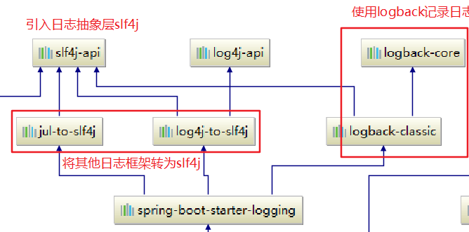

# 3.1 日志框架

| 日志门面（日志的抽象层）                                     | 日志实现                                             |
| ------------------------------------------------------------ | ---------------------------------------------------- |
| ~~JCL（Jakarta Commons Logging）~~、**SLF4j（Simple Logging Facade for Java）**、~~jboss-logging~~ | Log4j、JUL（java.util.logging）、Log4j2、**Logback** |

使用：左边选一个门面（抽象层），右边选一个实现；

日志门面：SLF4j

日志实现：Logback。（SLF4j、Log4j、Logback出自同一人；Log4j2很好，但很多框架还没有兼容）

SpringBoot：底层是Spring框架，Spring框架默认使用 JCL；SpringBoot选用==SLF4j 和 Logback==，也能自动适配JUL、Log4j2、Logback。


# 3.2 SLF4J使用

## 1.如何使用 SLF4J

[官方文档](https://www.slf4j.org/manual.html)

开发时，日志记录方法的调用，不应该直接调用日志的实现类，而是调用日志抽象层里面的方法；

给系统里面导入 SLF4j 的 jar 和 Logback 的实现 jar

```java
import org.slf4j.Logger;
import org.slf4j.LoggerFactory;

public class HelloWorld {
  public static void main(String[] args) {
    Logger logger = LoggerFactory.getLogger(HelloWorld.class);
    logger.info("Hello World");
  }
}
```

使用其他的日志实现：


每一个日志的实现框架都有自己的配置文件。使用 SLF4j 以后，**配置文件还是做成日志实现框架的配置文件**。


## 2.遗留问题

本身系统（SLF4j +Logback）如果以后集成 Spring（commons-logging）、Hibernate（jboss-logging）、MyBatis。。。需要统一日志记录，即使是别的框架，也和本身一起统一使用 SLF4j  进行输出。


**如何让系统中所有的日志都统一到 SLF4j？**

1. ==将系统中其他日志框架先排除出去；（IDEA：在依赖树中，选中该日志框架，右键Exclude，也可以在POM文件中排除）==
2. ==用中间包来替换原有的日志框架；==
3. ==导入 SLF4J 其他的实现。==


# 3.3 SpringBoot日志关系

```xml
    <dependency>
      <groupId>org.springframework.boot</groupId>
      <artifactId>spring-boot-starter</artifactId>
      <version>2.0.3.RELEASE</version>
      <scope>compile</scope>
    </dependency>
```

SpringBoot使用它来做日志：

```xml
    <dependency>
      <groupId>org.springframework.boot</groupId>
      <artifactId>spring-boot-starter-logging</artifactId>
      <version>2.0.3.RELEASE</version>
      <scope>compile</scope>
    </dependency>
```

底层依赖关系：



总结：

1. SpringBoot底层也是使用 SLF4J+Logback的方式进行日志记录；
2. SpringBoot也是把其他的日志都替换成了 SLF4J；
3. 如果要引入其他框架，一定要把这个框架的默认日志依赖移除掉。

**SpringBoot能自动适配所有的日志，且底层使用  SLF4J+Logback 的方式记录日志，引入其他框架时，只需要把这个框架以来的日志框架排除掉。**


# 3.4 日志使用

## 1.默认配置

SpringBoot默认帮我们配置好了日志。

**日志级别（从低到高）：trace < debug < info < warn < error**

SpringBoot**默认级别（root级别）是 info级别的**

可以调整输出的日志级别，**日志就只会在这个级别及以后的高级别生效**。

```java
    //日志记录器
    Logger logger = LoggerFactory.getLogger(getClass());
    @Test
    public void contextLoads() {
        logger.trace("这是trace日志");
        logger.debug("这是debug日志");
        logger.info("这是info日志");
        logger.warn("这是warn日志");
        logger.error("这是error日志");
    }
```


SpringBoot修改日志的默认配置 application.propertits 文件：

位置：Maven下载jar包的位置\org\springframework\boot\spring-boot\2.1.0.RELEASE\spring-boot-2.1.0.RELEASE.jar!\org\springframework\boot\logging\logback包下

1. 全局常规配置（格式、路径、级别）
2. 指定日志配置文件位置（logging.file 和 logging.path 都没有配置的话，只在控制台输出 ）

```properties
#对指定的包/类调整其日志级别：logging.level.包[.类] 
logging.level.com.zzk_fs=trace

#logging.file 和 logging.path 只能生效一个，同时存在则logging.file生效
#logging.file
    #不指定路径就在当前项目下生成springboot.log日志文件：logging.file=springboot.log	
    #可以指定完整路径：logging.file=G:/springboot.log
#logging.path(常用)
	#在当前磁盘的根路径下创建spring文件夹和里面的log文件夹：使用spring.log作为默认日志文件
logging.path=/spring/log

# 指定控制台输出的日志格式
logging.pattern.console=%d{yyyy-MM-dd HH:mm:ss.SSS} [%thread] %-5level %logger{50} - %msg%n
# 指定文件中输出的日志格式
logging.pattern.file=%d{yyyy-MM-dd} [%thread] %-5level %logger{50} - %msg%n
```


日志的**输出格式**：

默认输出格式: 时间 日志级别  线程ID --- [ 线程名 ] 全类名：信息 换行

如：`2018-06-29 09:46:54.392  INFO 12460 --- [           main] c.z.s.s.Springboot01ApplicationTests     : Started Springboot01ApplicationTests in 2.237 seconds (JVM running for 3.37)`

```properties
    %d 表示日期时间
    %thread 表示线程名
    %-5level 表示级别从左显示5个字符宽度
    %logger{50} 表示logger名字最长50个字符，否则按照句点分隔
    %msg 表示日志消息
    %n 是换行符
```


## 2.指定配置

给类路径下放上每个日志框架自己的配置文件即可，SpringBoot就不会使用自己的默认配置了

| Logging System          | Customization                                                |
| ----------------------- | ------------------------------------------------------------ |
| Logback                 | `logback-spring.xml`, `logback-spring.groovy`, `logback.xml`, or `logback.groovy` |
| Log4j2                  | `log4j2-spring.xml` or `log4j2.xml`                          |
| JDK (Java Util Logging) | `logging.properties`                                         |

如果是 logback.xml ，直接就被日志框架识别了；

如果是 **logback-spring.xml** ，日志框架就不直接加载日志的配置项，而由SpringBoot加载，就可以在日志配置文件中使用一些高级Profile特性：

```xml
<springProfile name="staging">	
	<!-- configuration to be enabled when the "staging" profile is active -->
    指定这里的配置只在 staging 环境下生效。在 application.properties 中配置环境
</springProfile>

<springProfile name="dev, staging">
	<!-- configuration to be enabled when the "dev" or "staging" profiles are active -->
</springProfile>

<springProfile name="!production">
	<!-- configuration to be enabled when the "production" profile is not active -->
</springProfile>
```

其他使用见SpringBoot [官方文档](https://docs.spring.io/spring-boot/docs/2.0.3.RELEASE/reference/htmlsingle/#boot-features-logging)


## 3.切换日志框架

切换为log4j2：

```xml
<dependency>
    <groupId>org.springframework.boot</groupId>
    <artifactId>spring‐boot‐starter‐web</artifactId>
    <exclusions>
        <exclusion>
            <artifactId>spring‐boot‐starter‐logging</artifactId>
            <groupId>org.springframework.boot</groupId>
        </exclusion>
    </exclusions>
</dependency>
<dependency>
    <groupId>org.springframework.boot</groupId>
    <artifactId>spring‐boot‐starter‐log4j2</artifactId>
</dependency>
```

