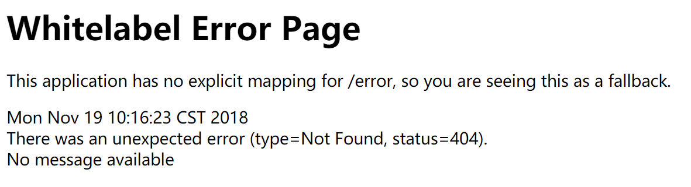
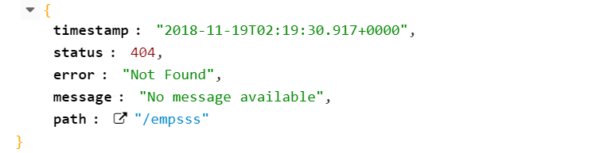

# 4.1 静态资源映射

```java
@ConfigurationProperties(prefix = "spring.resources", ignoreUnknownFields = false)
public class ResourceProperties {...}
可以设置和静态资源有关的参数，如缓存时间等
```


`WebMvcAutoConfiguration`类中：

```java
public void addResourceHandlers(ResourceHandlerRegistry registry) {
    if (!this.resourceProperties.isAddMappings()) {
        logger.debug("Default resource handling disabled");
        return;
    }
    Duration cachePeriod = this.resourceProperties.getCache().getPeriod();
    CacheControl cacheControl = this.resourceProperties.getCache()
        .getCachecontrol().toHttpCacheControl();
    if (!registry.hasMappingForPattern("/webjars/**")) {
        customizeResourceHandlerRegistration(registry
            .addResourceHandler("/webjars/**")
            .addResourceLocations("classpath:/META-INF/resources/webjars/")
            .setCachePeriod(getSeconds(cachePeriod))
            .setCacheControl(cacheControl));
    }
    String staticPathPattern = this.mvcProperties.getStaticPathPattern();
    if (!registry.hasMappingForPattern(staticPathPattern)) {
        customizeResourceHandlerRegistration(
            registry.addResourceHandler(staticPathPattern)
            .addResourceLocations(getResourceLocations(
                this.resourceProperties.getStaticLocations()))
            .setCachePeriod(getSeconds(cachePeriod))
            .setCacheControl(cacheControl));
    }
}
//配置欢迎页映射
@Bean
public WelcomePageHandlerMapping welcomePageHandlerMapping(
    ApplicationContext applicationContext) {
    return new WelcomePageHandlerMapping(
        new TemplateAvailabilityProviders(applicationContext),
        applicationContext, getWelcomePage(),
        this.mvcProperties.getStaticPathPattern());
}
```


## /webjars/** 请求

==所有 /webjars/**  请求，都去 classpath:/META-INF/resources/webjars/ 下找资源==

webjars：以jar包方式引入静态资源；参考：https://www.webjars.org/


	localhost:8080/webjars/jquery/3.3.1-1/jquery.js 是可以访问到图中的jquery.js这一静态资源的。

```xml
<!--导入jQuery-webjar--> 在访问的时候只需要写webjars下面资源的名称即可
<dependency>
    <groupId>org.webjars</groupId>
    <artifactId>jquery</artifactId>
    <version>3.3.1-1</version>
</dependency>
```


## /** 请求

==/** 访问当前项目的资源，会在以下五个静态资源文件夹中寻找==

```
"classpath:/META-INF/resources/",
"classpath:/resources/",
"classpath:/static/", 
"classpath:/public/" 
"/"              当前项目的根路径
```

	localhost:8080/abc	会去静态资源文件夹找

静态文件夹是可以自定义的,在application.properties中

```properties
spring.resources.static-location=classpath:/hello/,classpath:/zzk/
```

自定义静态资源文件夹以后，原来默认的就不再起作用了。


## 欢迎页

 ==欢迎页：静态资源文件夹下的所有index.html页面，被 "/**" 映射。==

	localhost:8080/  		会找静态资源文件夹下的 index 页面


## 图标映射

WebMvcAutoConfiguration类的内部类：

```java
@Configuration
@ConditionalOnProperty(value = "spring.mvc.favicon.enabled", matchIfMissing = true)
public static class FaviconConfiguration implements ResourceLoaderAware {

    private final ResourceProperties resourceProperties;

    private ResourceLoader resourceLoader;

    public FaviconConfiguration(ResourceProperties resourceProperties) {
        this.resourceProperties = resourceProperties;
    }

    @Override
    public void setResourceLoader(ResourceLoader resourceLoader) {
        this.resourceLoader = resourceLoader;
    }

    @Bean
    public SimpleUrlHandlerMapping faviconHandlerMapping() {
        SimpleUrlHandlerMapping mapping = new SimpleUrlHandlerMapping();
        mapping.setOrder(Ordered.HIGHEST_PRECEDENCE + 1);
        mapping.setUrlMap(Collections.singletonMap("**/favicon.ico",
                                                   faviconRequestHandler()));
        return mapping;
    }

    @Bean
    public ResourceHttpRequestHandler faviconRequestHandler() {
        ResourceHttpRequestHandler requestHandler = new ResourceHttpRequestHandler();
        requestHandler.setLocations(resolveFaviconLocations());
        return requestHandler;
    }

    private List<Resource> resolveFaviconLocations() {
        String[] staticLocations = getResourceLocations(
            this.resourceProperties.getStaticLocations());
        List<Resource> locations = new ArrayList<>(staticLocations.length + 1);
        Arrays.stream(staticLocations).map(this.resourceLoader::getResource)
            .forEach(locations::add);
        locations.add(new ClassPathResource("/"));
        return Collections.unmodifiableList(locations);
    }
}
```


==所有的 "**/favicon.ico"  都是在静态资源文件夹下找==


# 4.2 SpringMVC相关

参见[官方文档](https://docs.spring.io/spring-boot/docs/2.1.0.RELEASE/reference/htmlsingle/#boot-features-developing-web-applications)

## 默认配置

SpringBoot自动配置好了SpringMVC，以下为默认配置：

- 视图解析器： `ContentNegotiatingViewResolver` 和`BeanNameViewResolver` ；
  - `ContentNegotiatingViewResolver`会组合所有的视图解析器。
  - ==如何定制？如果自己给容器添加一个视图解析器，`ContentNegotiatingViewResolver`就会自动将其组合进来==
- 静态资源文件夹路径和webjars支持(见4.1)
- 静态首页`index.html`支持(见4.1)
- favicon.ico图标映射支持(见4.1)
- 自动注册了 `Converter`、 `GenericConverter`和`Formatter`
  - `Converter`转换器。类型转换时会使用
  - `Formatter`格式化器。SpringMVC中的日期格式化器默认格式是`dd/MM/yyyy`，可在全局配置文件中修改：`spring.mvc.date-format=yyyy-MM-dd`
  - ==自己添加的格式化器、转换器，只要放在容器中即可==
- 支持`HttpMessageConverters` 
  - 用于转换HTTP请求和响应
  - `HttpMessageConverters`是从容器中确定；获取所有的`HttpMessageConverter`；
  - ==自己给容器中添加`HttpMessageConverter`，只需要将自己的组件注册容器中即可==
- 自动注册了`MessageCodesResolver` ，定义错误代码生成规则
- 自动注册了`ConfigurableWebBindingInitializer` 
  - 初始化`WebDataBinder`(将请求数据绑定到JavaBean中)
  - 可以配置一个`ConfigurableWebBindingInitializer`来替换默认的；（添加到容器）

**org.springframework.boot.autoconfigure.web：web的所有自动场景**


## 扩展SpringMVC

如果要额外添加SpringMVC配置(如：拦截器)，可以编写一个自己的配置类(`@Configuration`标注的)，该配置类为`WebMvcConfigurer`类型，但不能标注`@EnableWebMvc`注解。

既保留了所有的自动配置，也可使用我们扩展的配置。

```java
@Configuration
public class MyConfig implements WebMvcConfigurer { //接口中的方法都是default方法
    @Override
    public void addViewControllers(ViewControllerRegistry registry) {
        //  /fs请求来到success页面
        registry.addViewController("/fs").setViewName("success");
    }
}
```

原理：

1. `WebMvcAutoConfiguration`是SpringMVC的自动配置类；在做其他自动配置时(下面的是内部类)

   ```java
   @Configuration
   @Import(EnableWebMvcConfiguration.class)  
   @EnableConfigurationProperties({ WebMvcProperties.class, ResourceProperties.class })
   @Order(0)
   public static class WebMvcAutoConfigurationAdapter implements WebMvcConfigurer, ResourceLoaderAware{}
   ```

2. 导入的`EnableWebMvcConfiguration`的父类`DelegatingWebMvcConfiguration`中：

   ```java
   //从容器中获取所有的WebMvcConfigurer
   @Autowired(required = false)
   public void setConfigurers(List<WebMvcConfigurer> configurers) {
       if (!CollectionUtils.isEmpty(configurers)) {
           this.configurers.addWebMvcConfigurers(configurers);
       }
   }
   ```

3. 容器中所有的`WebMvcConfigurer`都会一起起作用，所以SpringMVC的自动配置和我们的扩展配置都会起作用。


## 接管SpringMVC

SpringBoot对SpringMVC的自动配置不需要了，所有都是我们自己配置。所有的SpringMVC的自动配置都会失效。

只要在自己的配置类上添加`@EnableWebMvc`注解即可。

```java
@EnableWebMvc
@Configuration
public class MyConfig implements WebMvcConfigurer {
    @Override
    public void addViewControllers(ViewControllerRegistry registry) {
        //  /fs请求来到success页面
        registry.addViewController("/fs").setViewName("success");
    }
}
```

原理：

1. `@EnableWebMvc`：

   ```java
   @Import(DelegatingWebMvcConfiguration.class)
   public @interface EnableWebMvc {}
   ```

2. `DelegatingWebMvcConfiguration`：

   ```java
   @Configuration
   public class DelegatingWebMvcConfiguration extends WebMvcConfigurationSupport {}
   ```

3. 自动配置类`WebMvcAutoConfiguration`：

   ```java
   @Configuration
   @ConditionalOnWebApplication(type = Type.SERVLET)
   @ConditionalOnClass({ Servlet.class, DispatcherServlet.class, WebMvcConfigurer.class })
   //自动配置类在没有 WebMvcConfigurationSupport 组件时才会生效
   @ConditionalOnMissingBean(WebMvcConfigurationSupport.class)
   @AutoConfigureOrder(Ordered.HIGHEST_PRECEDENCE + 10)
   @AutoConfigureAfter({ DispatcherServletAutoConfiguration.class,
   		TaskExecutionAutoConfiguration.class, ValidationAutoConfiguration.class })
   public class WebMvcAutoConfiguration {。。。}
   ```

4. `@EnableWebMvc`会将`WebMvcConfigurationSupport`组件导入进来，所以自动配置类就不再生效。而导入的`WebMvcConfigurationSupport`只是SpringMVC最基本的功能。


## 修改默认配置

SpringBoot在自动配置很多组件时，先看容器中有没有用户自己配置的，如果有就使用用户配置的，如果没有才会自动配置；如果有些组件可以有多个(如视图解析器)，则会将用户配置的和自己默认的组合起来；

在SpringBoot中会有非常多的xxxConfigurer帮助我们进行扩展配置；

在SpringBoot中会有很多的xxxCustomizer帮助我们进行定制配置。


# 4.3 错误处理机制

SpringBoot默认的错误处理机制：

效果：浏览器会返回一个默认的错误页面（浏览器发送请求的请求头中的Accept优先为 text/html）：



其他客户端(如Chrome浏览器的Restlet Client插件)则会响应JSON数据（发送请求的请求头中的Accept为 /* ）：




## 原理

流程：

一但系统出现4xx或者5xx之类的错误；`ErrorPageCustomizer`就会生效（定制错误的响应规则）；就会来到/error
请求；就会被`BasicErrorController`处理：

1. 响应页面；去哪个页面是由`DefaultErrorViewResolver`解析得到的；

   ```java
   protected ModelAndView resolveErrorView(HttpServletRequest request, HttpServletResponse response, HttpStatus status, Map<String, Object> model) {
       //所有的ErrorViewResolver得到ModelAndView
       for (ErrorViewResolver resolver : this.errorViewResolvers) {
           ModelAndView modelAndView = resolver.resolveErrorView(request, status, model);
           if (modelAndView != null) {
               return modelAndView;
           }
       }
       return null;
   }
   ```


原理：参照`ErrorMvcAutoConfiguration`错误处理的自动配置。给容器添加了以下组件：

1. `DefaultErrorAttributes`帮我们在页面共享信息

   ```java
   @Override
   public Map<String, Object> getErrorAttributes(WebRequest webRequest,
                                                 boolean includeStackTrace) {
       Map<String, Object> errorAttributes = new LinkedHashMap<>();
       errorAttributes.put("timestamp", new Date());
       addStatus(errorAttributes, webRequest);
       addErrorDetails(errorAttributes, webRequest, includeStackTrace);
       addPath(errorAttributes, webRequest);
       return errorAttributes;
   }
   ```

2. `BasicErrorController`处理默认/error请求

   ```java
   @Controller
   //如果在全局配置文件中没有配置server.error.path就默认使用error.path的值，如果也没有就使用/error路径
   @RequestMapping("${server.error.path:${error.path:/error}}")
   public class BasicErrorController extends AbstractErrorController {
       //产生html类型的数据；浏览器发送的请求来到这个方法处理
       @RequestMapping(produces = MediaType.TEXT_HTML_VALUE)
   	public ModelAndView errorHtml(HttpServletRequest request,HttpServletResponse response) {
   		HttpStatus status = getStatus(request);
   		Map<String, Object> model = Collections.unmodifiableMap(getErrorAttributes(
   				request, isIncludeStackTrace(request, MediaType.TEXT_HTML)));
   		response.setStatus(status.value());
           //去哪个页面作为错误页面。包含页面地址和页面内容
   		ModelAndView modelAndView = resolveErrorView(request, response, status, model);
   		return (modelAndView != null) ? modelAndView : new ModelAndView("error", model);
   	}
   
   	@RequestMapping //其他客户端发送的请求来这个方法处理
   	public ResponseEntity<Map<String, Object>> error(HttpServletRequest request) {
   		Map<String, Object> body = getErrorAttributes(request,isIncludeStackTrace(request, MediaType.ALL));
   		HttpStatus status = getStatus(request);
   		return new ResponseEntity<>(body, status);
   	}
   }
   ```

3. `ErrorPageCustomizer`系统出现错误以后来到error请求进行处理；（相当于web.xml注册的错误页
   面规则）

   ```java
   @Override
   public void registerErrorPages(ErrorPageRegistry errorPageRegistry) {
       ErrorPage errorPage = new ErrorPage(this.dispatcherServletPath
                                          .getRelativePath(this.properties.getError().getPath()));
       errorPageRegistry.addErrorPages(errorPage);
   }
   //而在ErrorProperties.java中：
   @Value("${error.path:/error}")
   private String path = "/error";
   ```

4. `DefaultErrorViewResolver`

   ```java
   @Override
   public ModelAndView resolveErrorView(HttpServletRequest request, HttpStatus status,
                                        Map<String, Object> model) {
       ModelAndView modelAndView = resolve(String.valueOf(status.value()), model);
       if (modelAndView == null && SERIES_VIEWS.containsKey(status.series())) {
           modelAndView = resolve(SERIES_VIEWS.get(status.series()), model);
       }
       return modelAndView;
   }
   
   private ModelAndView resolve(String viewName, Map<String, Object> model) {
       //默认SpringBoot可以去找到一个页面？  如：error/404
       String errorViewName = "error/" + viewName;
       //模板引擎可以解析这个页面地址就用模板引擎解析
       TemplateAvailabilityProvider provider = this.templateAvailabilityProviders
           .getProvider(errorViewName, this.applicationContext);
       if (provider != null) {
           //模板引擎可用的情况下返回到errorViewName指定的视图地址
           return new ModelAndView(errorViewName, model);
       }
       //模板引擎不可用，就在静态资源文件夹下找errorViewName对应的页面   error/404.html
       return resolveResource(errorViewName, model);
   }
   ```


## 定制

### 定制错误页面

- **有模板引擎的情况下；error/状态码**
  - 将错误页面命名为 `错误状态码.html`放在模板引擎文件夹里面的error文件夹下，发生此状态码的错误就会来到对应的页面；
  - 也可以使用4xx和5xx作为错误页面的文件名来匹配这种类型的所有错误，精确优先（优先寻找精确状态
    码.html`）；
  - 页面可以获取的信息：timestamp、status(HTTP状态码)、error(错误提示)、exception(异常对象)、message(异常消息)、errors(JSR303数据校验的错误都在这里)、trace(异常跟踪信息)、path(错误发生时的请求URL路径)
- 没有模板引擎（模板引擎找不到这个错误页面），静态资源文件夹下找；
- 以上都没有错误页面，就是默认来到SpringBoot默认的错误提示页面。


### 定制错误的JSON数据

1. 方法一：自定义异常处理&返回定制JSON数据；没有自适应效果：浏览器返回错误页面，其他客户端返回JSON数据

   ```java
   @ControllerAdvice  //异常处理器
   public class MyExceptionHandler {
       @ResponseBody //浏览器和客户端都返回JSON数据
       @ExceptionHandler(UserNotExistException.class)  //要处理的异常
       public Map<String,Object> handleException(Exception e){
           Map<String,Object> map = new HashMap();
           map.put("code","user.notexist");
           map.put("message",e.getMessage());
           return map;
       }
   }
   ```

2. 方法二：转发到/error进行自适应响应效果处理

   ```java
   	@ExceptionHandler(UserNotExistException.class)
       public String handleException(Exception e, HttpServletRequest request){
           Map<String,Object> map = new HashMap<>();
           //传入我们自己的错误状态码  4xx 5xx，否则就不会进入定制错误页面的解析流程
           /**
            * Integer statusCode = (Integer) request
            .getAttribute("javax.servlet.error.status_code");
            */
           request.setAttribute("javax.servlet.error.status_code",500);
           map.put("code","user.notexist");
           map.put("message",e.getMessage());
           //转发到/error
           return "forward:/error";
       }
   ```


### 将定制数据携带出去

- 默认出现错误以后，会来到/error请求，被`BasicErrorController`处理，响应出去可以获取的数据是由
  `getErrorAttributes()`得到的。（`AbstractErrorController`（ErrorController）规定的方法）；

- 方法一：可以编写一个`ErrorController`的实现类【或者是编写`AbstractErrorController`的子类】，放在容器中，这样`BasicErrorController`就不会被注册到容器中(不推荐，使用下面的方法)

- 方法二：页面上能用的数据，或者是json返回能用的数据默认都是通过`DefaultErrorAttributes.getErrorAttributes()`进行数据处理后得到，所以可以自定义`DefaultErrorAttributes`：

  ```java
  //给容器中加入我们自己定义的ErrorAttributes
  @Component
  public class MyErrorAttributes extends DefaultErrorAttributes {
      @Override
      public Map<String, Object> getErrorAttributes(RequestAttributes requestAttributes,
  boolean includeStackTrace) {
          Map<String, Object> map = super.getErrorAttributes(requestAttributes,
  includeStackTrace);
          map.put("company","atguigu");
          return map;
      }
  }
  //最终的效果：响应是自适应的，可以通过定制ErrorAttributes改变需要返回的内容，
  ```


# 4.4 其他

开发期间模板引擎页面修改以后，要实时生效：

1. 禁用模板引擎的缓存：`spring.thymeleaf.cache=false`
2. (IDEA中)页面修改完成以后ctrl+f9：重新编译


## 首页

要使程序运行后直接访问到首页index.html，有两种方法：

方法一，在控制器中处理：

```java
    @RequestMapping({"/","/index.html"})
    public String index(){
        return "index";
    }
```

方法二，在自己的配置类中处理：

```java
@Configuration
public class MyConfig implements WebMvcConfigurer {
    @Override
    public void addViewControllers(ViewControllerRegistry registry) {
        registry.addViewController("/").setViewName("index");
        registry.addViewController("/index.html").setViewName("index");
    }
}
```


## 国际化

1. 编写国际化配置文件；

2. 使用`ResourceBundleMessageSource`管理国际化资源文件(SpringBoot已经自动配置好了相关组件)；

   ```java
   @EnableConfigurationProperties
   @Configuration
   public class MessageSourceAutoConfiguration {
       @Bean
   	@ConfigurationProperties(prefix = "spring.messages")
   	public MessageSourceProperties messageSourceProperties() {
           //在MessageSourceProperties中设置了basename默认值为mssages
           //即我们的国际化配置文件可直接放在类路径下叫message.properties，这样就不用在application.properties中配置基础名了
   		return new MessageSourceProperties();
   	}
       
       @Bean
   	public MessageSource messageSource(MessageSourceProperties properties) {
   		ResourceBundleMessageSource messageSource = new ResourceBundleMessageSource();
   		if (StringUtils.hasText(properties.getBasename())) {
               //设置国际化资源文件的基础名
   			messageSource.setBasenames(StringUtils.commaDelimitedListToStringArray(
   					StringUtils.trimAllWhitespace(properties.getBasename())));
   		}
   		if (properties.getEncoding() != null) {
   			messageSource.setDefaultEncoding(properties.getEncoding().name());
   		}
   		messageSource.setFallbackToSystemLocale(properties.isFallbackToSystemLocale());
   		Duration cacheDuration = properties.getCacheDuration();
   		if (cacheDuration != null) {
   			messageSource.setCacheMillis(cacheDuration.toMillis());
   		}
   		messageSource.setAlwaysUseMessageFormat(properties.isAlwaysUseMessageFormat());
   		messageSource.setUseCodeAsDefaultMessage(properties.isUseCodeAsDefaultMessage());
   		return messageSource;
   	}
   }
   ```

3. 由于国际化资源文件没有使用messages作为基础名，所以需要在application,properties中设置基础名

   ```properties
   #i18n包下，基础名为login
   spring.messages.basename=i18n.login 
   ```

4. 在页面使用Thymeleaf的`#{...}`取出国际化内容

   ```html
   <form class="form-signin" action="dashboard.html">
       
       <h1 class="h3 mb-3 font-weight-normal" th:text="#{login.tip}">Please sign in</h1>
       <label class="sr-only" th:text="#{login.username}">Username</label>
       <input type="text" class="form-control" placeholder="Username" required="" autofocus="" th:placeholder="#{login.username}">
       <label class="sr-only" th:text="#{login.password}">Password</label>
       <input type="password" class="form-control" placeholder="Password" required="" th:placeholder="#{login.password}">
       <div class="checkbox mb-3">
           <label>
               <input type="checkbox" value="remember-me">[[#{login.remember}]]
           </label>
       </div>
       <button class="btn btn-lg btn-primary btn-block" type="submit" th:text="#{login.btn}">Sign in</button>
       <p class="mt-5 mb-3 text-muted">© 2017-2018</p>
   </form>
   ```

   - 效果：根据浏览器语言设置的信息切换了国际化。


原理：

国际化：`Locale`（区域信息对象）；`LocaleResolver`（获取区域信息对象）。在`WebMvcAutoConfiguration`中：

```java
//默认根据请求头带来的区域信息获取Locale进行国际化，即浏览器中设置语言来修改
@Bean
@ConditionalOnMissingBean
@ConditionalOnProperty(prefix = "spring.mvc", name = "locale")
public LocaleResolver localeResolver() {
    if (this.mvcProperties.getLocaleResolver() == WebMvcProperties.LocaleResolver.FIXED) {
        return new FixedLocaleResolver(this.mvcProperties.getLocale());
    }
    AcceptHeaderLocaleResolver localeResolver = new AcceptHeaderLocaleResolver();
    localeResolver.setDefaultLocale(this.mvcProperties.getLocale());
    return localeResolver;
}
```


为了可以自己选择显示语言：

1. 在上面的HTML代码的form标签中添加：

   ```html
       <a class="btn btn-sm" th:href="@{/index.html(l=zh_CN)}">中文</a>
       <a class="btn btn-sm" th:href="@{/index.html(l=en_US)}">English</a>
   ```

2. 自定义`LocaleResolver`：

   ```java
   public class MyLocaleResolver implements LocaleResolver {
       @Override
       public Locale resolveLocale(HttpServletRequest request) {
           String l = request.getParameter("l");
           Locale locale = Locale.getDefault();
           if(!StringUtils.isEmpty(l)){
               String[] split = l.split("_");
               locale = new Locale(split[0],split[1]);
           }
           return locale;
       }
   
       @Override
       public void setLocale(HttpServletRequest request, HttpServletResponse response, Locale locale) {}
   }
   ```

3. 将自定义的`LocaleResolver`加入容器：

   ```java
   @Bean
   public LocaleResolver localeResolver(){ return new MyLocaleResolver(); }
   ```


## 拦截器

自定义拦截器：

```java
public class LoginHandlerInterceptor implements HandlerInterceptor {
    @Override
    public boolean preHandle(HttpServletRequest request, HttpServletResponse response, Object handler) throws ServletException, IOException {
        Object user = request.getSession().getAttribute("loginUser");
        if (user == null) {
            request.setAttribute("msg", "没有权限请先登陆");
            request.getRequestDispatcher("/index.html").forward(request, response);
            return false;
        }
        return true;
    }
}
```

注册拦截器：

```java
    @Override
    public void addInterceptors(InterceptorRegistry registry) {
        registry.addInterceptor(new LoginHandlerInterceptor())
            .addPathPatterns("/**").excludePathPatterns("/index.html","/","/user/login");
    }
```


## RESTful CRUD

1. SpringMVC中配置`HiddenHttpMethodFilter`;（SpringBoot自动配置好的）
2. 页面创建一个post表单
3. 创建一个input项，name="_method";值就是我们指定的请求方式


## 配置嵌入的Servlet容器

SpringBoot默认使用Tomcat作为嵌入式的Servlet容器。

### 修改配置

- 定制&修改Servlet容器相关配置：

  - 方法一：修改和server相关的配置(都在`ServerProperties`中)

  ```properties
  #通用的Servlet容器设置
  server.xxx
  #Tomcat的设置
  server.tomcat.xxx
  ```

  - 方法二：编写一个定制器实现`WebServerFactoryCustomizer`接口

  ```java
  @Component  //被扫描进容器
  public class CustomizationBean implements WebServerFactoryCustomizer<ConfigurableServletWebServerFactory> {
  	@Override
  	public void customize(ConfigurableServletWebServerFactory server) {
  		server.setPort(9000);
  	}
  }
  ```

  - 方法三：也可以直接注册一个容器工厂

  ```java
  @Bean
  public ConfigurableServletWebServerFactory webServerFactory() {
  	TomcatServletWebServerFactory factory = new TomcatServletWebServerFactory();
  	factory.setPort(9000);
  	factory.setSessionTimeout(10, TimeUnit.MINUTES);
  	factory.addErrorPages(new ErrorPage(HttpStatus.NOT_FOUND, "/notfound.html"));
  	return factory;
  }
  ```


### 注册三大组件

SpringBoot默认以jar包的方式启动嵌入式的Servlet容器来启动web应用，没有web.xml文件。

使用`ServletRegistrationBean`、`FilterRegistrationBean`、`ServletListenerRegistrationBean`来分别向容器中注册Servlet、FIlter、Listener三大组件。

```java
public class MyServlet extends HttpServlet {...}
//在配置类中:
    @Bean
    public ServletRegistrationBean myServlet(){
        ServletRegistrationBean servlet = new ServletRegistrationBean(new MyServlet(), "/myServlet");
        return servlet;
    }
```

```java
public class MyFilter implements javax.servlet.Filter {...}
//在配置类中：
    @Bean
    public FilterRegistrationBean myFilter(){
        FilterRegistrationBean<Filter> filter = new FilterRegistrationBean();
        filter.setFilter(new MyFilter());
        filter.setUrlPatterns(Arrays.asList("/hello","/myServlet"));
        return filter;
    }
```

```java
public class MyListener implements ServletContextListener {...}
//在配置类中：
    @Bean
    public ServletListenerRegistrationBean myListener(){
        return new ServletListenerRegistrationBean(new MyListener());
    }
```

SpringBoot帮我们自动SpringMVC的时候，通过`DispatcherServletRegistrationBean`来自动注册SpringMVC的前端控制器`DIspatcherServlet`，默认拦截`/`（即包含静态资源在内的所有请求，但不拦截 jsp 请求，而`/*`可以拦截jsp），可以通过`spring.mvc.servlet.path`来修改SpringMVC前端控制器默认拦截的请求路径。详见`DispatcherServletAutoConfiguration`。


### 切换嵌入的Servlet容器

- SpringBoot默认支持以下三种Servlet容器：
  - Tomcat(默认使用)
  - Jetty(适合开发长连接)
  - Undertow(不支持JSP，但却是一个高性能非阻塞的Servlet容器)

```xml
<dependency>
    <groupId>org.springframework.boot</groupId>
    <artifactId>spring-boot-starter-web</artifactId>
    <!-- 引入web模块默认就是使用嵌入式的Tomcat作为Servlet容器，要想切换就要先排除tomcat的依赖-->
    <exclusions>
        <exclusion>
            <artifactId>spring-boot-starter-tomcat</artifactId>
            <groupId>org.springframework.boot</groupId>
        </exclusion>
    </exclusions>
</dependency>

<!--引入其他的Servlet容器.将jetty更换为undertow即可切换为undertow-->
<dependency>
    <artifactId>spring-boot-starter-jetty</artifactId>
    <groupId>org.springframework.boot</groupId>
</dependency>
```


### 自动配置

```java
@Configuration
@EnableConfigurationProperties(ServerProperties.class)
@Import({ ServletWebServerFactoryAutoConfiguration.BeanPostProcessorsRegistrar.class,//会注册一个WebServerFactoryCustomizerBeanPostProcessor后置处理器
		ServletWebServerFactoryConfiguration.EmbeddedTomcat.class, //会创建一个TomcatServletWebServerFactory对象
		ServletWebServerFactoryConfiguration.EmbeddedJetty.class,
		ServletWebServerFactoryConfiguration.EmbeddedUndertow.class })
public class ServletWebServerFactoryAutoConfiguration {。。。}
```

```java
public class WebServerFactoryCustomizerBeanPostProcessor implements BeanPostProcessor, BeanFactoryAware {
	//这里仅列出部分方法
	private ListableBeanFactory beanFactory;
	private List<WebServerFactoryCustomizer<?>> customizers;

	@Override
	public Object postProcessBeforeInitialization(Object bean, String beanName)
			throws BeansException {
        //如果当前初始化的是一个WebServerFactory类型的组件
		if (bean instanceof WebServerFactory) {
			postProcessBeforeInitialization((WebServerFactory) bean);
		}
		return bean;
	}

	@SuppressWarnings("unchecked")
	private void postProcessBeforeInitialization(WebServerFactory webServerFactory) {
		LambdaSafe.callbacks(WebServerFactoryCustomizer.class, getCustomizers(),webServerFactory)
				.withLogger(WebServerFactoryCustomizerBeanPostProcessor.class)
            	//调用定制器的customize方法给Servlet容器进行属性赋值
				.invoke((customizer) -> customizer.customize(webServerFactory));
	}

	private Collection<WebServerFactoryCustomizer<?>> getCustomizers() {
		if (this.customizers == null) {
			this.customizers = new ArrayList<>(getWebServerFactoryCustomizerBeans());
			this.customizers.sort(AnnotationAwareOrderComparator.INSTANCE);
			this.customizers = Collections.unmodifiableList(this.customizers);
		}
		return this.customizers;
	}
}
```

1. SpringBoot根据导入的依赖，给容器中添加对应的`ServletWebServerFactory`（如：`TomcatServletWebServerFactory`）
2. 要创建Servlet容器工厂对象就会触发后置处理器`WebServerFactoryCustomizerBeanPostProcessor`
3. 后置处理器会从容器中获取所有的`WebServerFactoryCustomizer`，调用`customize()`方法


### 启动原理

IOC容器启动时创建嵌入式的Servlet容器：

1. SpringBoot应用启动运行`run()`方法；
2. `refreshContext(context)`刷新IoC容器(创建IoC容器对象，并初始化容器，创建容器中的每一个组件)；
3. `refresh(context)`刷新刚才创建好的IoC容器；
4. `onRefresh()` Web的IoC容器重写了`onRefresh()`方法：
   - `createWebServer()`创建Servlet容器
     1. 从IoC容器中获取Servlet容器工厂：`ServletWebServerFactory factory = getWebServerFactory()`
     2. 默认创建的是`TomcatServletWebServerFactory`，此时会触发后置处理器
     3. 后置处理器会获取所有的定制器来先定制Servlet容器的相关配置
     4. `this.webServer = factory.getWebServer(getSelfInitializer())`创建Servlet容器
     5. Servlet容器创建对象并启动
5. 将IoC容器中剩下没有创建出的对象获取出来。


### 使用外置Servlet容器

- 嵌入式的Servlet容器：应用打成可执行的 jar 包
  - 优点：简单、便捷；
  - 缺点：默认不支持JSP、优化定制复杂(见【修改配置】一节)

要使用外置的Servlet容器，需要在创建项目时将默认的打包方式修改为 war，并将嵌入式的Tomcat指定为provided

```xml
<dependency>
   <groupId>org.springframework.boot</groupId>
   <artifactId>spring‐boot‐starter‐tomcat</artifactId>
   <scope>provided</scope>
</dependency>
```

在IDEA的Product Structure按钮的Facets中配置Web源文件和部署；

必须编写一个`SpringBootServletInitializer`的子类，并调用`configure()`方法

```java
public class ServletInitializer extends SpringBootServletInitializer {
   @Override
   protected SpringApplicationBuilder configure(SpringApplicationBuilder application) {
       //传入SpringBoot应用的主程序
      return application.sources(SpringBoot04WebJspApplication.class);
   }
}
```

配置外部的Tomcat

启动服务器即可使用。


- jar包：执行SpringBoot主类的main方法，启动ioc容器，创建嵌入式的Servlet容器；
- war包：启动服务器，服务器启动SpringBoot应用`SpringBootServletInitializer`，启动IoC容器；

- ==原理==：与Servlet 3.0 的共享库及运行时插件特性相关，见Servlet笔记的3.2节

  - 启动Tomcat；

  - 创建Spring的web模块META-INF\services目录中的javax.servlet.ServletContainerInitializer文件里的`org.springframework.web.SpringServletContainerInitializer`类

    ```java
    @HandlesTypes(WebApplicationInitializer.class)
    public class SpringServletContainerInitializer implements ServletContainerInitializer {
        @Override
    	public void onStartup(){......}
    }
    ```

  - `SpringServletContainerInitializer`将`@HandlesTypes`标注的所有这个类型的类都传入`onStartup()`方法，为这些`WebApplicationInitializer`创建实例；

  - 每个`WebApplicationInitializer`都会调用自己的`onStartup()`方法

    - `SpringBootServletInitializer`也是该类的子类，会被创建对象并执行`onStartup()`方法
      - 方法中会调用`createRootApplicationContext(servletContext)`创建容器
        - 该方法还会调用`configure()`方法，子类重写了该方法，将SpringBoot的主程序类传入进来
        - 根据主程序类创建一个Spring应用
        - 启动Spring应用
          - 创建IoC容器
          - 刷新IoC容器

