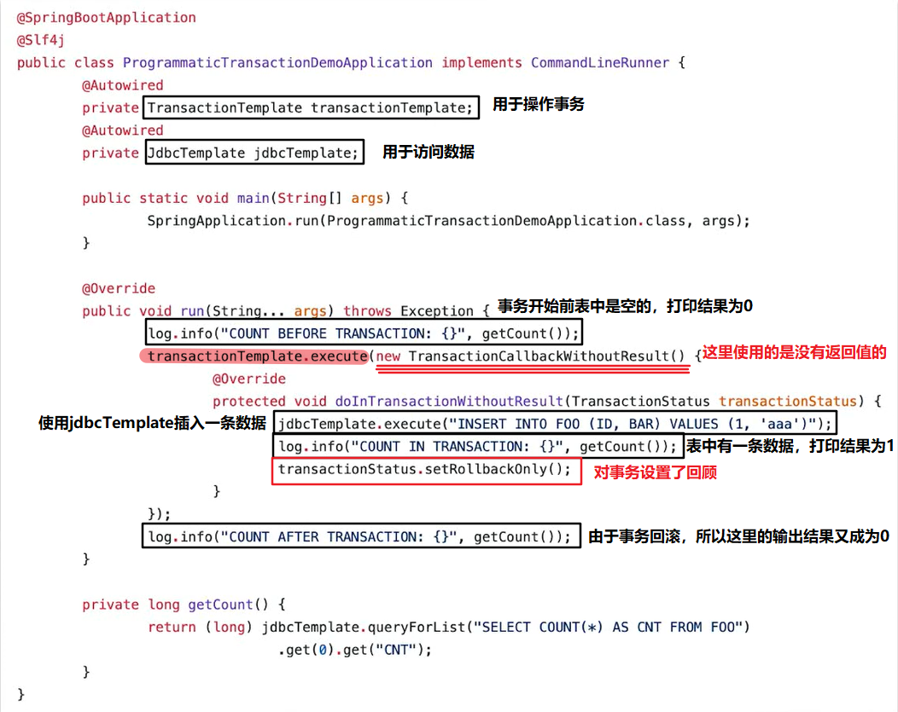
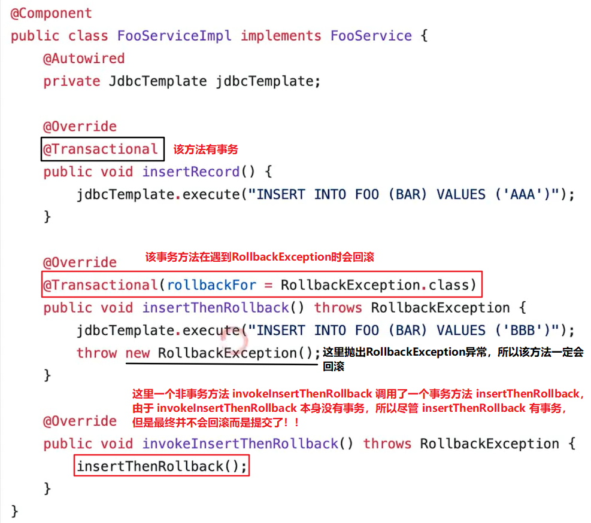
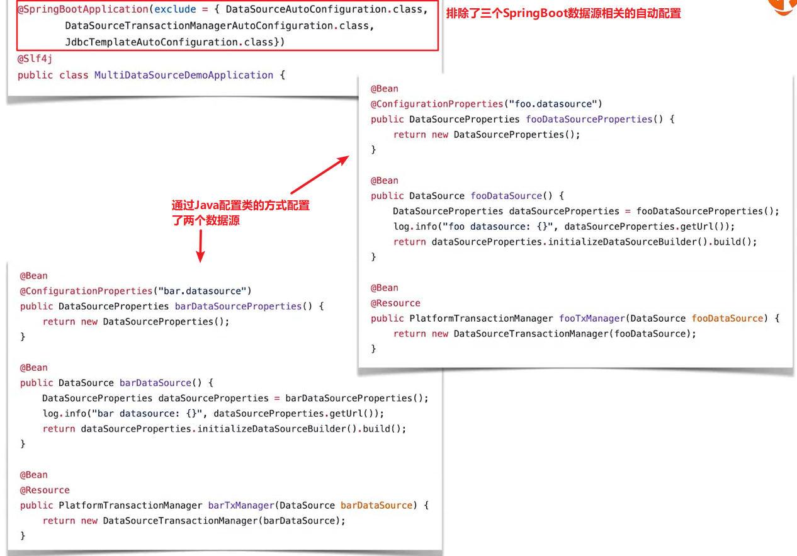

Spring Boot 

- 通过`DataSourceAutoConfiguration`自动配置了`DataSource`
- 通过`DataSourceTransactionManagerAutoConfiguration`自动配置了`DataSourceTransactionManager`
- 通过`JdbcTemplateAutoConfiguration`自动配置了`JdbcTemplate`，
- 但是如果以及自己配置了这些类，SpringBoot则不再自动配置。

- 数据源相关配置属性：

  - 通用：

    ```yaml
    spring:
      datasource:
        username: root
        password: 132128
        driver-class-name: com.mysql.cj.jdbc.Driver (可选，会自动根据url选择合适的驱动)
        url: jdbc:mysql://localhost:3306/myemployees?serverTimezone=UTC&useSSL=false
    ```

  - 初始化内嵌数据库：

    ```yaml
    spring:
      datasource:
        initialization-mode: embedded或always或never
        platform: mysql或h2或...
        # DataSourceInitializerInvoker是一个事件监听器，一旦应用被创建，会初始化类路径下的DDL和DML的sql脚本。DDL相关的是schema-${platform}.sql，DML相关的是data-${platform}.sql。默认初始化的文件为schema-all.sql和data-all.sql，可通过配置文件的spring.datasource.platform来修改。如果想要使用自定义文件名的sql脚本可以使用以下方式：
        # 指定DDL文件
        schema:
          - classpath:employee.sql
          - classpath:department.sql
        # 指定DML文件
        data:
          - classpath:emp.sql
          - classpath:dept.sql
    ```


# 5.1 配置单数据源

SpringBoot 2.x 默认使用`com.zaxxer.hikari.HikariDataSource`数据源。数据源相关配置在`DataSourceProperties`中。

参考`DataSourceConfiguration`，共支持以下四种数据源：

- `org.apache.tomcat.jdbc.pool.DataSource`
- HikariCP：`com.zaxxer.hikari.HikariDataSource`。为什么很快？

  - 字节码级别的优化(很多方法通过 JavaAssist生成)
  - 大量小改进：
    - 用`FastStatementList`代替`ArrayList`
    - 无锁集合`ConcurrentBag`
    - 代理类的优化(如，用 invokestatic 代替了  invokevirtual)
- `org.apache.commons.dbcp2.BasicDataSource`
- 自定义的数据源
  - 配置好自定义数据源相关的Bean之后，需要在配置文件中使用`spring.datasource.type`更换默认数据源，也可以通过在 spring-boot-starter-jdbc 包排除默认的 HikariCP 依赖来完成更换


## 整合Druid数据源

功能：详细的监控；ExceptionSorter，针对主流数据库的返回码都有支持；SQL 防注入；内置加密配置；众多扩展点，方便进行定制。

见GitHub上：https://github.com/alibaba/druid/tree/master/druid-spring-boot-starter

通过 durid-spring-boot-starter 整合，然后将配置写在spring.datasource.druid.*上

注意，要在 spring-boot-starter-jdbc 包中排除 HikariCP 的依赖，也可以不排除 HikariCP 依而通过在配置文件中使用`spring.datasource.type`来更换数据源！！！

添加数据库依赖和Druid依赖：

```xml
<dependency>
   <groupId>com.alibaba</groupId>
   <artifactId>druid-spring-boot-starter</artifactId>
   <version>1.1.10</version>
</dependency>
<dependency>
    <groupId>mysql</groupId>
    <artifactId>mysql-connector-java</artifactId>
    <scope>runtime</scope>
</dependency>
```

在全局配置文件中指定数据源并配置属性

```properties
# 更换默认数据源，也可以通过在 spring-boot-starter-jdbc 包排除 HikariCP 依赖来完成更换
spring.datasource.type=com.alibaba.druid.pool.DruidDataSource 
# ...其他配置（可选，不是必须的，使用内嵌数据库的话下面三项也可省略不填）
spring.datasource.url=jdbc:mysql://localhost:3306/self?characterEncoding=utf-8&serverTimezone=UTC&useSSL=false
spring.datasource.username=root
spring.datasource.password=132128
```

常见其他配置：

```properties
# Filter配置
spring.datasource.druid.filters=stat,wall,log4j 
# 数据加密
spring.datasource.password=
spring.datasource.druid.filter.config.enabled=true
spring.datasource.druid.connection-prperties=config.decrypt=true;config.devrypt.key=
# SQL 防注入
spring.datasource.druid.filter.wall.enabled=true
spring.datasource.druid.filter.wall.db-type=h2
spring.datasource.druid.filter.wall.config.delete-allow=false
spring.datasource.druid.filter.wall.config.drop-table-allow=false
```


### Druid Filter

- 用于定制连接池操作的各个环节（如数据库链接前后、SQL语句执行前后。。。）；
- 可以继承`FilterEventAdapter`以便方便地实现`Filter`；
- 修改 META-INF/druid-filter.properties 增加 Filter 配置。


# 5.2 事务抽象

Spring事务抽象的核心接口：

- `PlatformTransactionManager`实现类如：
  - `DataSourceTransactionManager`
  - `JtaTransactionManager`
- `TransactionDefinition`定义了事务的
  - propagation 传播特性
  - isolation 隔离性
  - timeout 超时设置：事务在强制回滚之前可以保持多久，这样可以防止长期运行的事务占用资源。
  - read-only status 是否为只读的：表示这个事务只读取数据但不更新数据,，这样可以帮助数据库引擎优化事务


## 传播特性

| 传播特性                     | 值   | 描述                                 |
| ---------------------------- | ---- | ------------------------------------ |
| PROPAGATION_REQUIRED（默认） | 0    | 当前有事务就用当前的，没有就用新的   |
| PROPAGATION_SUPPORTS         | 1    | 事务可有可无，不是必须的             |
| PROPAGATION_MANDATORY        | 2    | 当前一定要有事务，不然抛出异常       |
| PROPAGATION_REQUIRES_NEW     | 3    | 无论是否有事务，都起一个新的事务     |
| PROPAGATION_NOT_SUPPORTED    | 4    | 不支持事务，按非事务方式运行         |
| PROPAGATION_NEVER            | 5    | 不支持事务，如果有事务则抛出异常     |
| PROPAGATION_NESTED           | 6    | 当前有事务就在当前事务里再起一个事务 |

 

## 隔离特性

| 隔离性（√表示会发生该问题） | 值   | 脏读 | 不可重复读 | 幻读 |
| --------------------------- | ---- | ---- | ---------- | ---- |
| ISOLATION_READ_UNCOMMITTED  | 1    | ✓    | ✓          | ✓    |
| ISOLATION_READ_COMMITTED    | 2    | ✗    | ✓          | ✓    |
| ISOLATION_REPEATABLE_READ   | 4    | ✗    | ✗          | ✓    |
| ISOLATION_SERIALIZABLE      | 8    | ✗    | ✗          | ✗    |


## 编程式事务

- 使用`TransactionTemplate`进行操作
  - 如果是有返回值的就使用`TransactionCallback`
  - 如果是没有返回值的就使用`TransactionCallbackWithoutResult`
- `PlatformTransactionManager`
  - 可以传入`TransactionDefinition`进行定义




## 声明式事务


- 开启事务注解：`@EnableTransactionManagement`
- 在需要使用事务的方法或类上添加`@Transactional`，可以设置：
  - transactionManager
  - propagation
  - isolation
  - timeout
  - readOnly
  - rollbackFor：可以设置当碰到特定的异常类时才会回滚




# 5.3 JDBC异常抽象

Spring会将数据操作的异常转换为`DataAccessException`，无论使用何种数据访问方式，都能使用一样的异常。

Spring通过`SQLErrorCodeSQLExceptionTranslator`解析错误码。

ErrorCode定义：

- org/springframework/jdbc/support/sql-error-codes.xml
- 也可以自定义错误码放在 Classpath 下的 sql-error-codes.xml ，会覆盖掉官方的配置
  - 参照上面官方如何配置来自己配置


# 5.4 操作数据

## JDBC

spring-jdbc：

- core，`JdbcTemplate`等相关核心接口和类
- datasource，数据源相关的辅助类
- object，将基本的JDBC操作封装成对象
- support，错误码等其他辅助工具


- JdbcTemplate 简单的JDBC操作：
  - query
  - queryForObject
  - queryForList
  - update
  - execute
- SQL批处理：
  - JdbcTemplate
    - batchUpdate
      - BatchPreparedStatementSetter
  - NamedParameterJdbcTemplate
    - batchUpdate
      - SqlParameterSourceUtils.createBatch


## MyBatis

### 整合MyBatis

参照[官网](http://www.mybatis.org/spring-boot-starter/mybatis-spring-boot-autoconfigure/)

```xml
<dependency>
    <groupId>org.mybatis.spring.boot</groupId>
    <artifactId>mybatis-spring-boot-starter</artifactId>
    <version>1.3.2</version>
</dependency>
```


配置：

方式一：

```java
@Configuration
public class MybatisConfig {
    @Bean
    public ConfigurationCustomizer configurationCustomizer(){
        return new ConfigurationCustomizer() {
            @Override
            public void customize(org.apache.ibatis.session.Configuration configuration) {
                //开启驼峰命名法
                configuration.setMapUnderscoreToCamelCase(true);
            }
        };
    }
}
```

在主配置类中使用`@MapperScan()`指定扫描的Mapper接口位置

```java
@MapperScan("com.mapper")
@SpringBootApplication
public class MybatisApplication {...}
```

方式二：

```yaml
mybatis:
  #指定mybatis配置文件的位置
  config-location: classpath:mybatis‐config.xml 
  #指定mapper映射文件的位置，如果mapper文件和对应的mapper接口在相同位置可以不指定该属性
  mybatis.mapper-locations=classpath:mappers/*.xml
  #一般对应我们的实体类所在的包，这个时候会自动取对应包中不包括包名的简单类名作为包括包名的别名
  mybatis.type-aliases-package=com.example.shop.pojo
  # 开启下划线转为驼峰
  configuration.map-underscore-to-camel-case: true
```

注意：Mapper接口上要标注`@Mapper`注解！！！！


### 整合MyBatisGenerator

为了获取数据库配置，将username、driverClass等配置在application.properties。

配置文件：

```xml
<?xml version="1.0" encoding="UTF-8"?>
<!DOCTYPE generatorConfiguration
        PUBLIC "-//mybatis.org//DTD MyBatis Generator Configuration 1.0//EN"
        "http://mybatis.org/dtd/mybatis-generator-config_1_0.dtd">
<generatorConfiguration>
    <!--指定数据库配置文件的位置-->
    <properties resource="application.properties"/>
    <!-- 一个数据库一个context -->
    <context id="author" targetRuntime="MyBatis3">

        <!-- 自动识别数据库关键字，默认false，如果设置为true，根据SqlReservedWords中定义的关键字列表；
                一般保留默认值，遇到数据库关键字（Java关键字），使用columnOverride覆盖 -->
        <property name="autoDelimitKeywords" value="true"/>
        <!-- 生成的Java文件的编码 -->
        <property name="javaFileEncoding" value="utf-8"/>

        <!-- 格式化java代码 -->
        <property name="javaFormatter" value="org.mybatis.generator.api.dom.DefaultJavaFormatter"/>
        <!-- 格式化XML代码 -->
        <property name="xmlFormatter" value="org.mybatis.generator.api.dom.DefaultXmlFormatter"/>
        <plugin type="org.mybatis.generator.plugins.SerializablePlugin"/>

        <plugin type="org.mybatis.generator.plugins.ToStringPlugin"/>

        <commentGenerator>
            <!--生成没有注释的java文件-->
            <property name="suppressAllComments" value="true" />
            <!-- 是否生成注释代时间戳-->
            <property name="suppressDate" value="true"/>
        </commentGenerator>

        <!--配置数据库连接信息-->
        <jdbcConnection driverClass="${spring.datasource.driver-class-name}"
                        connectionURL="${spring.datasource.url}"
                        userId="${spring.datasource.username}"
                        password="${spring.datasource.password}">
        </jdbcConnection>

        <!-- 非必需，类型处理器，在数据库类型和java类型之间的转换控制-->
        <javaTypeResolver >
            <!-- 是否使用bigDecimal， false可自动转化以下类型（Long, Integer, Short, etc.） -->
            <property name="forceBigDecimals" value="false" />
        </javaTypeResolver>

        <!--指定javaBean生成的位置-->
        <javaModelGenerator targetPackage="com.fms5cms.mybatis.bean" targetProject=".\src\main\java">
            <!-- 是否允许子包，即targetPackage.schemaName.tableName -->
            <property name="enableSubPackages" value="false"/>
            <!-- 是否对model添加 构造函数 -->
            <property name="constructorBased" value="true"/>
            <!-- 是否对类CHAR类型的列的数据进行trim操作 -->
            <property name="trimStrings" value="true"/>
            <!-- 建立的Model对象是否 不可改变  即生成的Model对象不会有 setter方法，只有构造方法 -->
            <property name="immutable" value="false"/>
        </javaModelGenerator>

        <!--指定sql映射文件生成的位置，为每一个数据库的表生成对应的SqlMap文件-->
        <sqlMapGenerator targetPackage="mapper"  targetProject=".\src\main\resources">
            <property name="enableSubPackages" value="true" />
        </sqlMapGenerator>

        <!--指定dao接口生成的位置-->
        <javaClientGenerator type="XMLMAPPER" targetPackage="com.fms5cms.mybatis.dao"  targetProject=".\src\main\java">
            <!-- enableSubPackages:是否让schema作为包的后缀 -->
            <property name="enableSubPackages" value="true" />
        </javaClientGenerator>

        <!--table指定每个表的生成策略-->
        <!-- table可以有多个,每个数据库中的表都可以写一个table，tableName表示要匹配的数据库表,
        也可以在tableName属性中通过使用%通配符来匹配所有数据库表,只有匹配的表才会自动生成文件 -->
        <table tableName="author" domainObjectName="Author" selectByExampleQueryId="true"
               enableCountByExample="true" enableUpdateByExample="true" enableDeleteByExample="true" enableSelectByExample="true">
            <property name="useActualColumnNames" value="false"/>
            <!-- 数据库表主键 -->
            <generatedKey column="id" sqlStatement="Mysql" identity="true"/>
        </table>
    </context>
</generatorConfiguration>
```

使用Maven插件方式生成，在POM文件中：

```xml
<plugin>
    <groupId>org.mybatis.generator</groupId>
    <artifactId>mybatis-generator-maven-plugin</artifactId>
    <version>1.3.2</version>
    <executions>
        <execution>
            <id>mybatis-generator</id>
            <phase>deploy</phase>
            <goals>
                <goal>generate</goal>
            </goals>
        </execution>
    </executions>
    <configuration>
        <!-- 可使用configurationFile标签指定Mybatis-Generator 工具配置文件的位置 -->
        <!--允许移动生成的文件-->
        <verbose>true</verbose>
        <!--允许覆盖生成的文件-->
        <overwrite>true</overwrite>
    </configuration>
    <dependencies>
        <dependency>
            <groupId>mysql</groupId>
            <artifactId>mysql-connector-java</artifactId>
            <version>8.0.13</version>
        </dependency>
        <dependency>
            <groupId>org.mybatis.generator</groupId>
            <artifactId>mybatis-generator-core</artifactId>
            <version>1.3.2</version>
        </dependency>
    </dependencies>
</plugin>
```

运行Maven插件即可自动生成代码。


## SpringData JPA

对于数据访问层，无论是SQL还是NOSQL，Spring Boot默认采用整合Spring Data的方式进行统一处理，添加大量自动配置，屏蔽了很多设置。引入各种xxxTemplate，xxxRepository来简化我们对数据访问层的操作。对我们来说只需要进行简单的设置即可。SpringData JPA了解见SpringData笔记。

整合：

```xml
<dependency>
    <groupId>org.springframework.boot</groupId>
    <artifactId>spring-boot-starter-data-jpa</artifactId>
</dependency>
```

1. 编写一个实体类(bean)和数据表进行映射，并且配置好映射关系

   ```java
   @Entity  //告诉JPA这是一个实体类（和数据表映射的类）
   @Table(name = "author") //指定和哪个数据表对应;如果省略默认表名就是author
   public class Author {
       @Id   //这是主键
       @GeneratedValue(strategy = GenerationType.IDENTITY) //自增主键
       private Integer id;
       @Column(name = "au_name",length = 20) //这是和数据表对应的一个列
       private String au_name;
       @Column  //默认对应数据表列名就是属性名
       private String nation;
       
   	//getter、setter方法
   }
   ```

2. 编写一个Dao接口来操作实体类对应的数据表（Repository）

   ```java
   public interface UserRepository extends JpaRepository<Author,Integer> { }
   ```

3. 基本的配置

   ```yaml
   spring:
     jpa:
       hibernate:
         #如果启动应用后没有表则在数据库中创建，如果已有且表结构发生改变则更新数据库中的表
         ddl-auto: update
       #在控制台显示每次的SQL
       show-sql: true
   ```

4. 使用时注入Dao接口，然后使用它就可以了

   ```java
   @RestController
   public class UserController {
       @Autowired
       private UserRepository userRepository;
   
       @GetMapping("/user")
       public Author insertAuthor(Author author){
           return userRepository.save(author);
       }
   }
   ```


# 5.5 配置多数据源

注意：不同数据源的配置要分开；关注每次使用的数据源：

- 多个DataSource时系统如何判断
- 对应的设施（事务、ORM等）如何选择DataSource

配置方式：

- 手动配置两组 DataSource 及相关内容
- 与 Spring Boot协同工作（以下二选一）：
  - 配置`@Primary`类型的Bean
  - 使用自己的配置，需要排除 Spring Boot 以下的自动配置：
    - `DataSourceAutoConfiguration`
    - `DataSourceTransactionManagerAutoConfiguration`
    - `JdbcTemplateAutoConfiguration`



