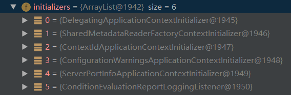
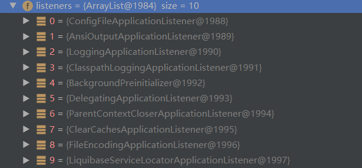

- 几个重要的事件回调机制
  - 配置在META-INF/spring.factories。如何配置可参考导入的SpringBoot导入包自带的该文件
    - `ApplicationContextInitializer`
    - `SpringApplicationRunListener`
  - 只需要放在ioc容器中
    - `ApplicationRunner`
    - `CommandLineRunner`


# 6.1 启动流程

1. 创建`SpringApplication`对象

   ```java
   public SpringApplication(ResourceLoader resourceLoader, Class<?>... primarySources) {
       this.resourceLoader = resourceLoader;  //传入了null
       //确保主配置类非空
       Assert.notNull(primarySources, "PrimarySources must not be null");
       //保存主配置类
       this.primarySources = new LinkedHashSet<>(Arrays.asList(primarySources));
       //获取Web应用的类型(REACTIVE、NONE、SERVLET)，这里是SERVLET
       this.webApplicationType = WebApplicationType.deduceFromClasspath();
       //从类路径下找到META-INF/spring.factories配置的所有ApplicationContextInitializer，保存在initializers中
       setInitializers((Collection) getSpringFactoriesInstances(
           ApplicationContextInitializer.class));
        //从类路径下找到META-INF/spring.factories配置的所有ApplicationListener,保存在listeners中
       setListeners((Collection) getSpringFactoriesInstances(ApplicationListener.class));
       //从多个配置类中找到有main方法的主配置类
       this.mainApplicationClass = deduceMainApplicationClass();
   }
   ```

   

   

2. 运行`run()`方法

   ```java
   public ConfigurableApplicationContext run(String... args) {
       StopWatch stopWatch = new StopWatch(); //计时工具
       stopWatch.start();
       ConfigurableApplicationContext context = null;
       Collection<SpringBootExceptionReporter> exceptionReporters = new ArrayList<>();
       configureHeadlessProperty();// 设置java.awt.headless系统属性为true - 没有图形化界面
       // !!! 从类路径下META‐INF/spring.factories获取SpringApplicationRunListeners，实际得到EventPublishingRunListener
       SpringApplicationRunListeners listeners = getRunListeners(args);
       //回调所有的获取SpringApplicationRunListener.starting()方法
       listeners.starting();
       try {
           //封装命令行参数
           ApplicationArguments applicationArguments = new DefaultApplicationArguments(args);
           // !!! 准备环境：如激活的Profile。//创建环境完成后回调SpringApplicationRunListener.environmentPrepared()；表示环境准备完成
           ConfigurableEnvironment environment = prepareEnvironment(listeners,
                                                                    applicationArguments);
           configureIgnoreBeanInfo(environment); //配置是否忽略BeanInfo的查找
           // 准备Banner打印器 - 就是启动Spring Boot的时候打印在console上的ASCII艺术字体
           Banner printedBanner = printBanner(environment); 
           // !!! 创建ApplicationContext；决定创建web的ioc还是普通的ioc
           context = createApplicationContext();
           // 准备异常报告器
           exceptionReporters = getSpringFactoriesInstances(
               SpringBootExceptionReporter.class,
               new Class[] { ConfigurableApplicationContext.class }, context);
           /**!!! Spring上下文前置处理。主要有：
            * 1.将environment保存到ioc中；
            * 2.applyInitializers()回调之前保存的所有的ApplicationContextInitializer的initialize方法
            * 3.回调所有的SpringApplicationRunListener的contextPrepared()
            * 。。。其他
            * 4.最后会回调所有的SpringApplicationRunListener的contextLoaded()
            */
           prepareContext(context, environment, listeners, applicationArguments, printedBanner);
           // !!! Spring上下文刷新。IoC容器初始化(如果是Web应用还会创建嵌入式Tomcat)、扫描、创建、加载所有组件
           refreshContext(context);
           //这里没有做任何操作
           afterRefresh(context, applicationArguments);
           stopWatch.stop();
           if (this.logStartupInfo) {
               new StartupInfoLogger(this.mainApplicationClass).logStarted(getApplicationLog(), stopWatch);
           }
           listeners.started(context);
           //!!! 从IoC容器中获取所有的ApplicationRunner和CommandLineRunner进行回调，先回调前者
           callRunners(context, applicationArguments);
       }
       catch (Throwable ex) {
           handleRunFailure(context, ex, exceptionReporters, listeners);
           throw new IllegalStateException(ex);
       }
   
       try {
           listeners.running(context);
       }
       catch (Throwable ex) {
           handleRunFailure(context, ex, exceptionReporters, null);
           throw new IllegalStateException(ex);
       }
       return context; //返回启动的IoC容器
   }
   ```


# 6.2 自动配置

Spring Boot启动扫描所有jar包的META-INF/spring.factories中配置的`EnableAutoConfiguration`组件；

spring-boot-autoconfigure.jar/META-INF/spring.factories有启动时需要加载的`EnableAutoConfiguration`组件配置。

配置文件中使用debug=true可以观看到当前启用的自动配置的信息。

自动配置会为容器中添加大量组件。

Spring Boot在做任何功能都需要从容器中获取这个功能的组件。

SpringBoot总是遵循一个标准；容器中有我们自己配置的组件就用我们配置的，没有就用自动配置默认注册进来的组件。


# 6.3 自定义starters

starter：启动器模块是一个空 JAR 文件，仅提供辅助性依赖管理(依赖于xxx-starter-autoconfigurer)，这些依赖可能用于自动装配或者其他类库。

- 命名规约：
  - 官方命名空间：
    - 前缀：`spring-boot-starter`
    - 模式：`spring-boot-starter-模块名`
  - 自定义命名空间：
    - 后缀：`-spring-boot-starter`
    - 模式：`模块名-spring-boot-starter`
    - 如：`mybatis-spring-boot-starter`


1. 这个场景需要使用到的依赖是什么？

2. 如何编写自动配置

   - 自动配置类会用到的注解：

   ```java
   @Configuration  //指定这个类是一个配置类
   @ConditionalOnXXX  //在指定条件成立的情况下该自动配置类生效
   @AutoConfigureBefore  //在特定自动装配Class之前
   @AutoConfigureAfter  //在特定自动装配Class之后
   @AutoConfigureOrder  //指定顺序
   
   @Bean  //给容器中添加组件
   
   @ConfigurationProperties   //结合相关xxxProperties类，使用配置文件来绑定相关的配置
   @EnableConfigurationProperties //让xxxProperties生效加入到容器中
   ```

   - 将需要启动就加载的自动配置类，配置在META‐INF/spring.factories文件中！如：

     ```properties
     org.springframework.boot.autoconfigure.EnableAutoConfiguration=\
     #下面的是所有的自动配置类
     org.springframework.boot.autoconfigure.admin.SpringApplicationAdminJmxAutoConfiguration,\
     org.springframework.boot.autoconfigure.aop.AopAutoConfiguration,\
     ```

3. 模式：

   - 启动器只用于做依赖导入；启动器模块的POM文件：

     ```xml
     <?xml version="1.0" encoding="UTF‐8"?>
     <project xmlns="http://maven.apache.org/POM/4.0.0"
              xmlns:xsi="http://www.w3.org/2001/XMLSchema‐instance"
              xsi:schemaLocation="http://maven.apache.org/POM/4.0.0
     http://maven.apache.org/xsd/maven‐4.0.0.xsd">
         <modelVersion>4.0.0</modelVersion>
         <groupId>com.atguigu.starter</groupId>
         <artifactId>atguigu‐spring‐boot‐starter</artifactId>
         <version>1.0‐SNAPSHOT</version>
         <!‐‐启动器‐‐>
         <dependencies>
             <!‐‐引入自动配置模块‐‐>
             <dependency>
                 <groupId>com.atguigu.starter</groupId>
                 <artifactId>atguigu‐spring‐boot‐starter‐autoconfigurer</artifactId>
                 <version>0.0.1‐SNAPSHOT</version>
             </dependency>
         </dependencies>
     </project>
     ```

   - 专门编写一个自动配置模块的POM文件；

     ```xml
     <?xml version="1.0" encoding="UTF‐8"?>
     <project xmlns="http://maven.apache.org/POM/4.0.0"
     xmlns:xsi="http://www.w3.org/2001/XMLSchema‐instance"
        xsi:schemaLocation="http://maven.apache.org/POM/4.0.0 http://maven.apache.org/xsd/maven‐
     4.0.0.xsd">
        <modelVersion>4.0.0</modelVersion>
        <groupId>com.atguigu.starter</groupId>
        <artifactId>atguigu‐spring‐boot‐starter‐autoconfigurer</artifactId>
        <version>0.0.1‐SNAPSHOT</version>
        <packaging>jar</packaging>
        <name>atguigu‐spring‐boot‐starter‐autoconfigurer</name>
        <description>Demo project for Spring Boot</description>
        <parent>
           <groupId>org.springframework.boot</groupId>
           <artifactId>spring‐boot‐starter‐parent</artifactId>
           <version>1.5.10.RELEASE</version>
           <relativePath/> <!‐‐ lookup parent from repository ‐‐>
        </parent>
        <properties>
           <project.build.sourceEncoding>UTF‐8</project.build.sourceEncoding>
           <project.reporting.outputEncoding>UTF‐8</project.reporting.outputEncoding>
           <java.version>1.8</java.version>
        </properties>
        <dependencies>
           <!‐‐引入spring‐boot‐starter；所有starter的基本配置‐‐>
           <dependency>
              <groupId>org.springframework.boot</groupId>
              <artifactId>spring‐boot‐starter</artifactId>
           </dependency>
        </dependencies>
     </project>
     ```

   - 启动器依赖自动配置；别人只需要引入启动器（starter）

