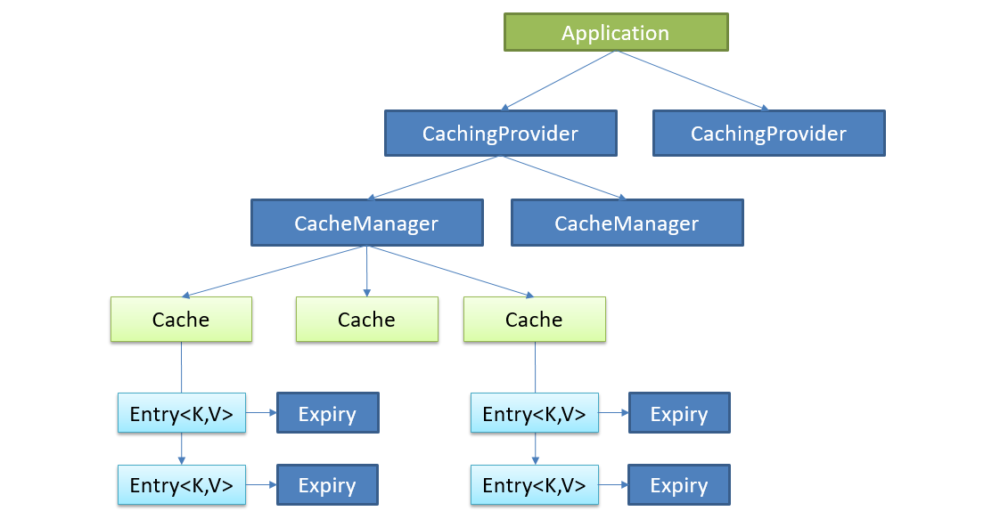
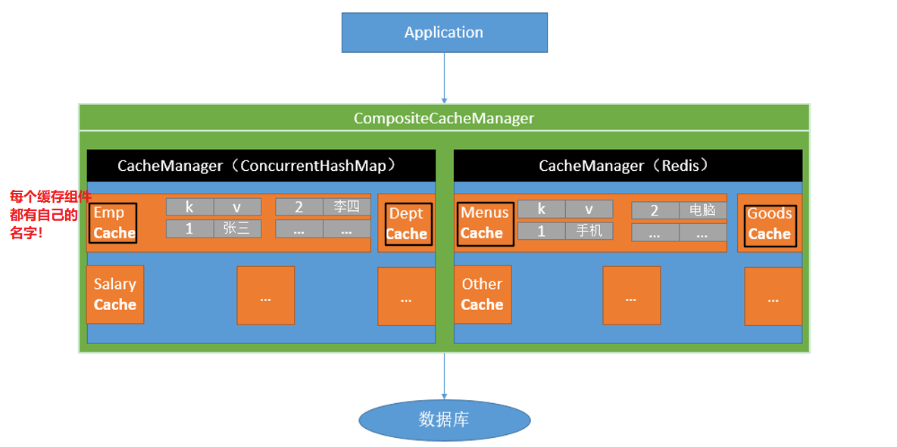

# 7.1 JSR-107

使用较少，常用的是Spring缓存抽象，两者的底层概念与JSR-107是通用的。

Java Caching定义了5个核心接口，分别是`CachingProvider`、 `CacheManager`、 `Cache`、 `Entry` 和 `Expiry`。

- `CachingProvider`定义了创建、配置、获取、管理和控制多个`CacheManager`。一个应用可以在运行期访问多个`CachingProvider`。
- `CacheManager`定义了创建、配置、获取、管理和控制多个唯一命名的`Cache`，这些`Cache`存在于`CacheManager`的上下文中。一个`CacheManager`仅被一个`CachingProvider`所拥有。
- `Cache`是一个类似`Map`的数据结构并临时存储以Key为索引的值。一个`Cache`仅被一个`CacheManager`所拥有。
- `Entry`是一个存储在`Cache`中的key-value对。
- `Expiry`每一个存储在`Cache`中的条目有一个定义的有效期。一旦超过这个时间，条目为过期的状态。一旦过期，条目将不可访问、更新和删除。缓存有效期可以通过`ExpiryPolicy`设置。



要使用JSR-107.需导入：javax.cache包。


# 7.2 Spring缓存抽象

Spring从3.1开始定义了`org.springframework.cache.Cache`和`org.springframework.cache.CacheManager`接口来统一不同的缓存技术；并支持使用JCache（JSR-107）注解简化我们开发。



每次调用需要缓存功能的方法时，Spring会检查检查指定参数的指定的目标方法是否已经被调用过；如果有就直接从缓存中获取方法调用后的结果，如果没有就调用方法并缓存结果后返回给用户。下次调用直接从缓存中获取。

使用Spring缓存抽象时我们需要**关注**以下两点；

1. 确定方法需要被缓存以及他们的缓存策略；
2. 从缓存中读取之前缓存存储的数据。


## 重要概念及注解

| 概念或注解       | 说明                                                         |
| ---------------- | ------------------------------------------------------------ |
| Cache            | 缓存接口，定义缓存操作。实现有：`RedisCache`、`EhCacheCache`、`ConcurrentMapCache`等 |
| CacheManager     | 缓存管理器，管理各种缓存（Cache）组件                        |
| `@Cacheable`     | 主要针对方法配置，能够根据方法的请求参数对其结果进行缓存。<br/>第一次调用方法，将结果缓存，第二次如果参数与上一次相同，从缓存中获取而不再调用方法<br/>标注方法返回值不能为`void` |
| `@CacheEvict`    | 清空缓存。可标注在返回值为`void`的方法上                     |
| `@CachePut`      | 同步更新缓存。保证方法总会被调用，方法结果会被缓存。标注方法返回值不能为`void` |
| `@EnableCaching` | 开启基于注解的缓存                                           |
| keyGenerator     | 缓存数据时key生成策略                                        |
| serialize        | 缓存数据时value序列化策略                                    |

注意：缓存的key不能为null ！


## 原理

- 自动配置类：`CacheAutoConfiguration`

- 缓存的配置类：

  ```java
  org.springframework.boot.autoconfigure.cache.GenericCacheConfiguration
  org.springframework.boot.autoconfigure.cache.JCacheCacheConfiguration
  org.springframework.boot.autoconfigure.cache.EhCacheCacheConfiguration
  org.springframework.boot.autoconfigure.cache.HazelcastCacheConfiguration
  org.springframework.boot.autoconfigure.cache.InfinispanCacheConfiguration
  org.springframework.boot.autoconfigure.cache.CouchbaseCacheConfiguration
  org.springframework.boot.autoconfigure.cache.RedisCacheConfiguration
  org.springframework.boot.autoconfigure.cache.CaffeineCacheConfiguration
  org.springframework.boot.autoconfigure.cache.SimpleCacheConfiguration  【默认】
  org.springframework.boot.autoconfigure.cache.NoOpCacheConfiguration
  ```

- 默认`SimpleCacheConfiguration`缓存配置类生效，给容器中注册一个`CacheManager`(`ConcurrentMapCacheManager`)

- 可以获取和创建一个`ConcurrentMapCache`类型的缓存组件，将数据保存在`ConcurrentMap`中


## @Cacheable

第一次调用方法，将结果缓存，第二次如果参数与上一次相同，从缓存中获取而不再调用方法。

该注解标注在接口上的话，接口的所有实现都会继承该注解，且缓存规则相同。

- `@Cacheable`注解，属性：
  - cacheNames或value：指定缓存组件的名字，将方法的返回结果放在哪个缓存中，是数组的方式，可指定多个缓存
  - key：指定缓存数据时使用的key，默认为方法参数的值。在缓存中该key对应的calue为方法的返回值。
    - 这个属性也可以使用SpEL来指定，见下面
  - keyGenerator：key生成器。可以指定key的生成器组件id。key和keyGenerator两个属性只能使用一个
  - cacheManager：指定缓存管理器
  - cacheResolver：指定缓存解析器。cacheManager和cacheResolver只能使用一个属性
  - condition：指定符合条件时才缓存。也可使用SpEL
    - 若结果为false，在缓存方法调用过程中缓存是被禁止的，既不会去缓存中查找，也不会将返回值放入缓存
  - unless：否定缓存。当unless指定的条件为true，方法的返回值就不会被缓存。可以获取到结果进行判断
    - 只能阻止将对象放进缓存，但是在方法调用时仍会去缓存中查找。
    - 只有在缓存方法有返回值时才有用！
  - sync：是否使用异步模式。开启的话就不再支持unless属性


SpEL：

| 名字          | 位置               | 描述                                                         | 示例                 |
| ------------- | ------------------ | ------------------------------------------------------------ | -------------------- |
| methodName    | root object        | 当前被调用的方法名                                           | #root.methodName     |
| method        | root object        | 当前被调用的方法                                             | #root.method.name    |
| target        | root object        | 当前被调用的目标对象                                         | #root.target         |
| targetClass   | root object        | 当前被调用的目标对象类                                       | #root.targetClass    |
| args          | root object        | 当前被调用的方法的参数列表                                   | #root.args[0]        |
| caches        | root object        | 当前方法调用使用的缓存列表（如`@Cacheable(value={"cache1",   "cache2"})`），则有两个cache | #root.caches[0].name |
| argument name | evaluation context | 方法参数的名字. 可以直接 `#参数名` ，也可以使用 `#p0`或`#a0` 的形式，0代表参数的索引； | #iban 、 #a0 、  #p0 |
| result        | evaluation context | 方法执行后的返回值（仅当方法执行之后的判断有效，如‘unless’，’cache put’的表达式 ’cache evict’的表达式beforeInvocation=false） | #result              |

### 使用

- 如果想要使用方法名+参数值："getEmp[1]"作为key:

  - 方法一，使用key属性指定：

    ```java
    @Cacheable(cacheNames = {"emp"},key = "#root.methodName+'['+#id+']'")
        public Employee getEmp(Integer id){ ... }
    ```

  - 方法二，自定义`KeyGenerator`来生成

    ```java
    @Configuration
    public class MyCacheConfig {
        @Bean("myKeyGenerator")
        public KeyGenerator keyGenerator(){
            KeyGenerator keyGenerator = (Object target, Method method, Object... params)->
                    method.getName()+"["+Arrays.toString(params).toString()+"]";
            return keyGenerator;
        }
    }
    ```

    ```java
    @Cacheable(cacheNames = {"emp"},keyGenerator = "myKeyGenerator")
        public Employee getEmp(Integer id){...}
    ```

- 只有在参数值id>0时才缓存：

  ```java
  @Cacheable(cacheNames = {"emp"},keyGenerator = "myKeyGenerator",condition = "#id>0")
  //也可为 #a0>0
  ```

- 如果第一个参数的值为2则不缓存

  ```java
  @Cacheable(cacheNames = {"emp"},unless = "#a0==2")
  ```


### 运行流程

以`@Cacheable(cacheNames="emp")`为例：

1. 方法运行前，先去查询Cache(缓存组件)，按照cacheNames指定的名字获取。（`CacheManager`先获取相应的缓存），第一次获取缓存如果没有Cache组件会自动创建
2. 去Cache中使用key (默认就是方法参数) 查找缓存内容；key是按照某种生成策略生成的，默认使用`KeyGenerator`生成，而默认的`KeyGenerator`为`SimpleKeyGenerator`
   - `SimpleKeyGenerator`生成key的默认策略：
     - 如果没有参数，`key=new SimpleKey()`
     - 如果有一个参数，`key=参数值`
     - 如果有多个参数，`key=new SimpleKey(params)`
3. 在缓存中没有查到就调用目标方法
4. 将目标方法返回的结果放进缓存

总结：`@Cacheable`标注的方法执行之前先来检查缓存中有没有这个数据，默认按照参数的值作为key无查询缓存，如果缓存中没有就运行方法并将结果放入缓存，以后再来调用就可直接使用缓存中的数据

- 核心：
  - 使用`CacheManager`按照名字得到`Cache`组件。默认`ConcurrentMapCacheManager`得到`ConcurrentMapCache`；
  - key是使用`KeyGenerator`生成,默认为`SimpleKeyGenerator`。


## @CachePut

同步更新缓存。保证方法总会被调用，方法结果会被缓存。

应用场景：修改了数据库的某个数据，同时更新缓存。

- `@CachePut`注解，属性与`@Cacheable`相同
- 运行时机：
  1. 先调用目标方法；
  2. 将目标方法的结果缓存起来


```java
    @Cacheable(cacheNames = {"emp"})
    public Employee getEmp(Integer id){
        System.out.println("查询"+id+"号员工");
        Employee employee = employeeMapper.getEmployeeById(id);
        return employee;
    }

    @CachePut("emp")
    public Employee updateEmp(Employee employee){
        System.out.println("更新员工："+employee);
        employeeMapper.updateEmployee(employee);
        return employee;
    }
```

- 测试：

  1. 先查询1号员工，查询结果被保存在缓存中；

     - key=1   value={lastName=bx}

  2. 更新1号员工：lastName=bxx，将方法的返回值同样放回缓存中：

     - 默认的 key=传入的employee对象   value=返回的employee对象

  3. 查询1号员工，得到的是更新前的数据：lastName=bx

     - ==要想查询到更新后的数据，需要指定key与之前查询放入缓存的key一致==：

       ```java
       @CachePut(value = "emp",key = "#employee.id")  //这里使用传入参数的员工id
       //也可以使用返回结果的员工id：key = "#result.id"
       // 注意 @Cacheable不能使用#result，因为会在还没运行方法之前就要得到key，此时方法没有执行自然没有返回结果
       ```


## @CacheEvict

清除缓存。

- `@CacheEvict`注解，属性：
  - cacheNames或value：指定缓存组件的名字
  - key：指定要删除的缓存的key
  - 与`@Cacheable`新增的属性：
    - allEntries：是否将当前缓存中所有数据都删除，默认false
    - beforeInvocation：缓存的清除是否在方法执行之前。
      - 默认false。在方法执行后在清除，如果出现异常，缓存就不会被清除
      - true，在方法执行之前清除，则无论是否出现异常，都会清除缓存


```java
    @CacheEvict(value = "emp",key = "#id")  
    public void delEmp(Integer id){
        System.out.println("删除"+id+"号员工");
        //employeeMapper.delEmployee(id); 金策市能否执行到这里
    }
```

测试：

1. 查询1号员工，使其保存到缓存中；
2. 删除1号员工；
3. 查询1号员工，发现控制台打印信息显示不再从缓存中查询


## @Caching

相当于`@Cacheable`、`@CachePut`、`@CacheEvict`的组合注解。用来定义复杂的缓存规则。

```java
    @Caching(
            cacheable = { @Cacheable(value = "emp",key = "#lastName") },
            put = {@CachePut(value = "emp",key = "#result.id"),
                    @CachePut(value = "emp",key = "#result.email")
            }
    )
    public Employee getEmpByLastName(String lastName){
        return employeeMapper.getEmpByLastName(lastName);
    }
```


## @CacheConfig

抽取缓存的公共配置，标注在类上，则类中方法的缓存相关注解使用时不用再配置公共部分了

```java
@Service
@CacheConfig(cacheNames = "emp")  //所有缓存注解中默认使用的也是emp缓存组件
public class EmployeeService {
    @Autowired
    EmployeeMapper employeeMapper;

    @Cacheable   
    public Employee getEmp(Integer id){
        System.out.println("查询"+id+"号员工");
        Employee employee = employeeMapper.getEmployeeById(id);
        return employee;
    }

    @CachePut(key = "#employee.id")
    public Employee updateEmp(Employee employee){
        System.out.println("更新员工："+employee);
        employeeMapper.updateEmployee(employee);
        return employee;
    }

    @CacheEvict(key = "#id")
    public void delEmp(Integer id){
        System.out.println("删除"+id+"号员工");
    }

    @Caching(
            cacheable = { @Cacheable(key = "#lastName") },
            put = {@CachePut(key = "#result.id"),
                    @CachePut(key = "#result.email")
            }
    )
    public Employee getEmpByLastName(String lastName){
        return employeeMapper.getEmpByLastName(lastName);
    }
}
```


# 7.3 整合Redis

SpringBoot默认使用的`ConcurrentMapCache`，而开发中通常使用缓存中间件，如：Redis、Memcached、ehcache。

引入starter：spring-boot-starter-data-redis

- 两个用于操作Redis的类：

  - `StringRedisTemplate`：k、v都是字符串，专门用于操作字符串
  - `RedisTemplate`：k、v都是对象

- 用于操作Reds五大数据类型的五个方法(以上两个类均有这些方法)：

  - String：`opsForValue()`

  - List：`opsForList()`

  - Hash：`opsForHash()`

  - Set：`opsForSet()`

  - ZSet：`opsForZSet()`

  - 说明：通过这些方法可以通过方法链来对对应的类型进行所有操作，如：

    ```java
    stringRedisTemplate.opsForValue().append("msg"," world");
    ```

- ==使用`RedisTemplate`操作对象时，默认使用JDK的序列化机制来保存对象，将序列化后的数据保存到Redis中==

  ```java
  redisTemplate.opsForValue().set("emp-01",employee); //Redis中的数据均为序列化后的结果
  ```

  - 如果想要将数据以JSON形式保存：
    - 方法一：自己通过工具将对象转为JSON再保存；
    - 方法二：==改变`RedisTemplate`默认的序列化器==。见下面的例子


## Redis测试

在配置文件中指定连接的Redis的主机：

```properties
spring.redis.host=192.168.214.133
```

以下为测试方法：

- 操作字符串：

  ```java
     @Autowired
      StringRedisTemplate stringRedisTemplate;  //k、v都是字符串，专门操作字符串
      @Autowired
      RedisTemplate redisTemplate;  //k、v都是对象
  
      @Test
      public void test1(){
          //stringRedisTemplate.opsForValue().append("msg"," world");
          String msg = stringRedisTemplate.opsForValue().get("msg");
          System.out.println(msg);
          stringRedisTemplate.opsForList().leftPush("mylist","1");
          stringRedisTemplate.opsForList().leftPush("mylist","2");
          stringRedisTemplate.opsForList().leftPush("mylist","3");
      }
  ```

- 操作对象(并改变默认的序列化器)：

  ```java
  @Configuration
  @EnableCaching
  public class MyRedisConfig extends CachingConfigurerSupport {
      /**注入Redis连接工厂*/
      @Autowired
      RedisConnectionFactory redisConnectionFactory;
  
      @Bean
      public RedisTemplate<Object, Employee> redisTemplateForEmp() throws UnknownHostException {
          RedisTemplate<Object, Employee> template = new RedisTemplate<>();
          template.setConnectionFactory(redisConnectionFactory);
          //创建一个序列化器
          Jackson2JsonRedisSerializer<Employee> serializer = new Jackson2JsonRedisSerializer<Employee>(Employee.class);
          //修改默认的序列化器
          template.setDefaultSerializer(serializer);
          return template;
      }
  }
  ```

  ```java
      @Autowired
      RedisTemplate<Object,Employee> redisTemplateForEmp;
      @Test
      public void test2(){
          Employee employee = employeeMapper.getEmployeeById(1);
          redisTemplateForEmp.opsForValue().set("emp-01",employee);  //保存对象到Redis
      }
  ```


## 作为缓存

导入Redis的starter后，默认的`SimpleCacheConfiguration`配置类不再生效，而`RedisCacheConfiguration`配置类生效。

`CacheManagerCustomizer`可以用来定制缓存的一些规则。通常让Redis配置类继承`CachingConfigurerSupport`。

- 原理：

  1. 引入Redis的starter，容器中保存的是`RedisCacheManager`；

  2. `RedisCacheManager`会创建`RedisCache`来作为缓存组件；`RedisCache`通过操作Redis缓存数据；

  3. 默认保存数据k、v都是`Object`，利用序列化保存

     1. `RedisCacheManager`操作Redis时使用的是`RedisTemplate<Object, Object>`
     2. `RedisTemplate<Object, Object>`默认使用的序列化器为`JdkSerializationRedisSerializer`

  4. 为了保存为JSON，需要自定义`CacheManager`

     ```java
     @Configuration
     @EnableCaching
     public class MyRedisConfig extends CachingConfigurerSupport {
         /**注入Redis连接工厂*/
         @Autowired
         RedisConnectionFactory redisConnectionFactory;
     
         @Override
         public CacheManager cacheManager() {
             RedisCacheConfiguration redisCacheConfiguration = RedisCacheConfiguration
                     .defaultCacheConfig()  //这里有默认配置
                     .serializeKeysWith(RedisSerializationContext.SerializationPair
                             .fromSerializer(keySerializer()))
                     .serializeValuesWith(RedisSerializationContext.SerializationPair
                             .fromSerializer(valueSerializer()));
     
             RedisCacheManager cacheManager = RedisCacheManager.builder(redisConnectionFactory)
                     .cacheDefaults(redisCacheConfiguration).build();
             return cacheManager;
         }
     
         public RedisSerializer<String> keySerializer(){
             return new StringRedisSerializer();
         }
     
         public RedisSerializer<Object> valueSerializer(){
             return new GenericJackson2JsonRedisSerializer();
         }
     }
     ```


## key前缀

使用Redis作为缓存中间件时，默认开启key前缀(即默认`useKeyPrefix=true`)，默认使用的key前缀为"方法名::	"

- 上一节自定义Redis配置时，默认配置`RedisCacheConfiguration.defaultCacheConfig()`中可以查看

- 如果不自定义Redis的`CacheManager`的话，可以使用以下方式关闭/开启前缀和指定前缀

  ```properties
  spring.cache.redis.use-key-prefix=
  spring.cache.redis.key-prefix=
  ```

- 如果自定义`CacheManager`的话，在方法中：(这里仅列出了`cacheManager()`的一部分)

  ```java
  //关闭key前缀
  RedisCacheConfiguration redisCacheConfiguration = RedisCacheConfiguration
                  .defaultCacheConfig()
                  .disableKeyPrefix()
  ```

  - 如果要自定义key前缀的话有两种方式

    - 方法一：指定一个固定的前缀

      ```java
      RedisCacheConfiguration redisCacheConfiguration = RedisCacheConfiguration
                      .defaultCacheConfig()
                      .prefixKeysWith("zzk")
      ```

    - 方法二：根据方法来确定前缀：

      ```java
      public class MyKeyPrefix implements CacheKeyPrefix {  //自定义一个计算前缀的类
          @Override
          public String compute(String cacheName) {
              return cacheName+"->";
          }
      }
      ```

      ```java
      RedisCacheConfiguration redisCacheConfiguration = RedisCacheConfiguration
                      .defaultCacheConfig()
                      .computePrefixWith(new MyKeyPrefix())
      ```

