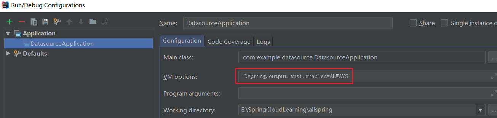

使用版本：SpringBoot 2.1.2

特性：

1. 快速创建 Spring 应用程序 ；
2. 使用嵌入的Servlet容器，不用部署war包文件 ；
3. 提供约定的starter POM来简化Maven配置，让Maven配置变简单；
4. 大量的自动配置，简化开发，也可修改默认值；
5. 基本可以完全不用使用XML配置文件，采用注解配置 ；
6. 准生产环节的运行时应用监控；
7. 与云计算天然集成。

四大核心：

1. 自动配置：针对很多Spring应用程序和常见应用功能，可以自动提供相关配置 ；
2. 起步依赖：需要什么功能，就能引入响应的依赖库 ；
3. Actuator（健康检查）：可以深入应用程序，了解SpringBoot程序内部信息 ；
4. 命令行界面：可选特性，主要针对Groovy语言使用 

[官方文档](https://docs.spring.io/spring-boot/docs/2.0.3.RELEASE/reference/htmlsingle/)

微服务：一种架构风格(服务微化)。一个应用应该是一组小型服务，可以通过HTTP的方式进行互通。

每个功能元素最终都是一个可独立替换和独立升级的软件单元。

[微服务原文](https://martinfowler.com/articles/microservices.html)

如何打war包：

1. 添加spring-boot-starter-tomcat的provided的依赖

2. 添加maven-war-plugin插件

3. 修改为`<packaging>war</packaging>`

4. 修改启动类MainApplication，使其继承`SpringBootServletInitializer`，重写`configure()`

   ```java
   protected SpringApplicationBuilder configure(SpringApplicationBuilder builder){
       return builder.sources(MainApplication.class); //指定 Spring 配置
   }
   ```

   - 注意：如果没有删除`main()`方法，则最后构建生成的war包仍可使用`java -jar xxx.war`运行

5. `mvn clean package`打包

6. 将war包放入Tomcat安装目录/webapps下

7. 启动Tomcat即可，注意，此时的访问路径需要在端口后面加上包名


如果要修改程序启动时控制台输出的Spring字符，可以在resources目录下新建一个banner.txt文件，然后通过[Text to ASCII Art Generator](http://patorjk.com/software/taag/#p=display&f=Graffiti&t=Type%20Something%20)得到想要的字符，将字符复制到banner.txt即可。


日志高亮：在VM options中加入：`-Dspring.output.ansi.enabled=ALWAYS`

