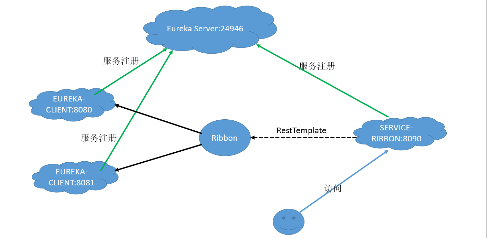

使用 Eureka 作为服务注册与发现的组件，有心跳检测、健康检查、负载均衡等功能。

- 服务发现的两种方式：
  - 客户端发现：简单直接，不需要代理的介入，同时客户端知道所有可用的服务的实际地址
    - Eureka
  - 服务端发现：消费者只需要找代理发送请求即可，注册中心和服务提供者对服务消费者是不可见的
    - Nginx、Zookeeper、Kubernetes

# 服务注册中心

在 Spring Initializer 选择 Cloud Discovery ，在右侧选择 Eureka Server。

1. 配置 Eureka 服务注册中心：

   - Eureka Server 既是Server端也是Client端，所以也需要配置注册中心的地址

   ```yaml
   server:
     port: 24946
   eureka:
     instance:
       hostname: eureka-server  # eureka实例的主机名
     client:
       register-with-eureka: false # 不再把eureka本身注册到注册中心
       fetch-registry: false # 因为本身是注册中心，所以不从eureka上获取服务的注册信息
       service-url: # 指定eureka注册中心的注册地址，有默认值
         #注意，下面是可以跟多个注册中心地址的，使用","分隔即可
         defaultZone: http://${eureka.instance.hostname}:${server.port}/eureka/
   ```

2. 在配置类上使用注解`@EnableEurekaServer`启用注册中心的功能

3. 启动程序，在浏览器中输入`localhost:24946`就可以进入注册中心了


# 服务提供者

在 Spring Initializer 选择 Cloud Discovery ，在右侧选择 Eureka Discovery、一定要记得选择Web模块，否则可能无法注册服务。

1. 配置 Client

   ```yaml
   spring:
     application:
       name: Eureka-Client # 应用名，显示在注册中心，服务间的相互调用都是用这个name
   server:
     port: 8080
   eureka:
     instance:
       prefer-ip-address: true # 注册服务的时候使用服务的ip地址
     client:
       service-url: # 指定eureka注册中心的注册地址，有默认值
         defaultZone: http://localhost:24946/eureka/
   ```

2. 在全局配置类上使用注解`@EnableDiscoveryClient`开启发现服务功能

3. 测试

   ```java
   @RestController
   @EnableEurekaClient
   @SpringBootApplication
   public class EurekaclientApplication {
   
       public static void main(String[] args) {
           SpringApplication.run(EurekaclientApplication.class, args);
       }
       @Value("${server.port}")
       String port;
   
       @GetMapping("/hi")
       public String home(@RequestParam(value = "name",defaultValue = "zzk") String name) {
           return "Hi " + name + ". I'm from " + port;
       }
   }
   ```

4. 在浏览器中输入`localhost:8080/hi`即可


为了测试下面的负载均衡机制，需要启动多个该工程的实例。方法：在 IDEA 中 Edis Configurations，选择该工程，将右上角的 Single instance only 去掉，然后多次修改配置文件中的 port（也可使用JVM参数来修改），分别启动，即可得到多个该工程的实例。

# 服务消费者

在微服务架构中，业务都会被拆分成一个独立的服务，服务间的通讯是基于 HTTP Restful 的。Spring Cloud有两种服务调用方式，一种是 Ribbon + RestTemplate，另一种是 Feign。


## Ribbon

Ribbon是一个负载均衡客户端，可以很好的控制 HTTP 和 TCP 的一些行为。其主要组件有：`ServerList`、`IRule`、`ServerListFilter`。流程：

1. 通过 `ServerList` 获取所有的可用服务列表；
2. 通过 `ServerListFilter` 过滤掉一部分地址；
3. 最后剩下的地址中，通过 `IRUle` 选择一个实例作为最终目标结果。

在 Spring Initializer 选择 Cloud Discovery 右侧的 Eureka Discovery；选择 Cloud Rounting 右侧的 Ribbon；及Web模块。

1. 启动 Eureka 注册中心、及多个服务提供者实例(8080、8081端口)

2. 配置服务消费者

   ```yaml
   eureka:
     client:
       service-url:
         defaultZone: http://localhost:24946/eureka/ #指定注册中心的地址
   server:
     port: 8090
   spring:
     application:
       name: Service-Ribbon
   ```

3. 在主配置类中使用`@EnableDiscoveryClient`向服务中心注册服务

   ```java
   @EnableEurekaClient  //开启发现服务功能
   @EnableDiscoveryClient
   @SpringBootApplication
   public class ServiceRibbonApplication {
   
       public static void main(String[] args) {
           SpringApplication.run(ServiceRibbonApplication.class, args);
       }
   
       @Bean
       @LoadBalanced //这个Bean开启负载均衡机制
       public RestTemplate restTemplate(){
           return new RestTemplate(); //该bean用于发现HTTP请求
       }
   }
   ```

4. 测试类 HelloService：

   ```java
   @Service
   public class HelloService {
       @Autowired
       RestTemplate restTemplate;
   
       public String hello(String name) {
           //EUREKA-CLIENT 是注册中心中注册的服务名
           return restTemplate.getForObject("http://EUREKA-CLIENT/hi?name="+name,String.class);
       }
   }
   ```

5. Controller：

   ```java
   @RestController
   public class HelloController {
       @Autowired
       HelloService helloService;
   
       @GetMapping("/hello")
       public String hello(@RequestParam String name){
           return helloService.hello(name);
       }
   }
   ```

6. 在浏览器中多次访问`localhost:8090/hello?name=fS`，可以发现端口在8080、8081直接切换。




- 服务提供者向 Eureka Server 注册了两个名为 EUREKA-CLIENT 的服务，其端口分别为 8080、8081；
- 用户访问 SERVICE-RIBBON 时，通过 RestTemplate 调用 EUREKA-CLIENT 的 hi 接口，由于 Ribbon 使用了负载均衡，所以会轮流调用 EUREKA-CLIENT 的两个端口。


## Feign

Feign是一个声明式的伪 HTTP 客户端，它使得写 HTTP 客户端变得更简单。使用 Feign，只需要创建一个**接口**并注解。它具有可插拔的注解特性，可使用 Feign 注解和 JAX-RS 注解。Feign 支持可插拔的编码器和解码器。Feign默认**集成了Ribbon，并和Eureka结合，默认实现了负载均衡的效果，整合 Hystrix 具有熔断功能**。

在 Spring Initializer 选择 Cloud Discovery 右侧的 Eureka Discovery；选择 Cloud Rounting 右侧的 Feign；及Web模块。

1. 启动 Eureka 注册中心、及多个服务提供者实例(8080、8081端口)

2. 配置服务消费者

   ```yaml
   eureka:
     client:
       service-url:
         defaultZone: http://localhost:24946/eureka/    #指定注册中心的地址
   server:
     port: 8091
   spring:
     application:
       name: Service-Feign
   ```

3. 在主配置类使用`@EnableFeignClients`开启 Feign 功能

   ```java
   @EnableFeignClients
   @EnableEurekaClient
   @EnableDiscoveryClient
   @SpringBootApplication
   public class FeignApplication {
       public static void main(String[] args) {
           SpringApplication.run(FeignApplication.class, args);
       }
   }
   ```

4. 定义一个接口，并标注`@FeignClient(value = "服务名")`来指定调用哪个服务

   ```java
   @FeignClient(value = "Eureka-Client")  
   public interface SchedualServiceHi {
       @GetMapping("/hi")  //路径和服务提供方的**完整路径**相同，以此来声明调用那个方法
       String sayHello(@RequestParam(value = "name") String name); //注意：这里@RequestParam必须写完整！！！！！
   }
   ```

5. 控制层

   ```java
   @RestController
   public class HelloController {
       @Autowired
       SchedualServiceHi schedualServiceHi;
   
       @GetMapping("/hi") //路径无所谓
       public String hello(@RequestParam String name) {
           return schedualServiceHi.sayHello(name);
       }
   }
   ```

6. 在浏览器中多次访问`localhost:8091/hello?name=fS`，可以发现端口在8080、8081直接切换。


# Eureka 高可用

启动两个 Eureka Server 并在配置文件中相互注册，且 Eureka Client 向两个 Server 都注册。

如果是三个 Eureka Server 的话，Server 两两注册，Client 向三个 Server 注册。

生产上建议至少两台以上。


# RestTemplate补充

该部分主要是补充 `RestTemplate`  调用服务的方式：

- 方式一：直接使用 `RestTemplate`，URL 是写死的

```java
RestTemplate restTemplate = new RestTemplate();
String response = restTemplate.getForObject("http://localhost:8080/msg", String.class);
```

- 方式二：利用 `LoadBalancerClient` 从 Eureka 服务器上注册的应用名获取 URL，然后再使用 `RestTemplate`

```java
@Autowired
private LoadBalancerClient loadBalancerClient;

ServiceInstance instance = loadBalancerClient.choose("PRODUCT");
String url = String.format("http://%s:%s", instance.getHost(), instance.getPort()) + "/msg";
RestTemplate restTemplate = new RestTemplate();
response = restTemplate.getForObject("http://localhost:8080/msg", String.class);
```

- 方式三：使用配置类向容器注入 `RestTemplate`，并在 Bean 上使用 `@LoadBalanced` 注解

```java
@Component
public class RestTemplateConfig {
    @Bean
    @LoadBalanced
    public RestTemplate restTemplate() {
        return new RestTemplate();
    }
}
```

```java
//服务器路径可以直接写应用名
String response = restTemplate.getForObject("http://PRODUCT/msg", String.class);
```

