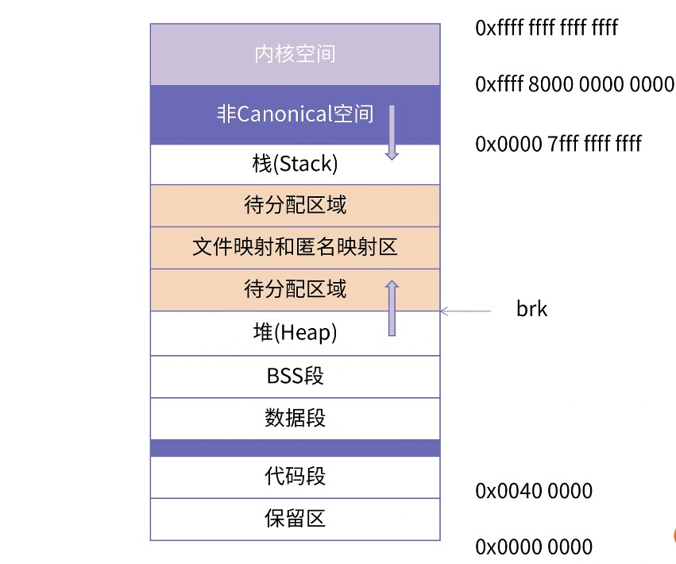

计算机的物理内存即内存条。

计算机的主存由多个连续的单元组成，每个单元称为一个字节，每个字节有一个唯一的物理地址（Physical Address，PA），地址编码从 0 开始，

# 局部性原理

绝大多数程序的运行过程中，当前指令大概率都会引用最近访问过的数据。即程序的数据访问会表现出明显的倾向性，这种倾向性称之为局部性原理 (Principle of locality)。

- 时间局部性，被访问过一次的内存位置很可能在不远的将来会被再次访问；
- 空间局部性，如果一个内存位置被引用过，那么它邻近的位置在不远的将来也有很大概率会被访问。

基于局部性原理，可以推论：无论一个进程占用的内存资源有多大，在任一时刻，它需要的物理内存都是很少的！所以，CPU 为每个进程只需要保留很少的物理内存就可以保证进程的正常执行了。

# 虚拟内存

- 直接操作物理内存
  - 需要知道每个变量的位置安排在哪里；
  - 要注意和当前进程同时工作的进程不能共用同一个地址，否则会造成地址冲突
- 操作虚拟内存
  - 独占所有内存，任意使用
  - 为变量和函数分配地址的话，交给链接器自动安排即可

任何虚拟内存最终都要映射到物理内存。CPU 充分利用程序局部性原理，提出了虚拟内存和物理内存的映射（Mapping）机制！！这种映射关系是以页为单位的，每个进程的虚拟内存页都被映射到物理内存页上。

1. 虽然虚拟内存提供了很大空间，但进程启动后，这些空间并不是全部都能使用的。开发者在对这块内存进行读写市，才会使用 malloc 等分配内存的接口真正为它分配物理内存；
2. 虚拟内存中连续的页面在物理内存中不必连续，只要维护好虚拟内存页到物理内存页的映射关系即可，而这个映射关系也是 OS 通过页表自动维护的。

注：虚拟地址空间通常与机器字宽有关，如 32 位机器上指向内存的指针是 32 位的，所以它的虚拟地址空间为 $2^{32}=4G$；64 位机器上指向内存的地址是 64 位，但在 64 位系统中只使用了低 48 位，所以其虚拟地址空间为 $2^{48}=256T$。

# 页表&页目录表

虚拟内存到物理内存的映射是由 CPU 的 MMU（Memory Management Unit，内存管理单元）自动完成的，但它依赖于 OS 设置的页表。

页表的本质是 PTE（Page Table Entry，页表项）数组。每个虚拟内存页和物理内存页的映射是通过 PTE 实现的，每个虚拟内存页对应一个 PTE，而每个 PTE 又记录了对应的物理内存页的起始地址。

1024 个 PTE（每个 PTE 占 4 字节） 组成一张页表，这样，一张页表本身占的大小就是 4K（正好一个物理内存页），而一张页表可以支持的物理内存空间大小为 $1024*4k=4MB$

> 每个物理内存页的大小也是 4K

为了编码更多地址，必须使用更多页表，所以，为了管理这些页表，又引入了页目录表。

页目录表中的每一项是 PDE Page Directory Entry, 页目录项)，每个 PDE 都对应一个页表，它记录了页表开始处的物理地址，这就是多级页表结构！

现代的 64 位处理器上，为了编码更大的空间，还存在更多级的页表

# CPU 怎么找到真实地址？

CPU 通过虚拟地址找到物理地址需要大概四个步骤（以 32 位操作系统为例）：

- 1.确定页目录基址
  - 每个 CPU 都有一个页目录基址寄存器，最高级页表的基地址就存在这个寄存器中，每次计算物理地址时，MMU 都会从里面取出页目录所在的物理地址；
- 2.定位 PDE
  - PDE 地址 = 页目录基址 + (虚拟地址的高 10 位 * 4)
  - 一个 PDE 是 4 字节，1024 个 PDE 占据 4096 字节，正好组成一页，而 1024 个 PDE 需要 10 位编码
- 3.定位 PTE
  - CPU 通过 PDE 找到页表的位置，PTE 地址 = 页表基址 + (虚拟地址中间 10 位 * 4)
- 4.确定真是的物理地址
  - PTE 中记录着物理地址
  - 虚拟地址的低 12 位刚好可以对一页内所有字节编码，所以用低 12 位代表页内偏移，计算公式是 物理页地址 + 低 12 位

在 64 位操作系统上，使用了 48 位的虚拟地址，所以需要使用 4 级页表，定位过程也变成了 5 步。

# 段&页式管理

直接访问物理内存的工作方式被称为实模式（Real Mode），而当出现虚拟内存的概念后，虚拟内存将每个进程的地址空间都隔离开，同时由于 PTE 中有多种权限保护标志，极大提高了应用程序的数据安全，CPU 的这种工作方式被称为保护模式（Protection Mode）。

实模式 -> 保护模式的演进中，X86 架构的内存管理发生了重大变化，最大不同体现在段式管理和中断的管理上。

8086 芯片的寄存器只有 16 位，而地址总线却有 20 位，即寻址空间为 $2^{20}=1M$。芯片上电后工作在实模式下，程序必须直接访问物理内存，但是又没办法将一个地址完整放到一个寄存器中，因为寄存器比地址少了 4 位！

为了解决这个问题，就引入了**段寄存器**！如 cs、ds、es、gs、ss 等，在里面记录了段基地址，通过计算就可以得到存储的物理地址了，物理地址可以用逻辑地址，也就是 `段寄存器:段内偏移` 这样的格式标识，计算公式为 $物理地址= 段寄存器<<4 + 段内偏移$。

> 逻辑地址要经过一步计算才能得到物理地址。
> 通常，数据段的起始地址放在 ds 寄存器中，代码段的地址放在 cs 寄存器中。这种按功能分段的内存管理方式就是段式管理。

32 位的 i386 芯片在段式管理的基础上，引入了页式管理！在完成初始化动作后，会开启页表，进入到保护模式，i386 的保护模式是一种段式管理和页式管理混合使用的模式。

i386 的地址总线和通用寄存器都是 32 位的，所以不再会因为寄存器位数不够而需要段寄存器，不过，i386 并未直接放弃段寄存器，而是将其进化成了新的段式管理。段寄存器还是 16 位，不过里面保存的是段选择子。

相比 8086，i386 中多了一种全局描述符表（Global Descriptor Table, GDT）的结构，其本质是一个数组，其中的每一项都是一个全局描述符，32 位的段基址就存储在这个描述符中，段选择子其实就是这个数组的下标。GDT 的地址保存在 GDTR 寄存器中。

当处理一个逻辑地址 `cs:offset` 时，会将 GDTR 中的地址 + cs中的下标值，从而得到一个段描述符，再从这个段描述符中取出段基址，段基址 + offset 就得到了虚拟地址，然后 CPU 的 MMU 就会讲虚拟地址映射为物理地址，就可以交给地址总线去读写了。

> 8086 中，段寄存器仅起到段基址的作用，在实模式下，任何指令都可以对代码段进行随意更改，而 i386 中，段描述符中除了记录段基址外，还记录了很多信息用于保护其指向的段。

段式管理会按功能把内存空间分割成不同段，有代码段、数据段、只读数据段、堆栈段，等等，为不同的段赋予了不同的读写权限和特权级。通过段式管理，操作系统可以进一步区分内核数据段、内核代码段、用户态数据段、用户态代码段等，为系统提供了更好的安全性。

但是段的长度往往是不能固定的，如果以段为单位进行内存的分配和回收的话，数据结构非常难于设计，而且难免会造成各种内存空间的浪费。

而页式管理不按功能区分，而是案固定大小将内存分割为很多大小相同的页，不管存储数据还是代码，都要先分配一个页，再将内容存到页中。页式管理的优点是大小固定，分配回收都比较容易。而且段式管理所能提供的安全性，在现代 CPU 上也可以被页表项中的属性替代，所以现在段式管理已经变得越来越不重要了。

现代的操作系统都是采用段式管理来做基本的权限管理，而对于内存的分配、回收、调度都是依赖页式管理。

# 中断描述符表

中断描述符表（Interruption Description Table, IDT）是保护模式对比实模式的另一大不同。

CPU 与外设之间的协同工作是以中断机制来进行的。如敲击键盘的时候，键盘的控制器就会向 CPU 发起一个中断请求。CPU 在接到请求以后，就会停下正在做的工作，把当前的寄存器状态全部保存好，然后去调用中断服务程序。

硬件负责产生中断，CPU 会响应中断，但是中断来了以后要做什么是由 OS 定义的。OS 要通过设置某个中断的中断描述符，来指定中断到达以后要调用的函数。中断描述符表（IDT）的本质就是中断描述符的数组。

IDT 的基地址保存在 idtr 寄存器中。每个中断都有一个编号（中断向量号）与之对应，中断向量号由 CPU 提前分配好。

# 虚拟内存布局

CPU 运行程序实质就是在顺序执行程序的机器码，而程序的机器码会被组织到**代码段**！

程序运行过程中必然要操作数据，其中，有初值的变量，其初始值会存放在程序的二进制文件中，这些数据部分也会被加载到内存中，即程序的**数据段**。数据段中存放的是程序中已初始化，且不为 0  的全局变量和静态变量。

而对于未初始化的全局变量和静态变量，由于编译器知道它们的处世之都是 0，因此不用在程序的二进制文件中存放这么多 0，只需要记录它们的大小即可，这就是 **BSS 段（Block Started By Symbol）**。

数据段和 BSS 段中存放的主要是全局变量和静态变量，而程序运行过程中生成的变量和那些临时变量，则被放在了程序的**堆**和**栈**。不同于代码段、数据段，堆和栈并不是从磁盘中加载，而是由程序在运行过程中申请，在程序运行结束后释放。

现代应用程序中还会有一些其他区域：

- 存放加载的共享库的内存空间，如果进程依赖共享库，那么共享库的代码段、数据段、BSS 段也需要被加载到这个进程的地址空间中；
- 共享内存段，可以通过系统调用映射一块匿名区域作为共享内存，用来进行进程间通信；
- 内存映射文件，可以将磁盘的文件映射到内存中，用来进行文件编辑或类似共享内存的方式进行进程间通信。

> 常说的 Section 主要指在磁盘中的程序段，Segment 指代内存中的程序段，Segment 是将具有相同权限属性的 Section 集合在一起，系统为它们分配的一块内存空间。

上图中可以看出，堆是向上增长，而栈是向下增长。也就是说，每次在进程中向内核申请新的堆地址时，地址的值都是增大的。堆和栈分别由“Program break”和“Stack pointer”控制。

> 在 64 位机器上，通常使用不到 $2^{64}=16EB$ 这么大的地址空间。在 Intel 64 架构中定义了 canonical address 的概念，如目前 Intel 64 处理器支持 48 位的虚拟地址，将第 63 到第 48 位设置为 0 或 1。所以 64 位系统下寻址空间位 $2^{48}=256TB$，并根据 canonical address 将地址空间天然划分为两个区间 [0x0, 00007fffffffffff] 和 [0xffff800000000000, 0xffffffffffffffff]，分别对应了低 128T 的用户空间、高 128T 的内核空间。而 [00007fffffffffff, 0xffff800000000000] 这部分用户空间与内核空间之间的内存区域，由 CPU 来保证其不可访问。
> 在代码段和数据段中间还有一段不可以读写的保护段，是防止程序在读写数据段的时候越界访问到代码段，这个保护段可以让越界访问行为直接崩溃，防止它继续往下运行。

# 申请堆空间

内核维护了一个只想堆顶部的变量 brk，所以 brk 的位置实际上就决定了堆的大小。

Linux 系统提供了 `sbrk`、`mmap` 两个系统调用来修改堆大小：
- `sbrk` 通过给 brk 变量增加 incr 来改变堆的大小，incr 可以为负
  - 执行成功，返回 brk 旧值，失败，返回 -1，并将 errno 设置为 ENOMEM
  - 实际很少直接使用 `sbrk` 申请堆内存，而是使用 C 语言提供的 malloc 函数进行堆内存分配，然后使用 free 释放内存
- `mmap` 功能很强大，可以用于创建共享内存，也可以创建文件映射区域用于提升 IO 效率，还可以用来申请堆内存

# Questions

段式管理和页式管理会出现内存碎片吗？

- 段式管理可以根据实际需求分配空间，有多少需求就分配多大的段。那么在段的内部就不会产生空间浪费，也就没有碎片，但是由于每个段的长度不固定，所以多个段未必能恰好便用所有的内存空间，也就是说段与段之间还是会产生碎片。
- 而页则是固定大小的，通常是4K，假设要为代码准备空间，即使这一段机器码不足4K，也要为它分配4K，因为一个页的大小就是4K，我们最少只能分配一个页。所以页式管理，页与页之间紧密排列，但是页内会出现内存浪费，也就是内存碎片。

